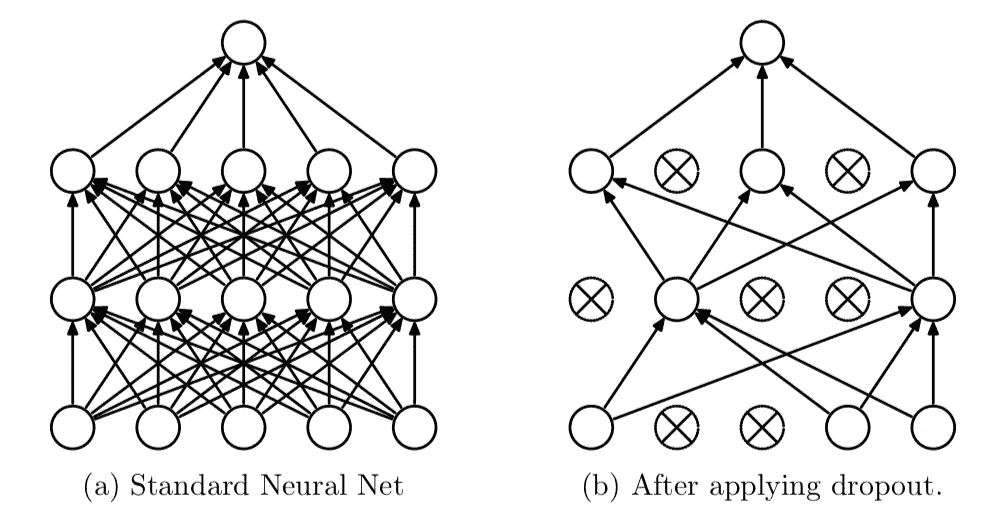
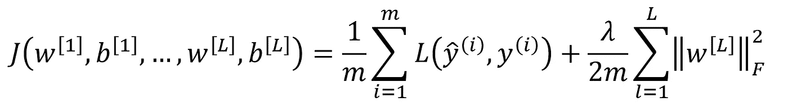
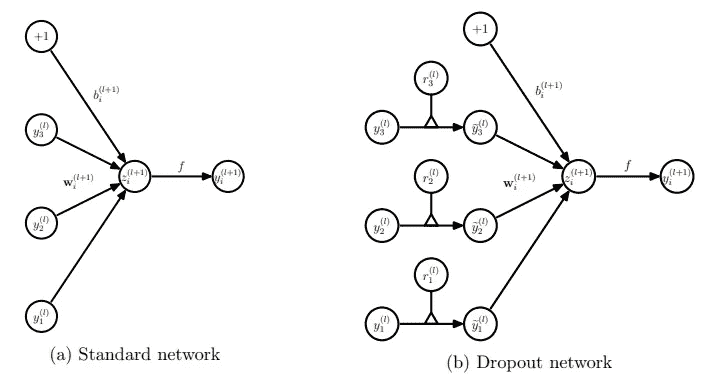
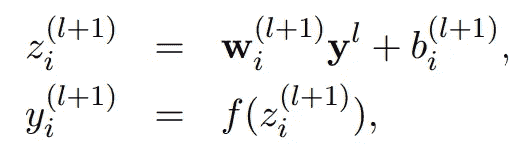
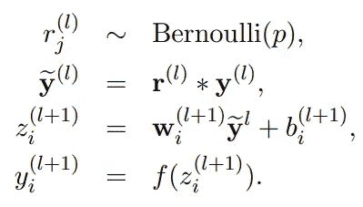
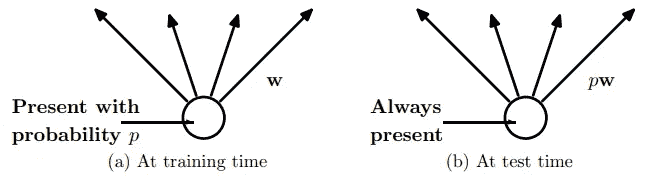

# 辍学:防止神经网络过度拟合的简单方法

> 原文：<https://medium.com/analytics-vidhya/dropout-a-simple-way-to-prevent-neural-networks-from-overfitting-f165b7902a92?source=collection_archive---------8----------------------->

艾莉娜·格鲁布尼亚克在 [Unsplash](https://unsplash.com/s/photos/network?utm_source=unsplash&utm_medium=referral&utm_content=creditCopyText) 上的照片

## 解释论文

## 这篇文章解释了[斯里瓦斯塔瓦](http://www.cs.toronto.edu/~nitish/)等人(2014)的论文《辍学》

我们将通过解释论文 [*Dropout:一种防止神经网络过度拟合*](http://www.cs.toronto.edu/~rsalakhu/papers/srivastava14a.pdf) *的简单方法，来学习一种防止神经网络过度拟合的技术。*该论文由 Srivastava 等人于 2014 年发表。

深度神经网络是非常强大的机器学习系统，但它们容易过拟合。在相对较小的数据集上训练的大型神经网络可能会过度拟合训练数据。这是因为模型学习训练数据中的统计噪声，这导致在测试数据集上评估模型时性能不佳。辍学是解决这个问题的一种方法。关键思想是在训练期间从神经网络中随机删除节点(连同它们的连接)。这可以防止节点过度地相互适应。

辍学——Srivastava 等人(2014 年)

Dropout 是作为一种正则化技术创建的，我们可以使用它来减少模型容量，以便我们的模型可以实现更低的泛化误差。它近似于并行训练大量具有不同架构的神经网络。在训练过程中，一些层节点被随机忽略或“*丢失*”。

> 如图所示，我们所说的丢弃一个单元是指暂时从网络中删除它，以及它所有的输入和输出连接。

## 正规化

使用各种技术来避免过拟合，其中一种是正则化——L1 & L2 正则化。我们使用正则化技术来降低模型容量，以便我们可以减少训练和测试误差之间的差距。正则化是将正则化项添加到损失函数中，这将模型复杂性的度量合并到要最小化的函数中。

L2 正则化损失函数

> 使用正则化，我们变得偏向于更简单的模型，因为它们捕捉的是更基本的东西，而不是特定数据集的一些工件。— *蒂姆·拉夫加登*

神经网络中的 L2 正则化与*权重衰减*的概念相关。这里给出了 L2 正则化的更详细的直觉:[在神经网络的上下文中理解 L 正则化的缩放](https://towardsdatascience.com/understanding-the-scaling-of-l%C2%B2-regularization-in-the-context-of-neural-networks-e3d25f8b50db)。

## 模型集成

另一种用于减少泛化误差的技术是通过组合几个不同的模型，这通常被称为模型集成。这是有意义的，因为在一个模型中，我们可以在测试数据的一部分中有错误，而另一个模型在测试数据的另一部分中有错误。因此，通过组合几个模型，我们可以获得更稳健的结果，因为在大多数模型中已经正确的部分不会改变，并且误差将减少。然而，训练许多不同的模型是困难的，并且训练每个大型网络需要大量的计算。此外，大型网络通常需要大量的训练数据，并且可能没有足够的数据来根据不同的数据子集训练不同的网络。

辍学结合了这两种技术。它防止过度拟合，并提供了一种有效地近似指数组合许多不同神经网络模型的方法。

*从一个神经网络中随机移除节点来调整它，这看起来似乎很疯狂。但事实证明，它可以极大地提高神经网络的性能。那么，为什么它的效果这么好呢？*

> **Dropout 意味着神经网络不能依赖任何输入节点，因为每个节点都有被移除的随机概率。因此，神经网络不愿意给予某些特征高的权重，因为它们可能会消失。**

## 培训阶段

辍学训练阶段的直觉很简单。我们在训练时关闭神经网络的一些节点，以使网络架构在每次训练迭代中不同。下图显示了我们关闭节点的方式。我们将每个输入 *y(l)乘以*节点 *r(l)* ，这是一个两点分布，按照伯努利分布输出 0 或 1。

这里， *r(l)* 是伯努利随机变量的向量，每个伯努利随机变量具有为 1 的概率(丢失率) *p* 。该向量被采样并与该层的输出 *y(l)* 逐元素相乘，以创建细化的输出 *y-dash(l)。*

在这里的第二行中，我们可以看到我们添加了一个神经元 *r* ，它或者通过将输入乘以概率为 *p* 的 1 来保留节点，或者通过将输入乘以概率为 1- *p* 的 0 来删除节点，然后进行与没有丢失相同的前向传递。

引入了一个新的超参数*(丢弃率)p* ，它指定了该层的输出被丢弃的概率，或者相反，该层的输出被保留的概率。

> *在最简单的情况下，每个单元以独立于其他单元的固定概率* p *保留，其中* p *可以使用验证集来选择，或者可以简单地设置为 0.5，这对于大范围的网络和任务来说似乎接近最优。*

## 测试阶段

现在，在测试阶段，我们可以使用平均方法作为模型集成，即在所有可能的神经网络中运行测试数据，并对结果进行平均。然而，显式平均许多指数模型的预测是不可行的，而且计算量很大。因此，该论文提出通过实现没有丢失的神经网络来获得平均值。

在进行预测时不使用 Dropout，这样做会导致网络的权重大于正常值。因此，在最终确定用于测试的网络之前，权重首先根据所选的辍学率进行调整。这种方法被称为重量标度。

> *如果一个单元在训练期间以概率* p *被保留，则该单元的输出权重在测试时乘以* p *。*

在训练时根据概率( *p* )激活节点，当节点在测试时总是存在时，根据相同的概率调整权重——Srivastava 等人(2014 年)

实际上，权重的重新调整可以在训练时而不是测试时进行。这被称为*反向下降*，其中输出按下降率缩小。

我们并不涉及论文中展示的所有实验结果，但它确保了与不使用 dropout 的神经网络相比，dropout 技术提高了所有数据集的泛化性能。请随意深入研究论文中所有数据集的辍学工作细节。

请务必阅读论文中的附录 A:辍学网络培训实用指南 。

## 参考资料:

1.  名词（noun 的缩写）Srivastava，G. Hinton，A. Krizhevsky，I. Sutskever，R. Salakhutdinov，“辍学:防止神经网络过度拟合的简单方法”(2014 年)
2.  [对正则化深度神经网络的退出的温和介绍](https://machinelearningmastery.com/dropout-for-regularizing-deep-neural-networks/)