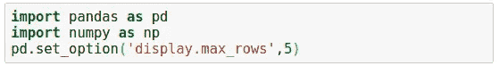
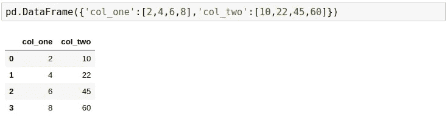
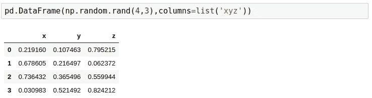
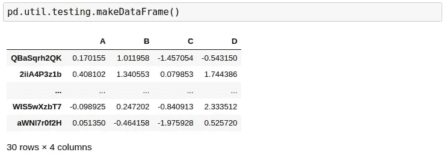
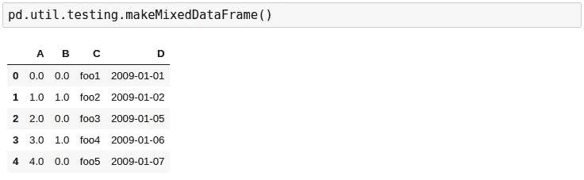
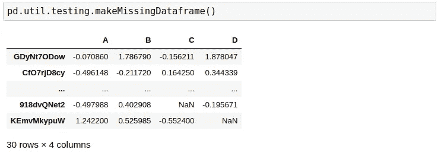
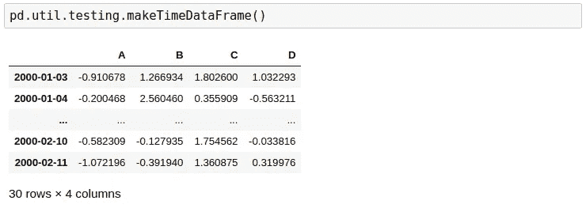
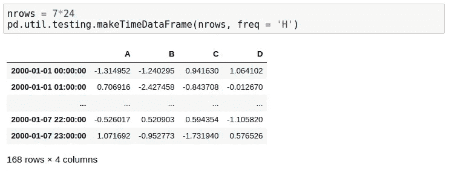
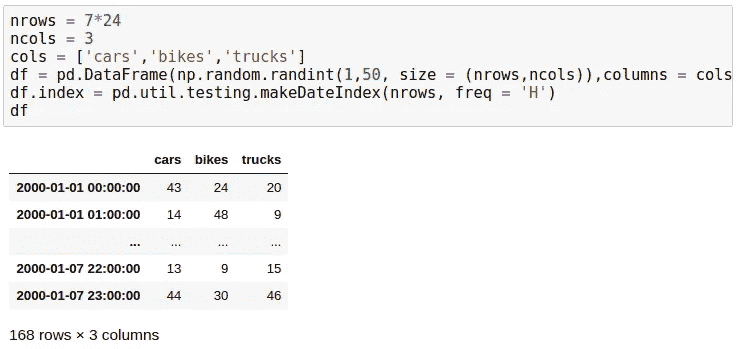

# 虚拟数据帧

> 原文：<https://medium.com/analytics-vidhya/dummy-dataframes-5672216d636?source=collection_archive---------16----------------------->

Pandas 是 Python 中处理数据最强大的库之一。在任何现实生活中的机器学习问题中，大多数时间都花在数据争论上。Pandas 和 Numpy 以最有效的方式处理数据清理。

然而，有时您可能想要创建用于测试的数据帧，或者您可能想要尝试一些您已经学会的新技术，并且发现很难用虚拟值填充数据帧。为了解决这个问题，Pandas **util 模块**可用于创建虚拟数据帧。我们将在本文中探索这些方法。

在第一步中，我导入了 Pandas 和 Numpy，为了简单起见，将显示的行数设置为 5。

创建 dataframe 最简单的方法是在一个列表中传递一个包含列名和相应值的字典。

Numpy 可用于创建虚拟数据帧，方法是将 **rand()** 函数中所需的行数和列数以及列名作为一个列表进行传递。

Pandas util 模块可用于创建虚拟数据帧。 **makeDataFrame()** 函数默认创建一个 30 行 4 列的虚拟数据帧。

**makeMixedDataFrame()** 函数创建一个具有不同数据类型列的 DataFrame。它包括 int、float、string 和 date-time 类型列。

大多数现实生活中的数据集包含大量缺失值。为了在虚拟数据集中复制这一点，可以使用 **makeMissingDataframe()** 函数。

一个**时间序列**数据集就是一系列按时间顺序排列的**数据**点。时间序列给出了两个变量之间的关系，其中一个变量是时间。可以使用 **makeTimeDataFrame()** 函数生成时间序列数据集。

**makeTimeDataFrame()** 函数可以根据需要进一步细化，指定所需数据的频率。这里 **freq** 可以以天(D)、月(M)、年(Y)等为单位。

上述所有的 **makedataFrame()** 函数都可以通过提及所需的行数和列数、列名和所需的取值范围来进一步定制。

如果你喜欢这篇文章，请鼓掌和分享！快乐阅读！