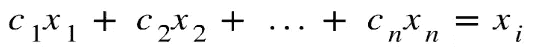
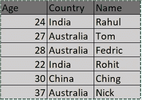
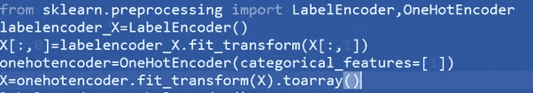
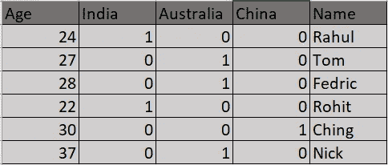
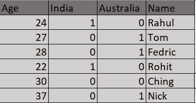

# 虚拟变量——真正的陷阱

> 原文：<https://medium.com/analytics-vidhya/dummy-variable-a-real-trap-5b8aebaa4526?source=collection_archive---------24----------------------->

迈克尔·波德格在 [Unsplash](https://unsplash.com?utm_source=medium&utm_medium=referral) 上的照片

> “陷阱只有在你不知道的情况下才是陷阱。如果你知道，这是一个挑战。******

***什么是哑变量？***

*一般来说，在**回归**分析中，解释变量(**自变量**)本质上被假设为**数量**(数值)。例如，年龄、经验、薪水等变量本质上是定量的，可以用尺度来衡量。*

*在许多情况下，变量本质上是**定性的**(分类的)。例如**季节**(夏季、冬季、春季等)**教育**(高中、学士、硕士等)**性别**(男/女)。这些变量无法用尺度来衡量。这些类型的分类变量被称为**虚拟**变量。*

> *虚拟变量(也称为指标变量)是一个数字变量，代表分类数据，如性别、种族、政治派别等。*

***数学解释:-***

**

*[JESHOOTS.COM](https://unsplash.com/@jeshoots?utm_source=medium&utm_medium=referral)在 [Unsplash](https://unsplash.com?utm_source=medium&utm_medium=referral) 上的照片*

*让我们看一个例子来说明虚拟变量陷阱:-*

# *案例 1:*

***(分类数据的数量=2 )** :-让我们取一个集合，其中一个数据可以取两个分类值，例如(男性或女性)。*

*让*

*D1 =代表男性。*

*D2=代表女性。*

*D1 和 D2(Dummy Vriables)是相互依赖的，如果 D1 是“真的”，那么 D2 是“假的”，反之亦然。这些变量本质上是[多重共线性](https://ebrary.net/1025/economics/measuring_degree_multicollinearity)(稍后解释)的(高度相关的)，这意味着:-*

*D1+D2 = 1 …………( 1)*

*D2 = 1-D1..……………….(2)*

*我们的线性回归方程，其中 y 是“因变量”:*

*Y = b0 +b1 *D1 + b2 *D2 ……………….(3)*

*将 D2 的值从(2)代入(3)，我们得到:-*

*y = b0 + b1*D1 + b2*(1-D1)*

*y = b0 + b1*D1 + b2 — b2*D1*

*y =(b0+b2) + (b1 — b2)D1*

*y = B0 *+B1 * D1………………(4)*

*其中，b0* = b0+b2 & b1* = b1-b2*

*可以看出，冗余虚拟变量 D2 的信息进入常数 b0。*

*因此，我们不需要像在(3)中那样为每个类别声明一个虚拟变量来避免虚拟变量陷阱。*

> ***虚拟变量陷阱**是独立**变量**为**多重共线**的场景——两个或更多**变量**高度相关的场景；简单地说，一个**变量**可以从其他变量中预测出来。*

*为了避免伪变量陷阱，我们总是声明比分类值(n)少一个伪变量(n-1)。*

***虚拟变量的数量=分类值的数量-1。***

***在上面的例子中，我们有两个分类值(男性/女性)。所以我们在(4)中只能有一个虚拟变量。因此，新等式应该类似于***

*y= b0 +b1*D1*

# *案例二:*

***(分类数据的数量> 2 )** :-考虑具有 2 个以上值的数据集。例如速度(慢、中或快)。按照上面的规则，我们只需要声明 2 个虚拟变量，因为分类值计数是 3。但是首先我们将在我们的等式中声明 3 个变量*

*假设变量是*

*D1=慢速*

*D2 =中速*

*D3 =快速*

*由于变量本质上是多重共线性的，以下等式成立*

*D1+D2+D3=1*

*运筹学*

*D3=[1-(D1+D2) ]…………(5)*

*我们的线性回归方程:-*

*y= b0+b1*D1+b2*D2+b3*D3……(6)*

*y = B0+B1 * D1+B2 * D2+B3 *[1-(D1+D2)]*

*y =(B0+B3)+D1(B1-B3)+D2(B2-B3)………(7)*

*可以看出，冗余虚拟变量 D3 的信息进入常数 b0，并且简化的方程将是:-*

*y= b0+b1*D1+b2*D2*

# *多重共线性*

*当数据集中的两个或多个独立变量(也称为要素)相互关联时，就会出现多重共线性。有几种方法可以用来测量双变量情况下的相关程度和方向，而多重共线性通常使用[方差膨胀因子](https://ebrary.net/1025/economics/measuring_degree_multicollinearity)来测量。简而言之，当独立变量彼此线性相关时，数据集中就存在多重共线性。*

**

*图一。完美多重共线性(x_i 和其他独立变量之间的完美线性相关)*

*如图 1 所示的情况。被称为完美多重共线性。同样，我们也有不完全多重共线性的情况，其中一个或多个高度线性的关系可能是我们所关心的。*

***如何在 Python 中处理虚拟变量:-***

*考虑以下包含“国家”作为分类值的数据集:-*

**

*在机器学习回归模型中，如果将分类值转换为数值(二进制向量)值，预测将会做得很好。这可以在 python 中使用 **LabelEncoder()** 和 **OneHotEncoder()** 来实现。上述分类集和虚拟变量的分类数据编码技术将变成:*

**

*国家一栏将按如下方式划分:*

**

*现在为了逃离虚拟变量陷阱，我们应该考虑**删除一列** — N — 1 个虚拟变量。(参考上面的数学证明)。在上面的虚拟变量表中，我们应该考虑删除任何一列。最后，表格如下所示:*

**

> *！！我们可以删除虚拟变量的任何一列。*

***使用虚拟变量时要记住的事情***

*1.虚拟变量仅代表分类值，它们没有任何数量意义。*

*2.它们在本质上是多重共线性的(参见上文的多重共线性)(高度相关)。*

***结论***

*所以明智的做法是:*

> *代表单个属性变量所需的虚拟变量的数量等于该变量中级别(类别)的数量减一。"*

*我希望这篇文章能够全面描述多重共线性和虚拟变量陷阱。这篇文章完全基于我的个人经验，事实来自可靠的来源(在每个这样的概念旁边已经提到了链接)。所以，如果你在文章中发现任何不一致的地方，请在下面评论。您的反馈将有助于我更好地写作和描述。期待收到你的来信。*

*谢谢*

*舒巴姆·班萨尔*