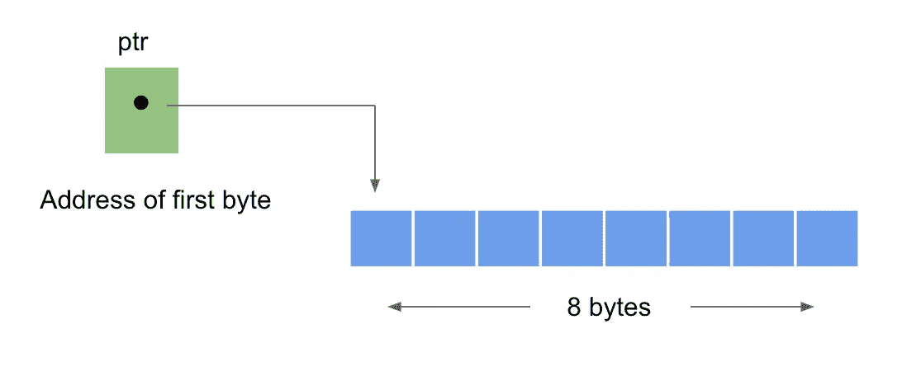

# 动态内存分配- malloc()

> 原文：<https://medium.com/analytics-vidhya/dynamic-memory-allocation-863d8e2e7e61?source=collection_archive---------19----------------------->


C 语言中的内存管理函数

在上一篇文章中，我们简要讨论了什么是静态和动态内存分配？以及栈和堆的概念。如果你没有读过我以前的类似文章，那么我想请你先读一下那篇文章，这里的[](https://bit.ly/2X2xvoQ)**是它的链接。**

**简而言之，我们现在知道动态内存分配是在运行时分配内存的过程，在 **stdlib.h** 下有一些内存管理函数允许我们动态地分配和释放内存。因此，今天我们将详细讨论所有这些功能。**

**让我们从第一个函数 malloc()开始。函数 malloc()分配单个内存块。它保留一个指定大小的内存块，并返回一个类型为 **void** 的指针。所以，我们可以把它赋给任何类型的指针。**

**这个函数的声明是:**

```
ptr = (cast-type *) malloc ( byte-size );
```

**ptr 是类型为 cast-type 的指针。malloc 返回一个指向字节大小的内存区域的指针(类型转换)。**

**示例:**

```
ptr = (int * ) malloc (2 * sizeof(int));
```

**成功执行该程序后，分配一个 8 字节大小的内存块。是因为 **int** 的大小是 4 字节。所分配内存的第一个字节的地址被分配给指针 **ptr** 。下图可以很好地说明这一点:**

****

**malloc()的内存分配**

**到目前为止，我们已经知道了 malloc()函数是如何工作的。现在让我们实现这个概念来解决一个问题:**

**程序使用 malloc()以相反的顺序排列输入的元素。**

```
ptr = (int *) malloc(size * sizeof(int));
```

**这里的 **ptr** 是类型为 **int** 的指针， **size** 是类型为 **int、**的变量，在这个语句执行之后**size×4**字节的内存被分配。**

```
if (ptr == NULL) {
    printf("Error! memory not available.");
    exit(0);
}
```

**如果指针 ptr 指向 NULL，该语句会显示一个错误，也就是说，如果内存中没有可供分配的空间，它只会显示一条错误消息。**

```
for (i = 0; i < size; i++) {
    printf("Enter element %d: ", i + 1);
    scanf("%d", ptr + i); 
```

**这个语句只是读取输入的元素。**

```
for (i = size - 1; i >= 0; i--) {
    printf("%d ", *(ptr + i));
}
```

**执行此语句后，所有输入的元素将以相反的顺序排列。**

```
free(ptr);
```

**在用 malloc 分配内存之后，并且您已经在您的程序中使用完它，必须使用函数 ***free()*** 将它返回给系统。**

**这是整个程序的样子:**

****

**输出:**

****

**这都是关于 malloc 的，在下一篇文章中我们将讨论 calloc()。这里是 calloc 的 [**链接**](/@bindu.khadka.np/calloc-dynamic-memory-allocation-562ab4276367) 。**

**在这里 观看我的同题视频 [**。**](https://www.youtube.com/watch?v=IxBjTl6ZNQg)**