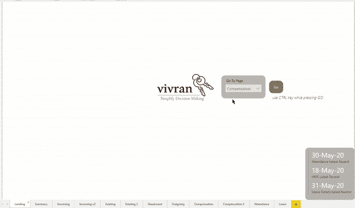
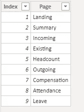
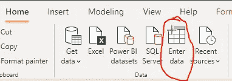
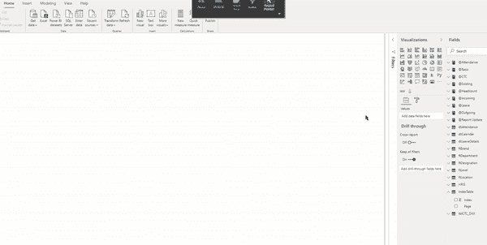
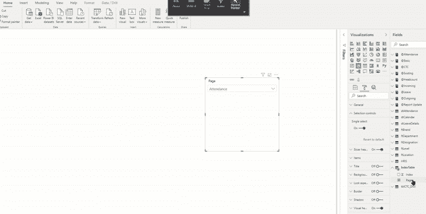
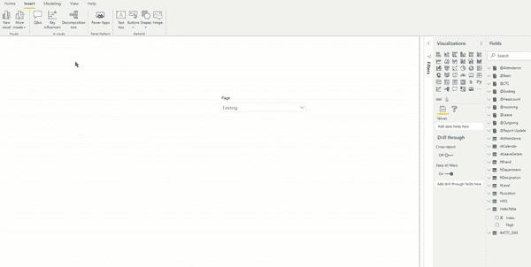
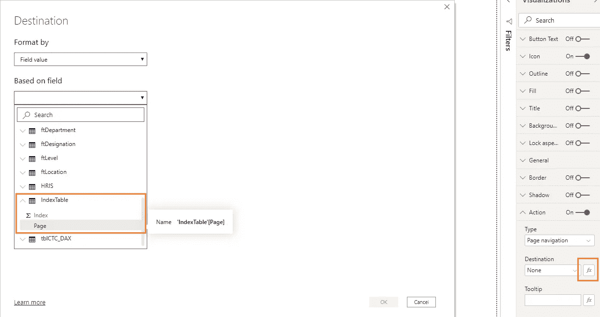
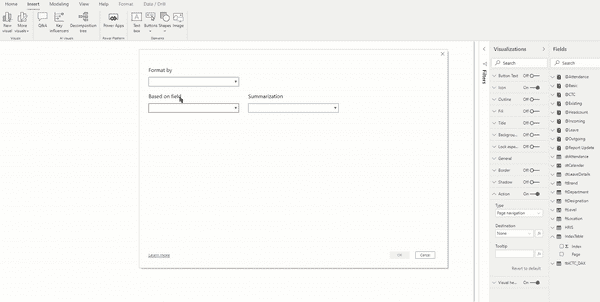

# Power BI 桌面中的动态页面导航

> 原文：<https://medium.com/analytics-vidhya/dynamic-page-navigation-in-power-bi-desktop-e97b9a11fd05?source=collection_archive---------2----------------------->

随着 2020 年 5 月 Power BI 桌面更新，它增加了定制的页面导航，这是一个相当智能的功能。它使我们能够从下拉列表中选择特定页面:

之前，使用书签有助于页面导航。有关书签的更多详细信息，请参考以下文章。

本文解释了创建动态页面导航的逐步过程。

# 步骤 1:创建支持表

在数据模型中添加一个简单的表，与任何其他表都没有关系。它应该包含

索引列(用于排序)，

和页面名称(将在切片器中使用)

我们可以使用*输入数据*选项来添加表格:

# 步骤 2:添加切片器

从上面创建的表中添加带页字段的切片器

包括以下步骤:

将切片器转换为下拉列表

格式>选择控制>单一选择>打开

我们可以使用索引列按照预定义的页面顺序对表字段进行自定义排序

选择列>列工具>按列排序>选择索引列

# 第三步:添加一个按钮

插入>按钮

或者，我们也可以使用任何形状或图像。

# 步骤 4:配置按钮

在类型选择页面导航下选择按钮>操作>

在目的地中，点击 *fx* 符号打开目的地设置选项。对于基于字段的*，从步骤 1 中创建的表格中选择页面的字段*

单击确定。

就是这样！

在 Power BI Desktop 中，您需要使用 CTRL 键进行导航。

*我写一下*[*MS Excel*](https://www.vivran.in/my-blog/categories/excel)*，* [*权力查询*](https://www.vivran.in/my-blog/categories/powerquery) *，* [*权力毕*](https://www.vivran.in/my-blog/categories/powerbi) *，* [*权力中枢*](https://www.vivran.in/my-blog/categories/power-pivot) *，*[*DAX*](https://www.vivran.in/my-blog/categories/dax)*，*

[@imVivRan](https://twitter.com/imvivran)