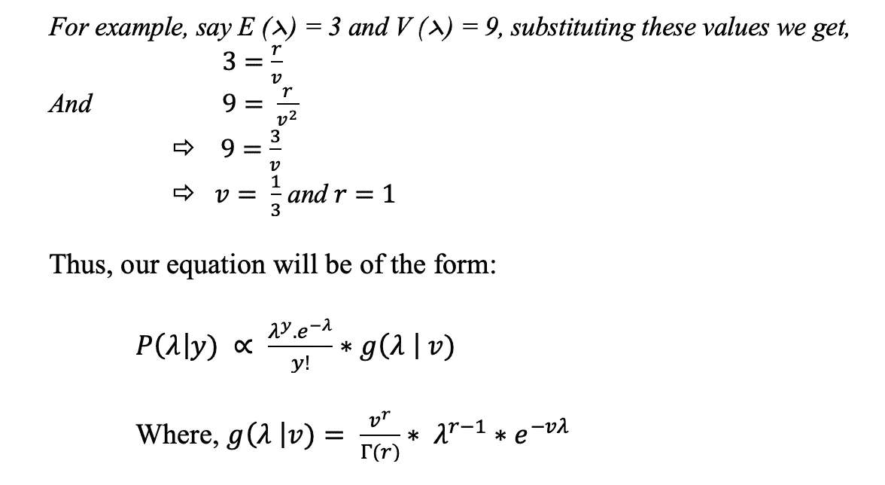

# 保险产品的动态定价

> 原文：<https://medium.com/analytics-vidhya/dynamic-pricing-of-insurance-products-d042dfb63b16?source=collection_archive---------6----------------------->

在当前竞争激烈的世界中，每个企业都希望在为客户提供最佳报价的同时获得利润。动态定价或基于时间的定价是目前企业根据当前市场反馈为其产品设定灵活价格的策略之一。动态定价在运输、娱乐和零售等行业非常普遍。产品和服务的价格根据供求规律不断变化。然而，由于监管的原因，保险产品的定价并不是非常动态的。价格的变化取决于收到的对该特定产品的索赔，价格按设定的时间间隔更新。

这篇文章讨论了如何利用最优化和统计学的概念，通过使反馈循环成为动态的和即时的，来优化保险业务的定价，以实现利润最大化

让我们先简单介绍一下保险和它的一些术语。

假设客户 A(被保险人)决定从为疾病 D 投保的公司 C(保险公司)购买产品 X(保单)，这意味着，根据 X 的条款和条件，客户 A 将在保单有效期内免于因疾病 D 而发生的任何财务损失。

**核保:**当客户选择购买产品 X 时，他/她必须回答一定数量的问题。这些问题有助于保险公司了解与疾病 D 相关的客户风险，并计算他们的索赔倾向。根据风险分数，产品的价格会相应改变。

**保费:**根据核保团队决定的价格，被保险人每月或每年为购买 X 项下的保险所支付的金额称为保费

**理赔:**在 X 产品的保障期内，如果被保险人受到 D 疾病的影响，他/她有权向保险人发送通知，以挽回其损失。然后，公司分析这些索赔，并决定向客户付款

**发病率:**每 1000 人中患疾病 D 的人数

请参考以下链接，了解所有保险术语的详细信息

[https://www.ona.ca/resources/terms/](https://www.ona.ca/resources/terms/)

回到动态定价，这是一个两步过程，首先我们需要提出初始产品定价以启动销售，第二步是整合反馈循环以使用贝叶斯更新来改变价格

让我们从第一步开始:

对于最初的产品定价，我们使用线性规划方法来最大化利润并计算价格。保费金额是公司产生的所有成本的函数，如营销成本、运营成本以及索赔产生的成本。使用 D 的事故率并运行模拟算法来找出其在整个投资组合中的分布，可以计算出索赔总数。为了简单起见，让我们假设疾病 D 是由 5 个不同的因素引起的，比如:d1、d2、d3、d4、d5。

利用历史医疗记录，我们将知道每个因素的发生率。诸如蒙特卡罗模拟的模拟算法可以用于组合每个单独的事故率。根据不同的情况，利率可以相互依赖或独立，在这种情况下，我们可以选择基于 copula 的方程。在运行这些模拟之前，深入研究的基本方法是确定每个因素引起的索赔发生率的分布。

假设在保险中索赔的发生是由泊松分布给出的。泊松分布是一种离散的概率分布，表示在固定的时间或空间间隔内发生的给定数量的事件的概率，假定这些事件以已知的恒定平均速率发生，并且与自上次事件以来的时间无关。

如果对于 k = 0，1，2，…，X 的概率质量函数由下式给出，则称离散随机变量 X 具有参数λ > 0 的泊松分布

在哪里

e 是欧拉数(e = 2.71828…)

k！是 k 的阶乘。

使用上述分布，我们模拟索赔数量，每售出 1000 份保单的索赔频率分布如下图所示:

该图显示，随着我们向右端移动，索赔数量的概率显著降低。实际上，这意味着售出的 1000 份保单中有 900 人索赔的概率将显著降低，除非出现类似疫情的情况。

现在，这种分布的好处是可以利用长尾理论来决定价格，从而考虑到索赔导致的最大损失。估计这一最大损失的方法之一是使用测量**条件尾部期望** ( **CTE** )

CTE 是一个[风险度量](https://en.wikipedia.org/wiki/Risk_measure)，与更一般的[风险值](https://en.wikipedia.org/wiki/Value_at_risk)相关联。它量化了在给定概率水平之外的事件已经发生的情况下损失的预期值。

[https://en.wikipedia.org/wiki/Tail_value_at_risk](https://en.wikipedia.org/wiki/Tail_value_at_risk)

一旦损失被估计，为了决定精确的定价点，线性规划方法被使用。对于实现，python 包含了一个名为“PULP”的用于线性编程的伟大库

现在让我们首先用线性规划的数学形式来公式化我们的问题陈述

如上所述，保险费金额是损失、营销成本、运营成本

即

*已付保费=营销成本+运营成本+理赔* +利润(1)

由于我们总是希望利润最大化，我们可以将等式改写为

*利润=已付保费(P) —营销成本(M) —运营成本(O) —理赔(C)* (2)

直接看这个等式，似乎为了获得一定的利润，我们可以增加收取的保费，并降低营销和运营成本。

但由于这是一个竞争激烈的市场，我们必须有效地收取保费，以便既能最大限度地减少我们的支出，又能让我们的客户能够购买产品。

因此，我们的等式将具有这样的约束，包括根据公司要求分配给每个因素的预算约束。

因此，我们的线性规划方程变成:

最大利润= P — M — O — C

受限制:

M < budgeted amount M1 (3)

O < budgeted amount O1

P < regulated amount P1

Please note that the factor marketing cost factor includes online and offline marketing as well. This may include other constraints as well such as

Cost on online marketing < cost to agents

Cost on advertisements < budgeted amount A1

And so, on

In the PULP library we have a solver called, LPSOLVE which can be used to solve the equation and conclude to the best price for initial sale.

We have now completed our first step, let’s move to the second step.

Once we start selling the product, we will get the data required for the feedback loop based on the lifecycle of the event. For example, products that provide insurance for seasonality-based disease like dengue gives us a short feedback loop, travel insurance or accident coverage also have a shorter lifecycle.

Once we receive the claims from the customer after initial sales, we will have to update the previous pricing (prior). Bayesian update is a well-known technique for updating our old equation to derive new price. Let’s first understand the concept of incorporating the feedback loop.

After a certain period of time of initial sales, we will start getting the claims for the product X. Following scenarios are observing on comparing the observed number of claims (Co) with the expected claims (Ce) (as obtained via simulation method).:

Scenario1: ***Co < Ce，***

这意味着我们的利润可能会减少。其中一个原因可能是大多数人还没有接触到该产品。因此，我们需要增加营销成本，以增加渗透率和更高的销售额。

场景 2: ***Co = Ce*** ，

这意味着预期索赔的分布对于目标人群是准确的。在这种情况下，我们不需要做任何改变。

场景 3: ***Co > Ce but Co <门槛索赔***

这意味着产品的渗透率很好，但是，在我们的目标人群中，有索赔的人数超过了预期。在这种情况下，我们应该降低营销成本以节约成本。

场景 4:**Co>Ce 和 Co >阈值声明 **

在这种情况下，我们的利润将开始大幅下降。因此，根据当前的索赔估计对产品进行重新定价非常重要。

上述情况可以图示如下:

显然，场景 4 最需要动态定价。

这里要注意的一点是，当这种情况出现时，这必然意味着我们对索赔数量分布的假设，即左偏分布(*图 1* )已经向右端移动。此外，它还可能导致公司利润的减少。因此，改变产品的溢价变得势在必行。

为了更新产品的定价，我们可以使用观察到的索赔的新信息，并使用贝叶斯更新方法更新索赔的后验分布。

贝叶斯更新方法认为，事件的概率可以根据可能与事件相关的条件的先验知识来推导。在数学形式中，可以借助以下符号来理解:

假设 A 是新的假设，B 是证据，

我们需要找到给定证据的假设的分布(P (A|B))

根据贝叶斯定理，这可以使用下面的关系来实现:

其中，P (B | A)是证据 B 的似然分布，并且

P (A)是关于假设的先验信息

最简单的理解方式是 A 是我们想了解的东西，B 是我们观察到的证据。

让我们应用这个来解决我们的问题陈述，更新索赔的分布。如果我们能找到平均索赔额的新分布，那么我们的问题就解决了。

因为我们知道我们的证据(索赔)遵循泊松分布(如前一节所述)。假设索赔的先验分布为伽玛分布，其参数由一组新的观察值(y)得出。

数学上，

由于使用了获得的新索赔数据，我们可以很容易地找到它的均值和方差，因此可以通过替换获得 ***r*** 和 ***v*** 的值。

求解上述方程将给出新索赔的分布。然后，可以使用线性规划方法来估算溢价，以使利润最大化，如前所述。因此，通过使用反馈回路和有效地做出判断，可以动态地更新保险中的保费价格。

*在第 2 部分，我将详细介绍贝叶斯学习的影响和结果，以及索赔的结果如何推动营销优化者和定价优化者*

这里使用的方法描述了解决这个问题的一种方法，也可以使用其他几种方法，如建立索赔模型，然后使用反馈回路。这个帖子包含了许多术语和术语，你可以去详细了解完整的理解。网上有很多免费的资源可以让你完全理解每一个概念，这可能不需要任何正式的教育。以下是一些有用的链接，有助于对所用概念的基本理解。

[用蒙特卡罗方法模拟](https://www.palisade.com/risk/monte_carlo_simulation.asp)

[线性编程](https://faculty.washington.edu/toths/Presentations/Lecture%202/Ch11_LPIntro.pdf)

[贝叶斯定理](https://betterexplained.com/articles/an-intuitive-and-short-explanation-of-bayes-theorem/)

[系词](https://en.wikipedia.org/wiki/Copula_(probability_theory))