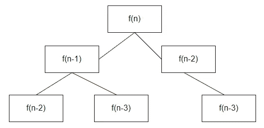
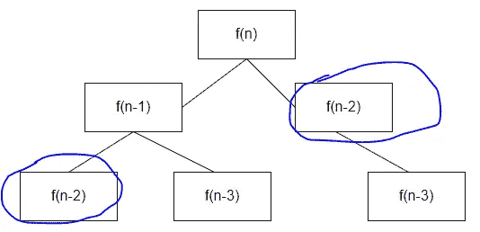

# 动态规划:0/1 背包问题详解

> 原文：<https://medium.com/analytics-vidhya/dynamic-programming-0-1-knapsack-problem-explained-in-detail-6ae7d7db7fac?source=collection_archive---------21----------------------->

互联网上有很多关于动态规划问题的教程，其中一些在处理问题方面误导了整个动态规划概念。因此，我想写一篇关于背包问题和处理各种 DP 问题的方法的详细文章。

首先，我们来了解一下什么是动态编程？

> 了解 DP 概念的人最初会考虑构建一个 DP 表来维护他们的结果，并在问题中陷入困境。这是完全错误的，相反，他们应该首先了解动态编程的核心概念。

## **关于递归的简要描述**

它只是在内存中创建一个函数堆栈，并将堆栈中的结果返回给它之前的调用堆栈。首先，递归在每次函数调用时接受一个缩减的输入，我们定义了一个在递归函数中定义的基本条件，以从现有的或所述的最后一个堆栈中断或返回。



**递归函数调用栈**

如果我们不把减少的输入传递给递归函数会怎样？显然，它将无休止地运行并抛出堆栈溢出错误。通常，递归函数模板在大多数情况下应该如下。

```
recursive(int[] array, int weight) {
     //define baseCondition
     //make next recursive call
}
```

在这里， **baseCondition** 只不过是最小的有效输入，如果我们的代码运行后，它将什么也不做或崩溃，并继续增加不必要的函数堆栈。

## 什么是记忆化？

如果你仔细观察上面的图表，递归函数，比如 f(n-2)会被调用，即使它是从另一个调用栈中调用的，这会降低程序的性能和时间复杂度。为了便于理解，我再次用高亮标记把它放在这里。



**重复递归调用**

如果我们可以将结果存储在内存中的某个地方，用于函数调用，或者用更简单的术语来说，用于 f(n-2)所取的特定输入参数，会怎么样呢…这很酷，对吧？这样，当递归函数 f(n-2)被调用时，并且如果该函数在此之前已经产生了可以在 O(1)时间内从存储器/内存中检索的结果，则迫使该函数重复执行和计算该结果。

问题是，我们如何用减少的参数存储函数调用的结果。这就是 DP 表出现在图片中的原因。首先，确定递归函数的不同参数，并准备一个 n+1 大小的表，其中 n 是初始输入的大小。

其次，如果我们要在表中存储 int 结果，用某个值初始化表，例如-1。最后，如果之前没有存储该值，则继续填充该表，并在以后需要时检索该值。这遵循**自上而下的方法**，这意味着值将从第一行和第一列填充到最后一列。最后一个值应该是我们的结果。然而，它不一定是自顶向下的方法，但它取决于方法，如果我们选择使用迭代方法而不是递归方法，也可以遵循自底向上的方法。

有道理，对吧…

## 什么是 DP？

动态编程只不过是将问题分解成子问题，并以非常直观的方式收集这些子问题的结果。

一般来说， **DP** = **增强递归+记忆化**

当你必须找出最优(最小，最大，最大，最小)解时，DP 比其他任何算法都更有效。例如，找到最大利润，一个未排序数组的两个元素之间的最大差异，等等…

## **O(1)背包问题**

背包基本上是什么？如果你在网上搜索这个词，它是包或载体的同义词。我们将使用同一个词，并很快定义一个问题。

**如何识别背包问题？**

你将得到一个类似于输入数组的东西，在另一个数组中有相关的权重，你必须通过处理这些输入找到最优解。

**问题陈述:**

给定 n 个物品的重量和价值，将这些物品放入容量为 W 的背包中，以获得背包中的最大总价值。换句话说，给定两个整数数组 val[0..n-1]和 wt[0..n-1]，它们分别表示与 n 个项目相关联的值和权重。同样给定一个表示背包容量的整数 W，找出 val[]的最大值子集，使得这个子集的权重之和小于或等于 W，不能分解一个物品，要么挑选完整的物品，要么不挑选(0–1 属性)。

如上所述，为了找到一个最优解，我们必须采用动态规划的方法来解决问题，对不对…

**那么我们的方法是什么？**

简单，递归+记忆= DP

让我们写代码来寻找最大利润。

```
public int knapSack(**int** W, **int** wt[],**int** val[], **int** n) { // Base Case
    **if** (n == 0 || W == 0)
        **return** 0; **if** (wt[n - 1] > W)
        **return** knapSack(W, wt, val, n - 1); // Return the maximum of two cases:
    // (1) nth item included
    // (2) not included
    **else
        return** max(val[n - 1] + 
                   knapSack(W - wt[n - 1],wt, val, n - 1),
                   knapSack(W, wt, val, n - 1));
}
```

在上面的程序中，我们有两个背包选择，即是否将物品放入包中以获得最大利润。我们从最末端开始，计算当前索引中包含的项目与当前索引中不包含的项目的最大值，然后从下一个开始挑选。

希望整篇文章能帮助你理解基于 DP 的背包问题。

会在这里继续讨论更多算法…编码快乐！！