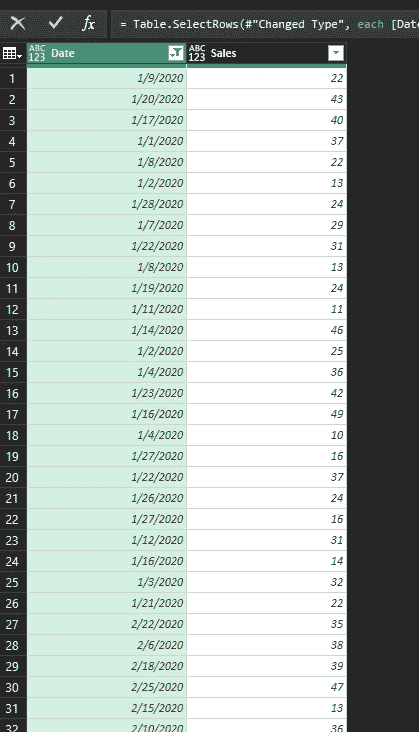

# 动态组合多张图纸 p# 1:电源查询

> 原文：<https://medium.com/analytics-vidhya/dynamically-combine-multiple-sheets-p-1-power-query-fa182a2888ad?source=collection_archive---------10----------------------->

在开始分析数据之前，分析师的关键任务之一是合并和转换数据。在这种情况下，Power Query 非常方便。

# 案例:当源数据与输出表位于不同的工作簿中时

基本的假设是所有的工作表都有相同的数据表结构。

对于与输出表相同的源表，请参考文章:

 [## 动态追加多张图纸 p# 2:超级查询

### 对于不同于输出表的源表，请参考文章:动态组合多个表 p#1 数据是…

www.vivran.in](https://www.vivran.in/post/dynamically-append-multiple-sheets-p-2-power-query) 

# 示例数据表

数据在四张不同的表上。

[下载样本数据](https://vivranin-my.sharepoint.com/:x:/g/personal/vivek_ranjan_vivran_in/EU8-J9vE0uZLnWJ2e2EUOWoBDWC5etkivobt9pEWBSsvqw?e=n2VRUJ)

# 第一步:获取数据

数据>获取数据>从文件>从工作簿

选择一个工作表>转换数据

# 步骤 2:删除除源代码之外的所有步骤

# 步骤 3:右键单击数据列>删除其他列

# 步骤 4:展开数据列。

# 第五步:调整标题

主页>使用第一行作为标题

过滤掉剩余的标题行。

右键单击>过滤器>不等于

# 结果

# 包括工作表名称

如果我们需要在最终输出中包含工作表名称，请在步骤 3 中进行以下调整。

选择名称+数据列>右键单击>删除其他列

# 动态输出

将查询输出加载到数据透视表中。

主页>关闭并加载到>数据透视表

工作簿中的任何更改，Power Query 都会相应地更新输出。

 [## 动态追加多张图纸 p# 2:超级查询

### 对于不同于输出表的源表，请参考文章:动态组合多个表 p#1 数据是…

www.vivran.in](https://www.vivran.in/post/dynamically-append-multiple-sheets-p-2-power-query)  [## 将多个文件合并到一个文件夹中:超级查询

### 想象一下:有一个 2019 年的文件夹。一年中的每个月有 12 个文件。所有的文件都有…

www.vivran.in](https://www.vivran.in/post/combining-multiple-files-in-a-folder-power-query) 

*我写关于*[*MS Excel*](https://www.vivran.in/my-blog/categories/excel)*[*权力查询*](https://www.vivran.in/my-blog/categories/powerquery)*[*权力毕*](https://www.vivran.in/my-blog/categories/powerbi)*[*权力中枢*](https://www.vivran.in/my-blog/categories/power-pivot)*[*DAX*](https://www.vivran.in/my-blog/categories/dax)*[*数据分析【数据*](https://www.vivran.in/my-blog/categories/data-analytics)*****

**[@imVivRan](https://twitter.com/imvivran)**