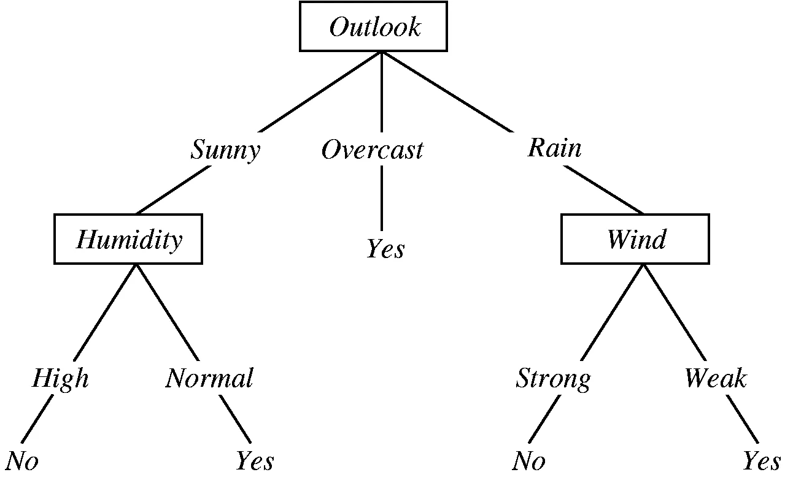
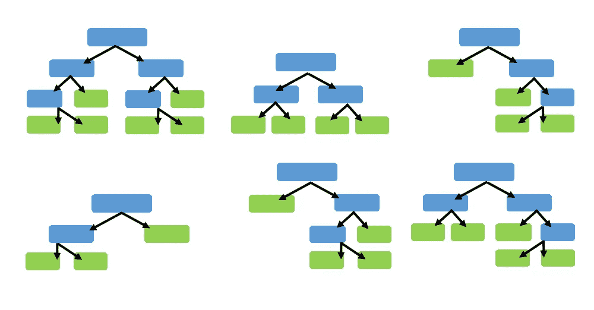
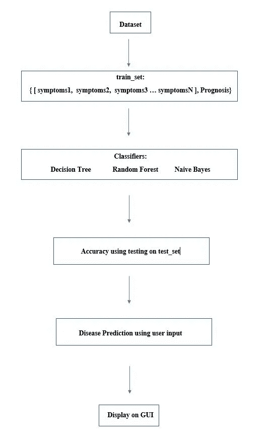

# 使用机器学习对常见疾病进行自我诊断的电子诊所。

> 原文：<https://medium.com/analytics-vidhya/e-clinic-for-self-diagnosis-of-common-illness-using-machine-learning-ac994d1be7e4?source=collection_archive---------19----------------------->

本文由[内哈](https://medium.com/u/d21f7c5bb6f5?source=post_page-----ac994d1be7e4--------------------------------)和[帕里托什](https://medium.com/u/e072d1556a2c?source=post_page-----ac994d1be7e4--------------------------------)共同撰写。

随着新冠肺炎的出现和医疗设施的减少，人们发现很难获得常见疾病的相关诊断。机器学习用于根据各种疾病的症状数据集来预测患病患者的疾病。三种分类器用于预测疾病:决策树、随机森林和朴素贝叶斯。使用的库是 pandas、numpy 和 tkinter。该模型在包含症状和相应预后的数据集上进行训练。训练模型后，用户输入症状，最后在基于 tkinter 的 GUI 上显示结果。

世界各地的卫生系统正在面临挑战，因为在努力维持常规卫生服务的同时，对新冠肺炎患者的护理需求也在不断增加。因为各国政府目前的优先事项已经转移到加强应对新冠肺炎疫情的前线。COVID 19 还影响了老年人、5 岁以下儿童和孕妇的日常生活、医疗护理和支持，以及他们保持社会联系的能力和他们的认知。面对不断恶化的情况，医院很难在每天出现的新新冠肺炎病例和期待诊断其他疾病(包括真菌感染、过敏、GERD 等)的患者之间保持平衡。这个项目旨在解决这个严重的问题，并驯服越来越多的人，他们通过在 GUI 应用程序中输入他们的症状来期待他们的诊断。

# **使用的量词:**

**决策树:**

决策树是机器学习中使用的预测建模结构之一。决策树是基于一些算法构造来构建的，这些算法构造有助于基于不同条件来识别树的分支。目标变量可以取一组离散值的树模型称为分类树。在制作决策树时，在树的每个节点，我们会问不同类型的问题。基于所提出的问题，我们将计算与之对应的信息增益。

决策树通过从根到某个叶节点对示例进行排序来对示例进行分类，叶节点为示例提供分类。树中的每个节点都充当某个属性的测试用例，从该节点开始向下延伸的每条边都对应于测试用例的一个可能答案。这个过程本质上是递归的，并且对以新节点为根的每个子树重复这个过程。

下面是我们在使用决策树时所做的一些假设:

*   开始时，我们将整个训练集视为根。
*   特征值最好是分类的。如果这些值是连续的，则在构建模型之前会将其离散化。
*   基于属性值，记录被递归地分布。
*   我们使用统计方法将属性排序为根或内部节点。

示例决策树。

**朴素贝叶斯:**

朴素贝叶斯是一种简单但惊人强大的预测建模算法。朴素贝叶斯算法是一种监督学习算法，基于贝叶斯定理，用于解决分类问题。它主要用于包含高维训练数据集的*文本分类*。

朴素贝叶斯分类器是一种简单且最有效的分类算法，有助于建立快速机器学习模型，从而做出快速预测。它是一个概率分类器，这意味着它根据对象的概率进行预测。朴素贝叶斯算法的一些流行例子是垃圾邮件过滤、情感分析和文章分类。

贝叶斯定理表述为:

P(h|d) = (P(d|h) * P(h)) / P(d)

在哪里

*   P(h|d)是给定数据 d 的假设 h 的概率，这称为后验概率。
*   P(d|h)是假设假设 h 为真时数据 d 的概率。
*   P(h)是假设 h 为真的概率(不考虑数据)。这叫做 h 的先验概率。
*   P(d)是数据的概率(不考虑假设)。

**随机森林:**

随机森林，顾名思义，由大量个体决策树组成，作为一个[集合体](https://en.wikipedia.org/wiki/Ensemble_learning)。随机森林中的每棵树都给出一个类别预测，拥有最多票数的类别成为我们模型的预测。

随机森林背后的基本概念简单而强大——群体的智慧。用数据科学的话来说，随机森林模型如此有效的原因是:大量相对不相关的模型(树)作为一个委员会运行，将胜过任何单个的组成模型。模型之间的低相关性是关键。就像低相关性投资(如股票和债券)组合在一起形成的投资组合大于其各部分之和一样，不相关模型可以产生比任何单个预测都更准确的整体预测。产生这种奇妙效果的原因是，这些树相互保护，不受各自错误的影响(只要它们不总是朝着同一个方向出错)。

随机森林是一种元估计器，它在数据集的各个子样本上拟合多个决策树分类器，并使用平均来提高预测精度和控制过拟合。如果 bootstrap=True(默认)，子样本大小由 max_samples 参数控制，否则使用整个数据集来构建每棵树。

示例随机森林。

# **工作:**

# 输出:

该模型利用机器学习的不同概念(即决策树、朴素贝叶斯算法和随机森林算法)，来帮助预测他们在家里患有的一些疾病，而没有任何去医院的风险。它的目的是以很少的努力或不费吹灰之力为有需要的人提供医疗护理。它还通过免费预测疾病而使不太幸运的人受益，并为整个社会服务。

# **参考文献:**

1.  [https://www . emu technology . com/WP-content/uploads/2018/08/Random-forest . png](https://www.emutechnology.com/wp-content/uploads/2018/08/Random-Forest.png)
2.  [https://miro.medium.com/max/2584/0*PB7MYQfzyaLaTp1n](https://miro.medium.com/max/2584/0*PB7MYQfzyaLaTp1n)
3.  [https://www . Java point . com/machine-learning-naive-Bayes-classifier #:~:text = Na % C3 % AFve % 20 Bayes % 20 classifier % 20 算法&text = Na % C3 % AFve % 20 Bayes % 20 classifier % 20 is % 20 one，of%20an%20object。](https://www.javatpoint.com/machine-learning-naive-bayes-classifier#:~:text=Na%C3%AFve%20Bayes%20Classifier%20Algorithm&text=Na%C3%AFve%20Bayes%20Classifier%20is%20one,the%20probability%20of%20an%20object.)
4.  [https://www . who . int/teams/social-determinators-of-health/新冠肺炎/](https://www.who.int/teams/social-determinants-of-health/covid-19/)
5.  https://towards data science . com/Decision-tree-in-machine-learning-e 380942 a4c 96 #:~:text = Decision % 20 tree % 20 is % 20 one % 20 of，set % 20 based % 20 on % 20 differential % 20 conditions。