# SQL 中的电子商务数据分析

> 原文：<https://medium.com/analytics-vidhya/e-commerce-data-analysis-in-sql-5c68305a8937?source=collection_archive---------2----------------------->

电子商务数据分析是关于分析你的网上零售店的数据。它显示了你的网上商店中什么有用，什么没用的一切。拥有关于你的业务的数字和图表信息有助于做出明智的决策，并最终繁荣你的业务。没有量化指标，你就无法优化你的市场支出和市场预算的有效性。

理解大局将有助于你看到模式，并为即将到来的时期作出销售预测。您了解在线客户的购买行为，并通过数据分析保持市场竞争力。你有机会通过认识到你的业务瓶颈来完善你的策略。你遇到了你忠诚的客户群，并采取必要的行动来留住他们。

在这个故事中，我将谈论以下关于 SQL 中的电子商务数据分析的话题。

**流量来源分析，竞价优化&趋势分析**

**分析网站性能**

**分析季节性&商业模式**

**产品分析**

**用户分析**

为此，我使用了一个示例电子商务数据库。

这是一个典型的电子商务数据库的样子。所有的框都是表，我已经在其中定义了表名和属性名。现在我们来详细讨论一下每个话题。

**流量来源分析、竞价优化和趋势分析**

了解你的客户来自哪里，以及哪些营销渠道带来了最高质量的流量，这一点至关重要。我们还会发现每个营销活动的对话率。它帮助我们将预算转向高质量的流量，做出明智的决策，消除浪费的支出，并扩大高转换流量。

付费流量是通过跟踪附加在 URL 中的 UTM 参数来识别的，它们允许我们将网站活动与特定的流量来源和活动联系起来。

我们将使用数据库中的**Website _ sessions**表中存储的 UTM 参数来识别付费网站会话。将会话数据与数据库中**Orders**表中的订单数据联系起来，以了解我们的付费活动带来了多少收入及其转换率。

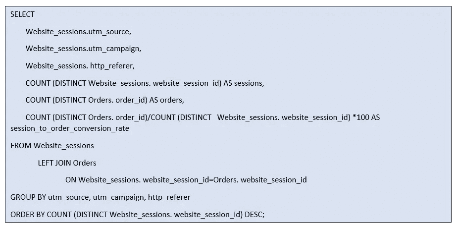

这里 utm_source 跟踪流量的来源，utm_campaign 添加单元(品牌/非品牌)。
竞价优化就是了解不同付费流量段的价值，以便优化您的营销预算。转换率和每次点击收入分析用于计算每次点击花费多少来获得客户。竞价优化还包括了解你的网站和产品在不同细分市场的表现。它包括竞价变化对拍卖排名的影响，以及吸引到你网站的客户数量。
假设，如果 gsearch 非品牌活动经理注意到一个网站在移动设备上的体验并不好。因此，他/她想按设备类型找出从会话到订单的转换率。如果台式机性能优于移动设备，他可能会出价购买台式机，以获得更大的销量。

看来经理已经注意到了正确的事情。如果他/她投标桌面会话会更好。
趋势分析有助于我们了解我们的业务在过去两到五年里取得了多大的进展。我们可以使用日期函数按周和年对会话进行趋势分析。

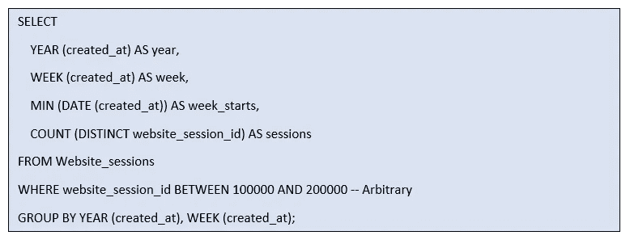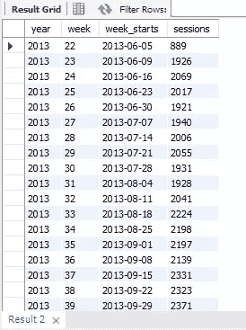

**分析网站性能**

分析网站性能的方法有很多种。其中一些如下。

1.分析热门网站内容

网站内容分析就是了解用户浏览最多的页面。它包括识别你的业务最常见的入口页面(用户看到的第一样东西)，并知道它们如何为你的业务目标服务。

我们将从 **Website_pageviews** 创建一个临时表**first _ pageviews**，并再次将它们与自身连接，以获得特定时间段内最常见的入口页面。

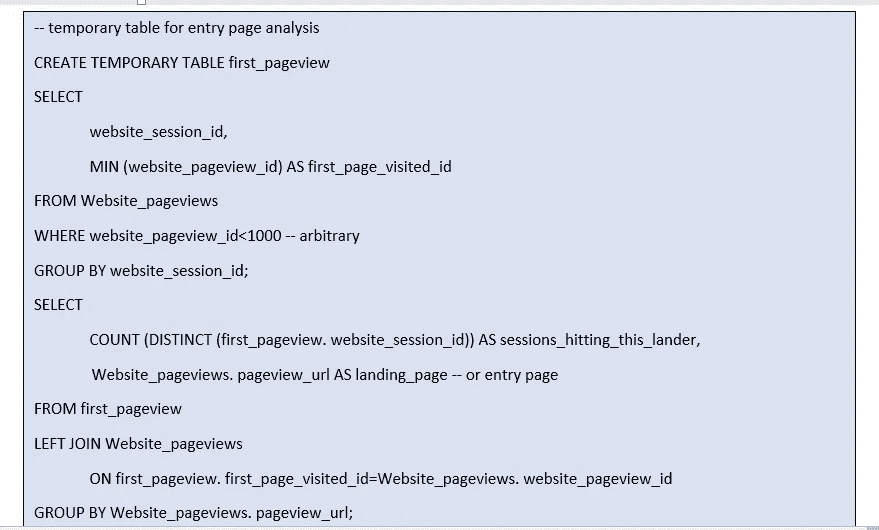

这说明几乎所有的用户都是首先登陆首页的，所以要让首页尽可能的吸引人。
假设网站经理想要知道按会话量排列的最常浏览的网站页面。

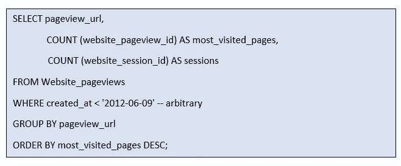

2.分析和测试转换漏斗:

转换漏斗旨在理解和改善用户购买产品过程中的每一步体验。

我们将找出用户在购买产品前最常走的路，并分析在你的转化流程中，每一步有多少用户继续，每一步有多少用户放弃。

为了演示的简单，我们将考虑从/lander-2 到/cart 的路径，并且只考虑一个产品，即模糊先生。

要获得转化漏斗，需要遵循三个步骤。

首先，我们将有像/lander-2，/products，/the-original-Mr-fuzzy 和/cart 这样的页面浏览量。为此，我们将把**网站 _ 浏览量**与**网站 _ 会话**结合起来。

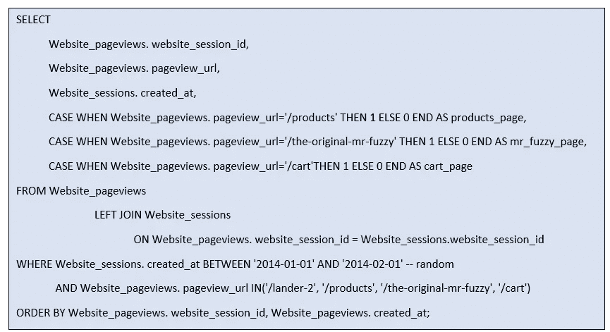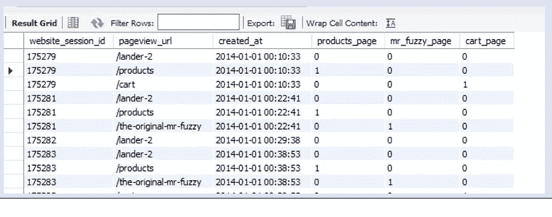

现在，我们将确定每个相关的浏览量作为具体的漏斗步骤。为此，我们将把上面的整个查询嵌入为一个子查询，以查找为我们的页面创建的会话。

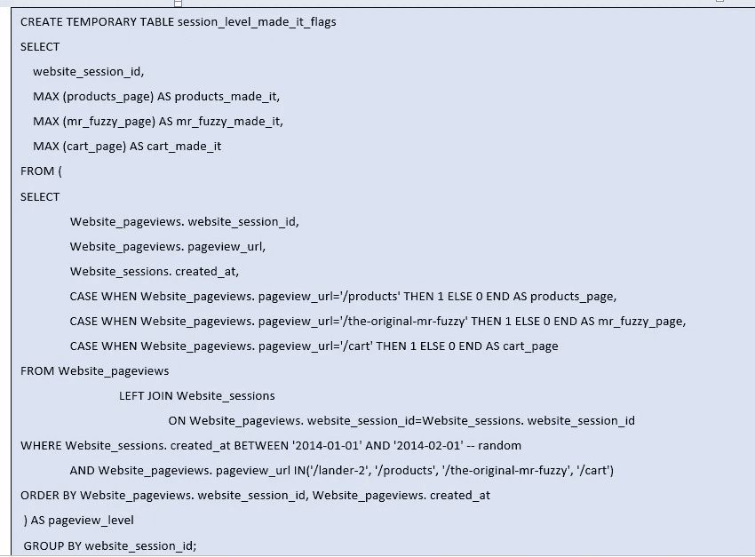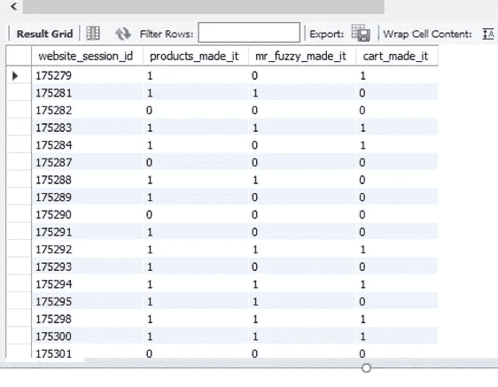

让我们创建会话级转换漏斗视图。

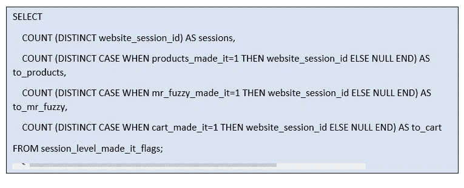

根据上述结果，我们可以说，在 2014 年 1 月通过 lander-2 页面进行的所有 10647 次会话中，7793 次是通过 to_products 页面进行的，7793 次是通过 product_page 页面进行的，4787 次是通过 to_mr_fuzzy 页面进行的，2887 次是通过 to_cart 页面进行的。

这样，我们可以从主页(/lander-1)到感谢页面(/thank-you-for-your-…)创建转换漏斗。

**分析季节性&商业模式**

业务趋势有助于产生洞察力，帮助您最大限度地提高效率和预测未来趋势。分天分析，以了解在一天或一周的不同时间应该有多少支持人员。了解季节性有助于更好地为即将到来的需求高峰或放缓做准备。为了深入挖掘商业模式和季节性，我们将使用日期函数。

我将通过两个假设的情况来解释这个概念。

假设 2012 年对我们来说是很棒的一年。随着我们继续增长，我们应该看看 2012 年的月度交易量模式，看看我们是否能找到我们应该为 2013 年规划的任何季节性趋势。你的 CEO 想知道会话量和订单量。

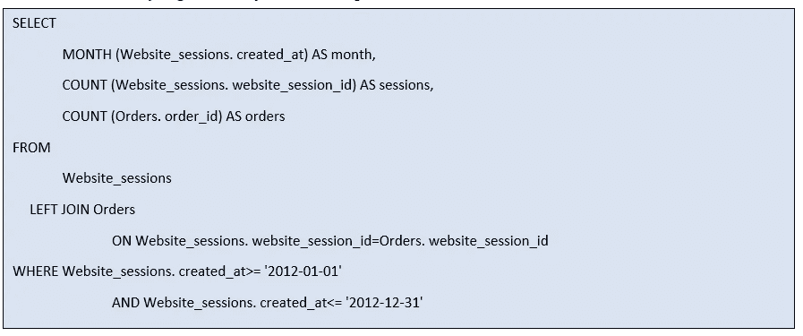

我们可以看到，去年 11 月、12 月和 10 月的销售额最高。我们还可以使用 WEEK 函数进行每周分析，以便进行详细分析。
假设首席执行官正在考虑在网站上添加实时聊天来提高客户满意度。他希望按一天中的一个小时和一周中的一天来分析平均会话量，以便适当地分配员工。避开假期，使用 2013 年 9 月 15 日到 11 月 15 日的日期范围。

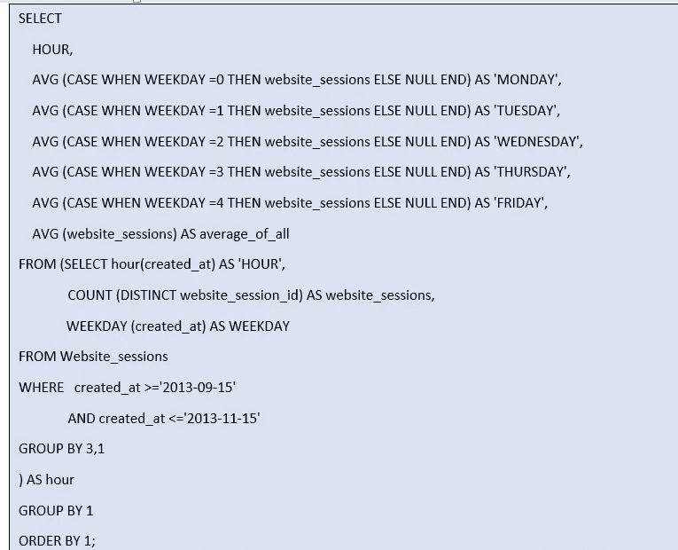

这样，他/她可以按小时(0 到 23)和天分析会话量。

**产品分析**

产品分析有助于您了解每种产品对您的业务有何贡献。

首先，让我们分析数据库中可用产品的销售和收入。

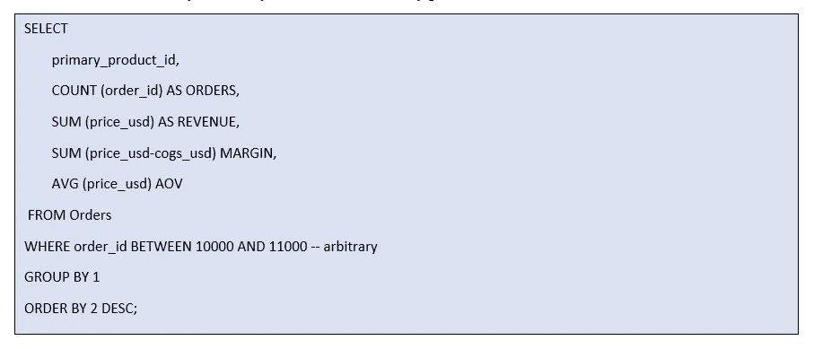

我们将再次考虑两种假设情况来理解产品分析。
假设首席执行官在 1 月 6 日推出了第二款产品。她希望看到自 2012 年 4 月 1 日以来的每月订单量、总转换率、每次会话的收入以及按产品分列的销售明细。

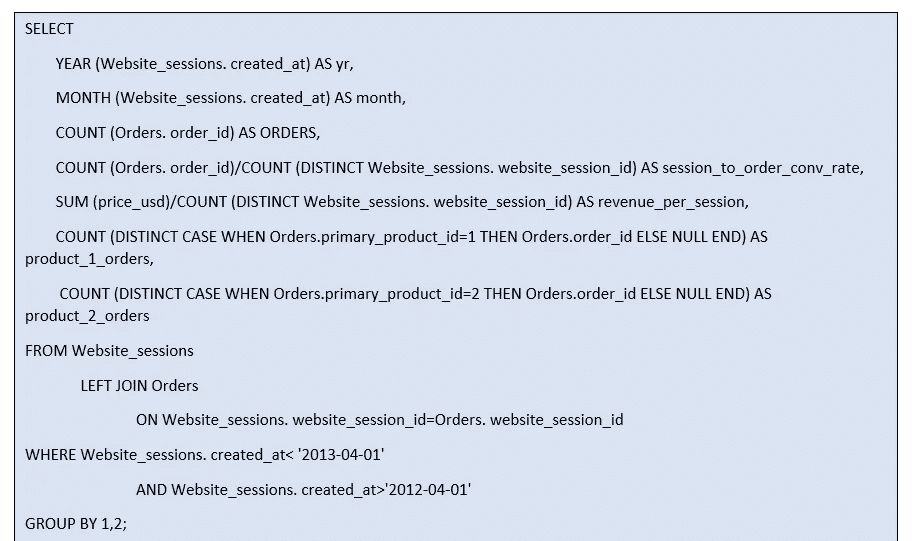

我们可以看到，第二款产品在 2012 年表现不佳，从 2013 年开始挑销量。

我们先来了解一下什么是交叉销售分析。它是关于知道用户可能一起购买哪些产品，并提供智能产品推荐。为此，我们将连接 **Orders** 和 **Order_items** 表。

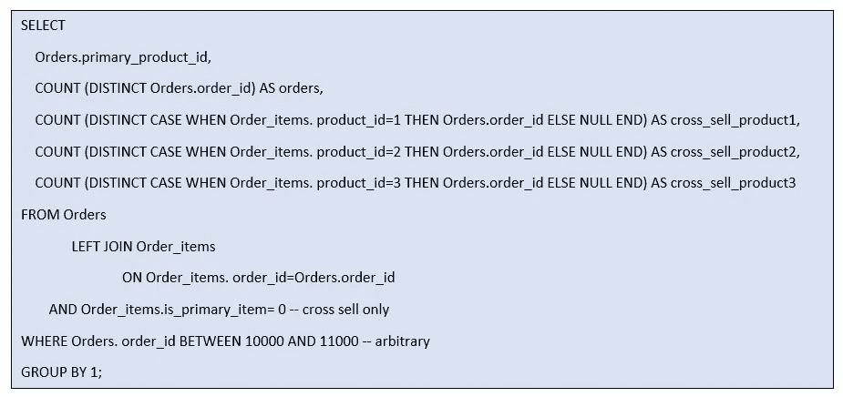

正如我们所见，产品 1 与产品 2 和 3 的交叉销售非常好。我们还可以推荐我们认为会与其他产品交叉销售的产品，并在交叉销售前和交叉销售后分析一段时间后的结果。
让我们转到产品退款分析。它正在分析退款率以控制质量，并了解您可能有问题要解决的地方。考虑产品退款率和相关成本可以给你的业务的整体表现一个要点。

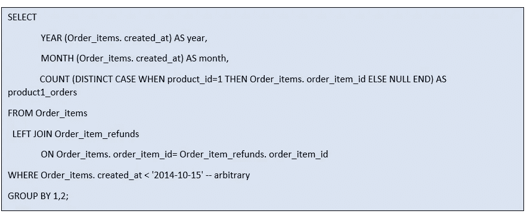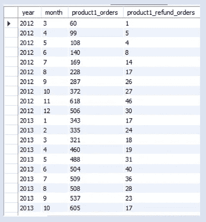

我们可以找到不同产品不同时期的退款率，改善我们的业务。

**用户分析**

用户分析有助于我们了解用户行为，并识别一些最有价值的客户。它包括分析重复行为活动和他们回来时使用的渠道。

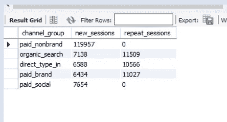

正如我们所看到的，有机搜索、直接输入和付费品牌正在提供更多的重复会话。我们应该考虑一下其他付费营销渠道。
我们还可以使用 datediff()函数来分析用户在给定页面上花费的时间、订单间隔时间或网站会话。
企业使用浏览器 cookies 跨多个会话跟踪客户行为。

这几个方面有助于为您的在线商店做出数据驱动的决策。