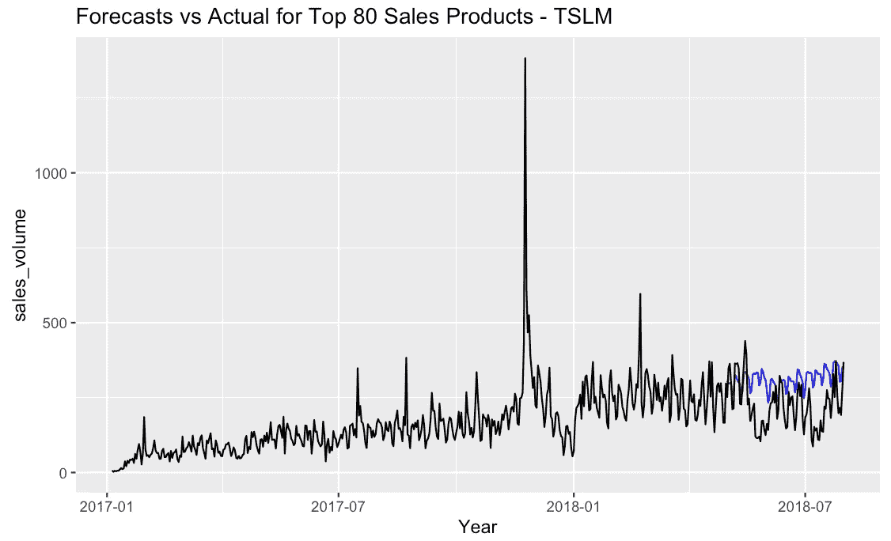

# 电子商务创业销售预测

> 原文：<https://medium.com/analytics-vidhya/e-commerce-startup-sales-forecasting-64a5d01bbad2?source=collection_archive---------4----------------------->

## 如何利用有限的数据创建最佳预测，同时最大限度地减少销售损失

*作者:詹妮弗·斯伍*


# **简介**

F 电子商务初创企业的预测销售面临着许多挑战，包括有限的历史数据、来自零售店或其他电子商务企业的竞争、由于**高峰**季节 ( *我将在本文*的后面解释这个术语)等造成的极端季节性。

在这篇文章中，我旨在分享我是如何应对这些挑战的，并确定了常见电子商务创业公司商业模式的最佳销售预测方法。为了让业务涉众看到结果，我在:[**jsiwu94.shinyapps.io/EcommerceSalesForecasting**](https://jsiwu94.shinyapps.io/EcommerceSalesForecasting/?_ga=2.43989413.1634540316.1594881151-375740093.1594881151)创建了一个基本的闪亮的 Web 应用程序。

> **通过此分析生成的最终预测能够将估计的年度销售损失降至约 100 万美元。**

如果你有兴趣了解更多，所有代码都可以在我的 [github 库](https://github.com/jsiwu94/ecommerce_sales_forecasting)中找到。

# **数据集**

该数据集来自一家名为[**Olist**](https://olist.com)**的巴西电子商务初创公司，并通过[**Kaggle.com**](https://www.kaggle.com/olistbr/brazilian-ecommerce)提供。它以 SQL 数据库的形式出现，有许多表，包含来自客户→订单→卖家的信息。对于此分析，我将只使用来自连接下面突出显示的 3 个表的订单和产品信息。**

****

**数据集中有 **73 个产品类别**和 **~32K 个产品 id**。订单购买日期从**2017 年 2 月 1 日**至**2018 年 7 月 31 日**。将 3 个表组合在一起后，我创建了一个主数据文件，如下所示。**

****

# ****探索性数据分析****

1.  **按产品类别划分的销售和收入帕累托图
    在所有 73 个产品类别中，只有 15-17 个类别占据了销售额和收入的前 80%。基于此，我将在本次分析中重点关注销售额前 80%的产品类别(平均年收入约为 1100 万英镑)。**

****

**2.趋势和季节性
历史销售数据显示了一些上升趋势，在 2017 年 11 月 24 日**黑色星期五**出现了一个极端的跳跃。事实上，销售额是正常日销售额的 3 倍，而且仅在一年中的某一天发生，因此很难预测。**

**这种现象通常被称为“**旺季**”，实际上对于任何零售/电子商务企业来说都是非常普遍的。旺季通常从万圣节持续到新年后的几个星期，*这段时间内有很多天都有非常火爆的销售*。**

********

**分解图表明销售数据呈上升趋势。**

**3.按产品类别划分的季节性和趋势
让我们将时间序列放大一点，以更近距离地看到每个产品类别在黑色星期五的跳跃。正如我们在下面看到的，前 3 个产品类别(基于销量)的季节性和峰值效应各不相同。**

****

**根据这些信息，我将做一个自下而上的预测，为每个产品类别创建单独的模型，并对其进行汇总以进行整体预测。然后，我将根据过去 3 个月中每个项目在该类别中的销售百分比，为每个项目分配类别级别预测。同一类别的每种产品或多或少会遵循相同的季节性和趋势。**

**4.年度、月度和每周季节性
对于年度季节性，我只使用了第一年的数据，因为我们没有第二年的完整数据。根据下面的图表，我们可以肯定地看到在几周和几个月内有很强的季节性。稍后我将使用这些信息来调整我的模型参数。**

****

# ****接近****

**在构建预测模型之前，我首先需要确定适合 Olist 业务模型的目标和指标。让我们看看下面的注意事项:**

1.  **作为一家电子商务初创公司，主要的业务关注点是**最大化增长和收入**。**
2.  **此外，Olist 没有任何实体仓库，因为商品是直接从卖方运送给客户的。因此，在这种情况下，**库存成本不是一个问题。****
3.  **最后，电子商务相对于零售商店的主要竞争优势是它提供的产品的可用性和多样性。**

**考虑到所有这些因素，我在本次预测中的目标是**最大限度地减少由于预测不足(预测<实际)**造成的销售损失。因此，我将用来评估最终预测绩效的指标是估计的年销售额损失(美元)。此外，我将使用 AIC 和 RMSE 来比较模型。**

****训练&测试拆分**
为了以后评估模型性能，我将我的数据拆分为训练和测试样本，截止日期为 2018 年 5 月 1 日(截止日期之前的训练数据和截止日期之后的测试数据)。**

> **由于这是一个时间序列，拆分不能随机进行，维持或测试数据应避免不规则性。**

****萨里玛****

***区别于平稳*
为了拟合 Arima 模型，我们需要确保我们的数据是平稳的(在一段时间内具有恒定的均值或方差)。一旦我对数据进行了一周的差分，时间序列数据就变得稳定了，如下所示，并通过扩展的 Dickey-Fuller 测试进行了验证。**

```
diff1 <- diff(tsdiffts, differences = 7)
autoplot(diff1, ts.colour = "#213ee2")
adf.test(diff1, nlag = 1)
```

****

***分析 ACF 和 PACF* 下面是差分前后自相关和偏相关的比较。如下所示，在差分之前显示的 ACF 和 PACF 图显示了许多相关的滞后。然而，使用差分数据后产生的 PACF 和 ACF 图，我们可以最终确定我们的 SARIMA 模型的参数阶。**

****

***训练 SARIMA 模型* 根据上面的 PACF 和 ACF 图，我估计 ARIMA 为(4，1，2 ),季节性顺序为(0，1，2 ),重复季节性模式为 7 天，这是基于前面探索性数据分析部分的知识。**

***模型结果
然而，由于黑色星期五的极端销售，密度曲线是偏斜的。在这种情况下，我不会将该数据视为异常值，因为我们确实希望在下一个旺季预测中考虑这一跳跃。***

****

****TSLM****

***训练 TSLM 模型* 除了萨里玛，我还构建了一个多元回归模型来比较业绩。为了更好地捕捉季节性，我为月和周创建了虚拟变量。此外，我在月内添加了傅立叶。**

```
fit.tslm <- traintsb %>% 
 model(TSLM(sales_volume ~ month + trend() + season(period="week") + fourier(period = "month",3)))
fit.tslm %>% report()fc.reg <- fit.tslm %>% predict(testtsb)
fc.reg %>% accuracy(testtsb)
```

***模型结果* 虽然模型得出的 AIC 比上面的 SARIMA 低得多，但它仍然没有捕捉到测试数据集的正确趋势和季节性，如下所示。**

****

****萨里马克斯****

***训练 SARIMAX 模型*
使用 SARIMAX，我的目的是将我们在多元回归中使用的额外季节性回归量结合到 SARIMA 模型中。此外，我在这个模型中加入了一个外部数据，即巴西国庆节，作为回归变量，同时加入了针对周、月和年的傅立叶变换，以更好地捕捉季节性。**

```
fit.arlm <- traintsb %>% 
        model(SARIMAX = ARIMA(sales_volume ~ month + weekday +
                                             holiday + day + 
                                             trend() + 
                                        fourier(period = "week",1) +
                                       fourier(period = "month",3) +
                                       fourier(period = "year",5)))
fit.arlm %>% report()fc.arlm <- fit.arlm %>% predict(testtsb)
fc.arlm %>% accuracy(testtsb)
```

***模型结果*** 

****

****萨里玛、萨里马克斯、ETS 和 TSLM****

**将上述所有经典时间序列模型与 ets 进行比较，基于测试数据性能的前 2 个模型是 ETS 和 SARIMA。**

********

****集合 TS 模型****

**由于萨里玛的趋势对于这个数据集来说有点太高，我决定创建一个集合模型来平均 ETS 和 ARIMA 的预测。在所有之前的迭代中，这个模型是我的首选模型。**

```
fit_ensemble <- traintsb %>% model(ensemble = (ARIMA(sales_volume ~ 0 + pdq(4, 1, 2) + PDQ(0, 1, 1, period = 7) +
                                               ETS(sales_volume))/2)fc_ensemble <- fit_ensemble %>% predict(testtsb)
fcst_ensemble <- fit_ensemble %>% predict(alltsb)fc_ensemble %>% accuracy(testtsb)
```

****

****FB 先知****

**现在，我已经尝试了经典时间序列预测模型的多种组合，并了解到其中没有一个能够很好地捕捉数据中的趋势和季节性，我试图将数据拟合到脸书先知算法中。**

**使用没有任何参数调整的自动 prophet 模型将产生与任何以前的时间序列模型相同的结果。因此，在这种情况下，我的目标是找到产生最低测试 RMSE 的最佳参数。**

***参数调整* 为了调整模型参数，我创建了自定义季节性方面，调整的参数包括**变化点标度**、**先验标度**和**傅立叶阶**。我还选择**增长**为我的 prophet 模型的“线性”,因为对于大多数初创公司来说，增长相对来说是线性的，并且需要一段时间才能达到成熟或开始平稳。**

***模型结果* 基于最小化测试 RMSE 找到的最佳参数如下。**

```
prophet(growth="linear",
              holidays = hldydf,
              daily.seasonality=FALSE, 
              yearly.seasonality = FALSE, 
              weekly.seasonality = FALSE,
              seasonality.mode = "multiplicative",
              changepoint.prior.scale = 0.04,
              seasonality.prior.scale = 20,
              holidays.prior.scale = 35) %>% 
                    add_seasonality(name="monthly",
                                  period=30.5,
                                  fourier.order = 45) %>% 
                    add_seasonality(name="weekly",
                                  period=7,
                                  fourier.order = 20) %>% 
                    add_seasonality(name="yearly",
                                  period=365.25,
                                  fourier.order = 20) %>% 
                    add_seasonality(name="quarter",
                                  period=365.25/4,
                                  fourier.order = 5,
                                  prior.scale = 15)
```

**如图所示，该模型能够正确捕捉数据集中的趋势和季节性。测试 RMSE 也低于首选的经典时间序列模型，这是一个集合的 ETS 和 ARIMA。基于此，我将选择这个模型作为最佳模型，并用它来预测未来的销售。**

****

# ****最终结果****

**与基于 ETS 和 ARIMA 的集合模型相比，通过调整后的 prophet 模型，我能够正确捕捉数据中的趋势和季节性，同时将销售损失最小化超过 100 万美元。**

********

# ****演示****

**为了以可操作的格式向利益相关者呈现结果，我创建了一个基本的闪亮 WebApp。该应用程序将每个产品类别的预测和实际比较以及实际预测数字可视化在一个表格中，该表格可以轻松粘贴到 excel 中([链接此处](https://jsiwu94.shinyapps.io/EcommerceSalesForecasting/?_ga=2.43989413.1634540316.1594881151-375740093.1594881151))。**

****

# **关键要点**

**利用有限的历史数据和极端的季节性进行预测具有挑战性，但通过正确的业务模型评估和理解，它仍然可以帮助公司最小化损失和最大化收益。在实际商业应用中，这些预测数字仍然是“原始的”，因为它们没有考虑任何未来的促销计划或价格变化。因此，一旦分析师完成这些预测，他们通常会与财务和营销团队会面，讨论预测中未考虑的任何外部因素，并相应地重新调整预测。**

# **参考**

**[https://r4ds.had.co.nz/many-models.html](https://r4ds.had.co.nz/many-models.html)**

**[https://towards data science . com/implementing-Facebook-prophet-efficient-c 241305405 a3](https://towardsdatascience.com/implementing-facebook-prophet-efficiently-c241305405a3)**

**【https://facebook.github.io/prophet/ **

**[https://online.stat.psu.edu/stat510/lesson/3](https://online.stat.psu.edu/stat510/lesson/3)**

**[https://shiny.rstudio.com/gallery/](https://shiny.rstudio.com/gallery/)**

**[https://robjhyndman.com/hyndsight/fable/](https://robjhyndman.com/hyndsight/fable/)**