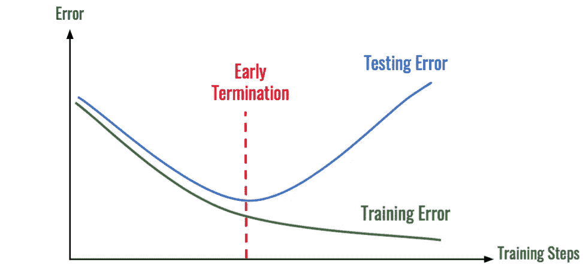

# 使用 PyTorch 提前停止，以防止模型过度拟合

> 原文：<https://medium.com/analytics-vidhya/early-stopping-with-pytorch-to-restrain-your-model-from-overfitting-dce6de4081c5?source=collection_archive---------0----------------------->

许多机器学习算法开发人员，尤其是新手，担心我应该为我的模型训练选择多少个纪元。希望这篇文章能帮助你找到解决这个困惑的方法。

在开始之前，让我们知道什么是 epoch，overfitting，什么是 early stopping，为什么我们要使用它？

很简单，EPOC 是你的整个训练数据在网络中正向传递和反向传播的次数。这意味着在测试数据之前，你的模型将了解你的数据多少次。

要说超拟合，我是回高中化学，大概你还记得化学反应的临界点吧！对吗？在你的化学实验室，你还记得滴定吗？要进行完美的滴定，酸和碱的量有一个临界点，因为如果你在酸溶液中多滴了几滴碱，你的滴定就不会显示出完美的结果。这意味着在某些时候你必须停下来，这样对两者都是平衡的。过度拟合的思想也是类似的。你必须在某个阶段停止训练你的模型。如果你不这样做，你的模型将是有偏差的训练数据，就像滴定中的不平衡情况。所以，早期停止是你必须停止训练你的模型的阶段。

那么我们需要做些什么来提前停止呢？我们可以推出一组验证数据，以持续观察我们的模型是否过度拟合。你也可以在 [Hackernoon](https://hackernoon.com/memorizing-is-not-learning-6-tricks-to-prevent-overfitting-in-machine-learning-820b091dc42) 上看到一篇关于过度拟合的讨论很好的文章。



提前终止点[【1】](https://hackernoon.com/memorizing-is-not-learning-6-tricks-to-prevent-overfitting-in-machine-learning-820b091dc42)

正如你所看到的，错误从一开始就或多或少的相似。然而，在某一点上，差异在增加，这表明我们需要在误差和时期方面尽早停止训练。

大多数机器学习库都有提前停止功能。例如，Keras 早期停止嵌入了库。你可以在这里看到，这是一篇关于这方面的精彩文章。

在我的头顶上，我知道 PyTorch 的提前停止并没有嵌入库。然而，它的官方网站建议另一个适合它的库，可以在训练阶段关注模型。现在是 [Ignite](https://pytorch.org/ignite/) ，你会在那里找到更多的实现文档。

然而，我使用的是另一个第三方库，根据我的可用性，它很酷。它在 [GitHub](https://github.com/ncullen93/torchsample) 中，作者将其命名为 TorchSample。你可以简单地从那里下载，它是开源的，如果你需要，你可以定制它。

现在，让我们开始工作，让我们有一个非常简单的 LSTM 模型

```
class Network(nn.Module):
    def __init__(self):
        super(Network, self).__init__()
        self.embededLayer = nn.Embedding(num_embeddings =MAX_LENGTH, embedding_dim = VOCAB_SIZE, padding_idx=None, max_norm=None, norm_type=2.0, scale_grad_by_freq=False, sparse=False, _weight=None)
        self.lstmCells = nn.LSTM(VOCAB_SIZE, HIDDEN_IN, MAX_LENGTH)   #nn.LSTM(input_size, hidden_size, num_layers) 
        self.linearLayer = nn.Linear(128, 32)  # equivalent to Dense in keras
        self.dropOut = nn.Dropout(0.2)
        self.linearLayer2 = nn.Linear(32, 1) 
        self.reluAct = nn.ReLU()
        self.softAct = nn.Softmax()
        self.logSoftAct = nn.LogSoftmax(dim=1)
        self.sigmoid = nn.Sigmoid()

    def forward(self, x):
        clsf = self.embededLayer(x)
        clsf, _ = self.lstmCells(clsf)
        clsf = self.linearLayer(clsf[:,-1,:])
        clsf = self.reluAct(clsf)
        clsf = self.linearLayer2(clsf)
        clsf = self.sigmoid(clsf)
        return clsf
```

一般来说，我们遵循这种策略，并跟进实验，因此，在这里，我根据我的训练假设，将时期数设为 200。

```
model = Network()
model.compile(loss='nll_loss', optimizer='adam')
model.fit(x_train, y_train, val_data=(x_test, y_test),num_epoch=200, batch_size=128, verbose=1)
loss = model.evaluate(x_train, y_train)
y_pred = model.predict(x_train)
```

然而，如果我的模型仅在 20 个周期后收敛，那么我们必须立即停止训练。那么我们如何做到这一点呢？很简单，只需要导入包，自己写一小部分代码就可以了。

现在您必须导入`ModuleTrainer`类，它提供了一个高级训练接口，抽象出训练循环，同时提供回调、约束、初始化器、正则化器等等。

```
from torchsample.modules import ModuleTrainer
trainer = ModuleTrainer(model)
model = ModuleTrainer(Network())
model.compile(loss='nll_loss', optimizer='adam')
callbacks = [EarlyStopping(monitor='val_loss', patience=5)]
model.set_callbacks(callbacks)
model.fit(x_train, y_train, val_data=(x_test, y_test),num_epoch=200, batch_size=128, verbose=1)
loss = model.evaluate(x_train, y_train)
y_pred = model.predict(x_train)
```

这里你可以看到，我只是通过模型训练器传递了模型，并创建了一个回调函数来跟踪验证。基于我的验证错误，我将停止训练过程。还有另一个参数名*耐心*，如果模型开始过度拟合，它将等待多少个时期终止。例如，如果模型在第 31 个时期开始显示与先前损失相比的变化，它将等到下 5 个时期，如果损失仍然没有改善，那么它将停止训练并返回模型，就像完成训练一样，如此而已。

希望你喜欢这篇文章。在我的下一篇文章中，我将尝试写关于贝叶斯超参数优化和正则化。