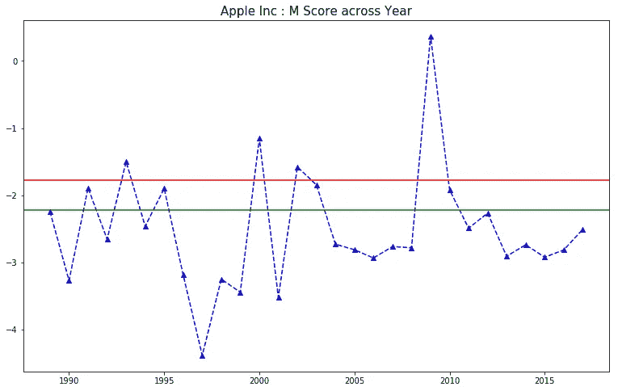
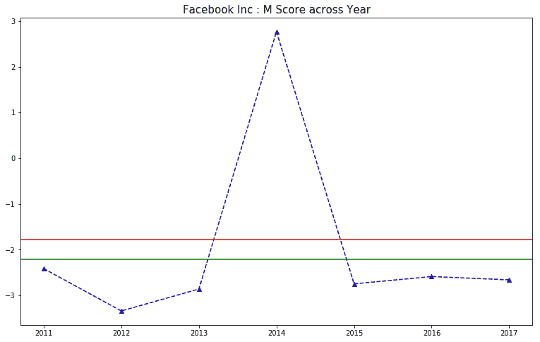
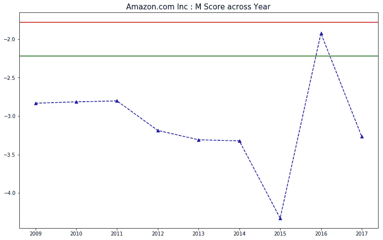
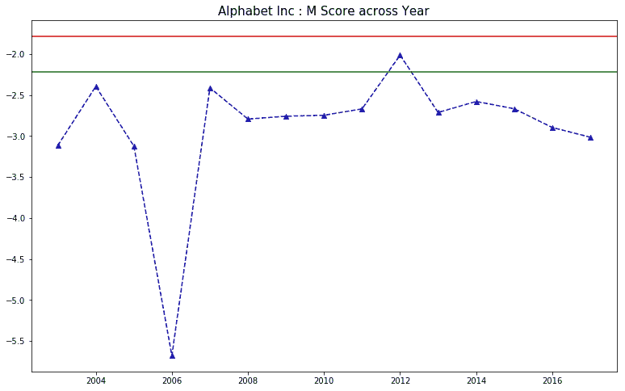
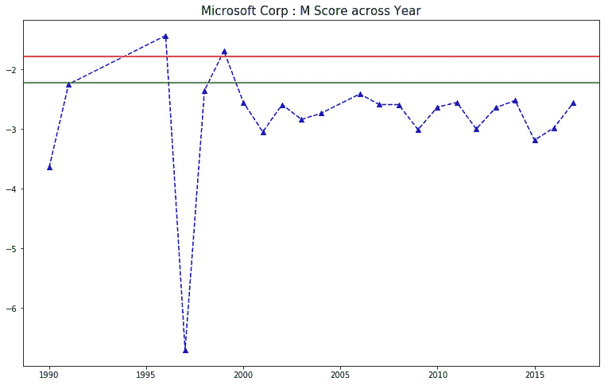
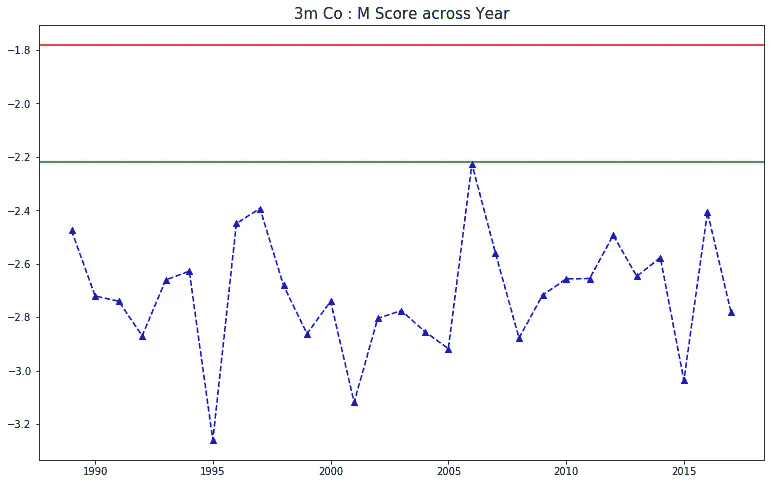
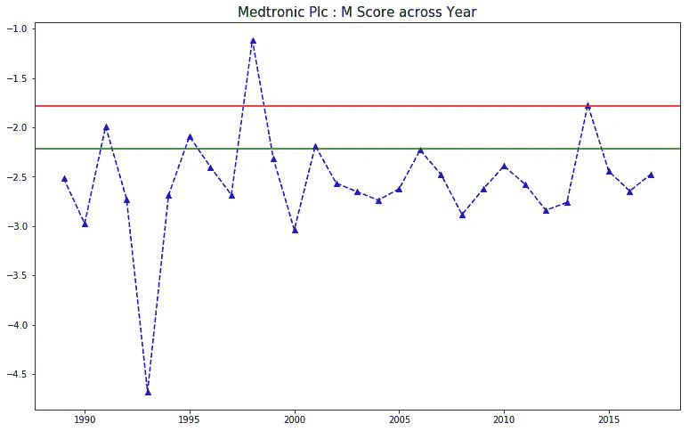
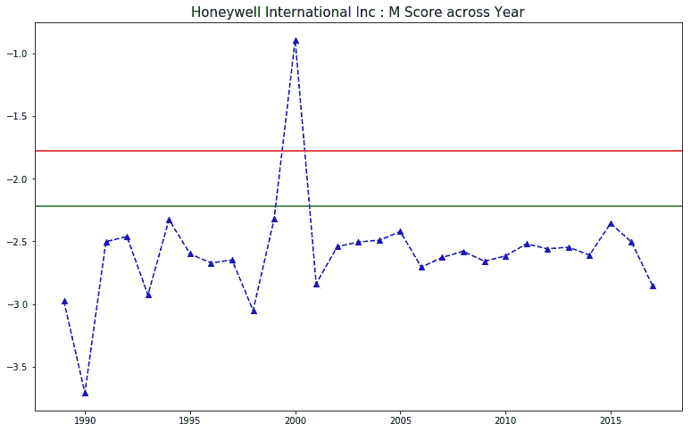

# 盈利操纵检测:嘿，为什么不试试我的 M 分数生成器？

> 原文：<https://medium.com/analytics-vidhya/earning-manipulation-detection-hey-why-not-try-my-m-score-generator-f8a7895743e0?source=collection_archive---------0----------------------->

# 介绍

在夏季学期的财务会计课上，我学习了一种叫做 Beneish M-Score 的盈余操纵工具。M-Score 是由 Messod Beneish 教授创建的，这是一个数学模型，利用八个财务比率来检查一家公司是否操纵了其收入。这个指标基本上是由公司的财务报表构建的。(引自本[链接](https://www.businessinsider.com/the-beneish-m-score-identifying-earnings-manipulation-and-short-candidates-2011-5))

Beneish 教授使用 Compustat 数据库来验证 M-Score。在财务与会计课程中，讲师创建了一个 excel 文件，其中包含 M-Score 的完整公式，并要求我们检测单个公司可能存在的盈余操纵行为。


这一次，我想跳回 Compustat 数据库，并试图不局限于一个单一的公司，并进一步创建我自己的 M 分数生成器。我很好奇是否有几家公司操纵了他们的收益。

该生成器可重复使用，易于使用，易于查询，并可以绘制跨年度的 M 分数趋势。

我在这里举一个例子来揭示我所做的事情。是苹果 M-Score 跨越多年的结果。



# 目标读者

对其投资组合中的公司的潜在收益操纵以及如何使用 Python 实现这种操纵感兴趣的人。

# 技能和工具

*工具:Python，Jupyter Notebook / Spyder*

*技能:数据清理和熊猫管理，函数创建，使用 matplotlib 可视化*

# 如何使用这篇文章

1.  通读这篇文章，更多地了解我如何建立我的简单的 M 分数生成器，并检查一些选定公司的一些 M 分数的例子。
2.  从 [my Github](https://github.com/yunhanfeng/M-Score-Generator) 中调出我的代码，查询你感兴趣的公司的 M-Score。

# 方法学

1.  由于 Compustate 数据库相当庞大，我决定用所需的列和行对数据进行子集化和清理，并进一步将其输出为 aa*m _ score _ dataset _ final . CSV*(也包含在我的 Github 中)。
2.  载入*m _ score _ datset _ final . CSV*，开始创建需要的列。
3.  根据数据框生成和图表输出创建几个辅助函数和主函数。

# 步骤 0:加载所需的包

加载所需的包总是步骤 0。和往常一样，熊猫，numpy，matplotlib，string 都会收录，不浪费任何时间。

```
import pandas as pd 
import numpy as np
import matplotlib.pyplot as plt
import string as st
```

# 步骤 1:子集化并清理 Compustat 数据库的数据

由于 Compustat 数据库非常庞大，我不得不将数据分割成易于管理的大小。采取的几个主要步骤如下:

1.  选择用于计算八个财务比率的指定列，包括净销售额、销货成本、净应收账款、流动资产、PPE、折旧、总资产、SGA 费用、净收入、经营现金流、流动负债和长期负债。除了这些财务指标，我还选择了 gvkey(数据库中的公司 id)、公司名称、数据日期和年份。

2.选择年份范围，我为生成器选择了 1988 年到 2017 年的范围。

3.从几根柱子上掉了 NA。

```
compustat = pd.read_csv("compustat_1950_2018_annual_merged.csv")
compustat_1 = compustat[["gvkey", "conm" ,"datadate","fyear","sale","cogs","rect","act",     "ppegt","dp","at","xsga","ni","oancf","lct","dltt"]]# Year range setting
compustat_2 = compustat_1.loc[compustat_1["fyear"] >1987]
compustat_2 = compustat_2.loc[compustat_2['fyear'] < 2018]# Some cleaning and NA dropping
com_3 = compustat_2[compustat_2['rect'] >= 0]
com_4 = com_3.dropna(subset = ["sale","cogs","act","ppegt","dp","at","xsga","ni","oancf","lct","dltt","rect"])
com_5 = com_4.fillna(0)# output the dataframe and create another csv
com_5.to_csv('m_score_dataset_final.csv', float_format = '%.6f', index = 0)
```

# 第二步:进一步管理并为 M 分数计算创建更多变量

大多数 M-score 8 比率需要前一年的变量；因此，我使用 pandas *groupby()* 和 *shift()* 函数来创建前一年的特征。

```
df['pre_sale'] = df.sort_values(['fyear']).groupby('gvkey')['sale'].shift()
df['pre_cogs'] = df.sort_values(['fyear']).groupby('gvkey')['cogs'].shift()
df['pre_rect'] = df.sort_values(['fyear']).groupby('gvkey')['rect'].shift()
df['pre_act'] = df.sort_values(['fyear']).groupby('gvkey')['act'].shift()
df['pre_ppegt'] = df.sort_values(['fyear']).groupby('gvkey')['ppegt'].shift()
df['pre_dp'] = df.sort_values(['fyear']).groupby('gvkey')['dp'].shift()
df['pre_at'] = df.sort_values(['fyear']).groupby('gvkey')['at'].shift()
df['pre_xsga'] = df.sort_values(['fyear']).groupby('gvkey')['xsga'].shift()
df['pre_ni'] = df.sort_values(['fyear']).groupby('gvkey')['ni'].shift()
df['pre_oancf'] = df.sort_values(['fyear']).groupby('gvkey')['oancf'].shift()
df['pre_lct'] = df.sort_values(['fyear']).groupby('gvkey')['lct'].shift()
df['pre_dltt'] = df.sort_values(['fyear']).groupby('gvkey')['dltt'].shift()
```

准备好所有变量后，现在可以创建八个比率。

```
# For later calculation
df['asset_qual'] = (df['at'] - df['act'] - df['ppegt']) / df['at']
df['pre_asset_qual'] = (df['pre_at'] - df['pre_act'] - df['pre_ppegt']) / df['pre_at']# Eight ratios
df['DSRI'] = (df['rect']/df['sale']) / (df['pre_rect'] / df['pre_sale'])
df['GMI'] =  ((df['pre_sale']-df['pre_cogs'])/df['pre_sale']) / ((df['sale']-df['cogs'])/df['sale'])
df['AQI'] = df['asset_qual'] / df['pre_asset_qual']
df['SGI'] = df['sale'] / df['pre_sale']
df['DEPI'] = (df['pre_dp'] / (df['pre_dp'] + df['pre_ppegt'])) / (df['dp'] / (df['dp'] + df['ppegt']))
df['SGAI'] = (df['xsga'] / df['sale']) / (df['pre_xsga'] / df['sale'])
df['TA'] = (df['ni'] - df['oancf']) / df['at']
df['LVGI'] = ((df['lct'] + df['dltt']) / df['at']) / ((df['pre_lct'] + df['pre_dltt']) / df['pre_at'])
```

最后，有了这些比率，我们就可以计算 M 值了。

```
df['M-Score'] = -4.84 + .920 * df['DSRI'] + .528 * df['GMI'] + .404 * df['AQI'] + .892 * df['SGI'] + .115 * df['DEPI'] - .172 * df['SGAI'] + 4.679 * df['TA'] - .327 * df['LVGI']
```

这一步的最后一步是将上面的所有代码捆绑到一个名为 m_score_df()的辅助函数中。当调用这个函数时，可以创建一个完整的 M-Score 数据帧。

# 步骤 3:编写函数为特定公司创建年度 M-Score 数据框架

这个函数可以用作帮助函数。函数**m _ score _ company(company _ name)**将返回特定公司的数据帧。用户只需键入公司名称。它将返回该公司的年度 M 分数表。

```
def m_score_company(company_name):
    company_name = company_name.upper()
    df = m_score_df()
    df1 = df[['gvkey','conm','fyear','M-Score']]
    df2 = df1[df1['conm'].str.contains(company_name)]
    df3 = df2.dropna()
    df3 = df3.reset_index()

    return df3
```

示例:

```
m_score_company('twitter')# result
   index  gvkey         conm   fyear   M-Score
0  74553  18872  TWITTER INC  2012.0 -1.955942
1  74554  18872  TWITTER INC  2013.0 -1.424558
2  74555  18872  TWITTER INC  2014.0 -3.162791
3  74556  18872  TWITTER INC  2015.0 -2.474192
4  74557  18872  TWITTER INC  2016.0 -3.394550
5  74558  18872  TWITTER INC  2017.0 -3.293757
```

# **第四步:用红色标志线创建一个可视化函数**

利用上面的函数，我又创建了一个绘图函数，**m _ score _ trend _ graph(company _ name)**。M-Score 有两个阈值:

*   如果 M-Score 大于-1.78，则表示红旗，表示操纵严重。
*   如果 M-Score 在-2.22 到-1.78 之间，表示黄旗，表示轻微操纵。

因此，这个函数生成的图形具有两个特性:一个是显示年度数据，另一个是红色和黄色旗帜有清晰的线条。

```
def m_score_trend_graph(company_name):
    df = m_score_company(company_name)
    company_name = df['conm'][0]
    df1 = df[['fyear','M-Score']]
    df1['fyear'] = df1['fyear'].round(1)
    df1 = df1.set_index('fyear')  
    company_name1 = st.capwords(company_name)

    fig, ax = plt.subplots(figsize = (13,8))
    ax.plot(df1, 'b^--')
    ax.axhline(y = -1.78, color = 'r', linestyle = '-')
    ax.axhline(y = -2.22, color = 'g', linestyle = '-')
    ax.set_title(company_name1 + ' : M Score across Year', fontsize = 15) 
    plt.show()
```

# 让我们来玩吧！

```
m_score_trend_graph('facebook')
```



```
m_score_trend_graph('amazon')
```



```
m_score_trend_graph('alphabet')
```



```
m_score_trend_graph('microsoft')
```



# **观察结果**

对于这四家公司来说，大部分时间它们都在 M 值的安全范围内，这表明大部分时间它们并不像是盈余操纵者。因为红旗区的某些点值得进一步调查。

让我们为明尼阿波利斯的一些财富 500 强公司尝试一下我们的 M-Generator。

```
m_score_trend_graph('3M co')
```



```
m_score_trend_graph('medtronic')
```



```
m_score_trend_graph('honeywell international')
```



# **观察结果**

根据 M 值，3M 是迄今为止最不可能操纵收益的公司。

美敦力和霍尼韦尔在 2000 年左右已经显示出危险信号。这些不寻常的图案非常有趣。

# **M 分数生成器的限制**

M 分数生成器有两个主要限制，可以进一步改进。

1.  如果一些财务指标没有被公司报告，也没有在 Compustat 数据库中报告。无法生成 M 分数图。以网飞为例。

```
m_score_company('netflix')# results
Empty DataFrame
Columns: [index, gvkey, conm, fyear, M-Score]
Index: []
```

这是因为网飞在*应收账款*栏里全是零，这削弱了我们的功能。我想下一步，我可能会为丢失的列寻找新的来源。

2.查找功能不是很准确。如果用户为一家公司插入一些通用关键字，它将返回包含所有匹配公司的列，并搞乱图形。

```
m_score_trend_graph('honeywell')
```


如果我只在函数中输入‘霍尼韦尔’，行就会被弄乱。这是因为它将返回“霍尼韦尔国际公司”和“霍尼韦尔公司”结果

因此，用户只需要键入特定的关键字。在这里，借助正则表达式的一些巧妙用法，可以做得更好。

# 结论

在这篇文章中，我试图探索盈余操纵的世界。我用 python 创建了几个有趣的函数，让读者/投资者了解他们投资组合中的公司。

这个过程既有趣又富有挑战性。我的代码仍然有一些不足之处，我一定会继续努力使它们变得更好。

```
If you like the article, feel free to give me 5+ claps
If you want to read more articles like this, give me 10+ claps
If you want to read articles with different topics, give me 15+ claps and leave the comment hereThank for the reading
```