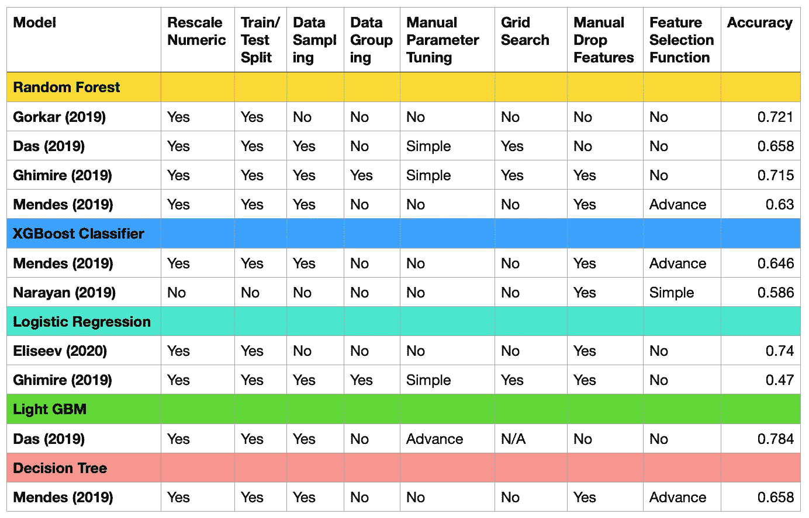

# 基于机器学习的震害预测——第一部分

> 原文：<https://medium.com/analytics-vidhya/earthquake-damage-prediction-with-machine-learning-part-1-74cc73bb978b?source=collection_archive---------12----------------------->

*由*——*任能 Ng*

照片由 [Jorge Fernández Salas](https://unsplash.com/@jorgefdezsalas?utm_source=unsplash&utm_medium=referral&utm_content=creditCopyText) 在 [Unsplash](https://unsplash.com/collections/5060896/waterstrider-ruins?utm_source=unsplash&utm_medium=referral&utm_content=creditCopyText) 拍摄

机器学习是一种帮助数据科学家进行预测的工具。为了充分理解如何在给定的情况下分析数据集，检查数据分布并起草一个全面的实验计划更有助于交付更好的结果。

随着 Kaggle 成为数据科学家相互学习的最受欢迎的平台，许多初学者将在分析什么和实验什么的问题上卡住。

在本教程中，我将假设您从一些在线课程或编码背景中对机器学习有一些基本的了解。由于大多数在线课程场景缺乏数据科学视图并直接指向编码，因此我将在本文中演示一个简单的数据科学观察视图。

开发机器学习算法的基本流程是:

**第一部分:背景及相关工作研究**

1.  理解领域和目标
2.  分析和比较不同研究者的相关工作

**第二部分:数据分析**

1.  选择实验编程语言、模型和验证方法
2.  创建勘探数据分析(EDA)报告

**第 3 部分&第 4 部分:实施**

1.  数据预处理
2.  实验计划草案
3.  关于实验的实施
4.  总结不同实验的准确度分数
5.  了解权衡点
6.  提交解决方案

**环境设置**

语言:R

IDE: R 工作室

模型:决策树，随机森林，XGBoost

包:脱字符，ggplot，UBL，rpart，psych， [MLmetrics 1.1.3](https://github.com/yanyachen/MLmetrics)

数据集:[https://www . driven data . org/competitions/57/尼泊尔-地震/数据/](https://www.drivendata.org/competitions/57/nepal-earthquake/data/)

# 第一部分:背景及相关工作研究

本案例研究主要关注[DataDriven.org](https://www.drivendata.org/competitions/57/nepal-earthquake/page/134/)和[卡格尔](https://www.kaggle.com/mullerismail/richters-predictor-modeling-earthquake-damage)的比赛和廓尔喀(尼泊尔)地震数据集。比赛要求 **F1 微分**作为表现指标。还有，这个数据集是[尼泊尔政府网站](https://eq2015.npc.gov.np/#/download)数据集的抽象版本数据集。

这个预测有什么用？

该数据集用于确定与建筑属性和质量相对应的损坏等级(低、中、毁坏)。目的是提出一种机器学习核，并准确预测损伤等级。它可以应用于任何具有类似建筑属性的国家或地区，以预测潜在的破坏等级，并进一步加强他们的建设工作。

当执行施工前抗震质量确定、施工增强工作分析和地震后脆弱性快速分析时，该预测是有用的。与依赖地震信号的其他地震相关预测相比，如[地震预测](https://www.researchgate.net/publication/320559210_Earthquake_Prediction_in_California_Using_Regression_Algorithms_and_Cloud-based_Big_Data_Infrastructure)。他们试图用一个与时间无关的机器学习模型来预测发生的概率、位置和震级，以向公众发出警报。但是由于非常随机，这是一项极其困难的任务。另一个预测示例是 [LANL 预测](https://www.kaggle.com/c/LANL-Earthquake-Prediction)，该预测用于激活现代故障保护系统，并通过处理声学和时间序列数据来预测最终故障时间，从而减轻地震损害。总之，基于建筑属性的预测是有价值的，因为它可以确定哪种建筑类型在减少损失和从地震损害中拯救人们方面具有成本效益。

**相关工作对比**

以下是如何将相关工作细节写入表格的示例。您可能能够确定其他研究人员已经做了什么，以及他们应用这些过程的意图是什么，例如关注模型、特征选择、超参数调整或 EDA。

可选地，你也可以包括与该领域相关的其他研究工作。如果主题没有太多相关工作，它可能会提供一些提示。

上表显示了相关的工作总结。它解决了一些关键问题:

1.  没有数据采样方法得到更高的准确度分数
2.  决策树得分类似于随机森林
3.  参数调整是优化精度的关键之一
4.  特征选择具有较低的向下精度
5.  随机森林是最稳定的内核

不平衡等级预测详情，可以看一下[这里](https://towardsdatascience.com/methods-for-dealing-with-imbalanced-data-5b761be45a18)。

**差距分析**

基于之前的工作，我们可以解决几个问题:

1.  XGBoost 能取得和 LGBM 差不多的成绩吗？
2.  这个数据集需要数据采样吗？
3.  特征选择如何改善预测？

我们可以拟定一些相关的实验来找出答案。

## [> >下一节](/@jenneng9/earthquake-damage-prediction-with-machine-learning-part-2-611d05bd391a)