# 基于机器学习的震害预测——第二部分

> 原文：<https://medium.com/analytics-vidhya/earthquake-damage-prediction-with-machine-learning-part-2-611d05bd391a?source=collection_archive---------13----------------------->

*By —* *仁能 Ng*

照片由[塞巴斯蒂安·赫尔曼](https://unsplash.com/@herrherrmann?utm_source=unsplash&utm_medium=referral&utm_content=creditCopyText)在 [Unsplash](https://unsplash.com/photos/FF5HjN9mT4E?utm_source=unsplash&utm_medium=referral&utm_content=creditCopyText) 上拍摄

这个故事是从一系列:

[第 1 部分:背景研究](/@jenneng9/earthquake-damage-prediction-with-machine-learning-part-1-74cc73bb978b)

[第二部分:数据分析](/@jenneng9/earthquake-damage-prediction-with-machine-learning-part-2-611d05bd391a)

[第 3 部分:实施](/@jenneng9/earthquake-damage-prediction-with-machine-learning-part-3-24e56342f5f1)

[第 4 部分:实施(续)](/@jenneng9/earthquake-damage-prediction-with-machine-learning-part-4-ac2461c1a9f6)

# 第 2 部分:数据分析

本教程使用 R 语言，原因是较少的编码工作和快速绘图。缺点可能是语法不可理解(语法太短)和深度学习模型支持少。

在[DataDriven.org](https://www.drivendata.org/competitions/57/nepal-earthquake/page/134/)有 39 列。主要目标是预测序数变量“损害等级”。此栏显示了受地震影响的损坏等级。损害测量有三个等级:1:低损害 2:中等损害 3:几乎或完全毁坏。

## 数据探索

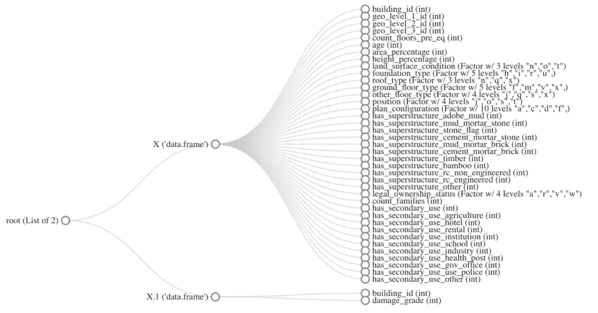

图 1 数据结构

当数据集有多个文件时，这个数据结构图非常有用，尤其是在 Kaggle 竞赛中。您可以大致了解一下如何将其合并到单个数据框中。

运行上面的代码将生成一个快速的 EDA 报告

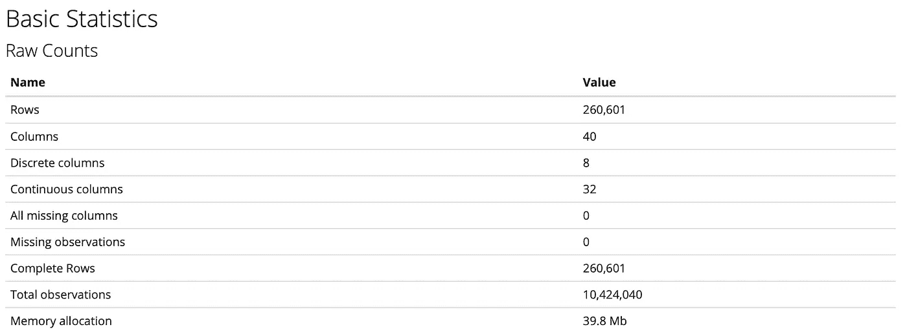

图 2 数据统计

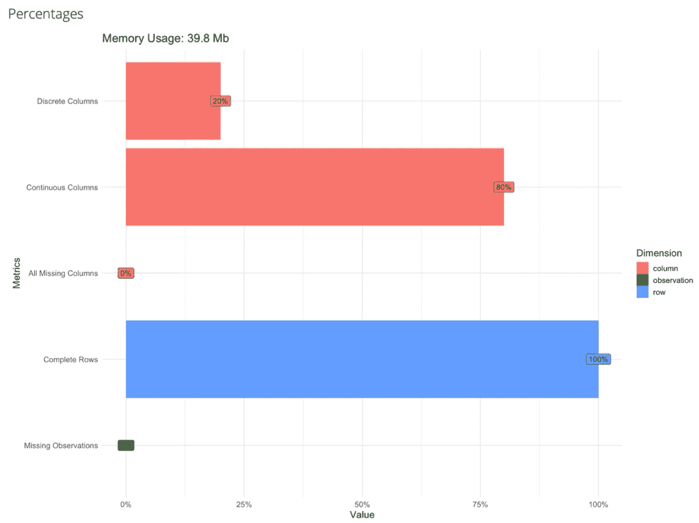

图 3 数据统计

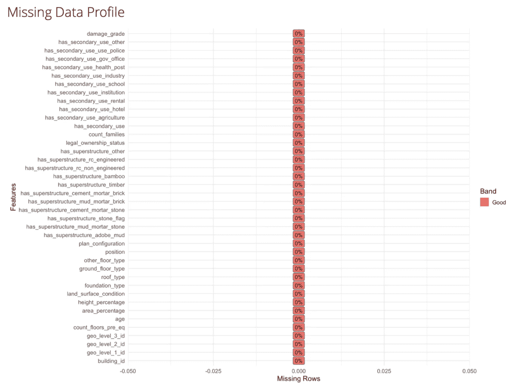

图 4 数据统计

图 2 显示了总体数据统计，它显示了 32 个连续列(二进制+数字)和 8 个离散列(类别)。因为只有 8 个离散的列，所以当我们执行一次热编码并消耗较少的 ram 来将数据存储到数据帧中时，速度会更快。

另一件要注意的事情是缺失的观察值和列，可能提供的一些数据集在特定的观察值(行)中有缺失的数据。这些步骤决定了我们是否应该执行数据清理/插补流程。

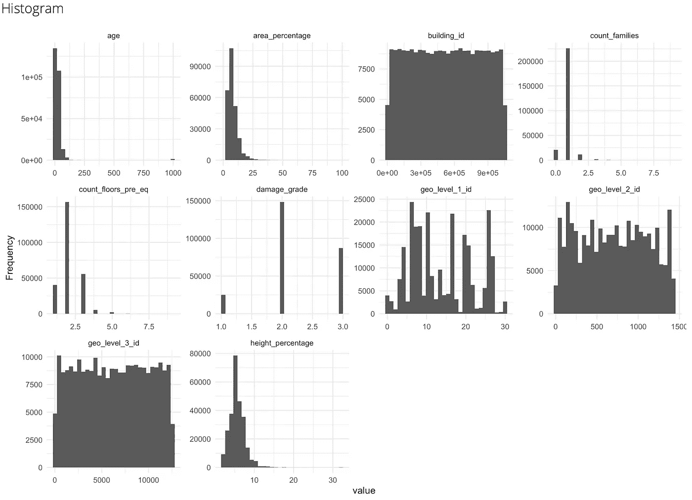

图 5 直方图

上面的直方图显示了频率分布，它提供了数字连续变量分布的快速视图。要观察的有趣点是年龄和身高 _ 百分比图右侧的小离群点。

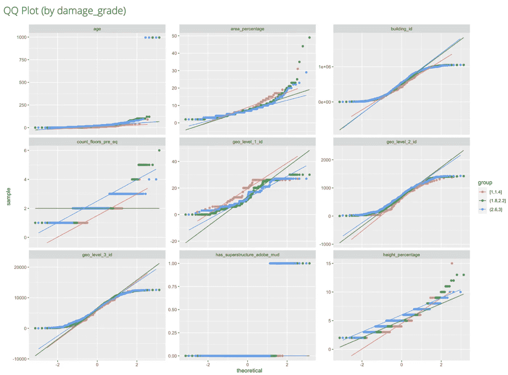

图 6 QQ 图

QQ 图对于数据科学来说，验证数据分布的正态性是相当常见的。这里的观察是为了验证头尾曲线是否接近常态线。上图显示了 building_id、geo_level_1_id、geo_level_2_id，而 geo_level_3_id 为“厚尾”,这意味着它具有比正态分布更多的极端数据，而位于分布中心的数据较少。([剧情参考](https://seankross.com/2016/02/29/A-Q-Q-Plot-Dissection-Kit.html))

另一方面，QQ 图显示了每个损害等级的变量范围或测量值。从那里，您可以识别哪些颜色线堆叠在一起，哪些没有。没有叠加在一起的颜色线，测量变量对于区分特定的观测数据是否处于哪个损伤等级是有用的。这个图向我们展示了所有的数字连续变量都是有用的。

或者，您也可以应用日志函数来修复数据分布。([参考](https://cran.r-project.org/web/packages/DataExplorer/vignettes/dataexplorer-intro.html#qq-plot)

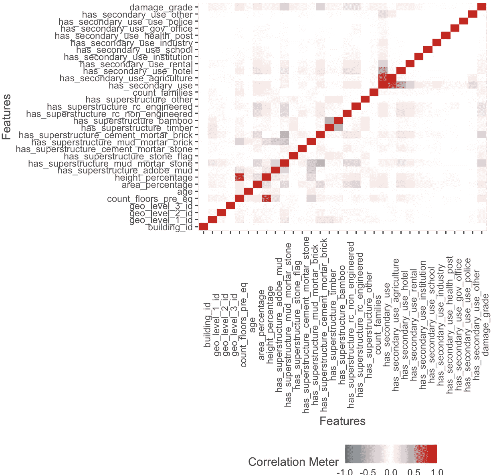

图 7 相关热图

相关热图是分析多元关系的一个有用的图。它定义了每个变量之间的关系。该图表明，楼层数与高度百分比高度相关。而且，has_secondary_use 和 has_secondary_use_agriculture 也有很高的相关性。

当变量高度相关时，意味着它们具有几乎相同的分布，如果有重复的变量，它不会提供有用的方差。因此，我们可以在以后决定是去除高度相关的变量，还是将它们与 PCA 相结合。

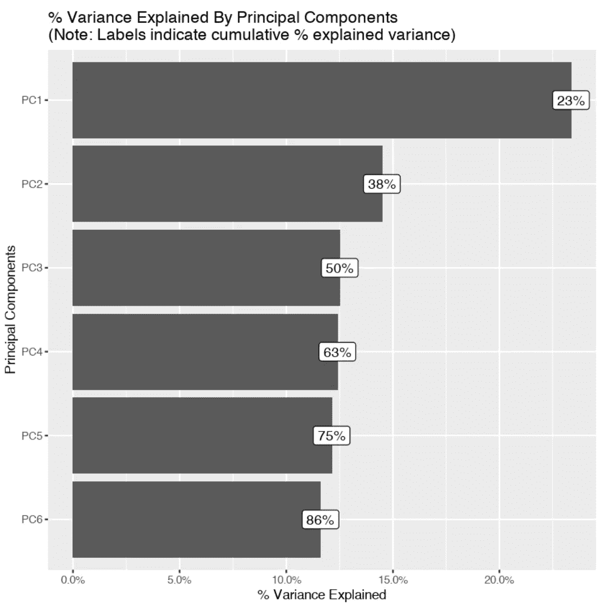

图 8 主成分分析图

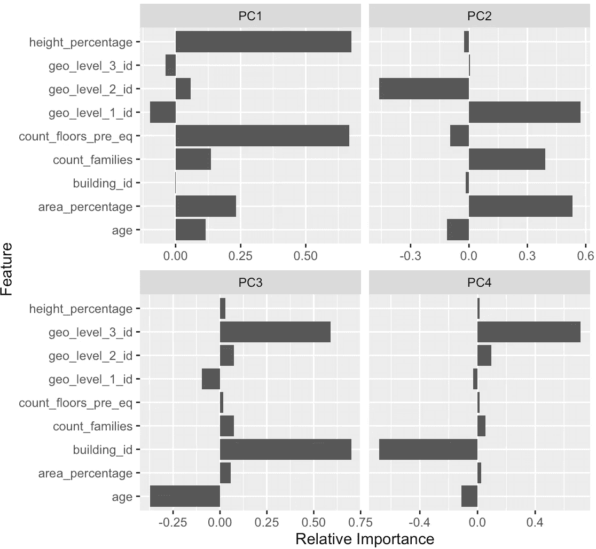

图 9 PCA 图

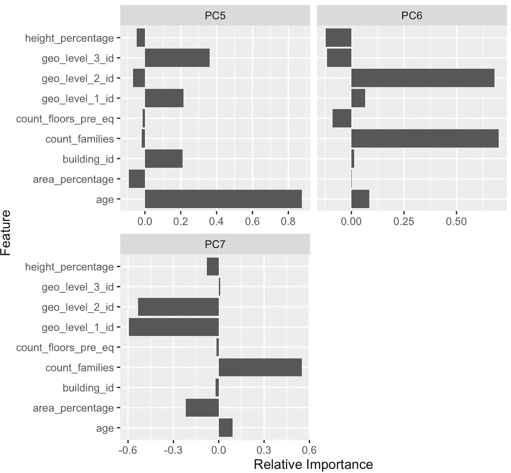

图 10 PCA 图

上面的 PCA 图(图 8–10)测量数值变量的 PCA。基于该图，建议将这 8 个变量组合成 6 个分量。那么这 6 个成分可以解释 86%的差异。一般来说，我们会挑选最高分，并将其合并到每个组的一个组件中，这被称为“因子加载”。但是，上面的图显示，一些变量能够加载到多个组件中，如 geo_level_3_id 和 count_families。(交叉加载)我们可以使用另一个库来执行 VARIMAX 旋转:

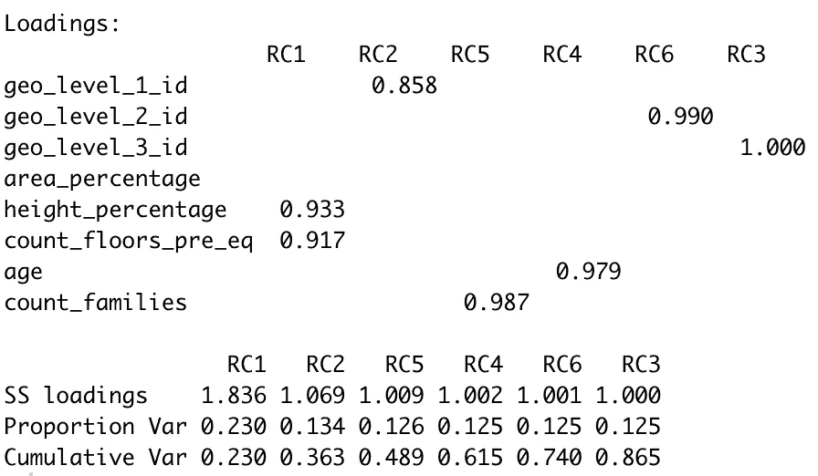

图 11 PCA 旋转

VARIMAX 旋转有助于我们解决交叉装载问题。它现在提供了一个更好的观点，我们应该结合什么变量。最佳组合是通过加载 height_percentage 和 count_floors_pre_eq 来旋转组件 1。其他组件只有一个变量，不值得执行。

图 12 卡方检验和 p 值

你也可以检查卡方和 p 值。当 p 值小于 0.05 时，这意味着它是显著的。(有用)

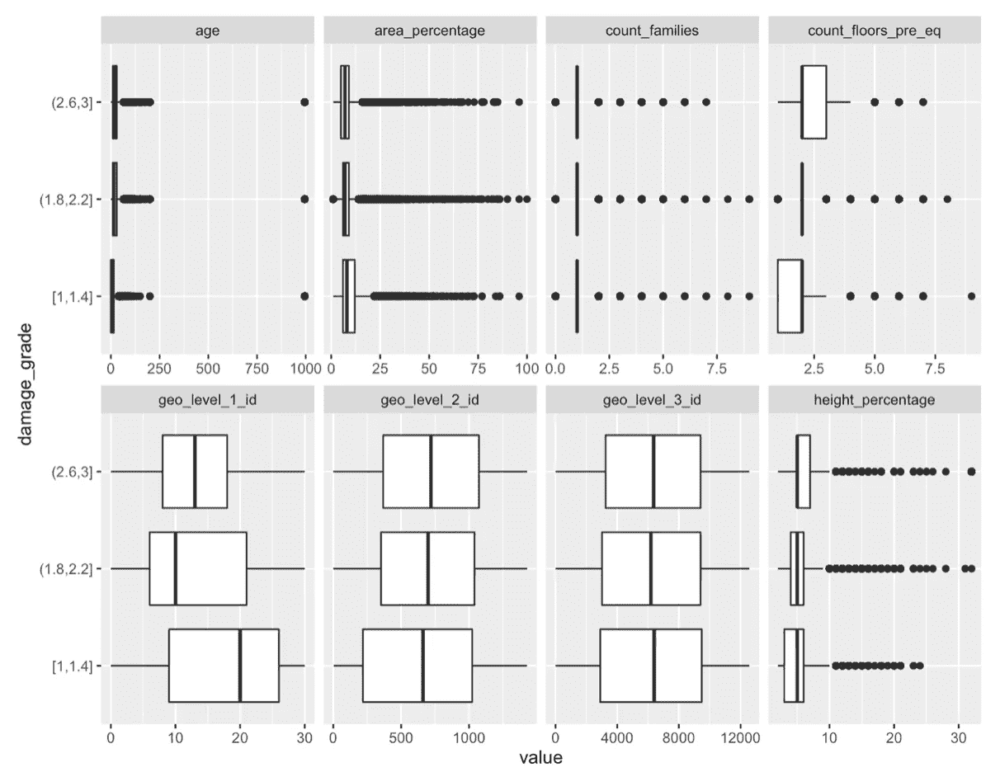

图 12 箱线图

这里的方框图可以帮助我们发现，当 count_floors_pre_eq 或 height_percentage 越来越高时，伤害等级越高。另一方面，geo_level_1_id 越高，damage_grade 越低。

使用箱线图的另一个优点是异常值识别。在年龄框图中，它显示一些黑点在最右边。可以在数据清洗部分去掉，但是一定要在实验部分验证。

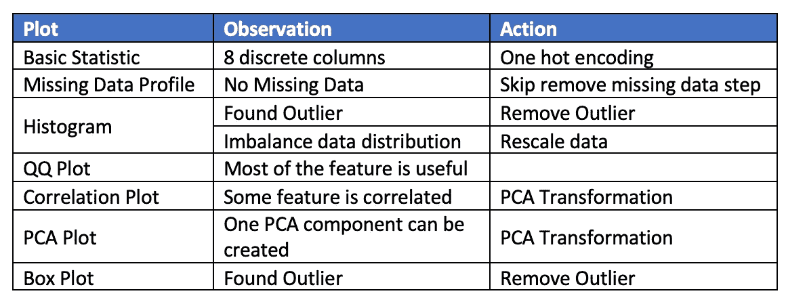

表 4 EDA 结果

数据预处理步骤可以按如下方式进行:

1)数据分割(在上采样之前执行分割，以避免插入用于验证的数据)

2)数据清理(删除异常值和重复行)

3)数据采样(在任何编码之前上采样以平衡因变量数据)

4)数据缩放(重新缩放连续变量数据)

5)数据转换(一次热编码和 PCA 转换)

6)功能选择(可选)

## [> >下一节](/@jenneng9/earthquake-damage-prediction-with-machine-learning-part-3-24e56342f5f1)