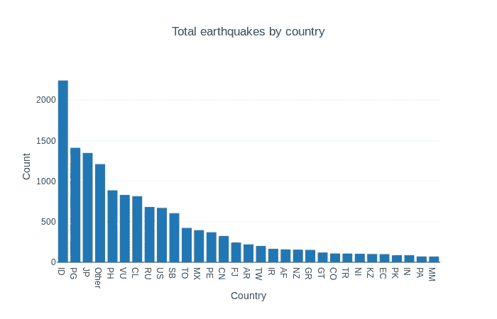
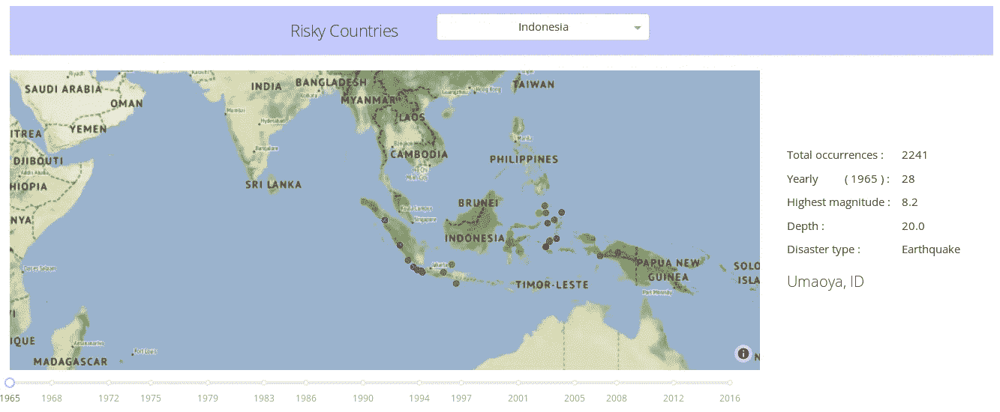
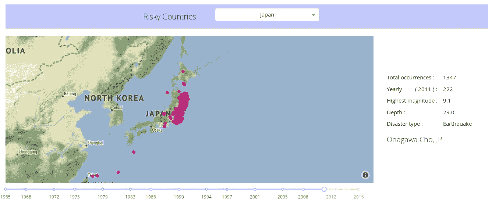
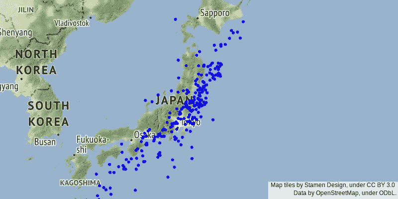

# 地震历史(1965 — 2016):数据可视化和模型开发

> 原文：<https://medium.com/analytics-vidhya/earthquake-history-1965-2016-data-visualization-and-model-development-ee53f3ce83f6?source=collection_archive---------17----------------------->


安德鲁·布坎南在 [Unsplash](https://unsplash.com?utm_source=medium&utm_medium=referral) 上的照片

实施 RandomForestRegressor，并使用 GridSearchCV 找到最佳拟合参数，以根据所选国家预测发生率。

**注:**我开发了这个模型，灵感来自[这个笔记本](https://www.kaggle.com/mahadevmm9/earthquake-prediction?scriptVersionId=6821016)，用我的编程技巧和创造力做了很多修改。

## 逐步程序

1.  从[这里](https://www.kaggle.com/usgs/earthquake-database)下载数据。
2.  如果我们仔细观察，会发现数据不包含*位置*列，这对于通过国家对其进行分离非常重要。但是它确实包含了*纬度*和*经度*坐标值。
3.  为了生成地点列，我们使用 openweathermap.org 的 API 并传递纬度和经度值，最终返回地点名称(您可以使用反向地理编码方法)。

```
>>> import pandas as pd
>>> import matplotlib.pyplot as plt>>> data_df = pd.read_csv('quake_db_1965-2016.csv')
>>> ## after geocoding implementation ##
>>> print(data_df['Place'])
>>> ["Ngidihopitonu, ID", "Pangai, TO", "Unknown", "Dapdap, PH" ... "Namie, JP"]
```

每个值由“，”分隔，带有地名和国家代码。有些是未知的，因为 API 找不到位置，因此它被验证为未知。JP 代表日本，ID 代表印度尼西亚等。

4.根据国家代码计算地震次数。这可以通过 pandas value_counts()函数轻松实现和可视化。

```
>>> data_df = data_df[data_df['Place'] != 'Unknown']
>>> data_df['CountryCode'] = data_df['Place'].apply(lambda x : x.split(', ')[len(x.split(', ')) - 1])>>> top_thirty = data_df['CountryCode'].value_counts()
>>> top_thirty = top_thirty.nlargest(30).index
>>> top_thirty = list(top_thirty)
['ID', 'PG', 'JP', 'PH', 'VU', 'CL', 'RU', 'US', 'SB', 'TO', 'MX', 'PE', 'CN', 'FJ', 'AR', 'TW', 'IR', 'AF', 'NZ', 'GR', 'GT', 'CO', 'TR', 'NI', 'KZ', 'EC', 'PK', 'IN', 'PA', 'MM']>>> df_update = data_df['CountryCode'].where(data_df['CountryCode'].isin(top_thirty), other='Other')>>> df_update.value_counts().plot(kind='bar', figsize=(15, 8))
```



按国家分列的地震总数

## 让我们做一些数据可视化

为此，我只考虑了前三十个受影响的国家。

创建一个 RangeSlider，显示从 1965 年到 2016 年的缩放年份

```
import numpy as np
import dash
import dash_core_components as dcc
import dash_html_components as htmlyear_marks = np.linspace(1965, 2016, 15)
year_marks = [int(i) for i in year_marks]range_slider = html.Div([
 dcc.Slider(
   id='year-slider',
   min=min(year_marks),
   max=max(year_marks),
   step=1,
   marks={i : '{}'.format(i) for i in year_marks},
   value=year_marks[0]
  )
])
```

制作一个下拉列表，显示前 30 个受影响国家的列表

```
country_dropdown = html.Div([
 dcc.Dropdown(
   id='top-thirty-risky',
   options=[
    {'label' : 'Indonesia', 'value' : 'ID'},
    {'label' : 'Japan', 'value' : 'JP'},
    {'label' : 'India', 'value' : 'IN'}
    ...
    {'label' : 'Myanmar', 'value' : 'MM'}
   ],
   clearable=False,
   searchable=True,
   value='ID'
 )
])
```

输出地图，以显示国家明智和每年明智的结果在地图上

```
country_map = html.Div(id='map-history')
```

使用一个助手函数来提取基于年份和国家代码的数据。

```
def GetCountryDataByYear(risky_code, year_value):
 dataq = pd.read_csv('quake_db_1965-2016.csv')
 risky_country = dataq[dataq['Place'].str.contains(risky_code)]
 risky_country = risky_country[['Date', 'Latitude', 'Longitude', 'Magnitude', 'Depth', 'Type', 'Place']]
 _, _, risky_country['Year'] = risky_country['Date'].str.split('/').str
 risky_country.loc[:, 'Year'] = risky_country.loc[:, 'Year'].astype(int)
 risky_country = GetDataYearValue(risky_country, year_value) return risky_country
```

在 dash 应用程序中显示输出

```
import plotly.graph_objs as goinsightful_history = html.Div([
 html.Div([]),
 country_dropdown,
 country_map,
 range_slider,
])app = dash.Dash(__name__)#<top_thirty_countries_occurrences_by_year>
[@app](http://twitter.com/app).callback(
 Output('map-history', 'children'),
 [Input('top-thirty-risky', 'value'), Input('year-slider', 'value')]
)
def history_scatter_map(risky_code, year_value):
 risky_country = GetCountryDataByYear(risky_code, year_value)
 if risky_country.shape[0] > 0:
  lats = risky_country['Latitude'].to_list()
  lons = risky_country['Longitude'].to_list()
  magnitudes = risky_country['Magnitude'].to_list()
  mags_info = ['Magnitude : ' + str(m) for m in magnitudes]
  depths = risky_country['Depth'].to_list()
  deps_info = ['Depth : ' + str(d) for d in depths]
  places = risky_country['Place'].to_list()
  country_risky_info = [places[i] + '<br>' + mags_info[i] + '<br>' + deps_info[i] 
   for i in range(risky_country.shape[0])]center_lat = risky_country[risky_country['Magnitude'] <= risky_country['Magnitude'].min()]['Latitude'].to_list()[0]
  center_lon = risky_country[risky_country['Magnitude'] <= risky_country['Magnitude'].min()]['Longitude'].to_list()[0]country_map = PlotScatterMap(lats, lons, 10, magnitudes, default_colorscale, country_risky_info)
  country_layout = LayoutScatter(400, 1000, 'stamen-terrain', center_lat, center_lon, 2.5)
  result_country = html.Div([
   dcc.Graph(
    id='risky-country-result',
    figure={'data' : [country_map], 'layout' : country_layout}
   )
  ], style={'margin-top' : 20, 'margin-left' : 10})
  return result_country
 return html.Div([
  html.H6('No Earthquakes found for {} in the year {}'.format(risky_code, year_value))
 ], style={'margin-top' : 150, 'margin-bottom' : 150, 'margin-left' : 250})
#</top_thirty_countries_occurrences_by_year>
```

最后运行应用程序

```
if __name__ == '__main__':
 app.run_server(debug=True, dev_tools_props_check=False, dev_tools_ui=False)
```

## 结果

除了可视化，我还做了一些基本的统计，当选择一个特定的年份和国家时，显示发生的总数，每年发生的总数，最高震级，最高震级的深度和每个坐标的实际地名。

1965 年印度尼西亚国家地图结果。



1965 年印度尼西亚地震

2011 年日本的国家地图结果(我们都知道它是如此的灾难性)。



2011 年日本地震

## 对日本的预测

为此，我们只考虑日本的数据。

```
>>> qdb = pd.read_csv('quake_db_1965-2016.csv')
>>> japan = qdb[qdb['Place'].str.contains('JP')]
>>> japan.shape
(1347, 22)
```

为了避免 NaN 值并对这些值进行插值，我们需要一些辅助函数。

```
def nan_helper(y):    
    return np.isnan(y), lambda z: z.nonzero()[0]def get_interpolation(my_df, nan_series):
    arr_series = np.array(my_df[str(nan_series)])
    nans, x = nan_helper(arr_series)
    arr_series[nans] = np.interp(x(nans), x(~nans), arr_series[~nans]) return arr_series.round(2)
```

要将 NaN 转换为实际值，请调用函数。

```
japan.loc[:, 'Depth Error'] = get_interpolation(japan, 'Depth Error')
japan.loc[:, 'Depth Seismic Stations'] = get_interpolation(japan, 'Depth Seismic Stations')
japan.loc[:, 'Magnitude Error'] = get_interpolation(japan, 'Magnitude Error')
japan.loc[:, 'Magnitude Seismic Stations'] = get_interpolation(japan, 'Magnitude Seismic Stations')
japan.loc[:, 'Azimuthal Gap'] = get_interpolation(japan, 'Azimuthal Gap')
japan.loc[:, 'Horizontal Distance'] = get_interpolation(japan, 'Horizontal Distance')
japan.loc[:, 'Horizontal Error'] = get_interpolation(japan, 'Horizontal Error')
japan.loc[:, 'Root Mean Square'] = get_interpolation(japan, 'Root Mean Square')
```

我们的模型只支持整数值。我们需要将字符串数据转换成数值。为此，我们必须使用 **LabelEncoder()** 类。

```
def label_integer_encoder(my_df, series_name):
    arr_name = np.array(list(my_df[str(series_name)]))
    label_arr_encoder = LabelEncoder()
    integer_arr_encoded = label_arr_encoder.fit_transform(arr_name) return integer_arr_encodedjapan.loc[:, 'Type'] = label_integer_encoder(japan, 'Type')
japan.loc[:, 'Status'] = label_integer_encoder(japan, 'Status')
japan.loc[:, 'Magnitude Type'] = label_integer_encoder(japan, 'Magnitude Type')
japan.loc[:, 'Place'] = label_integer_encoder(japan, 'Place')
```

现在将数据分为要素和目标。

```
X = japan[['Depth', 'Magnitude Error', 'Magnitude Type', 'Depth Error', 'Azimuthal Gap', 'Horizontal Distance', 'Horizontal Error', 'Root Mean Square', 'Place']]y = japan[['Latitude', 'Longitude', 'Magnitude']
```

我们的目标是坐标值和星等，以定位地图上的点。

```
>>> X_train, X_test, y_train, y_test =  train_test_split(X, y, test_size=0.2, random_state=5)>>> X_train.shape
(1077, 9)
>>> y_train.shape
(1077, 3)
>>> X_test.shape
(270, 9)
>>> y_test.shape
(270, 3)
```

## 模型开发

RandomForestRegressor 用于分类，对于大部分数据具有更高的准确性。

```
>>> reg = RandomForestRegressor()
>>> reg.fit(X_train, y_train)
>>> preds = reg.predict(X_test)
>>> accuracy = reg.score(X_test, y_test)
>>> accuracy
0.7162181047909523
```

GridSearchCV 是确定超参数以拟合数据并给出更好结果的最佳算法。我们只需要定义一堆参数，传入上面的模型。查看[这个](https://nbviewer.jupyter.org/github/chaotic-enigma/ETS_P/blob/master/JapanPrediction.ipynb)了解更多信息。

```
>>> parameters = {'n_estimators' : [16, 23, 43, 87, 45, 550, 680]}
>>> gs = GridSearchCV(reg, parameters, cv=10)
>>> grid_fit = gs.fit(X_train, y_train)
>>> best_fit = grid_fit.best_estimator_
>>> y_hat = best_fit.predict(X_test)
>>> gs_a = best_fit.score(X_test, y_test)
>>> print(gs_a)
0.7900631674945803
```

让我们将结果(y_hat)作为数据框，以便以更方便的方式可视化预测。

```
>>> preds_df = pd.DataFrame()
>>> preds_df['lats'] = [row[0] for row in y_hat]
>>> preds_df['lons'] = [row[1] for row in y_hat]
>>> preds_df['mags'] = [round(row[2], 2) for row in y_hat]
>>> preds_df.head()
**lats            lons             mags**                             37.621949       141.460630       5.72                 
39.431155       143.188569       6.72                 
36.210025       141.240586       6.04                 
35.908162       139.069894       6.00                 
36.863911       140.763899       5.85
```



日本预测

同样，我们可以对其他国家进行预测。我之所以用日本，是因为它是仅次于印度尼西亚的地震高发国家。

这个项目的完整代码是[这里](https://github.com/chaotic-enigma/ETS_P)。

# 结论

1.  地震是一种非常随机的自然灾害，很难预测下一次实际发生的情况。
2.  为了能够预测地震，我们需要实时的构造移动数据，即断裂引起地震的时间。
3.  序列挖掘将非常有助于通过序列的某种模式来预测下一次发生的事件。