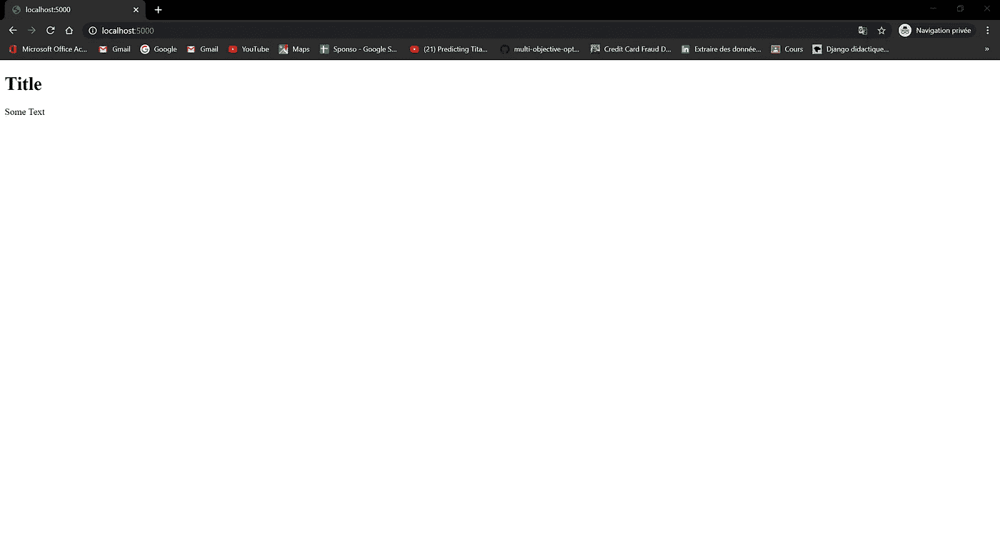
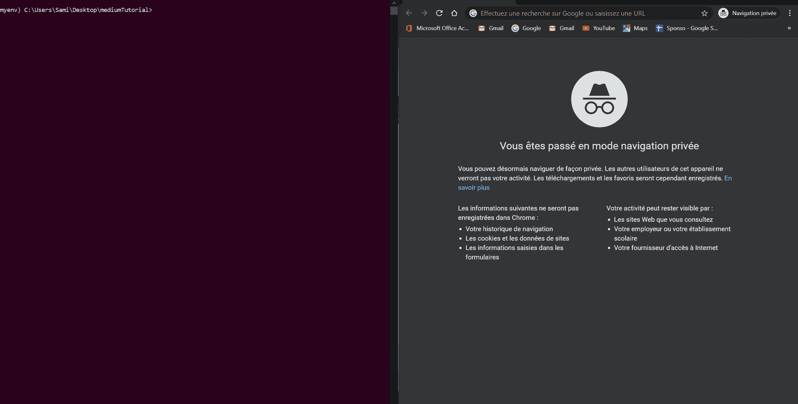
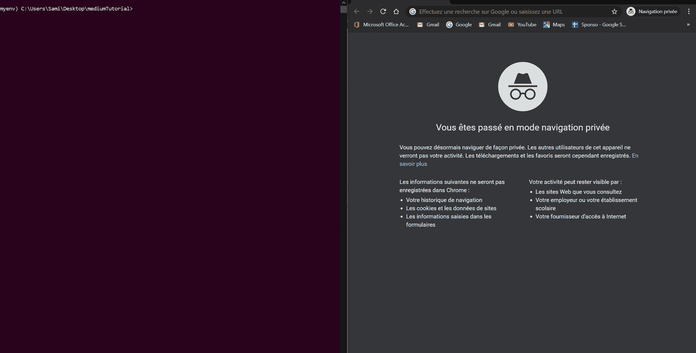

# 最简单的 python 和 flask 教程

> 原文：<https://medium.com/analytics-vidhya/easiest-python-and-flask-tutorial-f1ba963281a?source=collection_archive---------17----------------------->

> “任何傻瓜都能写出计算机能理解的代码。优秀的程序员会写出人类能理解的代码。”


大家好，我是一名年轻的工科学生，这是我写的第一个编码教程…我希望你们会喜欢。

**第一部分:首次设置**

我将在本教程中使用 Visual Studio 代码，因为它是我发现的最强大的 IDE。

步骤:

1.  安装 Python 3 稳定版

2.安装“pip”包。(可以找到很多安装方式)

4.通过打开 cmd 并执行以下命令，为 pip 安装虚拟环境

> *pip 安装 virtualenv*

**第二部分:项目设置**

1.  打开你的 cmd，进入你选择的目录(桌面)，创建一个名为 mediumTutorial 的新目录。

> cd 桌面
> 
> mkdir 培养基教程
> 
> cd 媒体教程

2.现在，我们将通过在 cmd 上键入以下命令，在 Visual Studio 代码中打开我们的文件夹:

> 代码。

VS 代码将打开一个新窗口，同时打开你的媒体教程文件夹

3.现在让我们创建一个虚拟环境。这是一件重要的事情，因为当我们需要部署我们的项目时，它会帮助我们。因此，无论何时开始一个 python 项目，都要确保创建一个虚拟环境。

> 虚拟 myenv

您将在项目文件夹中看到一个名为“myenv”的新文件夹

4.让我们激活这个虚拟环境，这样我们就可以开始了，在您的 cmd 中键入以下命令:

> cd myenv
> 
> cd 脚本
> 
> 使活动

你会看到这个:

```
(myenv) C:\Users\(User)\Desktop\mediumTutorial\myenv\Scripts>
```

5.让我们导航回“媒体教程”文件夹

> 激光唱片..
> 
> 激光唱片..

6.让我们在“myenv”中安装 flask:

> pip 安装烧瓶

7.返回 VS 代码，创建一个名为“app.py”的新 python 文件，粘贴如下内容:

```
from flask import Flask, render_templateapp = Flask(__name__)@app.route('/')def hello():return render_template('index.html')if __name__ == '__main__':app.run(debug=True)
```

所以这里我们导入了 flask 和 render template，它可以渲染一个模板，但是让我们避免把容易理解的事情复杂化。

我们将关注 3 行代码，它们是:

```
@app.route('/')
def hello():
return render_template('index.html')
```

这三行代码用于为给定的 URL 规则注册一个视图函数。

8.现在，我们必须创建一个名为“templates”的文件夹来保存我们的 html 页面，并在其中创建“index.html”文件，然后粘贴如下内容:

```
<!DOCTYPE html>
<html>
<body>

<h1>Title</h1>

<p>Some Text</p>

</body>
</html>
```

9.我们现在将运行该应用程序。

> python app.py

您应该会看到类似这样的内容:



恭喜你能够看到你的第一个 html 页面在 [http://localhost:5000/](http://localhost:5000/) 上运行

**第三部分:玩变量:**

在这一部分中，我们将看到如何从用户那里获得一个输入，使用它一点点，然后向用户显示结果。

1.  修改“index.html ”,使其可以提供输入框:

```
<!DOCTYPE html><html><body><h1>Title</h1><p>Some Text</p><form method="POST" ><div class="form-group"><label>Fist input</label><input type="text" class="form-control" name="pythonFirstInput" placeholder="input"></div><div class="form-group"><label>Second input</label><input type="text" class="form-control" name="pythonSecondInput" placeholder="input"></div><button type="submit" class="btn btn-black" >Submit</button></form></body></html>
```

并修改“app.py”文件:

```
from flask import Flask, render_template, requestapp = Flask(__name__)@app.route('/', methods=('GET','POST'))def hello():if request.method == 'POST':firstInput = request.form['pythonFirstInput']secondInput = request.form['pythonSecondInput']print(firstInput,secondInput)return render_template('index.html')if __name__ == '__main__':app.run(debug=True)
```

让我们检查一下 cmd 是否会打印这两个输入



精彩！！现在我们知道如何在 python 中存储我们的输入。⚡⚡

2.让我们做一个简单的 python 任务，它包括连接两个输入

在打印行之后添加这一行

```
myOutput=firstInput+secondInput
```

在 if 块的最后，我们将返回一个包含 python 变量的模板

```
return render_template("result.html",myHtmlOutput=myOutput)
```

这会呈现一个名为“result.html”的 html 页面

3.在模板文件夹中创建 result.html:

```
<!DOCTYPE html><html><body>{{myHtmlOutput}}</body></html>
```

如果你仔细观察，你会注意到我把变量放在花括号{{}}中，这就是 flask 如何理解它是从 render_template 方法返回的 python 变量。

如果一切正常，您应该能够看到:



**结论:**

这是对 flask 和 python 的简单介绍，现在您知道如何从 html 页面获取输入，将其存储在 python 变量中，并包装它们以便可以在 html 代码中打印它们。你可以在这里下载项目权[。](https://github.com/samibenazzouz/mediumTutorial)