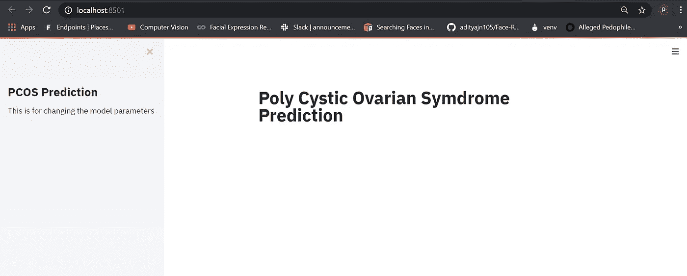
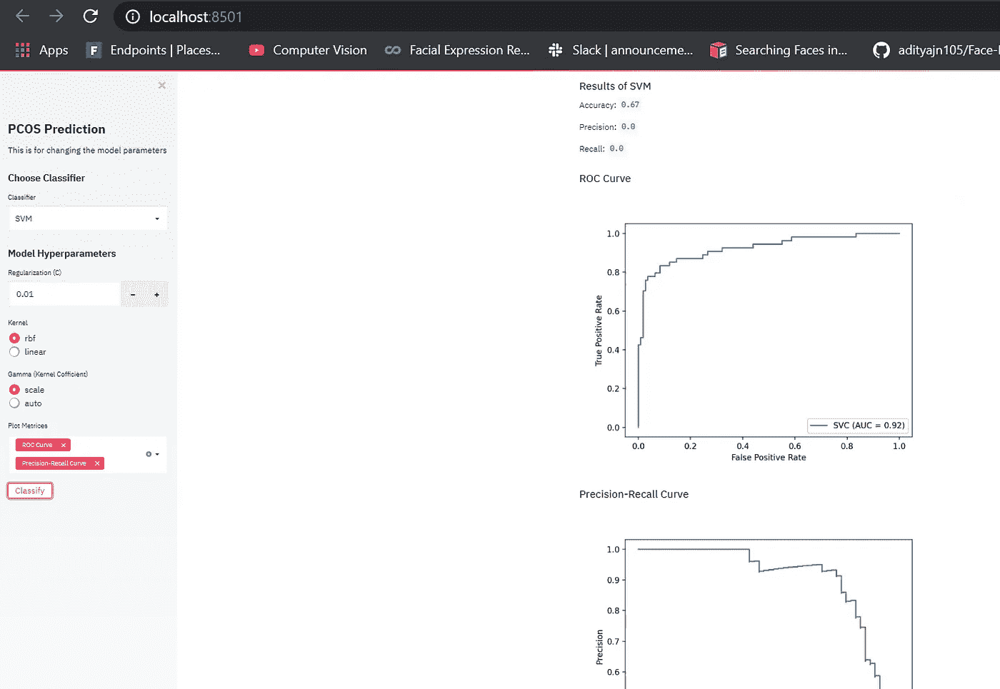
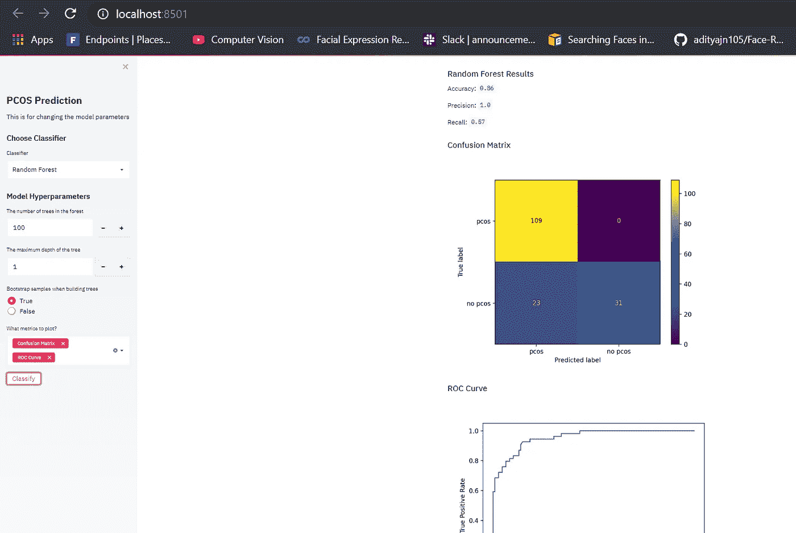
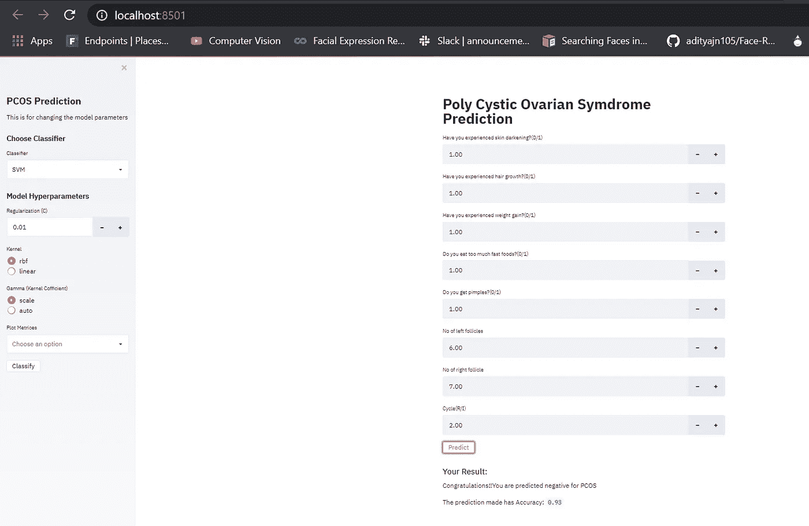

# 构建数据科学 Web 应用程序的最简单方法

> 原文：<https://medium.com/analytics-vidhya/easiest-way-to-build-your-data-science-web-app-b5fa640c1a39?source=collection_archive---------24----------------------->

我知道这种开发机器学习 Web 应用程序的超级简单的方法还不到一个月。我已经开发了各种 ML 模型，但总是难以让它看起来像样，更像一个产品或 MVP。

Streamlit 是一个 python 框架，在这个框架中，您只需几行代码就可以轻松构建一个交互式 web 应用程序。数据科学家现在是 Streamlit 的 Web 开发人员！

这很容易上手。你只需要通过 pip 安装软件包。您可以使用 *streamlit hello* 运行一个示例 streamlit 应用程序，以了解它的外观。

```
pip install streamlit
streamlit hellostreamlit run main.py
```

在我的主文件夹中:

```
import streamlit as st
st.title(“Poly Cystic Ovarian Symdrome Prediction”)
st.sidebar.title(“PCOS Prediction”)
st.sidebar.markdown(“This is for changing the model parameters”)
```

python 脚本中的更改在每次保存时都会被扫描，并且在您编码时，它也会在 web 应用程序中实时更改。运行文件为:***streamlit run main . py***，输出为:



这就对了。

我将用一个多囊卵巢综合征预测的演示项目来解释。如今，PCOS 是女性中非常常见的疾病，卵巢出现某种囊肿可能会导致不孕。数据集可以从这里的[获取](https://www.kaggle.com/prasoonkottarathil/polycystic-ovary-syndrome-pcos)。数据集分为两个表:

1.  没有不孕
2.  不孕不育

因此，我们需要在一个公共列上连接这两个表，并删除与我们的输出不太相关的特性。此外，我们将需要一些数据清理。

```
@st.cache(persist=True)
def load_data():
 no_inf=pd.read_csv(“C:/Users/dell/Documents/PCOS Prediction/no_inf.csv”)
 inf=pd.read_csv(“C:/Users/dell/Documents/PCOS Prediction/inf.csv”)
 data = pd.merge(no_inf,inf, on=’Patient File No.’, suffixes={‘’,’_y’},how=’left’)
 data[‘Fast food (Y/N)’].fillna(data[‘Fast food (Y/N)’].median(),inplace=True)
 data.drop([‘PCOS (Y/N)_y’,’AMH(ng/mL)_y’,’Patient File No.’,’Unnamed: 42'],axis=1,inplace=True)
 corr_features=data.corrwith(data[“PCOS   (Y/N)”]).abs().sort_values(ascending=False)
 corr_features=corr_features[corr_features>0.25].index
 data=data[corr_features]
 return datadf=load_data()
```

函数 *load_data()* 负责加载数据、清理和功能选择。这项工作只能做一次。当您重新运行脚本时，将再次执行 load_data()。但这可以通过使用 *@st.cache* decorator 来避免，它将缓存应用程序，这样你就可以避免昂贵的重复计算，如训练或加载巨大的数据集。在这里，我们将根据一名女性的体重增加、痤疮、月经不调等症状来预测她是否患有 PCOS。我们只选择那些与我们的输出特征非常相关的特征，即 *PCOS (Y/N)* 。

现在，让我们转向分类器。由于我们正在创建一个交互式仪表板，我们需要有多个分类器，以便用户可以找到最好的分类器。

```
st.sidebar.subheader("Choose Classifier")
 classifier = st.sidebar.selectbox("Classifier", ("SVM", "Random Forest"))
 if classifier == 'SVM':
  st.sidebar.subheader("Model Hyperparameters")
  C = st.sidebar.number_input("Regularization (C)", 0.01, 10.0, step=0.01, key='C_SVM')
  kernel = st.sidebar.radio("Kernel", ("rbf", "linear"), key='kernel')
  gamma = st.sidebar.radio("Gamma (Kernel Cofficient)", ("scale", "auto"), key='gamma')
  metrics = st.sidebar.multiselect("Plot Metrices", ('Confusion Matrix', 'ROC Curve', 'Precision-Recall Curve'))if st.sidebar.button("Classify", key='classify'):
   st.subheader("Results of SVM")
   model = SVC(C=C, kernel=kernel, gamma=gamma)
   model.fit(x_train, y_train)
   accuracy = model.score(x_test, y_test)
   y_pred = model.predict(x_test)
   st.write("Accuracy: ", accuracy.round(2))
   st.write("Precision: ", precision_score(y_test, y_pred, labels=class_names).round(2))
   st.write("Recall: ", recall_score(y_test, y_pred, labels=class_names).round(2))
   plot_metrics(metrics)if classifier == 'Random Forest':
  st.sidebar.subheader("Model Hyperparameters")
  n_estimators = st.sidebar.number_input("The number of trees in the forest", 100, 5000, step=10, key='n_estimators')
  max_depth = st.sidebar.number_input("The maximum depth of the tree", 1, 20, step=1, key='n_estimators')
  bootstrap = st.sidebar.radio("Bootstrap samples when building trees", ('True', 'False'), key='bootstrap')
  metrics = st.sidebar.multiselect("What metrics to plot?", ('Confusion Matrix', 'ROC Curve', 'Precision-Recall Curve'))if st.sidebar.button("Classify", key='classify'):
   st.subheader("Random Forest Results")
   model = RandomForestClassifier(n_estimators=n_estimators, max_depth=max_depth, bootstrap=bootstrap, n_jobs=-1)
   model.fit(x_train, y_train)
   accuracy = model.score(x_test, y_test)
   y_pred = model.predict(x_test)
   st.write("Accuracy: ", accuracy.round(2))
   st.write("Precision: ", precision_score(y_test, y_pred, labels=class_names).round(2))
   st.write("Recall: ", recall_score(y_test, y_pred, labels=class_names).round(2))
   plot_metrics(metrics)
```

*st.sidebar.selectbox("分类器"，(" SVM "，"随机森林"))*显示一个单选按钮，允许您在 SVM 分类器和随机森林分类器之间进行选择。对于每个分类器，您还可以设置可变参数。您可以通过以下几行代码为分类器输入您想要的参数:

```
C = st.sidebar.number_input("Regularization (C)", 0.01, 10.0, step=0.01, key='C_SVM')
kernel = st.sidebar.radio("Kernel", ("rbf", "linear"), key='kernel')
gamma = st.sidebar.radio("Gamma (Kernel Cofficient)", ("scale", "auto"), key='gamma')
```

并在训练分类器时发送这些参数:

```
model = SVC(C=C, kernel=kernel, gamma=gamma)
model.fit(x_train, y_train)
```

为了找到准确性，您需要创建一个训练测试分割。拆分只需要做一次，这就是为什么我们再次缓存这部分计算。让我们将分割函数设为:

```
[@st](http://twitter.com/st).cache(persist=True)
def split(df):
  y = df['PCOS (Y/N)']
  x=df.drop(columns=['PCOS (Y/N)'])
  x_train, x_test, y_train, y_test = train_test_split(x, y, test_size=0.3, random_state=0)
  return x_train, x_test, y_train, y_testx_train, x_test, y_train, y_test = split(df)
```

下面这部分特定的代码完成了准确性计算和实际预测的工作。 *plot_metrics* 函数中的 argumet*metrics*之前被定义为用户想要的精确度可视化列表。

```
metrics = st.sidebar.multiselect("Plot Metrices", ('Confusion Matrix', 'ROC Curve', 'Precision-Recall Curve'))accuracy = model.score(x_test, y_test)
y_pred = model.predict(x_test)
plot_metrics(metrics)
```

让我们将 *plot_metrics()* 函数定义为:

```
def plot_metrics(metrics_list):
  if 'Confusion Matrix' in metrics_list:
   st.subheader("Confusion Matrix")
   plot_confusion_matrix(model, x_test, y_test, display_labels=class_names)
   st.pyplot()if 'ROC Curve' in metrics_list:
   st.subheader("ROC Curve")
   plot_roc_curve(model, x_test, y_test)
   st.pyplot()

  if 'Precision-Recall Curve' in metrics_list:
   st.subheader('Precision-Recall Curve')
   plot_precision_recall_curve(model, x_test, y_test)
   st.pyplot()
```

因此，您可以选择分类器、更改预测以及可视化准确性度量。你也可以用同样的方法添加其他型号。

## 将症状作为用户的输入

```
skin=st.number_input("Have you experienced skin darkening?(0/1)", key='skin')
 hair=st.number_input("Have you experienced hair growth?(0/1)", key='hair')
 weight=st.number_input("Have you experienced weight gain?(0/1)", key='weight')

 ff=st.number_input("Do you eat too much fast foods?(0/1)", key='ff')
 pimple=st.number_input("Do you get pimples?(0/1)", key='pimple')
 lf = st.number_input("No of left follicles", key='lf')
 rf=st.number_input("No of right follicle", key='rf')
 cycle=st.number_input("Cycle(R/I)", key='cycle')
 my_data=[[lf,rf,skin,hair,weight,cycle,ff,pimple]]
 pd.DataFrame.from_dict(my_data)
 if st.button("Predict", key='predict'):
   st.subheader("Your Result:")
   model = SVC(C=0.01, kernel="linear", gamma="auto")
   model.fit(x_train, y_train)
   accuracy = model.score(x_test, y_test)
   y_pred = model.predict(my_data)
   if y_pred==1:
    st.write("Alert!!You are predicted to have PCOS")
   else:
    st.write("Congratulations!!You are predicted negative for PCOS")

   st.write("The prediction made has Accuracy: ", accuracy.round(2))
```

最终输出如下所示:



使用 SVM 分类器



使用随机森林分类器



供用户输入

整体项目可以从[我的 github repo](https://github.com/paridhi-parajuli/PCOS-Prediction-with-Streamlit) 下载。

感谢阅读！