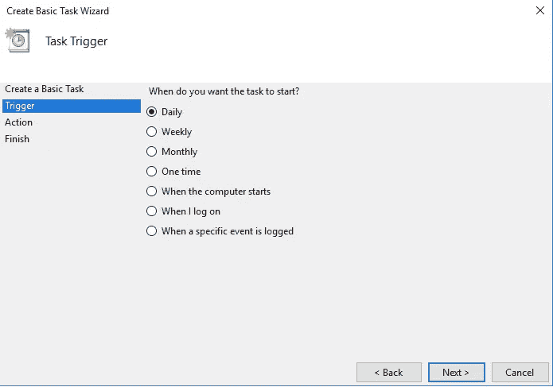

# 在后台运行 Python 脚本的最简单方法

> 原文：<https://medium.com/analytics-vidhya/easiest-way-to-run-a-python-script-in-the-background-4aada206cf29?source=collection_archive---------3----------------------->

运行 python 脚本在后台运行最简单的方法是使用 ***cronjob 特性(在 macOS 和 Linux 中)*** 。在 windows 中，我们可以使用 Windows 任务计划程序。

在 Mac 或 Linux 中，使用以下命令打开终端，检查后台正在运行哪些作业

> crontab -l

现在，要编辑列表，请键入以下命令

> crontab -e

然后，您可以通过给出时间细节来给出在特定时间运行的 python 脚本文件的路径。现在输入以下内容，按`CTRL+O and CTRL+X` 保存并退出。

目前我有两个任务计划在后台运行，这可以从下面的截图中看到

第一个作业将在该月 27 日第 11 个小时的第 15 分钟运行。该作业定期扫描现场办公室的详细联系信息，并将其存储在 csv 文件中。

第二个作业在每小时的第 15 分钟运行，检查各个地方的天气详细信息。

**cron job 的结构:**

**对于 Windows** ，搜索 ***任务调度*** 。

1.  打开程序。

2.现在，在右侧面板上点击“*创建基本任务*

给出任务名称及其描述，然后单击下一步

3.接下来选择您需要运行脚本的频率。

如果要每天运行脚本，请选择“每天”

4.在下一个屏幕上，选择要运行脚本的日期和时间

5.接下来，选择“启动程序”

6.浏览要执行的脚本

7.选择脚本并单击“完成”来计划任务

编码快乐！