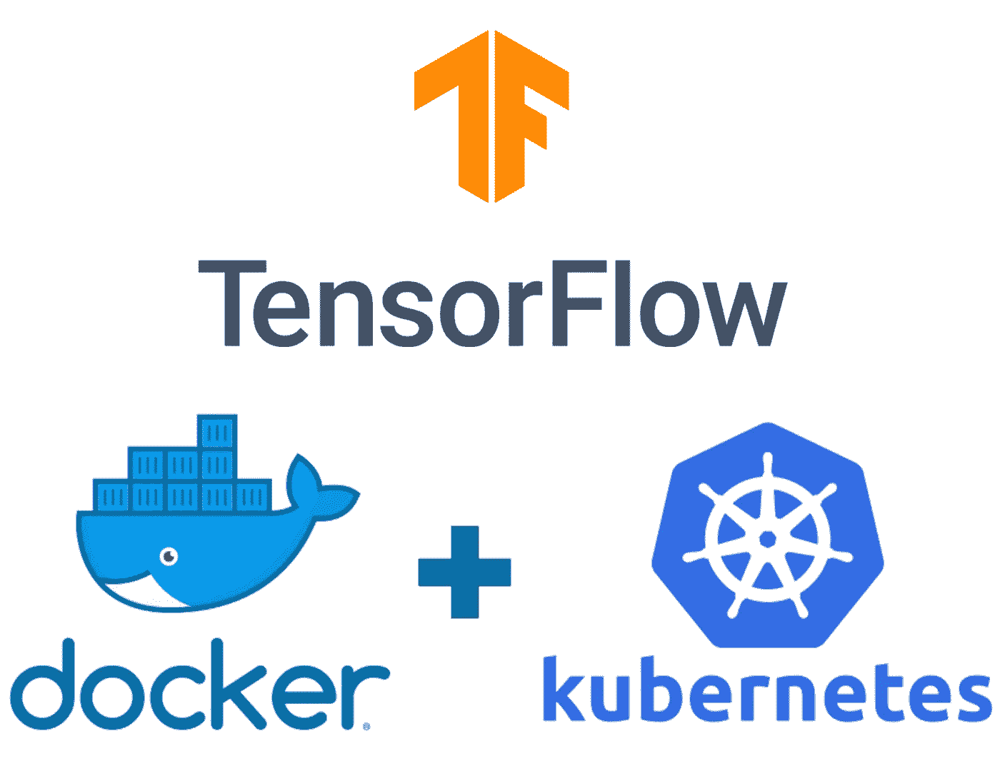

# 使用 Docker/Kubernetes 在生产中服务 Tensorflow 模型的最简单方法

> 原文：<https://medium.com/analytics-vidhya/easiest-way-to-serve-dl-models-in-production-using-docker-kubernetes-31870e34866f?source=collection_archive---------9----------------------->



将你的模型从实验投入生产的最简单的方法之一就是使用 Docker 来使用 **TF serving。在这篇博文中，我们将探讨如何建立你自己的 TF 服务 docker 形象，我们将把它推广到 Docker registery，比如 docker hub。**

为什么要建立自己的码头工人形象？？让我们探讨使用以下方法的利弊…
**弊** 1。嗯…很难弄清楚..可能你喜欢在你的管道的每个服务器上一次又一次地安装东西。
2。你可能需要在 docker hub 或任何其他平台的付费账户上投资，以防这些图片成为隐私。
3。你还不知道 Docker 好吧，现在是 2020 年，你确定吗？？？

**优点** 1。不需要，需要安装特定版本或任何版本的 tf 服务于任何机器，无论是本地开发和云服务器。
2。在 docker hub 这样的地方维护同一个模型的不同版本很容易。
3。我们可以在 kubernetes 集群中使用这些图像。

在这里，我不打算讨论 **TF 服务**的好处，因为它需要单独的博客文章……所以请继续关注。我将向您展示如何用您的模型将预处理放到 **TF Serving** 中。

**建立自己形象的步骤:**
1。安装对接器
2。以 tf 服务格式保存 tensorflow(keras)模型
3。在 dockerfile 中写入配置以构建映像
4。树立你的形象。将图像推送到 docker hub

现在是详细说明的时候了。安装 docker
使用 Docker 官方安装指南…([https://docs.docker.com/engine/install/](https://docs.docker.com/engine/install/))**或**在([https://www.youtube.com/watch?v=3c-iBn73dDE](https://www.youtube.com/watch?v=3c-iBn73dDE))上观看 Docker 视频

**2。** **以 tf 服务格式保存 tensorflow(keras)模型** 现在是保存您的模型的时候了…不要担心，训练过程将保持不变。一旦你对模型执行感到满意，只需使用以下代码行将模型存储为 **TF Serving** 格式。

```
version=1
export_path=f"./tf_serving/{version}/"tf.keras.models.save_model(model_object, 
                           export_path, 
                           overwrite=True,
                           include_optimizer=True,
                           save_format=None,
                           signatures=None,
                           options=None)
```

请记住，您可能有不同版本的模型，这就是为什么总是喜欢升级导出路径中的“**版本号**”，这有助于您在需要时选择模型的先前版本。

**3。在 dockerfile 中编写配置以构建映像**
终于到了我们要使用 **dockerfile** 来构建自己的 docker 映像的时候了，该映像使用刚刚保存的模型来托管在 docker hub 或其他 docker 注册表上。

在开始编写 **dockerfile** 中的配置之前，让我们了解一下 **TF Serving 的 docker 镜像还有哪些可用的方法。**

```
docker run -d -p 8501:8501 --mount type=bind,source="/mnt/c/Users/Scooby Doo/Projects/malaria_detection/tf_serving",target=/models/malaria -e MODEL_NAME=malaria -t tensorflow/serving
```

那么这种方法有什么问题呢？？？
1。它不适用于 kubernetes 设置，因为根据目前的知识，它需要使用正确的图像，而不是附加到 **tensorflow/serving** 的原始图像的东西。
2。另一个问题是单独运送 tf 服务文件，然后附加到原始图像。有些人想出了一种方法来分别维护这些 tf 服务文件，一旦项目开始增长，需要越来越多的模型和各自的 tf 服务文件，这可能是更大的挑战。

现在转到我们的解决方案…
编写 **dockerfile** ，它将构建自己的 docker 映像，而无需单独维护 tf 服务文件。

```
# Pull latest image of tensorflow serving
FROM tensorflow/serving:latestCOPY . /# Expose ports
# gRPC
EXPOSE 8500# REST
EXPOSE 8501ENTRYPOINT ["/usr/bin/tf_serving_entrypoint.sh"]CMD ["--model_name=malaria", "--model_base_path=/tf_serving"]
```

现在是时候解码这个文件了，这样就可以很容易地为每个新项目重复它。

```
FROM tensorflow/serving:latest
```

这一行代码代表什么将是我们建立全新形象的基础形象。这个基本映像包含在任何机器上运行服务于模型的 **TF 所需的所有依赖项。
看到你不需要安装任何东西…**

```
COPY . \
```

它将 **tf_serving** 文件夹及其文件/文件夹复制到我们正在构建的新映像中。

```
# Expose ports
# gRPC
EXPOSE 8500# REST
EXPOSE 8501
```

**expose 命令**的工作是在构建其容器时，通过一次运行时修改来打开与外界通信的端口。我们将在运行这个 docker 映像时看到这些修改。所以不用担心…

```
ENTRYPOINT ["/usr/bin/tf_serving_entrypoint.sh"]CMD ["--model_name=malaria", "--model_base_path=/tf_serving"]
```

移动到输出**文件**的最后阶段。在此之前，让我们先了解一下 **ENTRYPOINT、CMD 和 RUN** …

*   **入口点**配置一个将作为可执行文件运行的容器。
*   **CMD** 设置默认命令和/或参数，当 docker 容器运行时，可以从命令行覆盖这些命令和/或参数。
*   **运行**在新层执行命令并创建新图像。例如，它通常用于安装软件包。

现在**TF _ serving _ entry point . sh**文件里面是什么？？？基本上这个文件包含了运行 **TF 服务模型所需的所有配置&命令。一般来说，当你按照我的方法创建图像时，不要碰文件，因为这不是必需的…**

在任何情况下，您都需要使用 **CMD** 命令进行修改，就像我们在本例中所做的那样。在这种情况下，我们的两个修改是:

1.  我们应该始终使用“—型号名称”参数应用唯一的**“型号名称”**
2.  因为我们已经将整个 **tf_serving** 文件夹移到了新图像中。这就是为什么我们将“—模型 _ 基础 _ 路径”称为“tf _ 服务”。你必须小心，无论你在本地机器的哪个文件夹中存储了原始的 tf 服务文件。您应该始终使用该文件夹名称作为参数值。

**4。建立你的形象** 现在我们拥有自己形象的时候到了……嗯……但是怎么做呢？？？

只需使用操作系统的终端在 Dockerfile 和 tf_serving 文件夹中导航即可。请确保此文件和文件夹在同一文件夹中，并处于同一级别。

```
docker build -t swapnilpote/malaria:1.0
```

一旦你运行以上命令，它将创建自己的 docker 镜像，镜像名称为 malaria，版本标签为 1.0。让我们更好地理解这个命令…

**"docker build"** 用于构建图像，您可能已经猜对了，但是什么是**-t "**或者**"-tag = "**这个额外的参数用于为您的图像指定特定的名称，在我们的示例中是 **"malaria:1.0"** 。

好吧…但是用 imagename:verstintag 提**“swapnilpote/”**有什么意义。如前所述，我们将把这张图片推送到 docker hub，并给出我们将把这张图片推送到哪里的想法，提及内部图片名称非常重要。始终用您的 docker hub 用户名替换“swapnilpote/”。

要在本地机器上查看 docker 映像列表，请键入以下命令。

```
docker images
```

如果你在列表中看到你的 docker 图片，这意味着它已经被成功创建。

**5。如果你在 docker hub 上没有账户，将图片推送到 docker hub** 。访问此网址创建账户([https://hub.docker.com/](https://hub.docker.com/))。再次打开终端窗口以验证用户，然后在上面推送图像。

```
docker login
```

逐一输入您的用户名和密码。一旦通过验证，您将看到“登录成功”消息。推的时间到了…

```
docker push swapnilpote/malaria:1.0
```

你将在终端形象得到推动。完成后，检查您的 docker hub 配置文件，看图像是否存在。

**现在一切都完成了…** *但是等等，在使用 Kubernetes 集群之前，如何使用这个图像或交叉检查它呢？？？*

在任何机器上键入这个命令来构建 docker 映像的容器，并开始在本地或云环境上使用它。你不需要 kubernetes 开始在生产中使用这个图像。它的选择将由系统架构决定。

```
docker run -d -p 8501:8501 --name=malaria swapnilpote/malaria:1.0
```

如果你看过第一点中提到的视频。您可能已经非常清楚这个命令了。尽管如此，如果有人需要明确的想法，内部评论将会编辑这篇博文的最后一部分，以消除疑虑。

**最后一步预测使用 docker 容器或 kubernetes pod 检查此文件……**
[https://github . com/swapnilpote/malaria _ detection/blob/master/run . py](https://github.com/swapnilpote/malaria_detection/blob/master/run.py)

在这个 github repo([https://github.com/swapnilpote/malaria_detection](https://github.com/swapnilpote/malaria_detection))中找到上面这篇博文的完整代码

请在评论中发表你的想法和建议。敬请关注更多关于机器学习从开发到生产的博客文章，以及各自的最佳实践。