# 用 Spring 框架轻松构建 REST API

> 原文：<https://medium.com/analytics-vidhya/easily-build-your-rest-api-with-spring-framework-80941c359d44?source=collection_archive---------7----------------------->

Photo by [贝莉儿 DANIST](https://unsplash.com/@danist07?utm_source=medium&utm_medium=referral) on [Unsplash](https://unsplash.com?utm_source=medium&utm_medium=referral)

> 学习的能力是一种天赋；学习的能力是一种技能；愿意学习是一种选择。—布莱恩·赫伯特

M ost 菜鸟们，每当在一次对话或者一篇文章中听到***API****这个词的时候，一些有趣的想法可能会浮现在脑海中，比如 ***复杂、未知、困难等等。****

*这没有问题，我们都必须从某个地方开始，对吗？曾经，我是一个甚至不知道 ***API*** 首字母缩写代表什么的人，然后，像你一样，我开始阅读、思考、尝试……现在看看我，作为一名软件工程师，我几乎每天都在创建它们，我很喜欢它！*

*今天的目标是向你展示，前面提到的词语只是我们对未知事物恐惧的表现。然后，我要你想一想你是怎么考虑到这种感受的。*

*我们将从头开始创建一个简单的例子，解释每一个步骤，每一个选择，以及我们如何能够用 [***Spring 框架***](https://spring.io/)*在短短 10 分钟内，拥有一个工作的 REST API。**

# ****#概念****

**在我开始解释如何创建 API 之前，你应该先知道这个叫做***API***的东西是什么。**

**首先， *API* 代表 ***应用编程接口，*** [维基百科](https://en.wikipedia.org/wiki/API)解释为:**

> **定义多个软件中介之间交互的计算接口。它定义了可以进行的调用或请求的种类、如何进行、应该使用的数据格式、应该遵循的约定等等。**

**让我们试着把它映射到一个具体的例子:想象你有一个作品集网页，在那里你分享一些关于你自己的信息，比如兴趣、兼职、职业经历、项目等等。现在，你希望关注你的人随时了解你的 Spotify 偏好。**

**你可能会考虑手动进入你的 *Spotify* 账户，复制你喜欢的歌曲，如果你是一个不活跃的用户，这可能行得通，但如果不是，这将很快成为一个繁琐的任务。**

**这时候 ***API*** 这个词出现了， *Spotify* 和许多其他公司已经开发了他们的***API，*** 所以像你这样的人可以避免这样的问题。**

**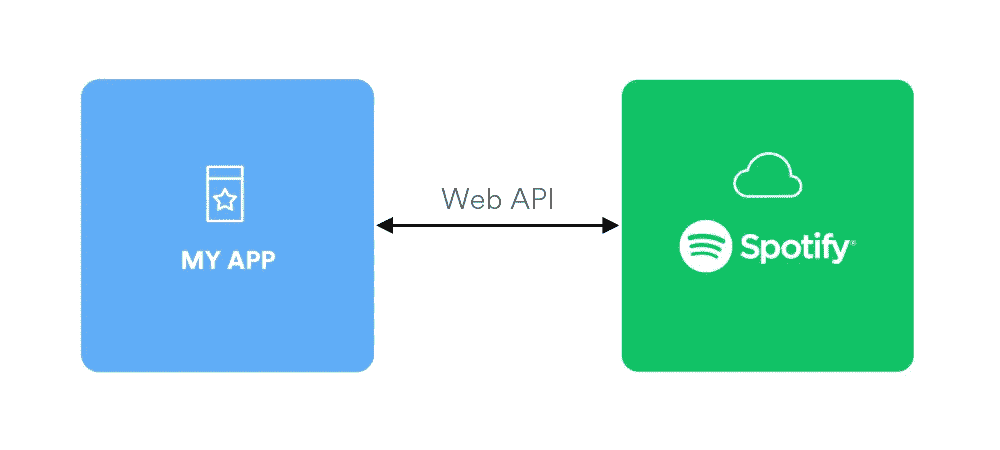**

**developer.spotify.com**

**在这样的背景下，你只需要联系他们的 ***API*** ，请求所有可能满足你需求的数据。在这种情况下，你喜欢的歌曲。**

**一个 ***API*** 可以描述为一个不需要前端就可以公开服务的应用。**

**现在让我们创建我们的 **API** 示例，这样我们可以很容易地理解到目前为止已经解释的内容。**

# **#实现 API**

## **#创建初始项目结构**

**选择 Spring Framework 是因为以下因素:**

*   **易于设置；**
*   **通俗易懂；**
*   **易于映射代码中的主要概念；**

> ****注意:**如果你没有安装 [Maven](https://maven.apache.org/install.html) 或者至少没有安装 [JDK 8](https://www.oracle.com/java/technologies/javase/javase-jdk8-downloads.html) ，使用各自的链接来安装它们。**

**Spring 有一个很好的项目启动页面，叫做[*Spring Initializr*](https://start.spring.io/)***，*** ，在这里你可以很容易地创建你的项目结构和需要的依赖项。**

1.  **访问 *spring initializr* 并定义以下属性。**

*   **该项目可以是 [*Maven*](https://maven.apache.org/) 或 [*Grandle*](https://gradle.org/) ，对于新手，我建议 Maven，因为你已经有了大量的例子。**
*   **下面的例子是用 Java 编写的，所以我们选择 Java；**
*   **选择 *2.4.1* 版本，这样我们可以有一个稳定的版本。**
*   **然后是一些元数据，比如项目名称和简要描述。**
*   **选择了 *Jar* 选项，这样我们就可以在不需要任何应用服务器的情况下运行我们的示例。**
*   **下面显示的任何 Java 版本都可以完成这项工作。**

**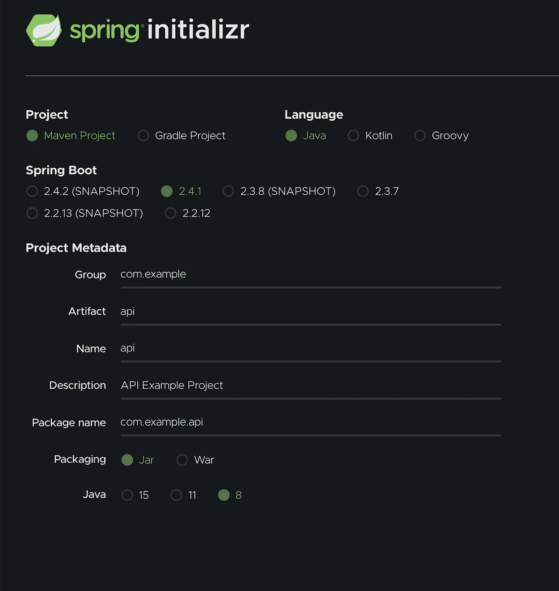**

**2.在“添加依赖项”按钮中，选择以下依赖项:**

**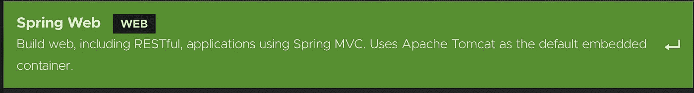**

**弹簧网**

*   ***Spring Web*——向世界展示服务，就像 Spotify 展示给你所有你喜欢的歌曲的服务一样。**

****

*   ***Spring Data JPA —* 这样我们就可以用 SQL 表映射我们的 Java 实体，并执行 CRUD 操作。**

*****注:*** *CRUD* 代表 **C** reate、 **R** ead、 **U** pdate、**D**delete SQL 操作。**

****

**H2 属地**

*   ***H2* —一个内存数据库，允许在我们的代码库中模拟一个真实的数据库。**

****

**龙目岛属地**

*   ***Lombok* —减少样板代码，例如，使用 ***@Getter*** 注释可以避免编写所有的属性 Getter 方法。**

**就这样，我们现在有了创建我们的 *API* 所需的所有东西，最后，您应该得到类似于下面的东西:**

**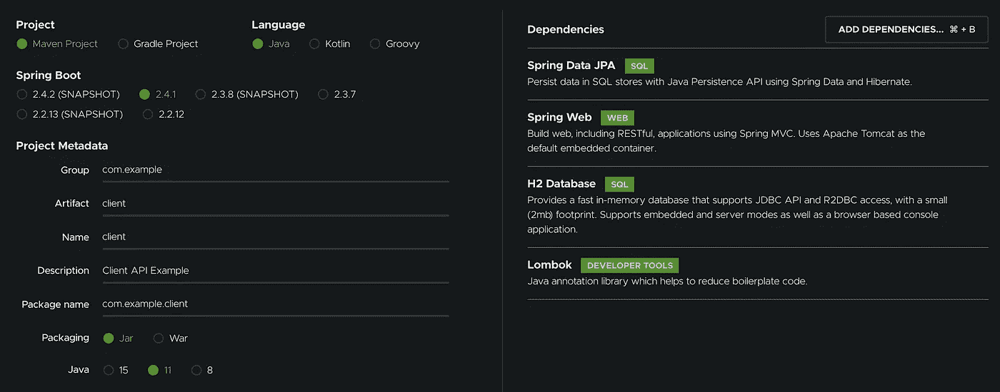**

**设置了所有属性的 Spring Initializr**

**3.点击“生成”,一个 zip 文件应该被下载。**

**4.将其导入到您最喜欢的 IDE 中；**

*****注意:该示例将在 IntelliJ 中显示，但是，所有步骤在其他 IDE 中应该是相同的。*****

## **#定义包结构**

**包结构在每个项目中都是重要的一步，随着时间的推移，你的班级人数会增加，我们需要从概念上组织它们，这样我们就不会忘记它们，这样我们就可以很容易地找到我们需要的任何东西。**

**我建议的包结构是:**

*   ****控制器**——所有休息控制器所在的地方；**
*   ****模型**——所有映射的 Java/SQL 实体所在的位置；**
*   ****存储库**——所有 JPA 存储库所在的位置。这些储存库将包含上述所有 CRUD 操作；**
*   ****服务**——我们将从客户端检索的数据中处理业务逻辑；**

**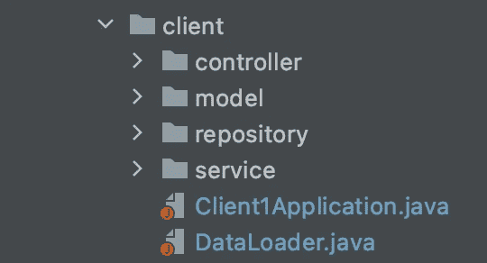**

**程序包结构**

*****注:*** 所有代码都可以在 [GitHub 页面](https://github.com/rafael-as-martins/medium/tree/rest-api)上找到，你可以在任何需要的时候确认和测试一切。**

## **#定义 Java/SQL 实体**

**正如您可能在依赖部分注意到的，我们添加了一个叫做 [JPA](https://spring.io/projects/spring-data-jpa) ( *Java 持久性* *API* )的东西，可以描述为:**

> **Spring Data JPA 旨在通过减少实际需要的工作量来显著改进数据访问层的实现。作为开发人员，您编写自己的存储库接口，包括定制的查找器方法，Spring 将自动提供实现。**

**在 ***模型****包中创建一个名为 [***客户端***](https://github.com/rafael-as-martins/medium/blob/rest-api/client/src/main/java/com/medium/client/model/Client.java)*的类，并标注以下属性:****

***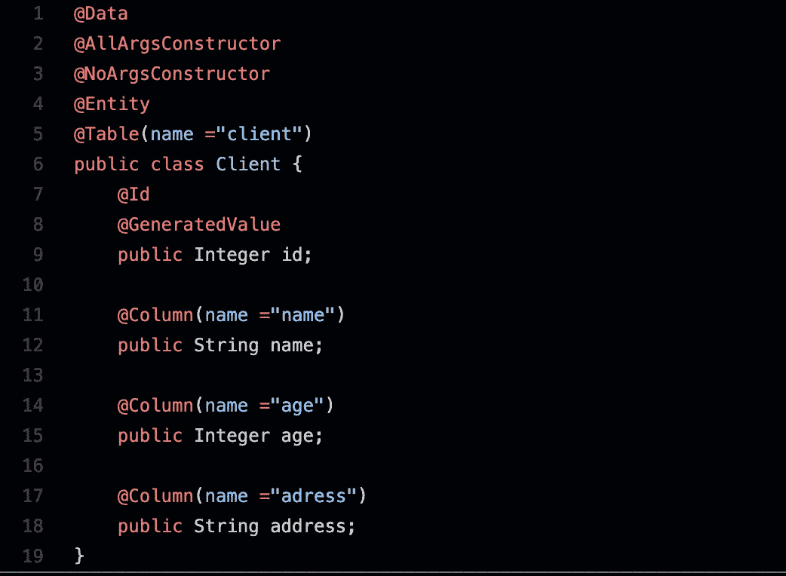***

***Client.java***

*   ******@Data*** 会生成我们客户端类中定义的所有 getters 和 setters***
*   *****@ AllArgsConstructor***创建一个具有所有属性的构造函数；**
*   *****@ NoArgsConstructor***创建空构造函数；**
*   *****@Entity*** 将该类定义为映射的 SQL 实体/表；**
*   *****@ Table(name = " client ")***表示这个类映射到一个名为 client 的 SQL 表；**

**我们的客户端实体将包含 4 个属性:一个 ID，它将唯一地区别于所有其他实体、一个姓名、一个年龄和一个地址。**

**正如您所看到的，ID 被注释为@Id 和@GeneratedValue，这将允许属性被作为客户端标识符处理，并在每次新客户端被添加到*客户端表时自动递增。***

**如您所见，每一列都用@Column(name="…")进行了注释，其中 name 是将要映射的 SQL 列名。**

## **#定义我们的实体存储库**

**实体存储库是必须与数据库交互的方法所在的地方，比如通过 id 删除实体、通过 id 获取等等。**

**定义一个很简单，你只需要创建一个新的 ***接口*** 命名为[***client repository***](https://github.com/rafael-as-martins/medium/blob/rest-api/client/src/main/java/com/medium/client/repository/ClientRepository.java)扩展***crud repository***在 ***repository 包:*****

**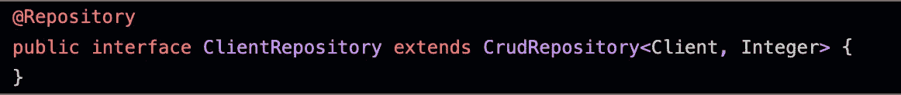**

**ClientRepository.java**

*****@Repository*** 注释将允许 Spring 识别这个类。在***crudsrepository***菱形中， ***“客户端，整数”*** ，意味着该存储库将映射客户端实体，其中 ID 由整数标识。**

**默认情况下，当扩展***crudrepository、*** 时，一些方法会立即可用，如 *:***

*   **findById**
*   **数数**
*   **救援**
*   **deleteById**
*   **existsById 和其他方式。**

**在这个例子中，默认的 ***findById*** 完成了我们需要的工作。**

## **#定义我们的服务**

**在我们的**服务包**中，我们将创建一个名为 **ClientService 的新类。**该类的主要职责是接收控制器客户端的请求，并将其连接到将要执行的实际操作。**

**我们的[*client service*](https://github.com/rafael-as-martins/medium/blob/rest-api/client/src/main/java/com/medium/client/service/ClientService.java)将包含:**

**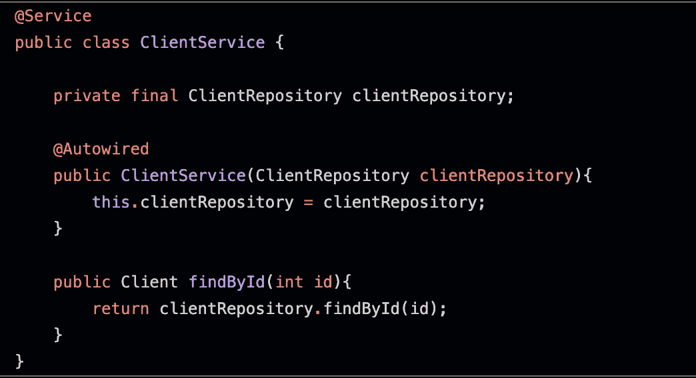**

**ClientService.java**

**您可能已经注意到，我们将我们的类标注为 ***@Service、*** ，这个表示它持有**业务逻辑**。所以除了在服务层使用之外没有别的特长。**

**然后我们有一个构造函数，这个构造函数会通过添加 ***@Autowired*** 来注入依赖 ***clientRepository、*** ，Spring 会自动为我们做这些。当我们注入一个依赖项时，我们是在要求 Spring 给我们一个这种类型的实现，剩下的就交给 Spring 了。**

**最后一个方法是引入业务逻辑的方法之一。在这种情况下，我们调用 *CRUDRepository* 拥有的默认方法之一，在这种情况下，我们使用 findById 查找客户端。**

## **#公开我们的 API**

**在最高级别，我们有我们的控制器。这些控制器的主要目标是接收外部请求并处理它们，然后它们可能相应地返回一个答案。**

**为了定义控制器，我们必须在我们的 ***控制器包*** 中创建一个类( [ClientController](https://github.com/rafael-as-martins/medium/blob/rest-api/client/src/main/java/com/medium/client/controller/ClientController.java) ，然后将其注释为 ***@RestController。*****

**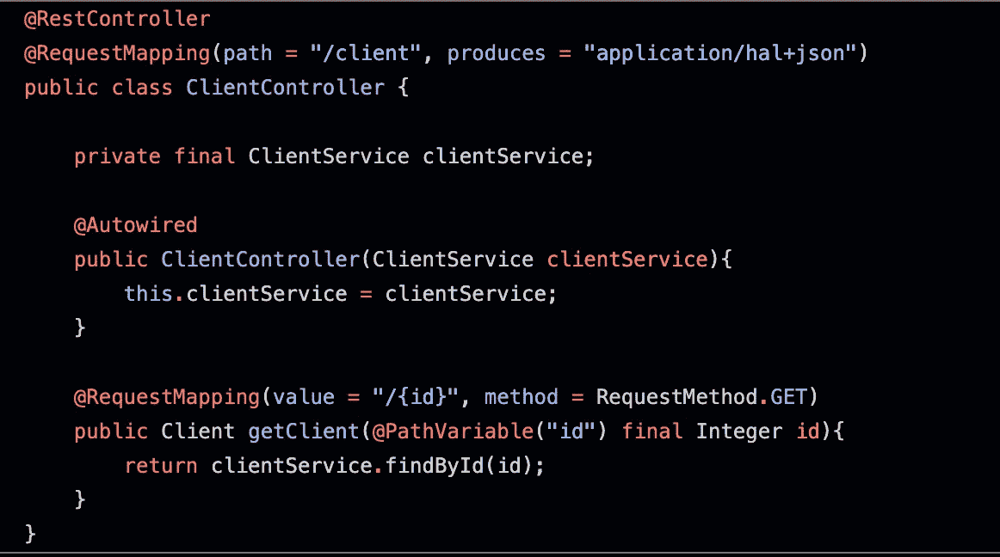**

**ClientController.java**

**在我们的 *@RequestMapping* 注释中，我们说所有对 http://localhost:8080**/client**的请求都应该生成一个 *JSON* 响应。**

**正如你在下面可以注意到的， **ClientService** 和与 **ClientRespository，**以相同的逻辑*工作。我们注入了**客户端服务**，这样我们就可以访问它。***

**然后我们有了一个方法，它将公开我们到目前为止所做的所有工作，我们首先从添加以下注释开始:**

> **@RequestMapping(value = "/{id} "，method = RequestMethod。获取)**

**我们说，所有带有端点[http://localhost:8080**/client**/{ id }](http://localhost:8080/client/{id})和 GET 操作的请求都应该通过这个方法接收。**

**然后我们通过 *@PathVariable* 注释说，id 位置的变量应该映射到 id 整型变量。最后，我们调用我们的服务方法，该方法将返回具有给定 id 的客户端；**

**注意:最常用的 HTTP 操作可能是:**

*   **[*发布*](https://developer.mozilla.org/en-US/docs/Web/HTTP/Methods/POST) -插入或更新**
*   **[*获取*](https://developer.mozilla.org/en-US/docs/Web/HTTP/Methods/GET) -数据抓取**
*   **[*补丁*](https://developer.mozilla.org/en-US/docs/Web/HTTP/Methods/PATCH) -官方更新**
*   **[*删除*](https://developer.mozilla.org/en-US/docs/Web/HTTP/Methods/DELETE) -删除**

## **#填充我们的数据库**

**请记住，我们目前使用的是内存数据库，我们需要向其中引入一些数据。Spring 在启动时有一个简单的方法来执行一些动作，在我们的例子中，是一些数据插入。**

**为此，在***client application***(由 spring initializr 自动创建的类)旁边创建一个名为[***data loader***](https://github.com/rafael-as-martins/medium/blob/rest-api/client/src/main/java/com/medium/client/DataLoader.java)的新类，其内容如下:**

**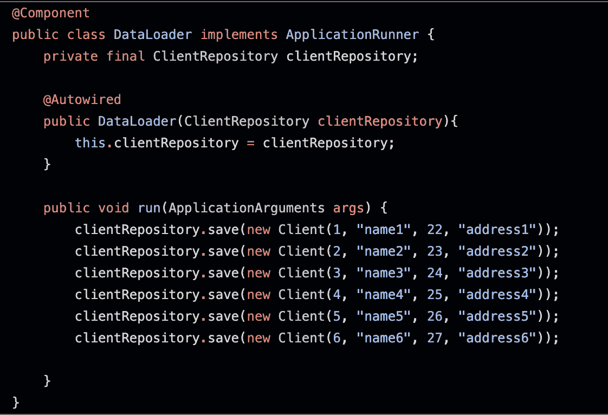**

**DataLoader.java**

**唯一的新概念是这个类实现了***application runner***接口，这告诉 *Spring* 在应用程序启动时执行 run 方法中的所有内容。**

**就是这样！我们仅仅使用 5 个类创建了一个 *API* 。**

**要测试它，您可以通过在项目文件夹上执行以下命令来轻松启动服务:**

*   **mvn 全新安装**
*   **java -jar 目标/客户端 1–0 . 0 . 1-snapshot . jar**

**看到以下输出后，您将能够开始从 API 请求数据:**

**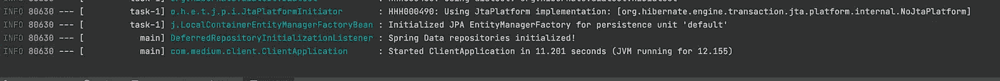**

**Spring 框架日志**

**例如，你现在可以到你的浏览器请求[http://localhost:8080/client/3](http://localhost:8080/client/3)，这个答案应该出来了！**

**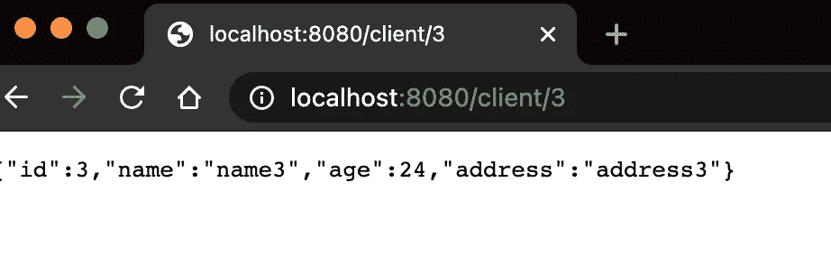**

# **#结论**

**我希望这篇教程能帮助你理解创建***API***并没有看起来那么难。如你所见，仅用了 10 分钟，我们就创造了一个。我试图给你最简单明了的解释，但是，如果你有任何问题，请随时分享，并反馈本教程是否对你有帮助。**

**下一篇文章再见。**

** [## 用网飞海斯特里克斯让您的微服务防弹

### 我们都希望我们的应用程序是安全的，没有错误的，并且对任何类型的问题都有弹性，对吗？这篇文章全是…

medium.com](/swlh/make-your-microservices-bulletproof-with-netflix-hystrix-853c1c308f08)  [## 借助网飞尤里卡提升您的微服务架构

### 成为你希望世界发生的变化。圣雄甘地

rafael-as-martins.medium.com](https://rafael-as-martins.medium.com/step-up-your-microservices-architecture-with-netflix-eureka-cb3b92f90a18)  [## 借助 Spring Cloud 提高微服务架构的灵活性

### 当您的应用程序配置被直接写入代码时，每次您需要应用一个…

rafael-as-martins.medium.com](https://rafael-as-martins.medium.com/boost-the-flexibility-of-your-microservice-architecture-with-spring-cloud-729ded91e221)**