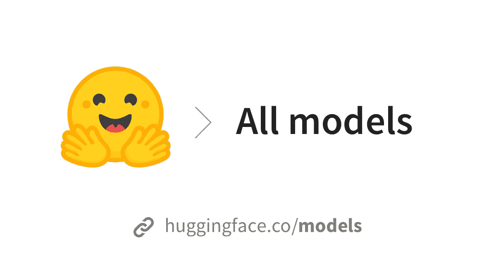
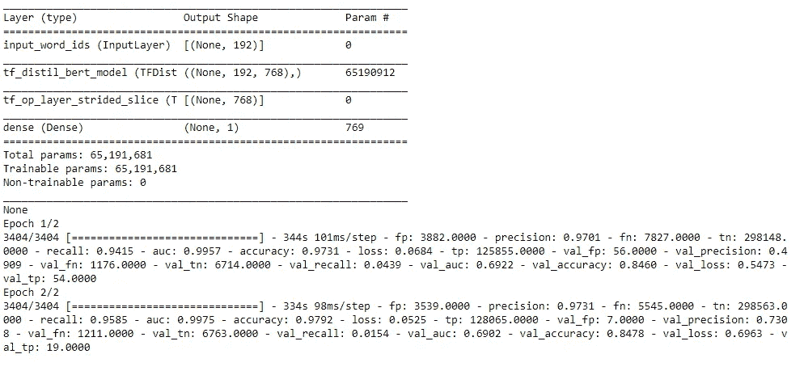
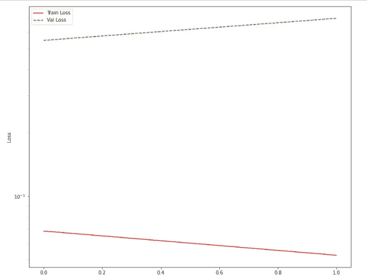
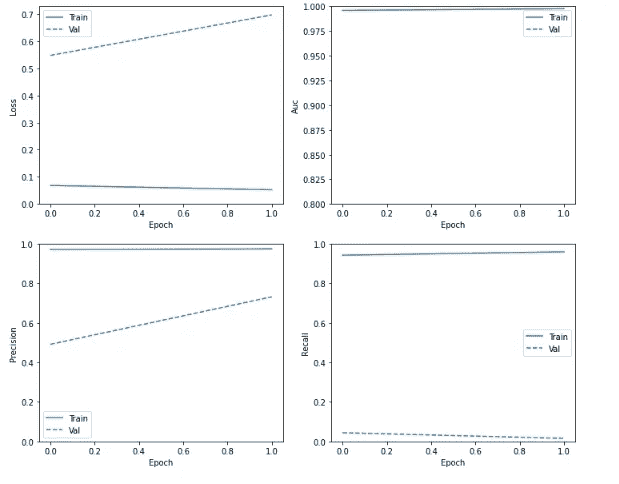
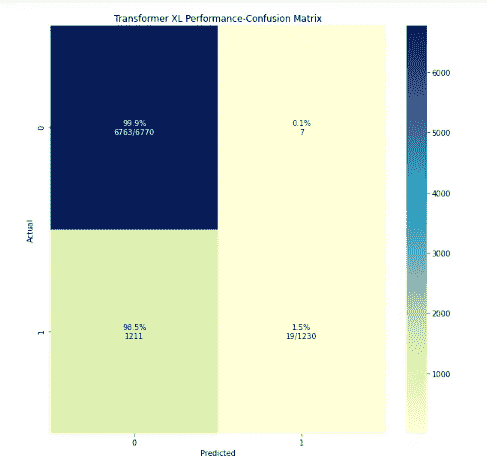
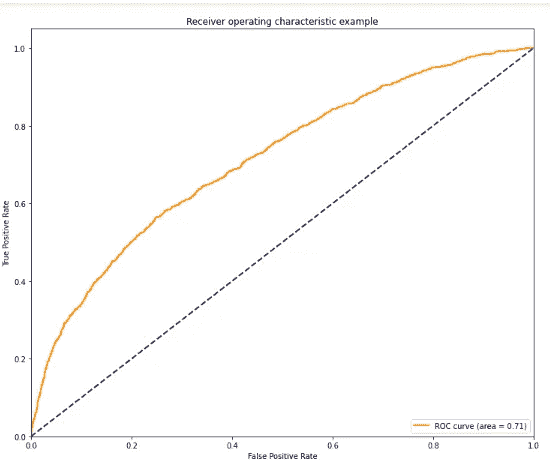

# 轻松实现不同的变压器🤗🤗通过拥抱脸

> 原文：<https://medium.com/analytics-vidhya/easily-implement-different-transformers-through-hugging-face-e471035e9c86?source=collection_archive---------10----------------------->

> 变形金刚是最先进的模型，已经被用于以非常有效的方式解决从情感分析到问题/回答的新颖的 NLP 任务。然而，变形金刚最基本的功能只是注意力机制的编码器层的堆叠。即使使用 Pytorch 或 Tensorflow 之类的 DL 框架，从头实现它也是相当困难和具有挑战性的。然而拥抱脸使得实现各种类型的变形金刚变得非常容易。在本文中，我将向您展示如何通过拥抱人脸库在 Tensorflow(Keras)中轻松实现变形金刚。

# **你需要什么:**

首先你需要安装拥抱脸库，这真的很容易。只需简单地安装它:

```
pip install transformers 
```

其次，您将需要最新的 TensorFlow 版本，该版本也可以通过 pip 轻松安装。

**数据:**

为了测试和实现不同的转换器，我使用了 kaggle 竞赛中的数据。这是最近的一个比赛，我参加了一个名为[拼图-多语言-有毒-评论-分类](https://www.kaggle.com/c/jigsaw-multilingual-toxic-comment-classification)的比赛。但是，使用相同的数据并不是强制性的，因为下面的实现可以很容易地适应任何文本数据。

这场比赛给出了不同的评论，我们的任务是检测特定的评论是否有毒。因此，这是一个二元分类任务。

**强大计算能力:**

还要注意，变压器有数百万个参数，因此我利用 Kaggle 内核提供的 TPU 来训练我的模型。或者，如果您没有强大的本地机器，您可以使用 google colab 来跟踪本文的实现。

# **让我们享受实现变形金刚的乐趣:**



图片来自[https://huggingface.co/front/thumbnails/models.png](https://huggingface.co/front/thumbnails/models.png)

**进口**

```
import numpy as np *# linear algebra*
import pandas as pd *# data processing, CSV file I/O (e.g. pd.read_csv)*
import tensorflow as tf
import tensorflow_hub as hub
from tqdm import tqdm
from tqdm import tqdm_notebook
from sklearn.metrics import auc
from sklearn.metrics import classification_report
import seaborn as sns
import matplotlib.pyplot as plt

from transformers import AutoTokenizer,BertTokenizer,TFBertModel,TFOpenAIGPTModel,OpenAIGPTTokenizer,DistilBertTokenizer, TFDistilBertModel,XLMTokenizer, TFXLMModel
from transformers import TFAutoModel, AutoTokenizer
from kaggle_datasets import KaggleDatasets
from sklearn.metrics import roc_curve,confusion_matrix,auc
from tokenizers import Tokenizer, models, pre_tokenizers, decoders, processors
*# Input data files are available in the read-only "../input/" directory*
*# For example, running this (by clicking run or pressing Shift+Enter) will list all files under the input directory*
import matplotlib as mpl

from sklearn.feature_extraction.text import CountVectorizer
from sklearn.metrics import confusion_matrix, accuracy_score
from sklearn.model_selection import train_test_split

from tensorflow.keras.preprocessing.text import Tokenizer
from tensorflow.keras.preprocessing.sequence import pad_sequences
from tensorflow.keras.models import Sequential
from tensorflow.keras.layers import *
from tensorflow.keras.initializers import Constant
```

**哪些变压器:**

以下变压器架构已在笔记本电脑中进行了测试

1-伯特

2-OpenAIGPT

3-蒸馏啤酒

4-XLM

5-xlmrobertalage

不用担心所有这些变形金刚的实现。实现简单且相似。

**使用的超参数:**

```
EPOCHS=2max_seq_length = 192
LEARNING_RATE=1e-5
early_stopping=early_stopping = tf.keras.callbacks.EarlyStopping(
    monitor='val_loss', 
    verbose=1,
    patience=10,
    mode='max',
    restore_best_weights=True)
```

**编码功能:**

每一个变形金刚都对每一句话进行编码。我希望你能理解这句话的含义。如果没有，那么他们在互联网上有许多了解编码的好资源。在一个非常基本的层面上，编码意味着通过为我们语料库中的每个单词(标记)分配一个唯一的整数来将原始文本数据转换为数字数据。然而，transformer 编码稍微复杂一点，因为它也使用字符级编码，将未知单词分解成单个字符，然后进行编码。然而，我不会进一步深入变压器编码如何工作的细节，因为它相当详细。可以肯定地说，下一个函数基本上将数据中的每个句子转换成各种转换器可以理解的特殊整数列表:

```
def single_encoding_function(text,tokenizer,name='BERT'):
    input_ids=[]
    if name=='BERT':
        tokenizer.pad_token ='[PAD]'
    elif name=='OPENAIGPT2':
        tokenizer.pad_token='<unk>'
    elif name=='Transformer XL':
        print(tokenizer.eos_token)
        tokenizer.pad_token= tokenizer.eos_token
    elif name=='DistilBert':
        tokenizer.pad_token='[PAD]'

for sentence **in** tqdm(text):       encoded=tokenizer.encode(sentence,max_length=max_seq_length,
pad_to_aax_length=True)## this is inside the loop
        input_ids.append(encoded)
    return input_ids
```

**制作数据管道:**

a)制作阵列:

```
X_train=np.array(single_encoding_function(train_raw['comment_text'].values.tolist(),tokenizer,name="BERT"))
y_train=np.array(train_raw['toxic'])
X_valid=np.array(single_encoding_function(valid_raw['comment_text'].values.tolist(),tokenizer,name="BERT"))
y_valid=np.array(valid_raw['toxic'])
X_test=np.array(single_encoding_function(test_raw['content'].values.tolist(),tokenizer,name="BERT"))steps_per_epoch = X_train.shape[0] // BATCH_SIZE
```

上面的代码是不言自明的，我只是将原始文本数据作为输入提供给单个编码函数，然后将结果转换为编码令牌的数组，这是提供给 TensorFlow 管道的最终数据。

b)制作张量流管道:

```
def make_data():
    train = (
        tf.data.Dataset
        .from_tensor_slices((X_train, y_train))
        .repeat()
        .shuffle(2048)
        .batch(BATCH_SIZE)
        .prefetch(AUTO))

    valid = (
        tf.data.Dataset
        .from_tensor_slices((X_valid, y_valid))
        .batch(BATCH_SIZE)
        .cache()
        .prefetch(AUTO)
    )

    test = (
        tf.data.Dataset
        .from_tensor_slices(X_test)
        .batch(BATCH_SIZE)
    )
    return train,valid,test 
```

**与 Keras 的实际实施:**

下一步真的很重要，所以仔细看看:

```
def build_model(transformer_layer,max_len=max_seq_length):
    input_word_ids = tf.keras.layers.Input(shape=(max_len,), dtype=tf.int32, name="input_word_ids")
    sequence_output = transformer_layer(input_word_ids)[0]

    cls_token = sequence_output[:, 0, :]
    out = tf.keras.layers.Dense(1, activation='sigmoid')(cls_token)

    model = tf.keras.Model(inputs=input_word_ids, outputs=out)

    return model
```

代码块很重要，因此让我进一步阐述它。首先有一个输入层，它为一个特定的实例接受给定变换器的**编码输入。然后，输入令牌被输入到主 transformer 层(从即将到来的代码块中定义的名为 compile_model 的函数中加载)。我想让这些代码对所有的变形金刚都是可重用的，因此不是复制和粘贴每个变形金刚的整个模型，唯一不同的层是变形金刚的变形金刚层。然后，转换器层输出序列输出。然而，这是一个分类任务，因此从序列输出中，我们将只提取给定句子中每个单词的 CLS(分类标记)。这个 cls_token 然后被馈送到用于区分给定句子的毒性的 sigmoid 层。**

请注意，您可以通过添加更多的层来使模型更加复杂，但我没有这样做，因为这会使我们的模型更加复杂，并且会花费更多的训练时间。

## **下一节仅展示如何绘制各变压器性能的相关有用图表，以便对不同模型进行对比分析。它们与任何转换器的主要实现都有关系。**

**绘制有用的图表来比较性能:**

a)绘制损耗和度量图:

```
mpl.rcParams['figure.figsize'] = (12, 10)
colors = plt.rcParams['axes.prop_cycle'].by_key()['color']

def plot_loss(history):
*# Use a log scale to show the wide range of values.*
    plt.semilogy(history.epoch,  history.history['loss'],
               color='red', label='Train Loss')
    plt.semilogy(history.epoch,  history.history['val_loss'],
          color='green', label='Val Loss',
          linestyle="--")
    plt.xlabel('Epoch')
    plt.ylabel('Loss')

    plt.legend()

def plot_metrics(history):
    metrics =  ['loss', 'auc', 'precision', 'recall']
    for n, metric **in** enumerate(metrics):
        name = metric.replace("_"," ").capitalize()
        plt.subplot(2,2,n+1)
        plt.plot(history.epoch,  history.history[metric], color=colors[0], label='Train')
        plt.plot(history.epoch, history.history['val_'+metric],
                 color=colors[0], linestyle="--", label='Val')
        plt.xlabel('Epoch')
        plt.ylabel(name)
        if metric == 'loss':
            plt.ylim([0, plt.ylim()[1]])
        elif metric == 'auc':
            plt.ylim([0.8,1])
        else:
            plt.ylim([0,1])

        plt.legend()
```

这两个函数都采用训练的历史，然后绘制丢失和度量的相关函数，即 AUC、召回和多个时期的精度。

b)绘制混淆矩阵和 ROC 曲线:

下一个代码块从模型和基础事实中获取 y_predicted，为模型创建混淆矩阵和 ROC 曲线。

```
def plot_cm(y_true, y_pred, title):
    *''''*
 *input y_true-Ground Truth Labels*
 *y_pred-Predicted Value of Model*
 *title-What Title to give to the confusion matrix*

 *Draws a Confusion Matrix for better understanding of how the model is working*

 *return None*

 *'''*

    figsize=(10,10)
    cm = confusion_matrix(y_true, y_pred, labels=np.unique(y_true))
    cm_sum = np.sum(cm, axis=1, keepdims=True)
    cm_perc = cm / cm_sum.astype(float) * 100
    annot = np.empty_like(cm).astype(str)
    nrows, ncols = cm.shape
    for i **in** range(nrows):
        for j **in** range(ncols):
            c = cm[i, j]
            p = cm_perc[i, j]
            if i == j:
                s = cm_sum[i]
                annot[i, j] = '**%.1f%%\n%d**/**%d**' % (p, c, s)
            elif c == 0:
                annot[i, j] = ''
            else:
                annot[i, j] = '**%.1f%%\n%d**' % (p, c)
    cm = pd.DataFrame(cm, index=np.unique(y_true), columns=np.unique(y_true))
    cm.index.name = 'Actual'
    cm.columns.name = 'Predicted'
    fig, ax = plt.subplots(figsize=figsize)
    plt.title(title)
    sns.heatmap(cm, cmap= "YlGnBu", annot=annot, fmt='', ax=ax)

def roc_curve_plot(fpr,tpr,roc_auc):
    plt.figure()
    lw = 2
    plt.plot(fpr, tpr, color='darkorange',
             lw=lw, label='ROC curve (area = **%0.2f**)' %roc_auc)
    plt.plot([0, 1], [0, 1], color='navy', lw=lw, linestyle='--')
    plt.xlim([0.0, 1.0])
    plt.ylim([0.0, 1.05])
    plt.xlabel('False Positive Rate')
    plt.ylabel('True Positive Rate')
    plt.title('Receiver operating characteristic example')
    plt.legend(loc="lower right")
    plt.show()
```

**最后:D 训练不同的变形金刚:**

a)编译模型:

```
def compile_model(name):
    with strategy.scope():
        METRICS = [
          tf.keras.metrics.TruePositives(name='tp'),
          tf.keras.metrics.FalsePositives(name='fp'),
          tf.keras.metrics.TrueNegatives(name='tn'),
          tf.keras.metrics.FalseNegatives(name='fn'), 
          tf.keras.metrics.BinaryAccuracy(name='accuracy'),
          tf.keras.metrics.Precision(name='precision'),
          tf.keras.metrics.Recall(name='recall'),
          tf.keras.metrics.AUC(name='auc')]
        if name=='bert-base-uncased':
            transformer_layer = (
                TFBertModel.from_pretrained(name)
            )
        elif name=='openai-gpt':
            transformer_layer = (
                TFOpenAIGPTModel.from_pretrained(name)
            )
        elif name=='distilbert-base-cased':
            transformer_layer = (
                TFDistilBertModel.from_pretrained(name)
            )
        elif name=='xlm-mlm-en-2048':
            transformer_layer = (
                TFBertModel.from_pretrained(name)
            )
        elif name=='jplu/tf-xlm-roberta-large':
            transformer_layer = (
                TFAutoModel.from_pretrained(name)
            )
        model = build_model(transformer_layer, max_len=max_seq_length)
        model.compile(optimizer=tf.keras.optimizers.Adam(
        learning_rate=LEARNING_RATE), loss='binary_crossentropy', metrics=METRICS)
    return model
```

上面的代码块真的很简单。如图所示，它采用您要编译模型的变压器的名称，然后从 hugging face library 加载相关的变压器层。然后，它将加载的 transformer 层提供给函数 build_model(上面定义的),然后我们编译这个模型。请注意，我还创建了一个名为 METRICS 的列表，因为我想检查不同指标的模型性能，而不是限制自己只关注准确性。

d)实际培训:

现在，每个变压器的实际训练过程是相同的。你只需要输入相关的名字并调用期望的函数来适应这个模型。

在本文中，我不会显示每个模型的输出图，因为这将占用大量的空间，但是，我将只显示一个变压器的图形，即提取的 BERT。可以以类似的方式为其他模型生成相同的图形。

接下来的代码块展示了如何使用上面为提取的 BERT 定义的函数。为了训练任何其他转换器，您只需要将名为“distilt-base-cased”和“DistilBert”(粗体突出显示)的字符串更改为相关的转换器名称。

```
*# # First load the real tokenizer*
tokenizer = DistilBertTokenizer.from_pretrained(**'distilbert-base-cased'**)X_train=np.array(single_encoding_function(train_raw['comment_text'],tokenizer,**'DistilBert'**))#change the name
y_train=np.array(train_raw['toxic'])
X_valid=np.array(single_encoding_function(valid_raw['comment_text'],tokenizer,**'DistilBert'**))#change the name
y_valid=np.array(valid_raw['toxic'])
X_test=np.array(single_encoding_function(test_raw['content'],tokenizer,**'DistilBert'**))#change the nametrain,valid,test=make_data()steps_per_epoch = X_train.shape[0] // BATCH_SIZEmodel=compile_model(**'distilbert-base-cased'**)#change the name
print(model.summary())

history=model.fit(
    train,steps_per_epoch=steps_per_epoch,
    epochs=EPOCHS,callbacks=[early_stopping], validation_data=valid
)
```



模型总结和培训信息

该模型将开始训练，并需要很长时间，这取决于您的数据和计算能力。最后，获取历史记录并使用上面定义的相关函数来生成图表:

```
plot_loss(history)
```



distilt-BERT 两个时期的损失

```
plot_metrics(history)
```



各时期的损失、AUC、精确度和召回

```
y_predict=model.predict(valid, verbose=1)
y_predict[ y_predict> 0.5] = 1
y_predict[y_predict <= 0.5] = 0
plot_cm(y_valid, y_predict, 'Distil BERT Performance-Confusion Matrix')
```



蒸馏水混淆矩阵

```
y_predict_prob=model.predict(valid, verbose=1)
fpr, tpr, _ = roc_curve(y_valid,y_predict_prob)
roc_auc = auc(fpr, tpr)
roc_curve_plot(fpr,tpr,roc_auc)
```



一种蒸馏啤酒用摇床

# 结论:

嗯，拥抱脸真的让 transformer 的实现变得非常容易。然而，理解转换器的底层工作也非常重要，因为否则上述实现将只是一个黑盒，您将无法进一步调整和优化您的模型。我的 kaggle 账户上也有完整的代码:[https://www . ka ggle . com/keen border/comparing-different-transformers-lstms](https://www.kaggle.com/keenborder/comparing-different-transformers-lstms)如果你想更详细地了解变形金刚，这里也有链接。

我为这篇文章真的很努力，因此，请鼓掌，如果你喜欢它，并想看到更多可怕的 NLP 内容。