# 通过网络与利益相关者轻松分享您的 ML 模型

> 原文：<https://medium.com/analytics-vidhya/easily-share-your-ml-model-with-stakeholders-via-the-web-f9328eccbaa6?source=collection_archive---------15----------------------->

## 添加几行 Flask 并在 web 上公开您的代码

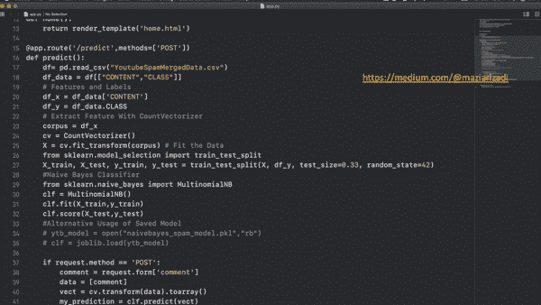

正如我在之前的故事中所讨论的，作为一名数据科学家，我一直在想:

1.  每当有人想看到结果时，模型需要被训练吗？

2.如果我需要与不使用 Jupyter 的利益相关者共享我的代码，该怎么办？

3.如果他们连 Python 都没装呢？新数据集如何输入模型并获得输出？

在 [Pickle your model in Python](/@maziarizadi/pickle-your-model-in-python-2bbe7dba2bbb) 中，我讨论了使用`pickle`打包模型的方法，然而，上面列表中的问题 2 和 3 没有得到回答。在本文中，我们将介绍如何轻松地将我们的应用程序(无论是简单的还是最复杂的)公开为 web 应用程序。

> 如果你还没有，确保你先阅读了[以前的文章](/@maziarizadi/pickle-your-model-in-python-2bbe7dba2bbb)。

> 目的是通过引入这些简单的组件，在未来我们将能够提出一种端到端的解决方案来部署机器学习模型，以便用户可以通过他们的浏览器以响应的方式与模型进行交互。😎…很酷，对吧？

**如何？**

为此，我们需要使用以下组件:

1.  咸菜( [*上一篇*](/@maziarizadi/pickle-your-model-in-python-2bbe7dba2bbb) )
2.  烧瓶(当前文章)
3.  码头工人(接下来😉)

🛑:请注意，我在 Mac OS 上使用我所有的作品。

# 瓶

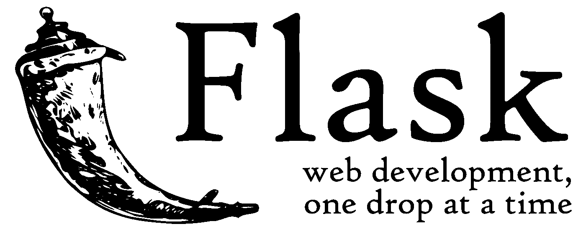

> [Flask](https://flask.palletsprojects.com/en/master/tutorial/) 是一个轻量级的 [WSGI](https://wsgi.readthedocs.io/en/latest/what.html) web 应用框架。它旨在快速轻松地开始使用，并能够扩展到复杂的应用程序。它已经成为最流行的 Python web 应用程序框架之一。

## 它解决什么问题？

假设我有一个 Python 应用程序(要么是一个简单的“Hello World”，要么是一个复杂的“垃圾邮件检测 AI”)，我想在 web 上公开它。弗拉斯克是我的归宿👍

## 为什么是烧瓶？

说到 [web 框架](https://jeffknupp.com/blog/2014/03/03/what-is-a-web-framework/)，web 上有[各种讨论](https://hackr.io/blog/top-10-web-development-frameworks-in-2020)。但为什么是烧瓶？🤔

简而言之，Flask 非常灵活且易于使用，这使得它成为像我这样没有太多编程背景的数据科学家的完美候选对象。更重要的是，[Python](https://towardsdatascience.com/how-to-be-pythonic-and-why-you-should-care-188d63a5037e)使用了 Python 构造和数据结构，具有清晰易读的习惯用法。

## 让我们从烧瓶开始

> 完整文档可在[此处](https://flask.palletsprojects.com/en/master/installation/)获得。

## 创造环境

使用**虚拟环境**来管理开发和生产中项目的依赖关系。

*   虚拟环境解决什么问题？

Python 项目越多，就越有可能需要使用不同版本的 Python 库，甚至 Python 本身。一个项目的较新版本的库可能会破坏另一个项目的兼容性。

虚拟环境是独立的 Python 库组，每个项目一个。为一个项目安装的软件包不会影响其他项目或操作系统的软件包。

打开一个新的终端并导航到您的项目文件夹。

> 在 Mac 终端上直接导航到文件夹的酷方法👇👇👇

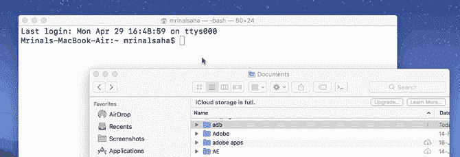

GIF [来源](https://techwiser.com/wp-content/uploads/2019/04/GIF-FINAL.gif)

使用终端，在以下位置创建项目文件夹和`venv`文件夹:

```
mkdir SpamDetect
cd SpamDetect
python3 -m venv venv
```

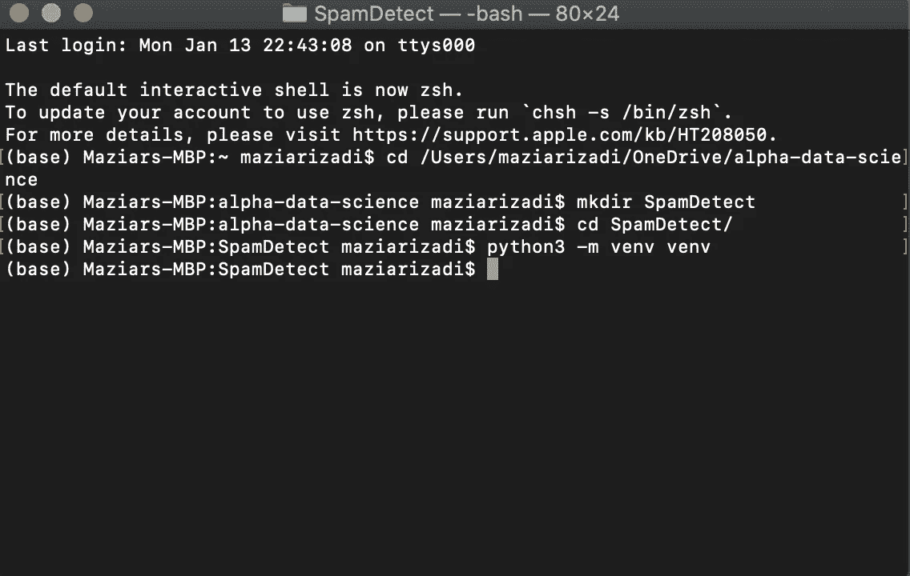

如果您现在浏览到那个文件夹，您会看到新的`venv`文件夹被创建。

## 激活环境

```
. venv/bin/activate
```

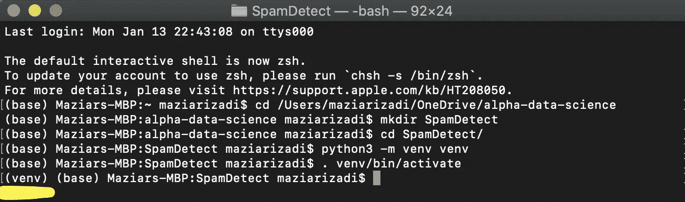

我们可以看到`venv`被激活了。

## 安装烧瓶

```
pip install Flask
```

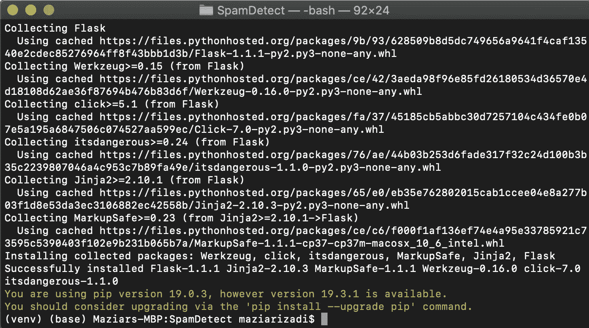

因为我已经安装了`Flask`，它建议我**升级**到更高的版本。

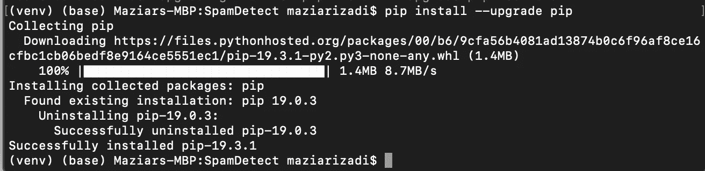

## 你的烧瓶申请

在本文中，为了简单起见，在进入机器学习模型并同时查看复杂代码之前，我想向您展示一个简单的 Flask 应用程序。

第一步。用 Python 扩展名创建一个名为`hello.py`的新文件。

```
$ touch hello.py
```

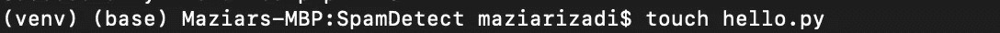

第二步。一个新文件出现在您的文件夹中:

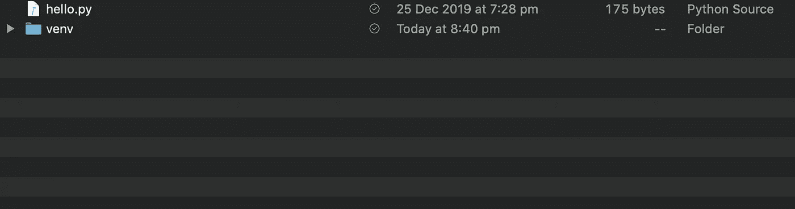

打开文件并在代码中保存 Flask 应用程序。

```
# A minimal Flask app**from** flask **import** Flask, escape, requestapp = Flask(__name__)@app.route('/')
**def** hello():
   name = request.args.get("name", "World")
   **return** f'Hello, {escape(name)}!'
```

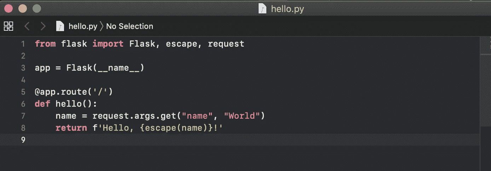

## 这段代码做了什么？

1.  首先我们导入了`[**Flask**](https://flask.palletsprojects.com/en/1.1.x/api/#flask.Flask)`，flask 的`[**escape**](https://flask.palletsprojects.com/en/1.0.x/api/#flask.escape)`和`[**request**](https://flask.palletsprojects.com/en/1.0.x/api/#incoming-request-data)`类。
2.  接下来，我们创建这个类的一个实例。第一个参数是应用程序的模块或包的名称。如果你使用单个模块(如本例所示)，你应该使用`__name__`，因为根据它是作为应用程序启动还是作为模块导入，名字会有所不同(`'__main__'`与实际的导入名)。这是必要的，以便 Flask 知道在哪里寻找模板、静态文件等等。欲了解更多信息，请查看`[**Flask**](https://flask.palletsprojects.com/en/1.1.x/api/#flask.Flask)`文档。
3.  然后我们使用`[**route()**](https://flask.palletsprojects.com/en/1.1.x/api/#flask.Flask.route)`装饰器告诉 Flask 哪个 URL 应该触发我们的函数。在文档中，你可以看到 flask 有自己的`[**escape**](https://flask.palletsprojects.com/en/1.0.x/api/#flask.escape)`和`[**request**](https://flask.palletsprojects.com/en/1.0.x/api/#incoming-request-data)`格式。
4.  该函数被赋予一个名称，这个名称也用于为该特定函数生成 URL，并返回我们希望在用户浏览器中显示的消息。

第三步。导出 FLASK_APP 环境变量

要运行应用程序，使用`**flask run**`命令或`**python -m flask**`。在此之前，您需要通过导出`FLASK_APP`环境变量来告诉您的终端要使用的应用程序:

```
$ export FLASK_APP=hello.py
$ flask run
```

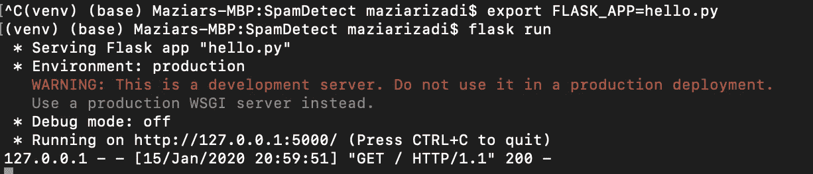

第四步。转到浏览器并输入您的终端中提供的 URL。

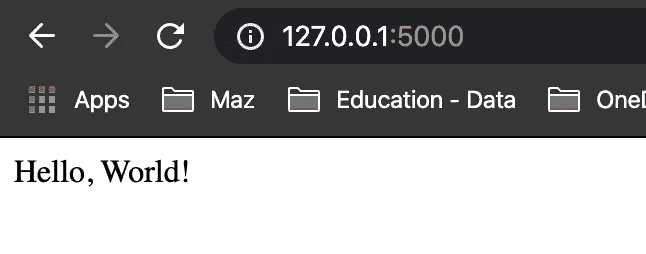

# 烧瓶摘要

我们了解到:

> 如何创造环境并激活它
> 
> 如何安装烧瓶
> 
> 如何调用一个简单的 Flask 应用程序并在浏览器中查看结果

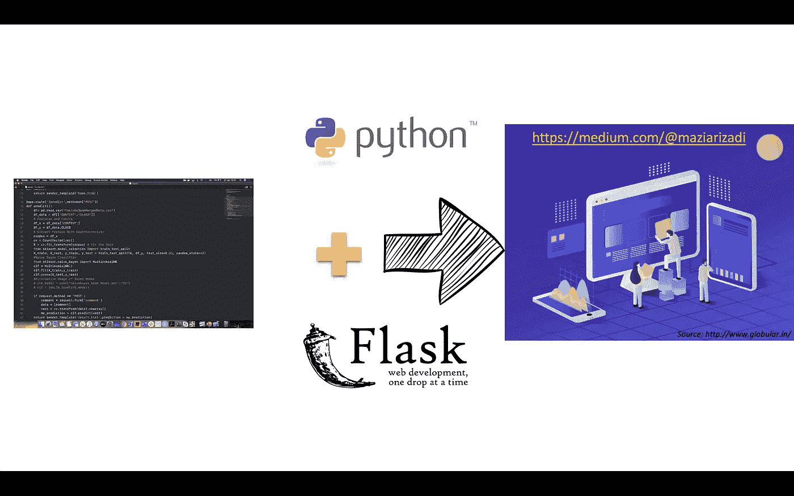

# 即将到来的下一个…

现在我们知道了当我们想要为 ML 模型用户提供 UI 时,`flask`如何变得方便。所以我们将`flask`放在这里，在下一篇文章中，我们将转到 Docker，看看 Flask 是如何包含在 dockered 容器中的。