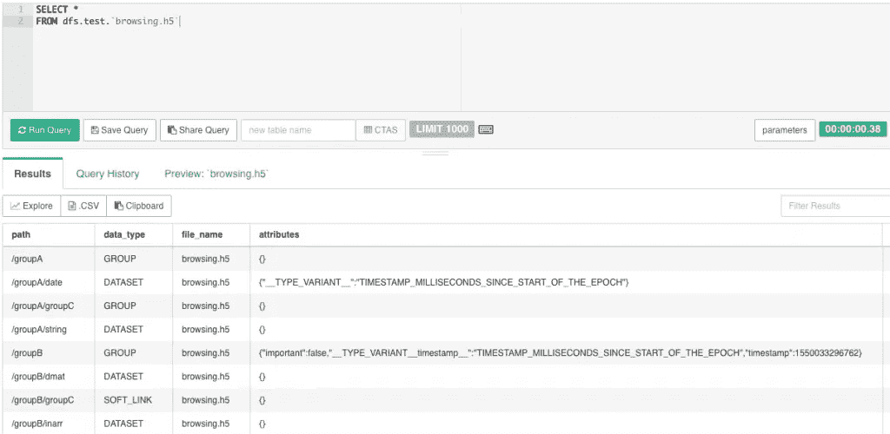
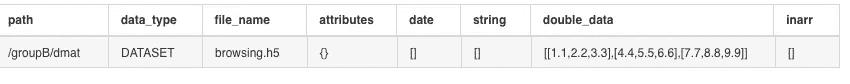
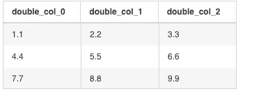

# 轻松分析 HDF5 数据

> 原文：<https://medium.com/analytics-vidhya/easy-analysis-of-hdf5-data-1bb986302b97?source=collection_archive---------14----------------------->

有一种数据格式叫做 [HDF5(分层数据格式)](https://en.wikipedia.org/wiki/Hierarchical_Data_Format)，在科学研究中被广泛使用。HDF5 是一种有趣的格式，因为它就像文件中的文件系统，性能极高。然而，HDF5 格式可能很难实际访问以 HDF5 格式编码的数据。但是，正如标题所示，这篇文章将带您了解如何使用我最喜欢的工具 Apache Drill 轻松访问和查询 HDF5 数据集。

自 1.18 版本起，Drill 将原生支持读取 HDF5 文件。

# 配置钻取以查询 HDF5

为了配置 Drill 以查询 HDF5 文件，您首先必须在文件系统的配置中设置以下变量。这应该适用于存储在 Hadoop、S3/Azure/谷歌云或本地文件系统上的 HDF5 文件。这也适用于压缩的 HDF5 文件。唯一不显而易见的变量是`defaultPath`，我稍后会谈到它，但现在让它保持为`null`。

`"hdf5": {"type": "hdf5","extensions": ["h5"],"defaultPath": null}`

一旦将它添加到配置中，Drill 就可以查询 HDF5 了。

# 在 Drill 中查询 HDF5 文件

现在 Drill 已经设置好了，您可以直接在 Drill 中查询 HDF5 文件。然而，Drill 以两种方式查询 HDF5:元数据查询和数据查询。元数据查询允许您浏览 HDF5 文件的内容，记住一个 HDF5 文件将包含多个数据集，而数据查询允许您直接查询数据集。让我们首先来看看元数据查询。确定 Drill 是执行元数据查询还是数据集查询的方法是设置前面提到的`defaultPath`变量。当它被设置为`null`时，您将获得文件元数据，所以现在，我们将把它保留为`null`，看看会发生什么。

在本例中，我们将查询一个名为 scalar.h5 的文件，这是一个包含几个样本数据集的简单文件。元数据查询至少会返回以下字段:

*   路径:这是到单个数据集的 **HDF5 路径**。当您想要查询数据集时，这是您将在`defaultPath`变量中设置的值。
*   data_type:这是包含在特定路径中的对象类型。选项有组、数据集、软链接。
*   file_name:实际文件的名称。
*   属性:HDF5 数据集可以有属性。Drill 将这些映射到键/值对的映射。

除了元数据之外，元数据查询还将返回实际的数据集。数据的字段名为`<data type>_data`。因此，在本例中，有一个名为 double_data 的列，它包含实际数据的嵌套列表。

您可以使用下面的查询直接查询这些数据，但是，这样效率不高，并且会导致极其复杂的查询。

`**SELECT**` `flatten(double_data)`

`**FROM**` `dfs.test.`browsing.h5``

`**WHERE**` `path='/groupB/dmat'`

查询这个数据集的一个更好的方法是使用`defaultPath`选项，我一直避免讨论这个选项。

# 查询数据集

除了查询 HDF5 文件元数据，Drill 还允许您只需在 HDF5 配置中设置`defaultPath`选项，即可查询 HDF5 文件中的单个数据集。这可以直接在配置中完成，也可以在查询时使用`table()`功能完成。例如，如果您想要查询上面的数据集，您可以使用以下查询:

`**SELECT**`

`**FROM**`

您会注意到`table()` 功能的使用，该功能将`defaultPath`设置为`/groupB/dmat`。该查询的结果如下所示。

正如您所看到的，这个查询产生了三列，它们反映了数据的类型:`double_col_n`。然后，可以单独选择、筛选、聚合这些列，在函数中使用这些列，或者以任何其他方式与 Drill 可以查询的任何数据相结合。

需要指出的一点是，HDF5 支持无限维的嵌套数据。虽然 Drill 也是如此，但这实际上意味着数据变得难以处理，因此 Drill 会自动展平任何嵌套深度超过 2 层的数据。

# 有多快？

这就是问题所在，不是吗？我只有一个词…快！不幸的是，HDF5 库有一个很大的限制，我不打算在这里讨论，但如果这个限制得到解决，这个东西会更快！！我用实际的 HDF5 数据文件做了一些测试，在我的 Macbook 上，Drill 能够在不到 2 秒的时间内查询 1GB HDF5 中的大型数据集。然而，更重要的不仅仅是“它有多快”，而是“它有多容易？”在我看来，这才是钻探真正闪光的地方。使用 Drill 查询 HDF5 数据非常简单，因为 Drill 使用标准 SQL。它让您的 HDF5 数据看起来就像是数据库中的另一张表！

# TL；速度三角形定位法(dead reckoning)

总之，如果您正在进行科学研究并处理 HDF5 数据，但不想处理 HDF5 库或编码，或者只是喜欢使用 SQL，您真的应该尝试一下 Drill。Drill 可以轻松高效地查询 HDF5 数据集，就像它们是常规的数据库表一样。这就对了。