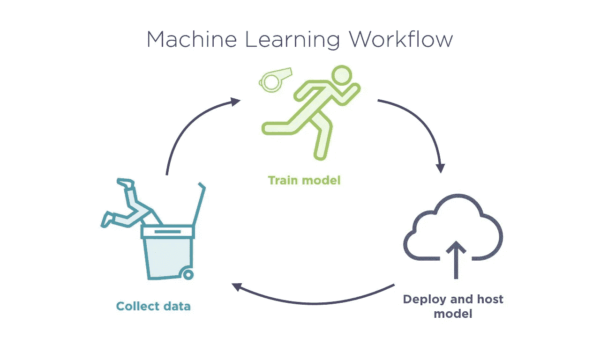
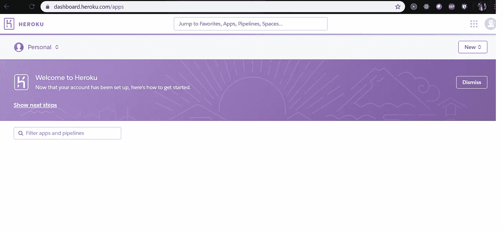
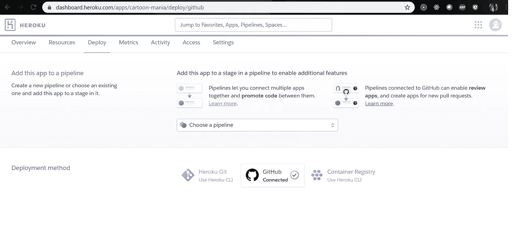
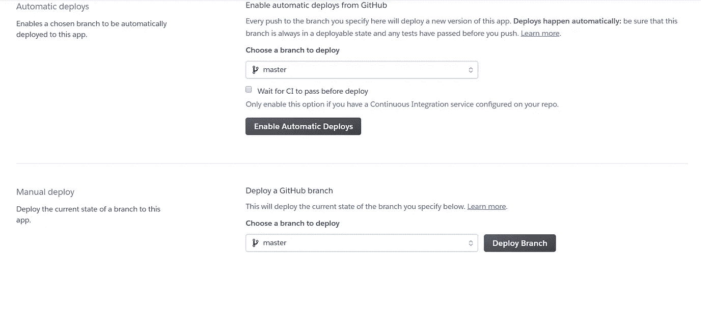

# 如何将您的机器学习模型部署到云中

> 原文：<https://medium.com/analytics-vidhya/easy-and-quick-steps-to-deploy-your-first-ml-model-into-cloud-ce2418fcb960?source=collection_archive---------27----------------------->

我保证我会长话短说。



有 3 种类型的部署:

1.  内部部署—您必须自行设置和配置您的应用程序、数据、运行时、中间件、操作系统和服务器。
2.  IAAS —(基础设施即服务)在这里，您只需提供您的应用程序、数据、运行时和操作系统。其他细节如服务器、网络等由平台本身处理。例如:AWS、Azure、GCP 等。
3.  PAAS —(平台即服务)这里你只提供你的应用和数据。其他每一个重要的事情，比如上面提到的服务，都是由平台自己处理的。

今天我们将只关注在 Flask web 框架的基础上，PAAS 使用 python 作为后端，HTML 使用 jinja2 作为前端。

# **第一步**

先做好你的机器学习模型。

首先在您的项目目录下创建一个 **models.py** 文件。

```
import numpy as np
import matplotlib.pyplot as plt
import pandas as pd
import pickle dataset = pd.read_csv('dummy_data.csv') 
dataset['quality'].fillna(0, inplace=True) dataset['rating'].fillna(dataset['rating'].mean(),inplace=True) 
X = dataset.iloc[:, :3] #Converting words to integer values
y = dataset.iloc[:, -1] data. from sklearn.linear_model import LinearRegression
regressor = LinearRegression() #Fitting model with training data
regressor.fit(X, y)
```

这就是我们如何创建一个简单的模型，根据产品的质量和等级来预测产品价格。

# 第二步

我们不想通过我们的应用程序向外界公开我们的模型的定义。所以我们为我们的模型制作了一个 pickle 文件。Pickle 文件基本上将我们的模型转录成字节。您将看到在您的工作目录中生成了一个 model.pkl 文件。

```
pickle.dump(regressor, open('model.pkl','wb'))
```

# 第三步

现在我们将制作一个 **app.py** 文件，它将成为我们应用程序的入口点。

```
import numpy as np
from flask import Flask, request, jsonify, render_template
import pickle app = Flask(__name__)
model = pickle.load(open('model.pkl', 'rb')) @app.route('/')
def home():    
   return render_template('page.html') @app.route('/predict',methods=['POST'])
def predict():    
   '''    
    For rendering results on HTML GUI    
   '''    
   int_features = [int(x) for x in request.form.values()]
   final_features=[np.array(int_features)]
   prediction = model.predict(final_features)     
   output = round(prediction[0], 2)
   return render_template('page.html', prediction_text='Price of the
                          Product should be $ {}'.format(output))
if __name__ == "__main__":    
   app.run(debug=True)
```

# 第四步

现在我们将制作一个名为**page.html**的模板文件，并把它放在项目文件夹下的**模板**文件夹中。

```
<!DOCTYPE html>
<html >
<!--From https://codepen.io/frytyler/pen/EGdtg-->
<head>  
<meta charset="UTF-8">  
<title>ML API</title>  
<link href='https://fonts.googleapis.com/css?family=Pacifico' rel='stylesheet' type='text/css'>
<link href='https://fonts.googleapis.com/css?family=Arimo' rel='stylesheet' type='text/css'>
<link href='https://fonts.googleapis.com/css?family=Hind:300' rel='stylesheet' type='text/css'>
<link href='https://fonts.googleapis.com/css?family=Open+Sans+Condensed:300' rel='stylesheet' type='text/css'>  </head> 
<body> 
<div class="login"> 
<h1>Predict Salary Analysis</h1>      
<!-- Main Input For Receiving Query to our ML -->    
<form action="{{ url_for('predict')}}"method="post">
<input type="text" name="rating" placeholder="Rating" required="required" />
<input type="text" name="quality" placeholder="Quality" required="required" />
<input type="text" name="demand_value" placeholder="Demand" required="required" />
<button type="submit" class="btn btn-primary btn-block btn-large">Price Predictor</button>
</form>
<br>   
<br>   
{{ prediction_text }}  
</div>  
</body>
</html>
```

# 第五步

配置文件

1.  首先，我们需要为我们在 python 文件中使用的导入语句提供一个 **requirements.txt** 文件。

文件格式示例

```
Flask==1.1.1 
gunicorn==19.9.0
itsdangerous==1.1.0 
Jinja2==2.10.1 
MarkupSafe==1.1.1 
Werkzeug==0.15.5 
numpy>=1.9.2 
scipy>=0.15.1 
scikit-learn>=0.18 
matplotlib>=1.4.3 
pandas>=0.19
```

2.我们需要在我们的项目中添加一个**过程文件**

```
web: gunicorn app:app
```

第一个**应用**是应用入口点的文件名。

第二个 **app** 是我们在创建 Flask app 时命名的应用名称。

示例: **app = Falsk(__name__)**

将所有具有所需结构的文件上传到 github 存储库中。

# 第六步

现在在 Heroku 创建一个帐户。登录后，您将进入类似如下的屏幕。



点击**新建。**

用小写字母填写您的应用程序名称。

其他部分保持原样。

您将在此屏幕中到达。



连接项目的 Github 存储库。

现在有两个选项自动部署和手动部署。

如果您选择**自动部署**，每次您在提到的分支中合并您的代码，Heroku 将部署您的应用一次，在几分钟(5-10 分钟)内，更改将反映在您的实时服务器中。

如果您选择**手动部署**，那么在将您的代码合并到上述分支中之后，您必须通过单击**部署分支**按钮来手动将您的应用部署到云中。



我建议您第一次选择手动部署并检查日志。

完成部署后，在构建应用程序包后，将为您的应用程序生成链接，以便在 live server 中运行。

这就是了。点击从部署日志生成的 URL。

**HOLA！！！！！！！！！！！！！！！！！**

您的应用程序已经启动并正在运行。输入您选择的值，您的模型将准备好预测该值。

****注意**:你不需要把你的 models.py 代码推送到 Github 里。每次更改模型时，生成 models.pkl 文件，并将更新后的文件推送到 github 中。