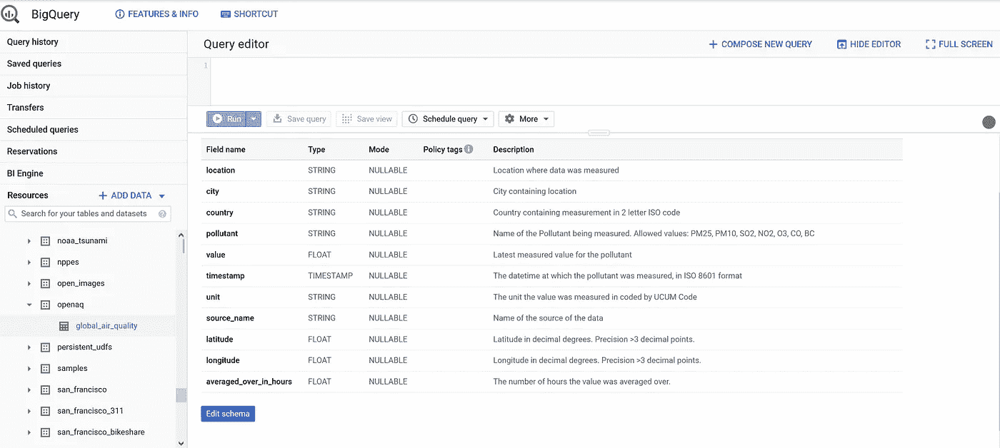

# 用 R 为数据科学家构建简单的 API

> 原文：<https://medium.com/analytics-vidhya/easy-api-building-for-data-scientists-with-r-673b381c4ae1?source=collection_archive---------7----------------------->

## 了解如何用 Docker 和 R Plumber 构建一个健壮的 REST API。



Google Big Query 上的公共实时数据集的模式，我们将为其构建一个 API

*这篇文章还发表在 https://www.r-bloggers.com/*[](https://www.r-bloggers.com/)**上。**

**这是用 R 和 Docker 构建和部署一个健壮的 API 的系列文章的第三部分，这个 API 允许您从 Google Big Query 中提取实时数据。第一部分，参见* [*使用 R*](/analytics-vidhya/google-big-query-with-r-875facef7844) *的 Google 大查询，第二部分，参见* [*使用 Cron 和 R*](/analytics-vidhya/live-data-extraction-with-cron-and-r-f29324bf153e) *的实时数据提取。关于 Docker 的简短介绍，请参阅关于构建和部署仪表板的文章系列的第二部分，* [*使用 Docker*](/analytics-vidhya/deploying-a-shiny-flexdashboard-with-docker-cca338a10d12) *部署闪亮的 Flexdashboard。**

*pi 是一种独立于编程语言跨设备访问数据的便捷方式。RE**RE**presentational**S**state**T**传输 API 是最常见的 Web API 类型。REST 是一种软件架构范例，它定义了一组统一的无状态操作。统一的操作使得定义接口变得简单，无状态性使得接口可靠、快速且易于修改和扩展。常用的交换协议是 HTT 协议，其操作 GET、HEAD、POST、PUT、PATCH、DELETE、CONNECT、OPTIONS 和 TRACE 发送到一个 IP 地址或其关联的 URL。*

*我们将使用 [Plumber 包](https://www.rplumber.io/)在 R 中构建一个 REST API，以便轻松访问来自 [openAQ](https://openaq.org/#/?_k=h8s64f) 的公共大查询实时空气质量数据集的数据。我们能够通过 Cron 在 Docker 容器中通过[计划的数据提取来保存空气质量的永久记录，因为当添加新数据时，数据集的旧条目会被忽略。R Plumber API 将在其自己的 Docker 容器中运行，该容器将与数据提取 Docker 容器一起在容器网络中运行。这种架构有几个优点:](/analytics-vidhya/live-data-extraction-with-cron-and-r-f29324bf153e)*

*   *将整个服务移植到其他机器或云服务*
*   *明确定义的依赖关系避免了功能的破坏*
*   *提取和预聚合数据实现了快速的 API 响应时间，而不需要数据库查询*
*   *增强的数据安全性，因为 API 操作和数据库访问在不同的容器中*
*   *模块化使得服务的调试和附加部分的集成更加容易*

## *r 水管工脚本*

*Plumber 允许您用定义端点和各种输入参数的注释来修饰 R 代码。然后，您可以在定义的 IP 地址公开修饰的 R 代码。从 CRAN 或 GitHub 安装 Plumber，并打开一个新的 Plumber 脚本来查看一些示例。如果你有 RStudio，你可以点击“Run API”按钮，用 Swagger 在本地测试你的端点。默认情况下，plumber 输出作为 JSON 发送，但是您可以使用其他序列化程序或创建新的序列化程序来指示 Plumber 以不同的格式呈现输出。更多信息，参见[管道工文档](https://www.rplumber.io/docs/quickstart.html#customizing-the-output)。*

*下面的脚本指示 plumber 公开各种 R 函数，从提取的空气质量数据中获取数据，这些数据保存在两个 Docker 容器的共享卷中，名为`/shared-data/airquality-india.RDS`。端点`/plot`处的最后一个函数将会按照序列化器`#* @png`的指定以 PNG 格式调用时得到一个测试直方图。注意，代替`elseif`语句，您可以参数化函数以获得更简洁的代码。你可以在这里克隆整个项目 GitHub repo [。](https://github.com/timosch29/Dockerized-Plumber-API)*

## *API 的 docker 文件*

*我们将在 Docker 文件中创建一个包含[食谱的 Docker 图像，将图像层层叠加。我们将使用来自](https://docs.docker.com/registry/recipes/) [Dockerhub](https://hub.docker.com/r/rocker/tidyverse/dockerfile) 的摇杆/tidyverse 图像作为基础图像。这假设了 Docker 的基本知识，如果没有看到 [*用 Docker*](/analytics-vidhya/deploying-a-shiny-flexdashboard-with-docker-cca338a10d12) *部署闪亮的 Flexdashboard。*最终的 commad 层`CMD ["R", "-e", "pr <- plumber::plumb('/src/API.R'); pr$run(host='0.0.0.0', port=3838)"]`将在本地主机(容器)上公开我们脚本中的函数，作为我们通过层`EXPOSE 3838`公开的容器端口 3838 上的端点。*

*在 Dockerfile 运行`docker build -t openaq_api .`的目录中，这将从 Dockerfile 构建图像，并将其标记为 *openaq_api* 。要测试 docker 化的 API，请通过此命令运行 docker 容器，将主机端口 3838 绑定到 API 运行的暴露容器端口。*

```
*$ docker run -d \
  -p 3838:3838 \
  --restart=always \
  --name openaq_api_container \
  --rm \
   openaq_api*
```

*然后检查测试直方图是否通过控制台中的 curl 或通过带有 R:*

```
*require("httr")# send API HTTP operation
api_output <- GET("http://0.0.0.0:3838/plot", verbose(), # param list not needed here as /plot endpoint has none
   #query = list(param1 =, param2=,...)
   )# show body of output                                                                                                 
content(api_output)*
```

*这将向您显示一个 PNG 格式的测试直方图。*

## ***创建多容器服务***

*我们定义了一个由 API 容器和数据提取容器组成的服务，通过 docker-compose 在它们之间共享一个卷。 [Docker-compose](https://docs.docker.com/compose/) 是一个可以附加安装到 Docker 引擎上的工具，它使得通过 YAML 文件中的定义以编程方式设置多容器服务变得容易。我们通过参数`volumes:`定义了共享卷，并通过参数`networks:`定义了一个共享网络，使容器能够监听彼此的端口(这在这个服务中不是必需的，只是为了完整性而显示)。容器是通过参数`services:`定义的，这里的`build:`参数指定容器镜像是从`context:`中的 docker 文件重建的。共享卷被挂载到`volumes:`中容器内的一个目录中。API 容器的公开端口 3838 通过`ports:`绑定到主机的端口 3838。*

*如果你克隆了[项目 GitHub repo](https://github.com/timosch29/Dockerized-Plumber-API) ，你可以看到顶层目录中带有 docker-compose.yml 文件的文件结构。在顶层目录中，使用命令构建并启动容器*

```
*$ docker-compose up*
```

*要在分离模式下运行，添加`-d`。要强制重建现有容器和/或强制重建映像，请添加`--force-recreate --build` 。要停止 YAML 文件中指定的所有已启动的网络和容器，只需运行`docker-compose down`。*

*提取过程现在应该启动并运行了，如 docker 日志中所示，因为我们跟踪了预定 cron 作业的日志。当第一次提取运行完成时，您可以使用 Plumber API 接收 R:*

**

## *何去何从:结束语和补充说明*

*就这样，我们构建了一个健壮的服务来从 Google Big Query 中提取数据，并在这三篇文章系列中使用 Docker 和 R 通过 REST API 轻松访问数据。*

*最初，我在 API 容器的 docker-compose.yml 中安装了主机 docker 守护进程的 docker UNIX 套接字作为卷`-/var/run/docker.sock:/var/run/docker.sock`,以便能够通过 API 调用从主机获取 docker 日志。然而，我删除了这一部分，因为这种做法是一个巨大的安全问题，特别是如果容器用于生产。详见[https://raesene . github . io/blog/2016/03/06/The-Dangers-Of-docker . sock/](https://raesene.github.io/blog/2016/03/06/The-Dangers-Of-Docker.sock/)。*

*从现在开始，你可以将这种多容器服务部署到生产中，例如部署到云服务，如 [AWS](https://www.ybrikman.com/writing/2015/11/11/running-docker-aws-ground-up/) 、[谷歌云](https://blog.machinebox.io/deploy-docker-containers-in-google-cloud-platform-4b921c77476b)和[数字海洋](https://blog.machinebox.io/deploy-machine-box-in-digital-ocean-385265fbeafd)。部署像 [Docker Swarm](https://docs.docker.com/engine/swarm/) 或 [Kubernetes](https://kubernetes.io/) 这样的容器编排工具来管理您的 Docker 容器及其共享资源是非常有用的。*

*在生产环境中，您可能希望使用反向代理服务器，如 [Nginx](https://www.nginx.com/) 将 API 请求重定向到一个 URL，进一步指向 API Docker 容器的公开端口，并通过 HTTPS 对其进行加密。此外，您可能想用 R 包[test](https://testthat.r-lib.org/)为您的 API 编写单元测试，并在许多请求下用 R 包 [loadtest](https://github.com/tmobile/loadtest) 对您的 API 进行负载测试。*

*管道工按顺序处理 API 请求。如果您遇到很多 API 调用，一个选择是部署几个 API 容器，并通过 Nginx 对传入的流量进行负载平衡。如果您想要运行四个 API 容器，请运行 docker-compose up with scale 参数:*

```
*$ docker-compose up --scale REST-API=4*
```

*另一个选择是不要用水管工构建你的 API，而是用 R 包[rest serve](https://restrserve.org/)。它并行处理请求，如果您需要行业级 API，它可能是总体上更好的解决方案，但是定义端点更复杂。关于加速 API 的其他技巧，请参见[https://medium . com/@ JB _ pley net/how-to-do-an-efficient-r-API-81e 168562731](/@JB_Pleynet/how-to-do-an-efficient-r-api-81e168562731)。*