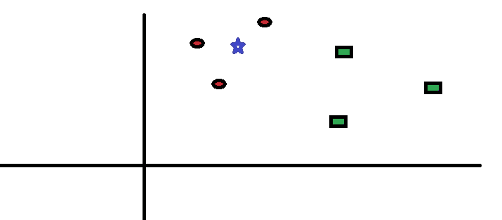
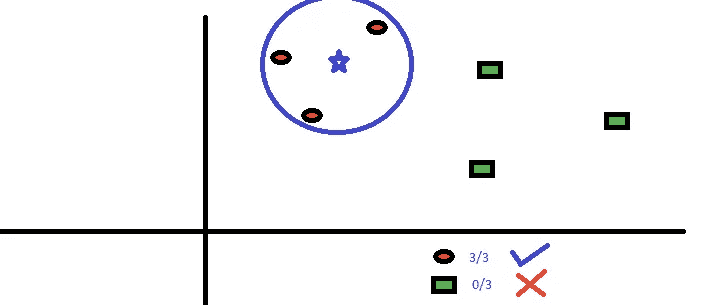
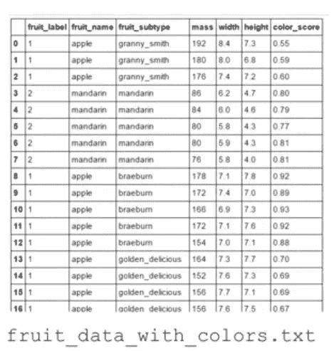
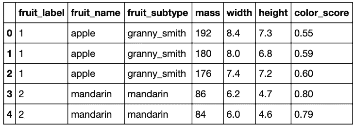
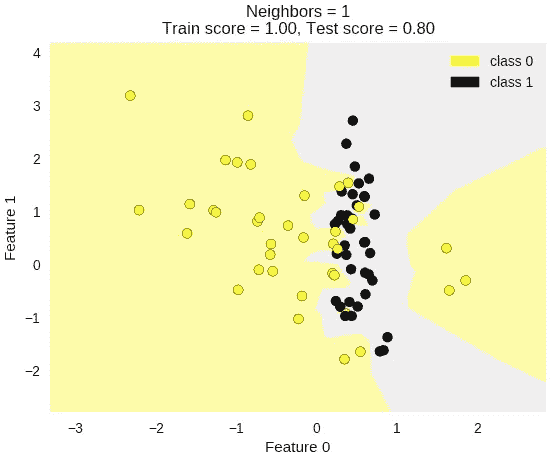
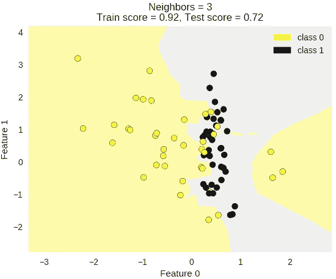
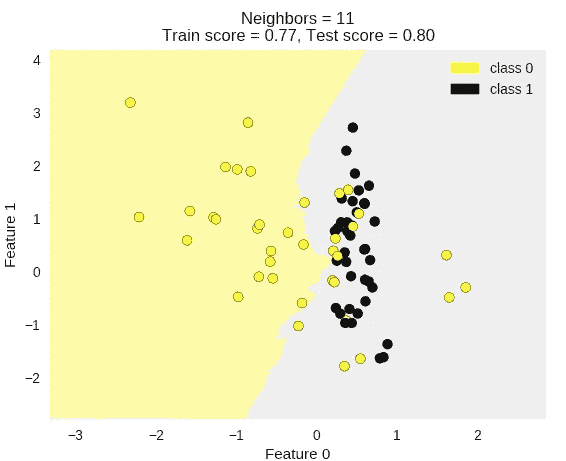
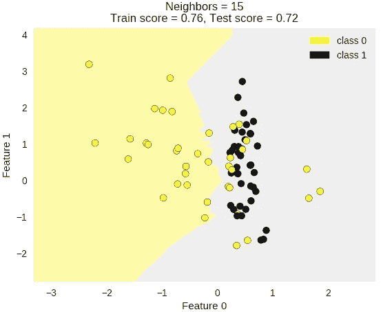

# 使用 scikit-learn 的简易 KNN 算法

> 原文：<https://medium.com/analytics-vidhya/easy-knn-algorithm-using-scikit-learn-7f6e256c9453?source=collection_archive---------1----------------------->

在 *这篇博客中，我们将了解什么是 K-最近邻，该算法如何工作以及如何选择 K 的值。我们将看到一个使用著名的 python 库 sklearn 来使用 KNN 的示例。*

K-最近邻是一个-

**——作为目标变量的监督机器学习算法**已知。

**-非参数化**，因为它不对底层数据分布模式做出假设。

-使用**特征相似度**预测新点将落入的聚类。

KNN 可用于分类和回归预测问题。然而，它更广泛地用于分类问题，因为大多数分析问题涉及决策。

让我们举一个简单的例子来理解这个算法。下面是一系列红色圆圈和绿色方块:



你想知道蓝星的等级。这可以是红色圆圈或绿色方块，没有别的。KNN 算法中的“K”是我们希望从中进行投票的最近邻居。假设 K = 3。因此，我们现在将画一个以蓝星为中心的圆，其大小正好能在平面上包含三个数据点。



离星星最近的三个点都是红圈。因此，在良好的置信水平下，我们可以说蓝星应该属于红圈类。这里，选择变得非常明显，因为最近邻居的三张选票都投给了红圈。

因此最终，我们可以说，该算法检查测试点附近的 k 个最近的数据点的类，并且大多数的类将被分配给测试数据点。

***实现使用 scikit****-*-***学习:-*-**

为此，我们将使用水果数据作为我们的示例数据集。



我们将使用水果的质量、宽度和高度作为我们的特征点来预测正确的水果标签(目标值)。

导入所需模块并加载数据文件(**fruit _ data _ with _ colors . tx**t)

```
**import numpy as np****import pandas as pd****from sklearn.model_selection import train_test_split**
```

使用 pandas 将 data_ table 读入数据帧格式。

```
**fruits = pd.read_table(‘fruit_data_with_colors.txt’)**
```

获取数据集的前五个数据值，以查看数据集的实际情况。

```
**fruits.head()**
```



创建从水果标签值到水果名称的映射，使结果更容易解释

```
**target_fruits_name = dict(zip(fruits.fruit_label.unique(),
fruits.fruit_name.unique()))****target_fruits_name**
```

= {1:'苹果'，2:'橘子'，3:'橘子'，4:'柠檬' }

设 x 为特征值集合，y 为目标值。

```
**x = fruits[[‘mass’, ‘width’, ‘height’]]****y = fruits[‘fruit_label’]**
```

使用 train_test_split 函数将数据分解为默认的 75/25 %训练和测试数据。

```
**x_train, x_test, y_train, y_test = train_test_split(x, y, random_state=0)**
```

一旦我们有了训练测试分割，我们就需要创建一个分类器对象的实例。并且在这种情况下是 k-NN 分类器。并将重要参数(在这种情况下，邻居的数量表示 k)设置为分类器使用的特定值(我们取 5)。取 n_neighbors 或 k = 5。

```
**from sklearn.neighbors import KNeighborsClassifier****knn = KNeighborsClassifier(n_neighbors = 5)**
```

然后，我们通过将 X_train 中的训练集数据和 y_train 中的标签传递给分类器 fit 方法来训练分类器。

```
**knn.fit(x_train,y_train)**
```

请记住，在训练阶段，k-NN 分类器没有看到测试集中的任何水果。

为此，我们对分类器对象使用 score 方法。

这将把测试设定点作为输入，并计算精度。准确度被定义为测试集项目的分数，其真实标签被分类器正确预测。

```
**knn.score(x_test,y_test)**
```

=0.53333333333333333

举个例子。我将输入一个假设的相当小的水果的质量、宽度和高度。如果我们要求分类器使用预测方法来预测标签。

我们可以看到输出是它预测这是一个柑橘。

例如:一个小水果，质量 20 克，宽 4.3 厘米，高 5.5 厘米

```
**fruit_prediction = knn.predict([[20,4.3,5.5]])****target_fruits_name[fruit_prediction[0]]**
```

=普通话

我们可以举另一个例子

```
**fruit_prediction = knn.predict([[180,8.0,6.8]])****target_fruits_name[fruit_prediction[0]]**
```

=苹果

现在让我们使用一个名为 plot_two_class_knn 的实用函数，它包含在共享实用程序模块中。

这将产生具有决策边界的彩色图。然后，您可以自己尝试不同的 k 值，看看对决策界限有什么影响。

```
**from adspy_shared_utilities import plot_two_class_knn****plot_two_class_knn(x_train, y_train, 1, ‘uniform’, x_test, y_test)**
```



```
**plot_two_class_knn(x_train, y_train, 3, ‘uniform’, x_test, y_test)**
```



```
**plot_two_class_knn(x_train, y_train, 11, ‘uniform’, x_test, y_test)**
```



```
**plot_two_class_knn(x_train, y_train, 15, ‘uniform’, x_test, y_test)**
```



***如何选择 k:-***

如果你仔细观察(上图)，你会发现随着 K 值的增加，边界变得更加平滑。随着 K 值增加到无穷大，它最终变成一个单一的目标区域，这取决于总的多数。训练错误率和验证错误率是我们需要在不同 K 值上访问的两个参数。

因此，检查不同 k 值的精度是选择 k 值的最简单和最好的方法。

在 KNN，求 k 值并不容易。k 值小意味着噪声对结果的影响更大，而 k 值大则计算量大。数据科学家通常选择 k=sqrt(n)。

并且总是试图为 k 选择一个奇数值，以避免在两个类的情况下出现平局。

**继续机器学习吧！**