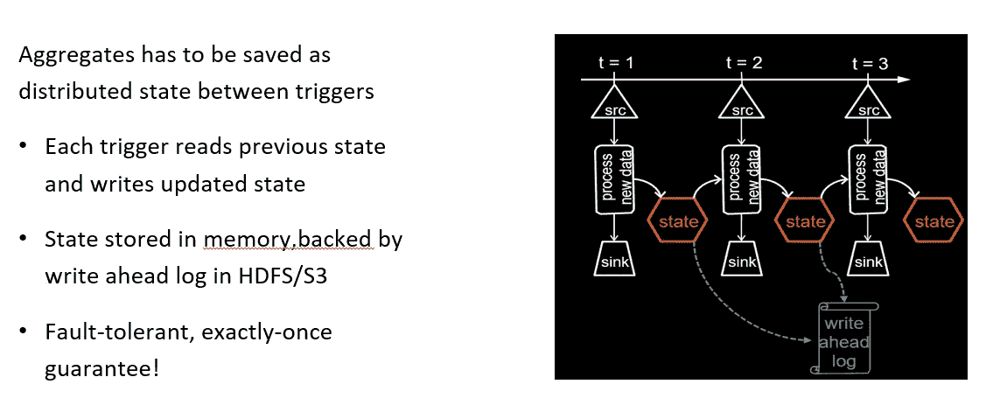

# 利用结构化流探索简单、可扩展、容错的流处理

> 原文：<https://medium.com/analytics-vidhya/easy-scalable-fault-tolerant-stream-processing-with-structured-streaming-8f340be7ed29?source=collection_archive---------24----------------------->

## 流处理的复杂性:

## **什么是结构化流？**

## **解剖流字数:**

## 利用时间:

**活动时间-**

*   许多用例需要按事件时间汇总统计数据。

例如，在 1 小时窗口内，每个系统中的错误数量是多少？

*   从数据中提取事件时间，处理延迟的、无序的数据。
*   DStream APIs 对于事件时的东西是不够的。

**事件时间聚合-**

*   窗口只是结构化流中另一种类型的分组。

每小时记录数-**parsed data . group by(window(" timestamp "，" 1 小时"))。count()**

每 10 分钟每个设备的平均信号强度-**parsed data . group by(" device "，window("timestamp "，" 10 mins "))。avg("信号")**

*   支持 UDAFs！

## **聚合的有状态处理:**

## **自动处理迟交数据:**

## 水印:

## 关注点的彻底分离:

## 其他有趣的操作:

## 流式重复数据删除:

## **带水印的流式重复数据删除:**

## **任意有状态操作:**

## **MapGroupsWithState:如何使用？**

1.定义数据结构

2.定义使用新数据更新每个分组键状态的函数

3.对分组数据集使用用户定义的函数

***user actions . group by key(_。关键)。mapGroupsWithState(updateStateFunction)***

**它适用于批处理和流式查询**

*批量查询时，每组只调用一次函数，没有先验状态*

## **FlatMapGroupsWithState:**

## **监控流查询:**

## **故障恢复和存储系统要求:**

即使机器出现故障，结构化流也能保持其结果有效。为此，它对输入源和输出接收器提出了两个要求:

输入源必须是*可重放的*，以便在作业崩溃时可以重新读取最近的数据。例如，像 Amazon Kinesis 和 Apache Kafka 这样的消息总线是可重放的，文件系统输入源也是如此。

输出接收器必须支持*事务更新*，这样系统才能让一组记录原子地出现。到目前为止，结构化流为文件接收器实现了这一点。

## **带检查点的容错:**

## **支持的源&汇:**

## **性能基准:**

## **更多卡夫卡支持:**

# 感谢阅读💜