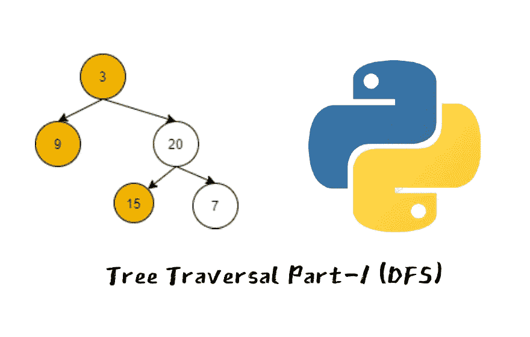
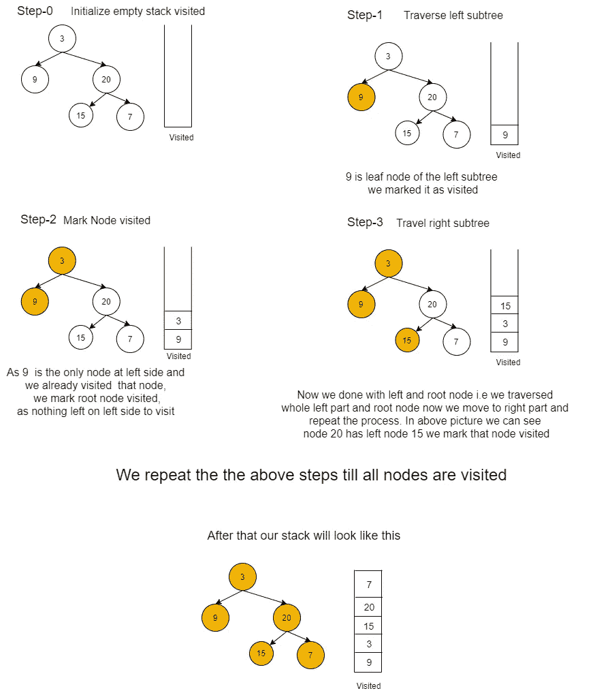
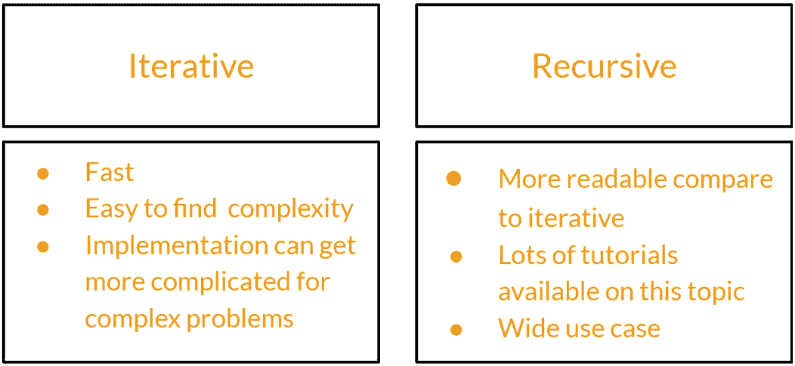

# Python 中简单的树遍历

> 原文：<https://medium.com/analytics-vidhya/easy-tree-traversal-in-python-ff75e320978c?source=collection_archive---------7----------------------->

> **第 1 部分:使用递归的 DFS<=你在这里**
> 
> 第 2 部分:使用迭代的 DFS
> 
> 第 3 部分:使用 DFS 解决 Leetcode 和 binary 搜索问题
> 
> 第 4 部分:BFS 树遍历
> 
> 第 5 部分:使用 BFS 解决 Leetcode 和 binary 搜索问题

而备考编码面试和竞聘编程树都很重要，一定要知道数据结构。人们应该熟悉树操作，例如在树中插入节点，从树和树遍历中删除节点。说到遍历，有两种方法来遍历一棵树 DFS(深度优先搜索)和 BFS(广度优先搜索)。在这篇文章中，我们将看看 DFS 遍历。

# ***DFS-遍历***

有三种使用 dfs 遍历树的方法:前序和后序，以及两种实现遍历的方法，即迭代和递归。我们将讨论这两种方法及其差异，并用 python 实现一个 dfs 模板来执行上述遍历

# 算法

执行 DFS Inorder traversal (LVR)的步骤这里我们使用 Inorder traversal，我们可以通过改变顺序来实现其他两个，这在实现中是很清楚的。

执行有序遍历的步骤

1.  转到左侧子树
2.  将节点标记为已访问
3.  转到右边的子树
4.  重复上述步骤，直到访问完所有节点

**顺序遍历中 DFS 的可视化**

# 实施:

## 实现遍历有两种方法:迭代和递归。

上述比较是我对这些方法的感觉，你可以在互联网上找到很多比较，随意选择你觉得舒服的任何方法，因为递归问题可以用迭代方法实现，反之亦然

# **何时使用迭代或递归？**

当需要速度时，使用迭代方法是很好的选择，因为循环比函数调用更快，这就是为什么大多数有竞争力的程序员使用迭代方法。递归解决方案有利于概念构建，因为它们是解决问题的更自然的方法。首先递归解决，然后使用迭代方法优化是很好的实践。

> 现在我们对什么是遍历、它们如何工作以及实现它们的方法有了一个概念。

## 让我们开始用 python 实现递归方法

## 有序遍历(LVR)

# 前序遍历(VLR)

执行前序遍历的步骤

1.将节点标记为已访问

2.转到左侧子树

3.转到右边的子树

4.重复上述步骤，直到访问完所有节点

> 如果我们仔细观察这两个代码，我们会注意到它们之间唯一的变化是我们调用函数的方式，在我们遵循的顺序(LVR)和在我们遵循的前序(VLR)的情况下，顺序是唯一的变化，对于后序，你猜对了，顺序将是(LRV)这意味着我们可以使用上面的代码作为简单易懂的 dfs 模板来实现所有的遍历，只需改变顺序万岁！！！！！！！！！！！！！

***下面是发文顺序实现***

## 前序遍历(VLR)

执行前序遍历的步骤

1.  转到左侧子树
2.  转到右边的子树
3.  将节点标记为已访问
4.  重复上述步骤，直到访问完所有节点

# 输出

