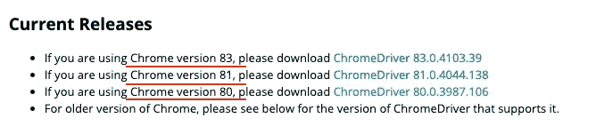
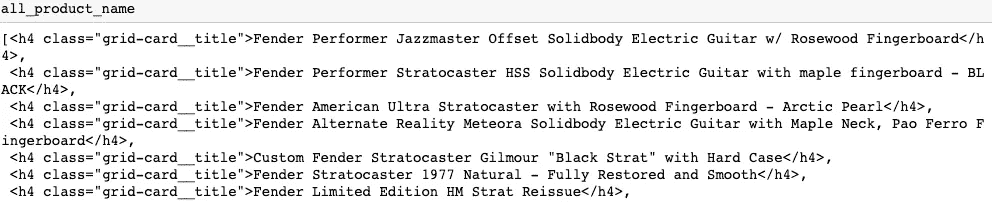
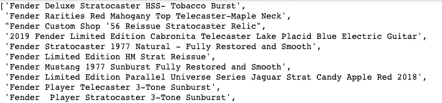

# 2020 年使用 python 和 selenium 在动态网站(CSR)上轻松抓取网页(5 行代码)

> 原文：<https://medium.com/analytics-vidhya/easy-web-scraping-5-lines-of-code-on-dynamic-website-csr-with-python-and-selenium-in-2020-44523c475b5?source=collection_archive---------10----------------------->


# **简介**

现在有很多方法可以抓取网页，不管是用 Javascript(我认为是最简单的)还是其他编程语言。在本文中，我将关注 Python，因为你知道这是数据科学的时代，数据科学家热爱 Python，我最近也迷上了数据分析师领域。

有 3 个流行的库可以使用 Python 进行 Web 抓取，它们是 Selenium、Beautiful Soup 和 Scrapy(它们是如何不同的，你可以观看这个 [youtube 视频](https://www.youtube.com/watch?v=zucvHSQsKHA))。这个内容我将向你展示如何与硒和美丽的汤，这是直观的，易于实施。

# 先决条件

*   安装硒和美丽的汤包

```
pip install selenium
pip install BeautifulSoup4
```

*   任何文本编辑器，但我会推荐木星笔记本或谷歌 colab，因为它更容易调试
*   Selenium web 驱动程序。这是另一件重要的事情，因为 selenium 需要一个 web 驱动程序来创建一个允许 selenium 控制的新网页。本教程我将使用 Chrome 驱动程序。你可以在这里下载 Chrome 驱动程序。* *在下载 chrome 驱动程序之前，请检查您的 google chrome 版本是否与您的 Chrome 版本兼容。



# 我们开始吧

我就刮一下整个[混响吉他搜索页面](https://reverb.com/marketplace/electric-guitars?make=suhr&page=1)源码作为例子。

```
from bs4 import BeautifulSoup
from selenium import webdriver
import timedriver = webdriver.Chrome('directory/to/web_driver')
driver.get("[https://reverb.com/marketplace/electric-guitars?make=fender&page=](https://reverb.com/marketplace/electric-guitars?make=fender&page=100)1")
time.sleep(3)
html_source = driver.page_source
soup = BeautifulSoup(html_source,'lxml')
```

正如你所看到的只有 5 行代码，我们有一个完整的 HTML 页面来源于一个特定的 URL。我将从上面的代码中一行一行地解释。

1.  执行 web 驱动程序(下载的那个)并存储到驱动程序变量

```
driver = webdriver.Chrome('directory/to/web_driver')
```

2.告诉 web 驱动程序打开 URL

```
driver.get("[https://reverb.com/marketplace/electric-guitars?make=fender&page=](https://reverb.com/marketplace/electric-guitars?make=fender&page=100)1")
```

3.这一行非常重要，我们需要设置睡眠时间，等待网页完全加载，因为这是一个动态网站或一些客户端渲染(CSR)调用。你可以在这里阅读更多关于 CSR 和其他类型[的内容。](https://www.toptal.com/front-end/client-side-vs-server-side-pre-rendering)

```
time.sleep(3)
```

4.获取页面源

```
html_source = driver.page_source
```

5.调用 Beautiful Soup 并解析 HTML 源代码。你可以从漂亮的 Soup 文档[中找到解析器选项。](https://www.crummy.com/software/BeautifulSoup/bs4/doc/)

```
soup = BeautifulSoup(html_source,'lxml')
```

所以是的，差不多就是这样。如何以一种非常简单的方式进行网页抓取？

# 奖金

如果你想知道所有吉他产品的名称和价格。基本上，在我们抓取了页面源之后，这意味着我们拥有了特定页面上的所有信息。我们可以用美丽的汤来获取那些特殊的信息。

这个概念很简单。搜索存储产品名称或您想知道的任何内容的标签、类别或 id。(我们将使用这些标签、类或 id 作为美汤的参数)。你可以使用谷歌浏览器中的检查元素功能，通过在 mac 中按下 cmd+opt+i 来找出标签、类或 id。

## 产品名称

对于产品名，我检查了 HTML 源代码后，发现产品名在‘H4’标签和‘grid-card _ _ title’类中

我已经在 soup 变量中存储了 HTML 源代码，所以我可以调用函数“find_all ”,并传递两个参数第一个是标记名和类名，以查找产品名。

```
all_product_name = soup.find_all('h4', class_='grid-card__title')
```

下面是结果，你可以看到我们有所有特定的 h4 标签和类 grid-card__title。



那么，如果我们只想要那些标签中的文本呢？？就用。文本函数并循环遍历该列表。

```
[i.text for i in all_product_name]
```

嘭！我们得到了我们想要的。



# 结论

刮页来源
-安装硒
-安装美汤
-下载 web 驱动

```
from bs4 import BeautifulSoup
from selenium import webdriver
import time
URL = "www.whateverwebpage.com"driver = webdriver.Chrome('directory/to/web_driver')
driver.get(URL)
time.sleep(3)
html_source = driver.page_source
soup = BeautifulSoup(html_source,'lxml')
```

用美人汤刮后获得具体信息。了解更多[美汤](https://www.crummy.com/software/BeautifulSoup/bs4/doc/#)。

```
#soup.find(tag_name,class or id)
all_product_name = soup.find_all('h4', class_='grid-card__title')
#return text inside tag 
[i.text for i in all_product_name]
```

这就是在动态网站上抓取网页的基础，只需要 5 行代码。:)