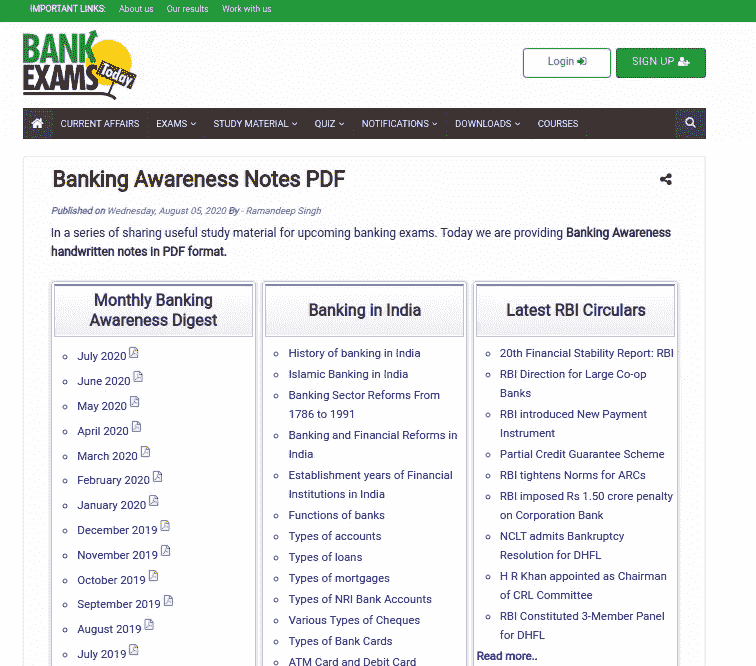
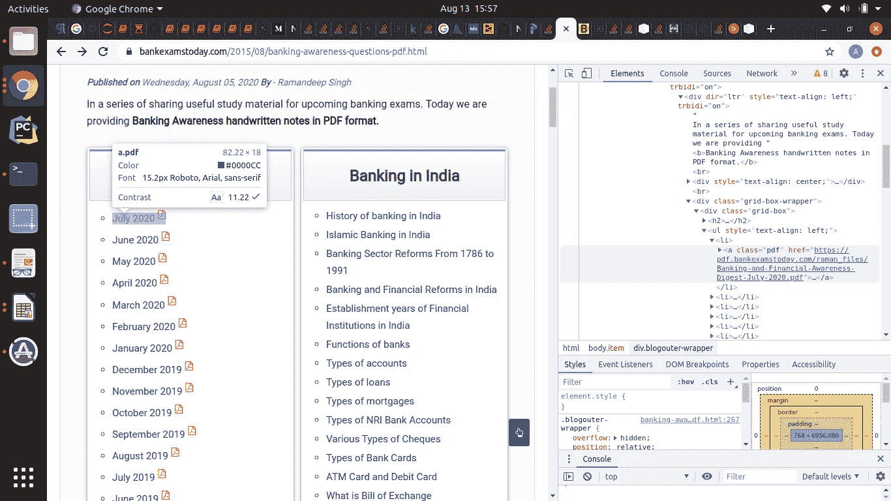
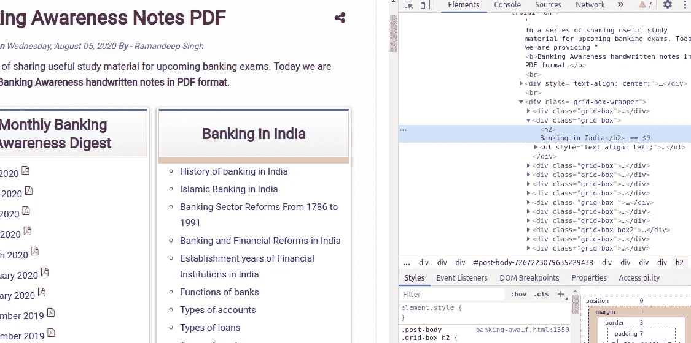
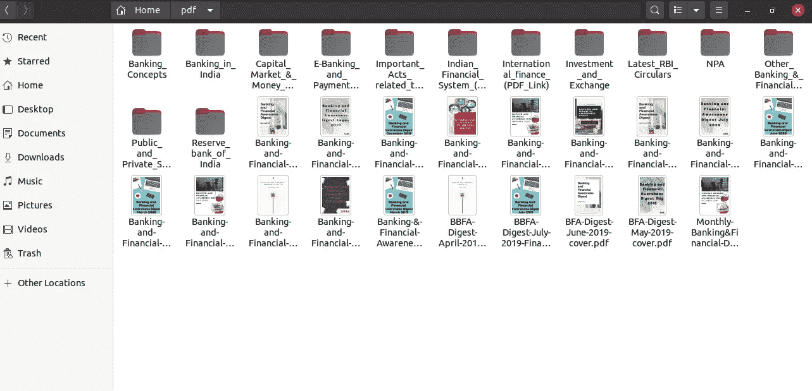

# 使用 Python 和 BeautifulSoup4 轻松抓取网页，并将文件和 HTML 页面保存为 PDF 格式

> 原文：<https://medium.com/analytics-vidhya/easy-web-scraping-using-python-and-beautifulsoup4-and-saving-files-as-well-html-pages-as-pdf-d4693d77150b?source=collection_archive---------3----------------------->

# 下载和保存文件的简单自动化

随着世界进入 21 世纪的第二个十年，最近著名的谚语“数据是新的石油”变得越来越贴切。网络抓取是一种非常有用的技术，可以从一个正常工作的网站上获取大量数据。它还可以用来下载文件、图像、文本，甚至从一个或多个网站获取实时更新。

像 Python 这样简单的高级编程语言使它变得更简单，同时也更有趣。

今天我将解释两个话题。**下载文件**和**下载 PDF 格式的网页。**

**为了简单起见，我选择了一个带有上述链接的网页:**[https://www . bankexamstoday . com/2015/08/banking-awareness-questions-pdf . html](https://www.bankexamstoday.com/2015/08/banking-awareness-questions-pdf.html)。它既包括 PDF 文件，也包括针对 HTML 网页的链接，可以很容易地转换成 PDF 格式。



**先决条件:-**

您必须安装 Python。它内置在 Ubuntu 中，Windows 用户可以很容易地从官方网站安装它。

我正在分享**在各种平台上安装 Python 的链接:**

MAC:[https://medium . com/faun/the-right-way-to-set-up-python-on-your-MAC-e 923 FFE 8 cf 8 e](/@blessedmarcel1/how-to-install-jupyter-notebook-on-mac-using-homebrew-528c39fd530f)

windows:[https://medium . com/@ kswalawage/install-python-and-jupyter-notebook-to-windows-10-64-bit-66db 782 E1 d 02](/@kswalawage/install-python-and-jupyter-notebook-to-windows-10-64-bit-66db782e1d02)

对于 Linux 和 Ubuntu 它已经安装，你只需要安装 Jupyter 笔记本或任何 IDE(为简单起见安装 Jupyter)。只需打开终端并键入

```
$ sudo apt install jupyter-notebook
```

本教程不需要更多的库。我在 Python3 上工作，所以我将使用 pip3，对于较低版本使用 pip。

```
*$ pip3 install beautifulsoup4*$ sudo apt-get install wkhtmltopdf$ pip3 install urllib
```

库 **wkhtmltopdf** 不工作 **pip** 所以我用 **apt-get** 来安装它。

在**终端**或**命令提示符**上输入 **jupyter notebook** 打开 Jupyter notebook，在右上角进入“新建”，在“笔记本”下选择“Python”

# 进入编码部分

1.  导入所需的库。

```
from bs4 import BeautifulSoup as bs
import requests
import urllib
import pdfkit
```

2.刮削部件:

向页面发出 get 请求，并分配 use Soup。



使用 Inspect 元素搜索文件链接，对于 pdf 文件，存在带有 class ='pdf '的定位标记

```
# findAll and find function of BeautifulSoup search for HTML tags
# findAll will return a list with n elementsurl = ‘[https://www.bankexamstoday.com/2015/08/banking-awareness-questions-pdf.html'](https://www.bankexamstoday.com/2015/08/banking-awareness-questions-pdf.html')
response = requests.get(url)
soup = bs(response.text,’html.parser’)
a=soup.findAll(‘a’,{‘class’:’pdf’})
for tag in a:
    print(a)
```

3.从 HTML 元素中获取文件名、文件链接并保存到本地 PDF 文件

```
for element in a:
 print(l)
 name = element[‘href’].split(‘/’)[4]
 link = element[‘href’]
 directory = ‘address/to/directory’

 print(‘saving : ‘,name)
 pdfFile = urllib.request.urlopen(link)
 file = open(directory+name, ‘wb’)
 file.write(pdfFile.read())
 file.close()
```

4.保存 PDF 文件后，现在我们将把网络链接保存为 PDF。在检查时，我们看到所有的块都以一个 div 的形式出现，只剩下第一个 div，因为我们已经废弃了 PDF 文件。我们将在一个循环中刮擦每一个其他的



a.查找所有栅格盒 div

```
grid_box = soup.findAll(‘div’,{‘class’:’grid-box’})
```

b.在所有框中循环——创建目录并将 HTML 文件保存为这些文件夹中的 PDF。

```
for i in range(1,len(grid_box)):
    # stripping topic heading name from the grid-box   
    dirname = grid_box[i].h2.text.strip()
    print('creating folder for : ',dirname)

    # Creating a directory with same name as topic heading     
    # replacing spaces with underscore as spaces can create problem 
    # 

    dirname = 'address/to/directory'+dirname.replace(' ','_')
    if not os.path.isdir(dirname):
        os.mkdir(dirname) links = (grid_box[i].findAll('a'))
    for f in links:
        html_link = (f['href'])
        html_name = f.text.replace(' ','_').strip()
        html_res = requests.get(html_link)

    # creating files with same name as name in html link 
        filename =  dirname+'/'+html_name+'.pdf'

        if not os.path.isfile(filename):
            pdf = pdfkit.from_url(html_link,filename)
            print('created_file : '+dirname+'/'+html_name+'.pdf')
```



……….从网站创建和下载的文件/文件夹……..

# 下面的完整代码

```
from bs4 import BeautifulSoup as bs
import requests
import urlliburl = ‘[https://www.bankexamstoday.com/2015/08/banking-awareness-questions-pdf.html'](https://www.bankexamstoday.com/2015/08/banking-awareness-questions-pdf.html')
response = requests.get(url)
soup = bs(response.text,’html.parser’)
a=soup.findAll(‘a’,{‘class’:’pdf’})for element in a:
 print(l)
 name = element[‘href’].split(‘/’)[4]
 link = element[‘href’]
 directory = ‘address/to/directory’

 print(‘saving : ‘,name)
 pdfFile = urllib.request.urlopen(link)
 file = open(directory+name, ‘wb’)
 file.write(pdfFile.read())
 file.close()grid_box = soup.findAll('div',{'class':'grid-box'})for i in range(1,len(grid_box)):
    # stripping topic heading name from the grid-box   
    dirname = grid_box[i].h2.text.strip()
    print('creating folder for : ',dirname)

    # Creating a directory with same name as topic heading (replacing
    #spaces with underscore as spaces can create problem in creating folder)   

    dirname = 'address/to/directory'+dirname.replace(' ','_')
    if not os.path.isdir(dirname):
        os.mkdir(dirname)links = (grid_box[i].findAll('a'))
    for f in links:
        html_link = (f['href'])
        html_name = f.text.replace(' ','_').strip()
        html_res = requests.get(html_link)

    # creating files with same name as name in html link 
        filename =  dirname+'/'+html_name+'.pdf'

        if not os.path.isfile(filename):
            pdf = pdfkit.from_url(html_link,filename)
            print('created_file : '+dirname+'/'+html_name+'.pdf'+' successfully')
```

**就这些** …..编码，练习，调试，谷歌，再编码。编码时舒适地坐着，保持水分。

***快乐编码！！！***