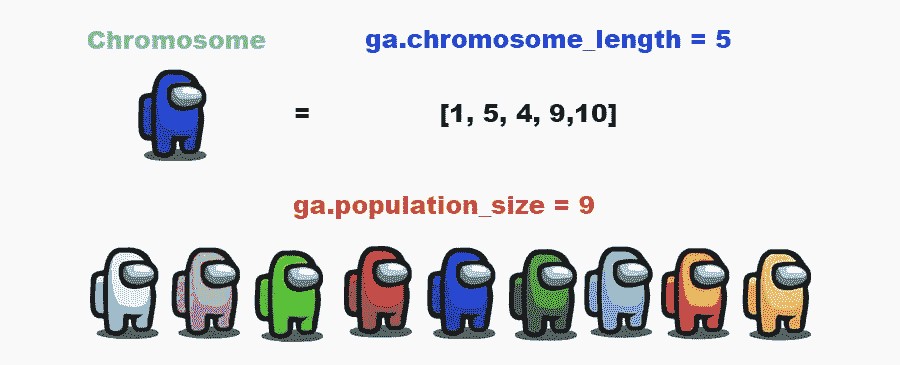
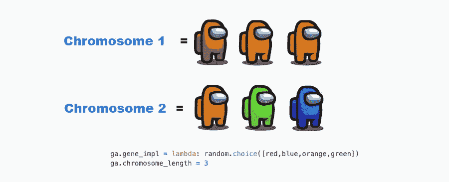

# EasyGA:让遗传算法变得简单。遗传算法在 5 行 python 中的实现。认真 5 线。

> 原文：<https://medium.com/analytics-vidhya/easyga-genetic-algorithms-made-easy-genetic-algorithm-in-5-lines-of-python-seriously-5-lines-a4da7d8ae85a?source=collection_archive---------9----------------------->


为了遵守我的承诺，这里是你需要的所有代码，让你的第一个遗传算法与 EasyGA 软件包一起工作。

```
pip3 install EasyGA
```

在计算机上的任意位置运行 python 文件中的以下代码。

```
import EasyGA

# Create the Genetic algorithm
ga = EasyGA.GA()

# Evolve the genetic algorithm until termination has been reached
ga.evolve()

# Print out the current generation and the population
ga.print_generation()
ga.print_population()
```

**输出:**

```
Current Generation      : 15
Current population:
Chromosome - 0 [7][4][4][5][3][5][5][8][3][7] / Fitness = 3
Chromosome - 1 [7][4][4][5][3][5][5][8][3][7] / Fitness = 3
Chromosome - 2 [7][4][4][5][3][5][5][8][3][7] / Fitness = 3
Chromosome - 3 [7][4][4][5][3][5][5][8][3][7] / Fitness = 3
Chromosome - 4 [7][2][4][5][3][5][5][8][3][7] / Fitness = 3
Chromosome - 5 [7][2][4][5][3][5][5][8][3][7] / Fitness = 3
Chromosome - 6 [5][8][8][6][10][10][5][7][2][7] / Fitness = 2
Chromosome - 7 [5][8][8][6][10][10][5][7][2][7] / Fitness = 2
Chromosome - 8 [5][8][8][6][10][10][5][7][2][7] / Fitness = 2
Chromosome - 9 [7][2][8][10][3][5][5][8][1][7] / Fitness = 2
```

恭喜你，你已经完成了一些 python 导入魔法，并创建了一个遗传算法来解决在染色体中获得所有 5 的问题。你可以称自己为人工智能数据科学家。现在让我们解开发生的一切，我们如何才能改变这个野兽。

## **默认属性:**

遗传算法可能非常复杂，但不知何故，我们将其简化为五行代码。这是通过使用许多默认属性实现的。这些属性包括:

```
# Attributes
ga.population_size = 10
ga.chromosome_length = 10
ga.generation_goal = 15
```

这是一个很好的例子，说明了**人口数量、染色体长度**属性是如何影响遗传算法的，这个例子使用的是我们中间很流行的游戏。



EasyGA 初始化变量:

## **为染色体创建基因:**

让我们用 **gene_impl** ，基因实现可以让你把所有的基因都做成一个函数。你可能已经注意到了 **random.randint** 函数，这是标准 python 库的一部分。俗称“导入随机**”**。[完整的列表可以在这里找到](https://www.w3schools.com/python/module_random.asp)或者你可以使用 [EasyGA](https://github.com/danielwilczak101/EasyGA/wiki) wiki。

```
# Create random genes from 0 to 10
ga.gene_impl = lambda: random.randint(0, 10)
```



Gene_impl 示例:

## 默认适应度函数

最后需要的是一个健身功能。这可能是最没用的健身函数之一，但向任何从未创建过健身函数的人解释一下，效果很好。默认的 EasyGA 适应度函数的目标是获得染色体中所有的 5。

为了证明我的意思。下面是 **is_it_5()** 健身函数。

```
def is_it_5(chromosome): # Overall fitness value
    fitness = 0
    # For each gene in the chromosome
    for gene in chromosome.gene_list:
        # Check if its value = 5
        if(gene.value == 5):
            # If its value is 5 then add one to
            # the overal fitness of the chromosome.
            fitness += 1

    return fitness
```

## 完整示例

现在我喜欢例子，所以让我们用我们刚刚学到的。然而，我不喜欢数字 5，所以让我们把它改为 7，让我们看看在 100 代和人口规模为 50 之后，我们是否能得到所有的 7。

```
import EasyGA
import random# Create the Genetic algorithm
ga = EasyGA.GA()# Attributes
ga.population_size = 50
ga.chromosome_length = 10
ga.generation_goal = 100# Create random genes from 0 to 10
ga.gene_impl = lambda: random.randint(0, 10)# Fitness function to get all 7's
def is_it_7(chromosome):
    # Overall fitness value
    fitness = 0
    # For each gene in the chromosome
    for gene in chromosome.gene_list:
        # Check if its value = 7
        if(gene.value == 7):
            # If its value is 7 then add one to
            # the overal fitness of the chromosome.
            fitness += 1 return fitness# Set the fitness function to the one we made
ga.fitness_function_impl = is_it_7# Evolve the genetic algorithm until termination has been reached
ga.evolve()# Print out the current generation and the population
ga.print_generation()
ga.print_population()
```

## **输出:**

```
Current Generation     : 100
Current population:
Chromosome - 0 [7][7][7][7][7][7][7][7][7][7] / Fitness = 10
Chromosome - 1 [7][7][7][7][7][7][7][7][7][7] / Fitness = 10
Chromosome - 2 [7][7][7][7][7][7][7][7][7][7] / Fitness = 10
Chromosome - 3 [7][7][7][7][7][7][7][7][7][7] / Fitness = 10
Chromosome - 4 [7][7][7][7][7][7][7][7][7][7] / Fitness = 10
Chromosome - 5 [7][7][7][7][7][7][7][7][10][7] / Fitness = 9
Chromosome - 6 [7][7][7][7][7][7][7][7][7][8] / Fitness = 9
Chromosome - 7 [7][7][7][7][7][2][7][7][7][7] / Fitness = 9
Chromosome - 8 [2][7][7][7][7][7][7][7][7][7] / Fitness = 9
etc...
```

我们走，所有的 7！现在这可能对你来说是不同的，因为遗传算法是启发式的，是基于随机开始的。本文只是对 EasyGA python 包的介绍。如果你想了解更多，可以查看 [**EasyGA wiki**](https://github.com/danielwilczak101/EasyGA/wiki) 。他们有很棒的教程，甚至用我们中间流行的游戏来解释一些功能。

感谢您的阅读，
丹尼尔·威尔扎克