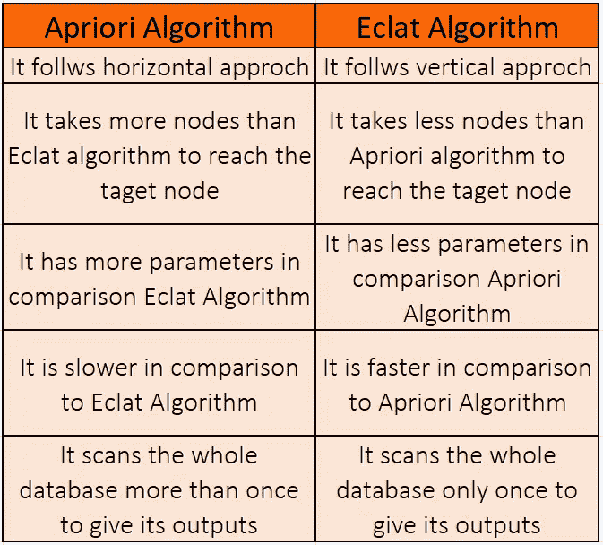
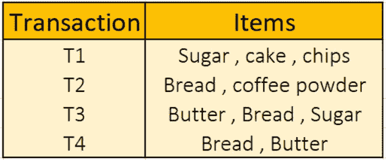
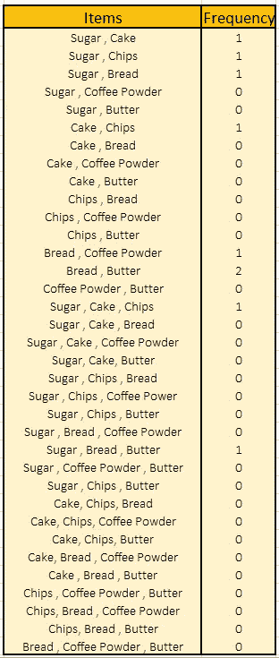
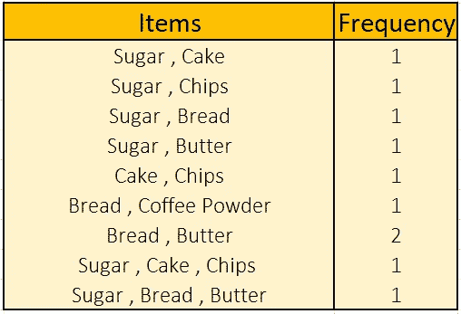

# Eclat 关联规则非常简单！你知道吗？

> 原文：<https://medium.com/analytics-vidhya/eclat-association-rule-is-very-easy-you-know-71c8a992b36b?source=collection_archive---------9----------------------->

**Eclat** 算法代表 **E** 等值**CL**as**T**变压器。它是一种推荐或关联算法。和 [**Apriori 算法**](/analytics-vidhya/get-a-prior-knowledge-of-apriori-algorithm-before-using-it-4cf72bdaf7dd?source=friends_link&sk=e03c4e7cbcce1e1a7dd2e02b3c9028b7) 相比就非常好理解了。Apriori 算法遵循**广度优先搜索**算法，而 Eclat 算法遵循**深度优先搜索**。下表显示了 Apriori 和 Eclat 关联模型之间的比较。

从上表我们可以看出，Eclat 算法在同时使用两种算法时比 Apriori 算法更有效。我们可以在下面的图片中看到最好的比较，它说明了这两种算法如何从第一个节点( **a** )到达目标节点( **e** )。

Aprior(BFS)对 Eclat(外勤部)

## Eclat 算法的工作→

因此，首先我们将决定我们要处理的数据集。

现在，我们将决定数据集的最小支持，它将等于 **50%** 和。事务的最小支持的数值将= ( **给定的%值**/**100**)*****(**事务数** ) = (50/100)*4 = **2。**

现在，我们将从长度大于或等于 2 的数据集**中找出每一个唯一的可能组合及其频率。**

从该表中，我们可以得出以下组合…..

**长度大于或等于 2，是 Eclat 算法的输出。**

我的读者们，我希望这是理解 Eclat 算法的简短易懂的教程。如果您对此有任何问题、意见或担忧，请在回复中自由提出。我会尽快回答他们。在那之前，享受学习吧！……