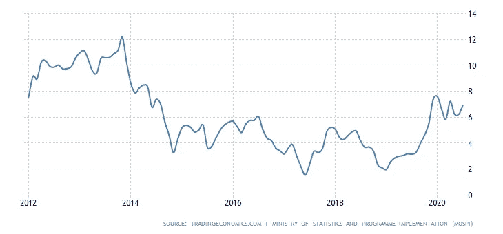
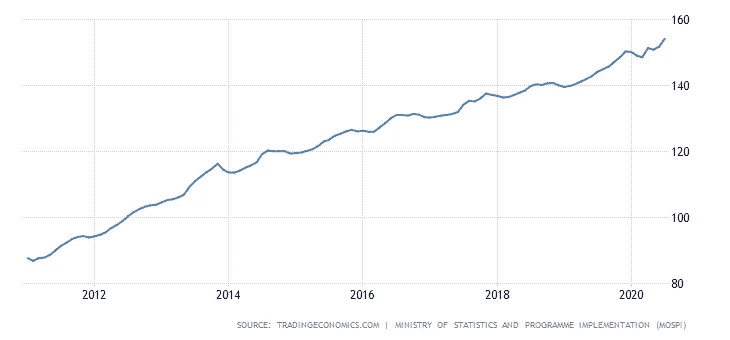

# 经济心理学和指标

> 原文：<https://medium.com/analytics-vidhya/economic-psychology-and-indicators-3fd070e3ba06?source=collection_archive---------24----------------------->

## 经济系列-第一部分

## 我们对经济学的理解是什么？

经济学是一个广泛用于替代各种术语的术语。在这篇文章中，我们关注“经济”一词的两个广泛使用的含义。“国家经济”通常用来定义一个地区在商品和服务的生产和消费以及货币供应方面的能力。而“人的经济”或“个人经济”在个人的基础上处理这种能力。
我们需要讨论这两个经济体的原因是，一个经济体依赖另一个经济体生存和繁荣。现在，既然我们已经把概念分成了两部分，那我们就来深入探讨题目的第二部分。

“心理学”是一门迄今为止对人类了解最少的科学，但却与人类生活的每个方面和他们采取的每个行动密切相关。心理学被定义为对人类思维及其功能的研究，尤其是那些在特定环境下影响行为的研究。国家是人民的集合，而人民是国家设置的制度的产物。因此，经济对国家的心理影响是经济对包括在“国家”中的人民的心理影响的总和。(State 在这里是指任何地区、国家、区域，甚至在某些情况下是指一个社区。)

这篇文章将介绍一个经济体的指标，并深入研究这两个经济领域的指标的心理影响和含义。

# 经济指标

通过货币和货币价值的交换来确定商品和服务的生产和消费能力，对于在把握现在的同时为未来做准备是很重要的。这种对经济状况的确定/预测可以通过“经济指标”来完成。在这篇文章中，我们将关注通货膨胀、GDP、就业、销售/零售额。这些指标将在印度经济和美国经济的背景下进行讨论。这些指标的解释和含义是作者的观点，因此可能因人而异。这些指标有一个具体的发布时间表，允许人们在某个时间根据某些指标来规划投资和创建销售目标。这些指标可以超前或滞后，因此是有用的工具，不仅可以确定经济状况，还可以确定这些指标的增减对国家和人民意味着什么。本文还将尝试用简单的例子来解释这些指标值的波动和变化如何影响一个国家和一个人个人的心理。

# 通货膨胀

资料来源:统计和方案执行部，10 年通货膨胀率

一篮子特定商品和服务的价格水平在一段时间内的增长率被称为通货膨胀。通货膨胀衡量一组日常或普通使用的商品和服务的平均价格变化，如交通、食品、住房、服装以及其他服务和商品。通货膨胀通常表明该国人民的购买力。较高的通货膨胀表明一个国家/民族的货币购买力下降，从而导致经济增长放缓。尽管零通货膨胀或通货紧缩对经济的健康发展并没有好处，但一定程度的通货膨胀对于保持和增加消费者需求和消费是必要的，以便消除通过储蓄囤积资金的想法。经济处于停滞状态，因此需要外部刺激来保持车轮转动，从而刺激生产和消费，代价是一些其他损失，如外汇市场上货币价值的下降。通货膨胀有两大类，这两类都解释了通货膨胀的原因并指出它们的影响。

1.  需求拉动型通货膨胀:这个词本身解释了这种通货膨胀的含义，也就是说，通货膨胀是由市场需求拉动的。如果市场上的总需求高于总供给，基本上，如果大量的货币被使用，但商品非常少。举个例子，假设一个人拍卖了一位伟大艺术家的 5 件艺术品，有 10 个人想买这些艺术品。如果起拍价是 X，那么每一次提价，艺术品的价值都会上升，并以高于 X 的价格结束，即使第一件艺术品以其底价卖出。供应量减少，因此其他 4 件物品的价值增加。由于供应有限，需求拉高了价格。一个更大的例子可以在 IPL 拍卖中看到(举个例子，我不了解足球转会市场)。这种通货膨胀发生在国家经济增长快于预测的长期趋势增长率的时候。基本上，由于供不应求，公司推高了价格。人们的个人支出增加，消费也增加，但这主要是一个积极的特征，因为只有当人们有足够的消费能力时，支出才会增加，从而为个人经济和国家经济显示出积极的信号。在一个公司在一个细分市场上建立垄断的情况下，这可能是一个负面的指标，随着需求的增加，通货膨胀随着不成比例的利润而增加，这在经济中产生了真正的负面状况，因为消费能力没有增加，但是由于对商品或服务的需求增加，人们不得不花费更多。需求拉动型通货膨胀的原因可能是总的经济增长、预测的通货膨胀、更高的货币供应量、国家支出的增加或出口的增加。这背后的心理非常简单，一旦确定了一种需求，就产生了一个细分市场。这种需求需要得到满足，因此即使价格上涨，为了满足这种需求，支出也会增加。重要的是要注意，在这种情况下，需求是一种必要的商品或服务，因为我们谈论的是大规模的，而上面的例子是非常小的。
2.  成本推动型通货膨胀:这可能听起来像是第一类通货膨胀的对立面，但却完全不同。“成本推动型通胀”是指商品和服务价格随着生产和原材料成本的上升而上涨，这可能是由多种因素造成的。石油和食品等原材料的短缺或员工工资的上涨都会导致这种类型的通货膨胀。这种通货膨胀对经济不利，因为它降低了人们的总体生活水平，通常被认为是一个暂时的阶段，但它对国家的经济非常有害，因为总供给减少，即使总需求处于相似的水平，这两个值之间的差异也会不断增加，供给越少，价格上涨越多。让我们举一个例子，一个农场的产量是 X 公斤小麦，假设 100 个人在“第一年”消费，但第二年的产量是 Y，其中 X>Y，仍然是 100 个人消费，农民今年必须比去年支付更多的种子费用。因此，为了收支平衡，农民提高了农产品的价格，而打算消费的人保持不变。由于供应和原材料成本的因素，成本被推高了。这种通货膨胀的原因是名义工资的增加，食品和能源价格的上涨，石油价格的上涨，货币贬值:即该州/地区进口的增加。这些都导致商品和服务的成本增加。成本的增加对人们的心理产生了影响。

对人们的心理影响:商品和服务成本的上升导致人们消费减少，如果整个社会开始减少消费，并开始储蓄，预期通货膨胀会增加，甚至停止金融系统的齿轮。这是一个问题，因为它将阻止资金通过该系统流动，并将导致该地区人民生活水平的下降，从而降低社会地位。为未来储蓄背后的心理学本质上是非常存在主义和生存主义的。

**通货膨胀指数**

消费价格指数趋势 10 年

1.  消费者价格指数(CPI):该指数衡量消费品和服务的加权平均价值/价格，它几乎涵盖了从健康到食品、房地产到交通的所有类别。由于包容性太强，该指数有点不可预测，因此不能正确描述和捕捉通货膨胀的本质。7 月份的 CPI 值为 154.20 个单位，高于 6 月份的 151.80 个单位，考虑到这一趋势，预计 2021 年将达到 162.20 个点，如果目前的趋势明年继续下去，按照长期趋势，我们预计 2022 年将达到约 168 个点。食品和饮料在商品和服务篮子中占最大/最重要的部分，其加权平均值是衡量的。
2.  核心消费价格指数:它是对商品和服务价值变化的衡量，不包括食品和能源等波动较大的产品和服务。这是一个更好的衡量方法，因为不稳定的商品和服务会误导市场，而且这些不稳定的商品和服务通常在被衡量的篮子中占有很大份额。
3.  生产者价格指数:它是衡量商品和服务生产者的产品/产出的平均销售价格变化的指标。这是从生产者而不是消费者的角度来衡量的。印度的生产者价格指数从 2020 年 6 月的 119.30 点上升至 7 月的 120.60 点。这意味着 7 月份生产产品的成本比 6 月份高 1.20%，因为这是平均销售价格的变化。从长期趋势来看，印度的生产者价格指数预计将在 2021 年达到 133.55 点左右，2022 年达到 139.56 点。

10 年来的生产者价格指数(资料来源:印度经济顾问办公室)

# 国内生产总值

这一指标被认为是最受欢迎的指标，主要用于确定经济的规模和产出。它衡量一个国家在一定时期内生产的所有商品和服务的总价值。目前，美国的国内生产总值最高，接近 21.5 万亿美元，而印度预计今年将达到 2.61 万亿美元。在一个非常基本的概览经济中。GDP 的计算方法是个人(家庭)消费、企业投资、政府支出和净出口的总和。这里讨论了 GDPs 的许多价值，另一篇文章将详细讨论所有这些价值。由于 GDP 是一个众所周知的指标，被认为是经济健康的良好指标，因此，它应该对人们的买卖模式影响最大。这里最值得注意的是，虽然 GDP 确实在很大程度上影响买卖模式，但它对日常生活中人与人之间的影响并不大。原因在于，国内生产总值(GDP)不是作为经济健康的经济指标而被推广，而是作为国家与国家之间竞争的指标。这使得 GDP 成为一个概念，而不是一个人的，而是一个大群体的象征。这就是为什么人们不理解 GDP 和人均 GDP 之间的区别以及它是如何影响日常生活的。当我们讨论 GDP 时，有一个与 GDP 相关的值是非常重要的，但在讨论中经常被忽略，那就是债务与 GDP 的比率。“债务与 GDP 比率”是衡量一个国家偿还债务能力的指标。例如，2020 年第一季度，美国的这一指标为 110%。

GDP 被广义地定义为名义 GDP 和实际 GDP 两种形式。名义国内生产总值考虑了价格的自然变动，并在一定时期内随着经济价值的增长而增长。名义 GDP 使用当前价格作为经济账户，不考虑通货膨胀或通货紧缩。另一方面，实际国内生产总值计入了通货膨胀。这意味着它考虑了价格水平的总体上涨。为了理解它如何对通货紧缩进行调整，需要理解 GDP 价格平减指数的概念。

GDP 价格平减指数:它衡量一个经济体中生产的所有商品和服务的价格变化。国内生产总值平减指数表示经济中所有产品和服务的价格水平变化或通货膨胀的程度，不包括一篮子商品和服务。这包括工业、企业、政府以及消费者支付的价格。因此，这是一个比消费物价指数更现实的模型，它隐含地调整名义国内生产总值，并基于当前年和基准年之间的差异，然后根据价格缩减指数进行计算/调整，并显示为实际国内生产总值。这一 GDP 值很重要，因为它显示了国家的生产和增长，因此投资者和决策者将其作为一个指标。当经济状况良好时，失业水平通常较低，工资往往会增加，因为生产需要更多的人来满足经济增长的需求。经济负增长是一个令人担忧的信号，因为它可能表明经济衰退或经济低迷，这意味着要么生产下降，要么人们的购买能力严重下降。最好的例子可以在当今世界看到，由于前所未有的新冠肺炎病毒传播，整个世界的经济遭受了巨大的损失。随着各国进入封锁状态，轮子上的齿轮已经停止转动，导致生产放缓。对于投资者来说，GDP 虽然是了解各国情况差异的重要手段，但也是了解经济增长和生产的增加或减少如何影响股票及其当前和过去投资的重要手段，但不是市场未来的良好指标。

来源:世界银行

以下网站提供了关于上述文章涉及的所有主题的大量信息:

1.  [投资媒体](https://www.investopedia.com/)
2.  [交易经济学](https://tradingeconomics.com/)

经济学几乎塑造了我们所有的财务决策，有时也塑造了非财务决策，因此理解经济及其对我们财务和双向心理的影响非常重要。

本系列的下一篇文章将讨论影响该州经济的另外两个因素:就业/劳动力和生产。

直到下一次，

再见！