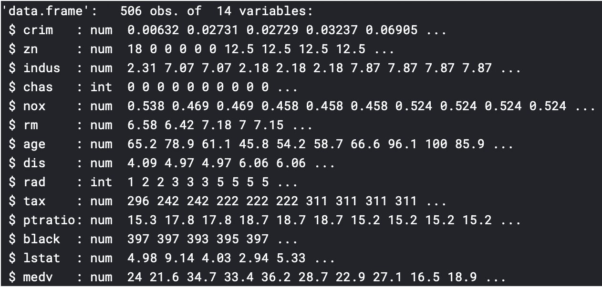

# EDA 和多元线性回归对波士顿住宅的影响

> 原文：<https://medium.com/analytics-vidhya/eda-and-multiple-linear-regression-on-boston-housing-in-r-270f858dc7b?source=collection_archive---------3----------------------->

该数据集包含 1970 年人口普查中波士顿 506 个人口普查区域的相关信息。作为一名有抱负的数据科学家，理解如何像这样对数据建模对我来说非常重要。今天，我将使用 Harrison 和 Rubinfeld (1979)的波士顿住房数据，探索哪些因素影响住房的中值，并对其进行线性回归分析。

## 波士顿住房数据

您可以通过使用“MASS”库来包含这些数据。数据具有以下特征，medv 是目标(因变量):

1.  crim——城镇人均犯罪率
2.  Zn——面积超过 25，000 平方英尺的住宅用地比例
3.  印度河——每个城镇非零售商业英亩数的比例
4.  chas —查尔斯河虚拟变量(= 1，如果区域边界为河流；否则为 0)
5.  NOx——氮氧化物浓度(百万分之一)
6.  RM——每个住宅的平均房间数
7.  年龄——1940 年之前建造的业主自用单元的比例
8.  到五个波士顿就业中心的 dis 加权距离
9.  rad——放射状公路可达性指数
10.  税收——每万美元的全价值财产税税率
11.  pt ratio——按城镇分列的学生-教师比率
12.  黑人——按城镇划分的黑人比例
13.  lstat——较低社会地位人口的百分比
14.  medv——业主自住房屋的中值，以千美元计

## 我们将按如下方式构建代码:

1.加载数据
2。准备数据
3。探索性数据分析
4。建模与精度分析
5。模型的最终分析

## 1.加载波士顿住房数据并将其分配给任意变量

我们可能需要的其他库:

## 2.准备数据

检查 NA 和缺失值并删除它们。

准备培训和测试数据。

## 3.探索性数据分析

这是一个至关重要的部分，通常会占用大部分时间。一个适当和广泛的 EDA 将揭示有趣的模式，并有助于以更好的方式准备数据！

现在，让我们执行一些探索性的数据分析，以了解数据的变量是如何相互关联的。

str(房屋)

这里我们可以看到变量“chas”和“rad”不是数字

主管(住房)

总结(住房)

在上图中，我们可以看到变量“crim”和“black”取值范围很广。

变量“crim”、“zn”、“rm”和“black”的中值和平均值之间有很大的差异，这表明各个变量中有很多异常值。

绘制上述变量的箱线图，以验证异常值。

箱线图

如前所述，变量‘crim’，‘Zn’，‘RM’和‘black’确实有很多异常值。

**寻找相关性** 相关性是一种统计方法，它表明成对出现的两个变量之间的线性相关程度。它的值介于-1 到+1 之间

*   如果大于 0，则意味着正相关，即 X 与 y 成正比。
*   如果低于 0，则意味着负相关，即 X 与 y 成反比。
*   值 0 表示弱关系。

通常我们会使用函数“cor”来查找两个变量之间的相关性，但是因为我们这里有 14 个变量，所以使用库“corrplot”中的 corrplot 函数来检查不同变量之间的相关性会更容易。

相关图是探索数据和查看变量之间交互水平的一种很好的方式。

由于这是一个线性回归实验，涉及到观察波士顿房屋的中值如何随不同因素而变化，所以观察所有变量的趋势是有意义的。

在继续分析“medv”和不同变量之间的线性关系之前，有几件事我们必须知道:

**R 中线性模型的类型**

*资料来源——蒙特菲奥里研究所*

我们现在将试着找出‘medv’和其他变量之间的线性关系，记住一件事

> 不值得为了调整后的 R 平方值的非常小的增加而使模型变得复杂。

分析“medv”和其他变量之间的线性关系

第一排情节是最有用的。它显示了不同的变量如何影响波士顿房屋的中值。

分析 medv 和其他变量之间的散点图和调整后的 R 平方值的线性关系，我们发现只有“lstat”在其平方模型和线性模型之间具有显著较高的调整后的 R 平方差异。因此，可以使用单位函数(I)在模型内部对其进行数学平方。

## 4.建模及精度分析

**如何在线性回归中分析模型**

*   无效假设是与变量相关的系数为零。
*   另一个假设是，系数不等于零(即，所讨论的自变量和因变量之间存在关系)。
*   如果 Pr(>|t|)值为 3 星，则表示系数具有非常高的统计显著性。小于 0.05 的 Pr(>|t|)值被认为是好的。
*   多重 R 平方测量模型中所有自变量解释的因变量变化的比例。
*   调整后的 R 平方衡量的是仅由那些真正有助于解释因变量的自变量解释的变化比例。它惩罚你添加独立变量，这无助于预测因变量。
*   如果 F 统计量显著，则模型是好的(F 统计量的值越高越好)。
*   我们的主要目标是确定能给出最佳预测模型的变量。

让我们从拟合所有变量开始。

**迭代 1**

**观察结果**

*   r 平方值约为 0.76
*   f 统计值为 90.8

**改进**

*   变量“年龄”和“印度河”具有非常高的 Pr(>|t|)值和较低的显著性，因此移除它们可以给我们一个更好的模型。
*   正如我们在 EDA 中注意到的,“lstat”是非线性的，因此可以对其进行平方以获得更好的拟合。

**迭代 2**

**观察结果**

*   r 平方值增加到 0.81 左右
*   统计值为 128.5

**改进**

*   变量“zn”具有非常高的 Pr(>|t|)值和低显著性，因此移除它可以给我们一个更好的模型。
*   高度显著的变量之间的相互作用可以给我们一个更好的模型。

**迭代 3**

**观察结果**

*   r 平方值增加到 0.86 左右
*   f 统计值增加到 185.1

我们从 0.76 的 R 平方值开始，通过去除无关紧要的变量并添加新的相互作用项，达到了 0.86。

任何模型都是可以改进的，包括这个，是我们决定我们要进一步改进这个模型到什么程度。就本文而言，我们将只进行三次迭代。

## 5.模型的最终分析

看上面的直方图，我们可以说，该图是非常轻微的右偏，因此几乎可以认为是正态分布。

我希望你喜欢这个分析！我认为使用线性回归之外的方法会很有趣。

欢迎回复和鼓掌！

## 与我联系

点击下面的任何一个与我联系

*   [领英](https://www.linkedin.com/in/kritikseth/)
*   [Github](https://github.com/kritikseth)
*   [卡格尔](https://www.kaggle.com/kritikseth)
*   [我的网站](https://kritikseth.github.io)