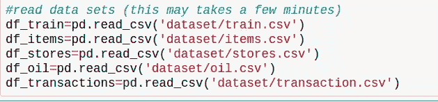
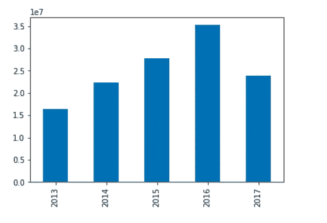

# EDA 案例研究:Corporación Favorita 杂货销售预测！

> 原文：<https://medium.com/analytics-vidhya/eda-case-study-corporaci%C3%B3n-favorita-grocery-sales-forecasting-e6801b29ed3a?source=collection_archive---------10----------------------->

> 分析**数据的方法**集合**来总结它们的主要特征，通常采用可视化方法。**

今天，我们要对一个庞大的数据集——由 Kaggle *提供的 ***Corporación Favorita 杂货销售额进行**探索性数据分析(EDA)** 。总部位于厄瓜多尔的大型杂货零售商 Corporación Favorita ，他们经营着数百家超市，货架上有超过 200，000 种不同的产品。****

在这个数据集中，我们必须预测**单位销售额(** *一种产品产生的总收入除以该产品在给定时间段* **)** 内售出的 ***单位总数*** *)，该产品在厄瓜多尔的不同 Favorita 商店销售数千种商品。训练数据包括日期、商店和物品信息以及物品是否被促销。*

下面，我将研究关于不同特性的观察分布。我还检查了目标变量(单位销售额)的分布是否有异常值。

我在训练集和测试集中发现了一些有趣的差异，这些差异在训练模型之前值得考虑。

首先，导入库并将各种 CSV 加载到数据帧中:

Favorita 存储数据集。

# **训练集:**

让我们看看训练集(df_train)

训练集有 **125，497，040(1.25 亿)行**和 6 列:行 id、日期、商店编号、商品编号、单位销售额(请记住，这可以是整数、浮点数或-1，表示返回的商品)，以及特定商品是否有促销。

总之，我们必须处理 onpromotion 列中的 NaN，并用更有用的列['year '，' month '，' day']替换`date`列。

**df_train.fillna(0，inlace=True) —处理 NaN 的**

**pd。DatetimeIndex(df_train['date'])。年份—从日期中获取年份。**

这是从日期列中获取年、月和日，然后删除日期列(因为它现在已经没有用了)后 dataframe 的外观:

数据集也包含 store.csv 和 items.csv 文件。让我们来了解一下他们的情况:

Store.csv 文件

Items.csv 文件

值得注意的是，数据集之间存在链接属性——在 df_store、df_item 和 df_train 之间共享“store_nbr”和“item_nbr”。在这里，你可以很容易地想到，通过使用熊猫函数 **pd.merge()** 方法，将它们合并到训练集(df_train)中。

***“合并”两个数据集是将两个数据集合并成一个数据集，并根据公共属性或列对齐每个数据集的行的过程。***

**pd.merge(df_train，df_item，on='item_nbr')**

**pd.merge(df_train，df_store，on='store_nbr')**

合并后，训练集看起来像这样-

合并数据集。

**现在，我们绘制条形图和折线图等图形，以便更好地理解数据集。**

# 按年、月、日分析数据集:

现在，让我们了解一下收集数据的时间范围:

x 轴=年份，Y 轴=单位销售额

他们收集了 2013 年至 2017 年的数据。除了 2017 年，每年的观测数量都在增加，但这可能是因为它尚未结束。

让我们看看数据是如何按月分布的:

x 轴=月，Y 轴=单位销售额

观测值几乎按月均匀分布。最高值出现在 12 月，最低值出现在 2 月。按一个月中的某一天怎么样？

x 轴=天数，Y 轴=单位销售额

同样，观测值在一天中几乎是均匀分布的。

# **店铺:**

现在，让我们确定有多少个商店以及每个商店的观察分布。

每个商店的观察分布。

使用 **unique()** 方法可以发现数据集中有 54 个商店。这个情节的解读如下。y 轴是对应于特定悬挂物的观察次数。观察多的店不一定比观察少的店表现好。这是因为一些商店可能提供更广泛的产品，但推量较少。这将夸大他们在这个阴谋中的数字。我们可以将 y 轴解释为商店种类的度量。

# 项目:

现在让我们对项目进行分析。根据易腐物品和不易腐物品的数量绘制图表。还可以看看产品系列。

x 轴=易腐物品，y 轴=物品数量

0 =非易腐物品，1 =易腐物品。

x 轴=系列，y 轴=项目数量

总之，商店里有大量与食品杂货相关的不易腐烂的物品。

# 促销:

现在，让我们找出优惠券剪购买了多少物品。

约 **6.22%** 的商品是在促销时购买的。

这里我们已经填充了空值，并将 onpromotion 列转换为分类数据，其中 **0=NaN 的值，1=False(没有商品促销), 2=True。**

# 城市和州:

让我们了解一下州和城市列的信息。我们已经通过使用标签编码将城市和州转换成分类数据。

x 轴=城市编号，y 轴=单位 _ 销售额

x 轴=州号，y 轴=单位销售

城市和州列形成了几乎相似的图形。由此，我得出结论，我们可以在最终的训练集中删除 state 列。从数据集中删除列完全取决于个人感知和目标变量对该列的依赖。

# 结论:

我们查看了训练集中的观察结果是如何按日期、商店、商品和促销分布的。我们还更加熟悉了目标值单位销售额的分布，这可能需要进行处理以消除异常值。

我们可以得出结论，年月日列非常重要。为了更好地理解，有必要将日期转换为日期时间。您还可以对数据集样本执行 EDA，只需取出样本年份并绘制图表。同样，您可以对测试数据集进行分析。

在未来，我计划探索其他数据集。感谢阅读！