# EDA —探索性数据分析

> 原文：<https://medium.com/analytics-vidhya/eda-exploratory-data-analysis-d0fb1fd40cb9?source=collection_archive---------8----------------------->

术语“探索性”是指探索和探索性数据分析，是指探索数据和分析数据并根据数据得出结论。根据我的理解，这是一个非常简单的解释，如果我们从理论上解释 EDA 意味着:在统计学中，探索性数据分析是一种分析数据集以总结其主要特征的方法，通常采用可视化方法。在本文中，我们可以了解如何进行探索性数据分析，以及不同类型的图表。

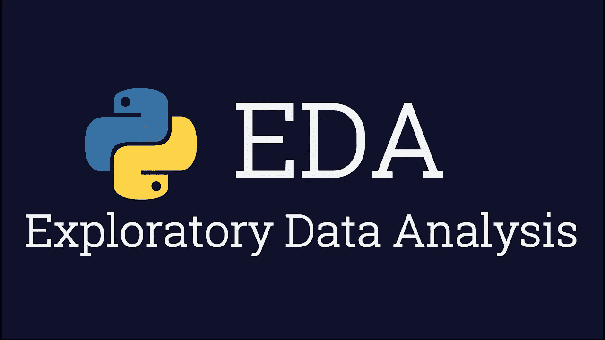

*   首先，我们必须加载数据分析过程所必需的库。需要的必要库是 pandas、numpy、matplotlib、seaborn。这些是进行 EDA 的基本库——我将很快在单独的文章中解释每个库。首先导入这些库。

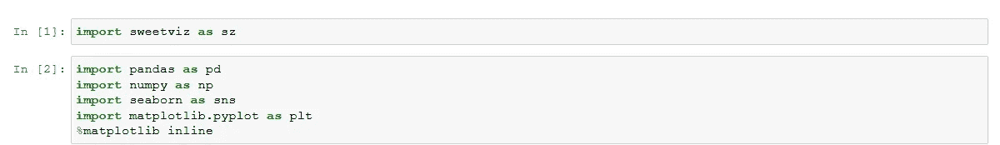

*   接下来，将数据加载到名为 df 的数据帧中。我最喜欢的永远是 df，因为它好记。这永远是第二步。这些都是基本的，基本的事情做起来总是很有趣。加载库并加载数据集。我见过许多人在加载数据集本身时犯错误。

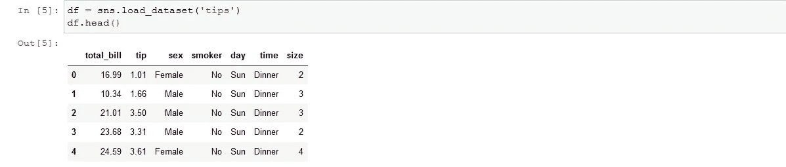

在进入第三步之前，我必须澄清两件事。在使用(df.describe())进行统计分析之前，请始终使用 info 检查数据集是否有任何损坏的数据**

[**-这里损坏的数据意味着，浮点将是对象，日期将是对象，即使 int 数据将是对象。如果我们对对象使用 df.describe，它不会给出很好的统计分析。因此，为了快速得出结论，我们必须将数据转换成清晰的形式]

*   检查 df.info() — info 确保它提供了有关数据集中数据类型的信息。这将给出关于它的适当信息。

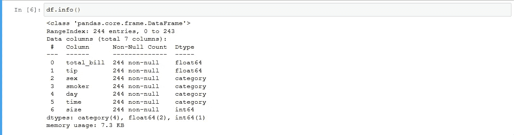

[现在，如果它们是不同的数据类型，这里有一个带有模板的备忘单，可以删除数据中所有额外的配件，使数据变得干净，以便于分析]

[https://medium . com/@ navinni ish 001/cleaning-the-data-type-c 961 BC 1a 12 c 6](/@navinniish001/cleaning-the-data-type-c961bc1a12c6)

*   在查看数据的统计分析之前，必须检查空值。有一个技巧可以做到这一点空值，我会告诉你如果出现空值该怎么做——对于分类数据用模式填充，对于数值数据用均值填充。这确保了数据不会受到太大影响。

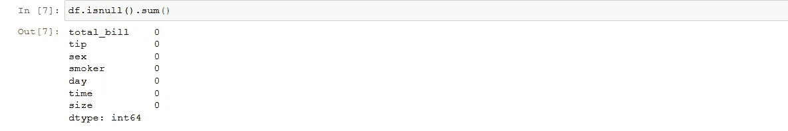

*   清理完数据后，现在就该对数据进行统计分析了。使用 df.describe 来确保我们查看数据的统计分析。这给出了数据的五点汇总。五点汇总平均值—平均值、中值、众数、分位数%。

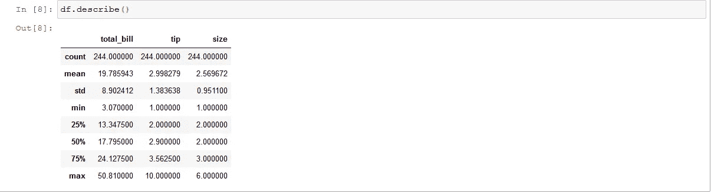

*   检查数据的相关性，通过使用 corr()函数并使用 seaborn library 可用的热图来绘制数据的相关性摘要。热图将向您展示彩色图的相关性。我们也可以使用 sweetviz 来实现这一点，我已经在这里附上了。

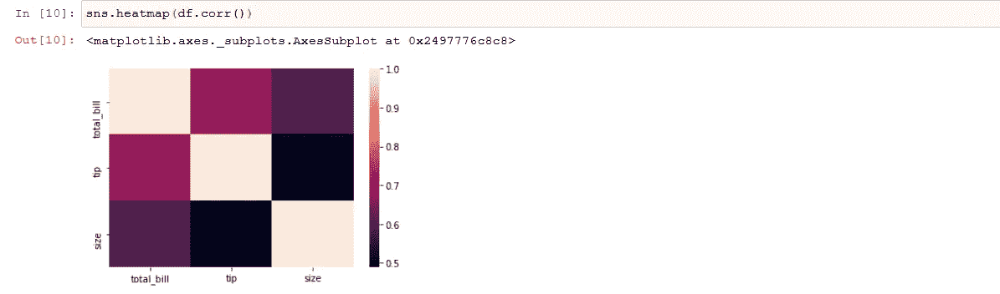

关联完成，清理完成，数据准备好进行单变量和双变量分析。

什么是数据的单变量分析？

*   Uni 的意思是单身。单变量是指采用单个变量并以图形/图表的形式分析数据。

**什么是双变量数据分析？**

*   Bi 是指两个变量，双变量分析是指取两个变量进行比较，以检查其是直接还是间接成比例

**什么是数据的多元分析？**

*   Multi 就像双变量分析一样，但是在分析过程中涉及到两个以上的变量。

**用于单变量/双变量/多变量分析的图表:**

*   单变量图形:直方图、密度、数值箱线图、饼图、条形图和分类计数图
*   双变量图形:数字-数字我们使用散点图、直线图，数字-分类我们使用条形图、方框图、群集图、条形图、小提琴图
*   多元图表:数值-数值我们使用散点图、直线图，数值-分类我们使用条形图、方框图、群集图、条形图、小提琴图

做了分析之后，我们必须确保写下我们的观察结果，这样我们才能得出结论。

**异常值处理:**

*   每个数据都可能有异常值，没有数据会因为没有异常值而例外。例如，看看这个:

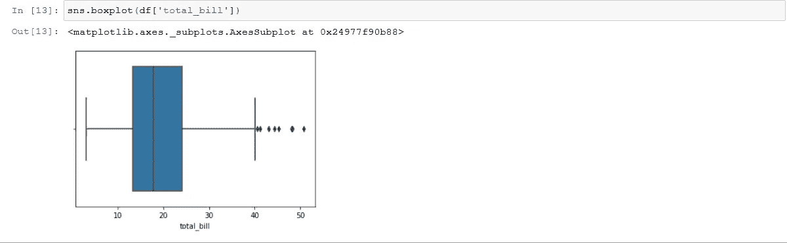

高于上限区域的点称为异常值。它们是数据中的例外，可能会导致偏差。为了进行完整的分析，我们进行了异常值处理。异常值处理有两种方式:

*   通过使用 Z 分数
*   通过使用 IQR 方法

除了这两种方法，还有其他方法，但这两种方法广泛用于异常值处理。

**使用 Zscore 方法:**

*   Zscore 方法用于对数据进行重度异常值处理。这里，我们导入 zscore，并为我们选择用于分析的列计算 zscore，然后找出 zscore 的图形。
*   稍后，我们将数据帧缩减为 zscore 大于-3 且小于+3 的较小数据帧，以减少异常值。这被称为 zscore 异常值处理。

**在 Zscore 之前:**

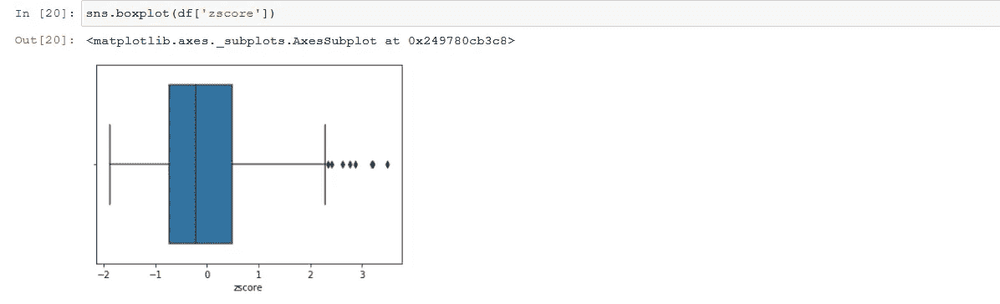

经过 **Zscore** 处理后:

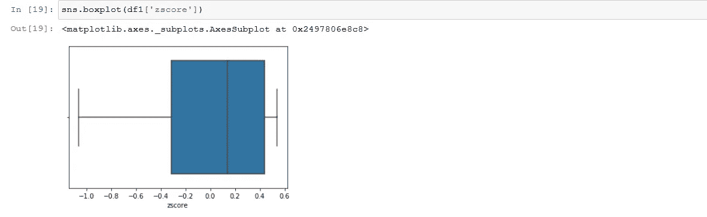

如您所见，数据变得向左倾斜，离群值被移除。这被称为 zscore 异常值处理。

**IQR 法治疗:**

*   IQR 是用于获得分位数值的分位数范围方法，它涉及将值减少为上限和下限
*   上限= Q3 +1.5(IQR)，下限= Q1–1.5(IQR)，这也是非常有效的方法。
*   我们必须选择位于上限和下限之间的值来进行异常值处理

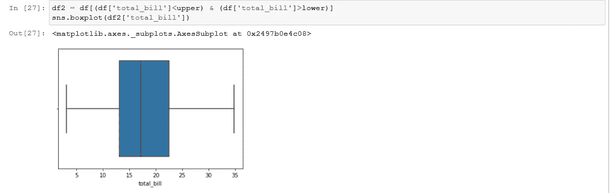

这就是 IQR 方法去除异常值的效率。这个图看起来也是向右倾斜的。

**所以总结一下:**

*   加载库
*   加载数据集
*   检查 df.info
*   清除数据(重命名、填充值、更改数据类型)
*   检查 df.describe
*   做单变量和双变量分析
*   检查异常值
*   进行异常值处理。

在 tips 数据集上完成的完整 EDA:【https://github.com/navinniish/EDA 

还有一种叫做缩放的东西。对数据进行缩放是为了减小数据的规模。要素缩放(也称为数据标准化)是用于标准化数据要素范围的方法。由于数据的值的范围可能变化很大，因此在使用机器学习算法时，这成为数据预处理中的必要步骤。

**什么是缩放？**

*   要素缩放(也称为数据标准化)是用于标准化数据要素范围的方法。由于数据的取值范围可能变化很大，因此在使用机器学习算法时，这成为数据预处理中的一个必要步骤。

这仅仅意味着，以一种我们可以更好地理解数据的方式缩小比例。在这篇文章中，我将讲述我们如何进行扩展，以及如何使用内置库来提高我们的工作速度。

**缩放类型:最小最大缩放& Z 分数缩放**

**最小最大缩放**:这也称为归一化。当您的数据具有不同的比例，并且您使用的算法不对数据的分布进行假设时，归一化非常有用。

**Z 分数标度**:这叫做标准化。对特征进行标准化，使它们以 0 为中心，具有标准偏差，这是许多机器学习算法的一般要求。

**如何进行最小最大标准化:**

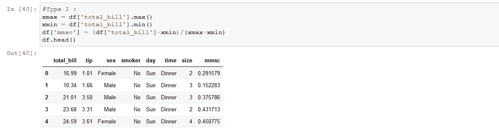

在这种方法中，我们对最大值和最小值进行硬编码，然后使用最小最大值缩放公式，我们正在进行最小最大值缩放。

这是最小最大缩放后，图形看起来的样子:

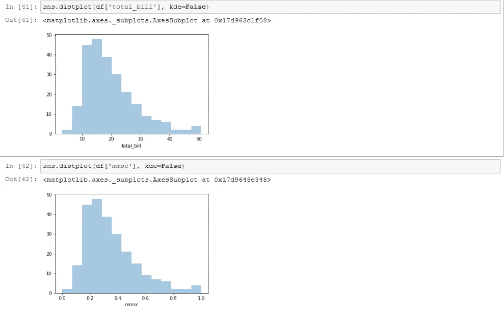

**如何进行 Zscore 缩放:**

Zscore 缩放给出-3 到+3 范围内的值。我将在这里告诉一个简单的方法，以便我们可以使用 zscore 函数轻松地进行 Zscore 缩放。

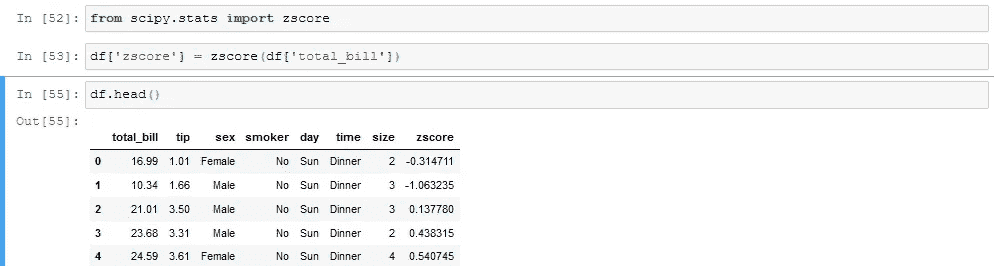

这是 zscore 图形的样子:

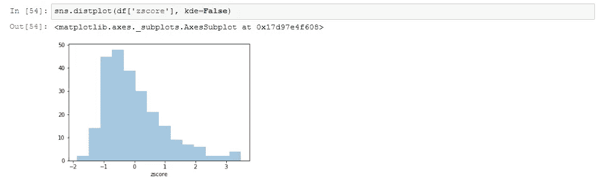

如您所见，这些值在负 3 和正 3 的范围内。还有另一种方法，那就是使用 zscore 的公式。

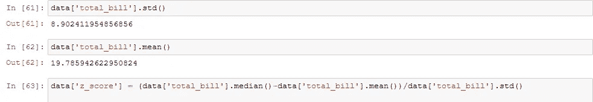

公式是:

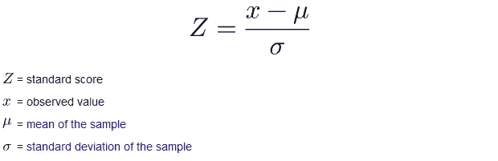

这就是我们进行缩放的方式。缩放无非是减少数据的规模。

我还写了数据分析中使用的不同类型的图表，并通过使用 tips 数据集的示例说明了它们的用途，我将在它结束后附上它——敬请关注

因此，缩放、数据可视化和数据清理都已完成，在本文中，我已经解释了 EDA，因此，在完成所有这些工作后，我们必须将数据分割为测试序列，以便通过分割实际数据来获得用于分析的数据百分比。这是一个 ML 的概念，所以当我写 ML 的时候，我会写更多关于它的内容，现在 EDA 已经完成了。

特别感谢我最好的朋友 [HR](https://medium.com/u/733adbca7dbf?source=post_page-----d0fb1fd40cb9--------------------------------) 帮助我更好地理解 EDA。

感谢阅读。