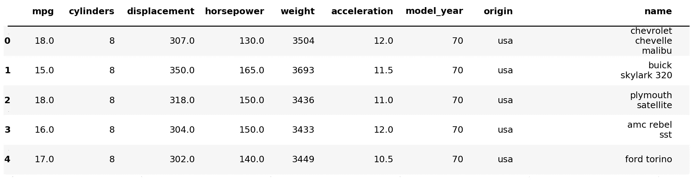
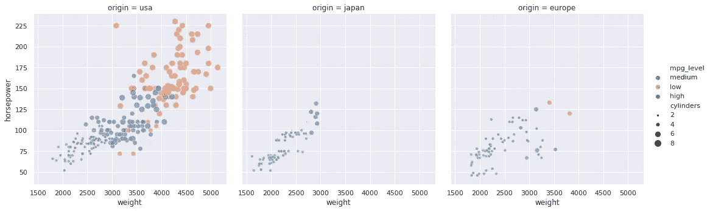

# 探索性数据分析

> 原文：<https://medium.com/analytics-vidhya/eda-for-beginners-using-python-4fcd2b57d1f7?source=collection_archive---------6----------------------->

这是 **3 系列**的一部分，我将浏览一个数据集，分析它，然后在最后做预测建模。我建议按顺序学习各个部分，但你也可以跳到任何部分。

**第 1 部分，探索性数据分析(EDA):**
这一部分包括数据的汇总统计，但主要重点将放在 EDA 上，在 EDA 中，我们使用绘图从数据中提取意义/信息，并报告关于数据的重要见解。这部分更多的是**数据分析**和**商业智能(BI)** 。

[**第二部分，统计分析**](/@greatsharma04/statistical-analysis-using-python-e83f10ca3c82) **:**
在这一部分我们会做很多统计假设检验，应用估计统计量，解释我们得到的结果。我们也将通过第一部分的发现来验证这一点。我们将应用参数和非参数测试。我们将在这一部分报告我们得到的所有重要见解。这部分内容都是关于**数据科学**的，如果可能的话，需要一些统计背景知识。

[**第三部分，预测建模:**](https://github.com/greatsharma/MPG/tree/master/Modelling)
在这一部分我们将使用给定的预测因子来预测一个反应。这部分都是关于**机器学习**的。

## 元数据，关于数据的数据

我正在使用从 [UCI 资料库](https://archive.ics.uci.edu/ml/index.php)中获取的用于 EDA 的[自动 mpg](https://archive.ics.uci.edu/ml/datasets/auto+mpg) 数据。

**标题:** Auto-Mpg 数据
**实例数:** 398
**属性数:** 9 包括类属性
**属性信息:**

```
1\. mpg — continuous
2\. cylinders — multi-valued discrete
3\. displacement — continuous
4\. horsepower — continuous
5\. weight — continuous
6\. acceleration — continuous
7\. model year — multi-valued discrete
8\. origin — multi-valued discrete
9\. car name — string (unique for each instance)
```

这种数据并不复杂，非常适合分析，因为它很好地融合了分类属性和数字属性。

这是**第一部分**即 EDA。我不会把这一部分拉得太长，而是按顺序做下面的事情。

1.  **数据的一些预处理**，这包括处理缺失值、重复数据(如果有的话)，然后对齐数据。
2.  **分类属性的 EDA**，这包括分析它们的分布以及与其他猫的关系。(分类)属性。
3.  **关于数字属性的 EDA**，这包括分析它们的分布以及与其他数字的关系。(连续/数值)属性。
4.  然后我们将分析**关系 b/w 数值&范畴属性**。

我将在整个笔记本中大量使用 **seaborn** ，因此对于那些正在使用 seaborn 寻找 EDA 的人来说，这也是一个很好的笔记本。

首先，导入所有必需的库。

我们首先将数据导入到 pandas 数据框中，并检查它的属性。



数据是矩形(表格)形式，有 398 个条目，每个条目有 9 个不同的属性。

为了检查元数据(即关于数据的数据)，我们可以使用内置的 pandas 函数。

`df.info()`，描述了数据的很多东西，比如每一列的数据类型，内存使用情况等等。

现在，我将为分类和数字列名制作两个不同的列表，因为对这两种类型的分析是不同的。为此，我将内省每一列的数据类型，如果它是类型`object`，那么它是分类的，否则是数字的。

我将在整个分析中大量使用这两个列表。

让我们看看每一列中有多少个唯一值。

因为`cylinders`和`model_year`只有很少的唯一值，所以让它们成为分类的而不是数字的是安全的。这种转换将有助于分析，因为我将在其他属性的基础上分叉一些属性。

因此，列表需要更新。

现在，检查数据中的`nans`。我将逐列检查`nans`。


数据中的纳米比例为`6 / len(df) = 0.01507`。因此，`horsepower`包含所有 6 个 nan 行，包括大约`1.5%`个数据。因为这个分数非常低，所以现在删除 nan 行是安全的。

> **注意:**如果 nan 比例很大(超过 5%)，那么我们不会删除它，而是估算缺失值，甚至可以将缺失视为另一个属性。

现在删除所有 nan 行，因为它们只有 1.5%。

让我们看看有多少重复条目，如果有，就删除它们。

因此，没有重复的行。

在我们继续之前，最好将所有类型相同的变量组合在一起。


现在我们都可以进行一些深入的分析了。

## 范畴属性分析

分析包括描述性统计和 EDA。

我将首先从原始数据帧中切出分类列，然后对其进行分析，保持原始数据不变。最后，我将在原始数据帧中加入所需的更改。


由于`origin`和`name`由文本数据组成，因此需要一些预处理。我们将从每个字符串中删除所有多余的空格，否则具有不同空格的相同字符串将被视为不同的类别，这是不应该的。

我将创建一个名为`mpg_level`的人工分类属性，将 mpg 分为`low`、`medium`和`high`。这样做有两个原因，首先，它在 EDA 中会有很大帮助，即我可以在 mpg 的基础上分叉图，其次，与数字相比，这很容易理解。

我将`mpg`分成三个区域，

> [最小，17]->低
> [17，29]->中
> [29，最大]->高

此外，范围的选择是分析性的，可以是任何东西，直到它似乎是合理的。

> **注意:**这是特征工程，主要在预测建模中完成，但在这里介绍它是有意义的。

我们来考察一下`origin`、`cylinders`、`model_year`中的独特人物。我将离开`name`,因为在这种情况下，它对于每个条目几乎都是唯一的，因此检查它没有什么意思。

虽然分类属性的描述性统计信息不多，但仍然值得一看。pandas `describe`函数也只用于数字数据，在 df_cat 中`cylinders`和`model_year`是唯一的数字类型。

```
df_cat.describe()
```


看来`cylinders`里的大部分值都是 4，(min，max)是(3，8)。

## 分布分析

现在，我们分析每个分类属性的分布，并从图中获得一些见解。

在分类变量的情况下，理想的(或至少是喜爱的)分布是`uniform` 或`uniform-like`，下面是均匀分布。


让我们为数据中不同的分类属性绘制分布图。


我们来计算一下每一类中占优势的阶层所占的比例。

## 洞察力

*   `origin`高度不均衡，仅`usa`就占数据的 62.5%，而`japan` & `europe`的比例相似。我们将在未来的分析中看到这种优势。`We will try to find the reason for this in our further analysis.`
*   `cylinders`是高度不平衡的，仅`4`就包含了 50.77%的数据。而`8` & `6`的比例几乎相同，但`3` & `5`合起来只占 7 个条目，即占全部数据的 1.8%。在未来的分析中，我们将在`cylinders`中看到这种巨大的比例失衡。
*   `mpg_level`高度不平衡，仅`medium`一项就占数据的 52.3%，而`low` & `high`的比例相同。这种优势是由于我们在制造该特征时的阈值化，因为中间范围更宽，因此它包含更多的数据点。因为它是连续的，所以它不会出现在原始的`mpg`特征中。
*   `model_year`相当平衡，这很好。

*现在我们来分析* `*car's name*` *。*

首先，尽管名称是分类的，但它有很多类别，这甚至是有意义的，因为产品名称通常在任何领域都有很大不同。因此，对汽车名称进行分析不会有什么结果，因为这些名称就像产品 id 一样，似乎没有什么重要的见解。

但这里需要注意的一点是，每辆车的名字都是以公司名开头的，所以可能数据集中的公司很少，将它们作为单独的特征提取出来并进行分析会很有成效。所以让我们开始吧。

我将通过从所有名字中提取第一个单词来创建一个名为`car_company`的新属性。我还会将汽车公司从每个汽车名称中删除，因为现在不需要它，并且还会将列`name`重命名为`car_name`。


*现在，检查* `*car_company*` *中的总唯一值。*

太好了，这就是我们所希望的，我们也确实得到了。我们这个数据涉及的车企会很少的想法确实是对的。因为类别的数量变少了，我们现在可以对其进行分析。所以我们仅仅通过我们的指导就朝着正确的方向迈出了一步。

*现在，我们分析一下* `*car_company*` *的分布。*


## 洞察力

*   我们发现`car_name`有很多类别，接近总数据点。因此，对其进行分析是没有意义的，因为它对于大多数点来说是唯一的，而且在大多数情况下，名称是可以安全避免的，因为它们与其他点没有相关性。
*   然后，我们通过从汽车名称中提取公司名称来创建一个名为`car_company`的人工属性。我们发现，与汽车品牌相比，汽车公司要少得多(大约少 8 倍)。
*   我们随后发现`car_company`的分布并不均匀，大部分比例被排名前 15 的车企所覆盖。而`ford`和`chevrolet`仅占大约 23%(将近四分之一)。

## 结论

*   除了`model_year`之外的每一个分类属性都是高度不平衡的，离`uniform distribution`很远。在所有情况下，大多数数据都由前几个类别组成。
*   虽然`model_year`不是完全均匀的，但我们可以把它看作`uniform-like distribution`。这是一个容易理解的假设，原因有两个，首先，我们可以在图中清楚地看到，实际上分布是`uniform-like`，而且这不是整个人口，而是一个样本，因此可能在很大程度上它将收敛到`uniform`，这可能是真实的人口分布(**大数定律**)。

现在，我们将分析不同的特性如何影响其他特性的变化。


## 洞察力

在我们的分叉图中，我们可以清楚地看到不平衡类别的影响。

**由原点分叉的圆柱体**

*   日本是三缸车的唯一产地。
*   欧洲是 5 缸汽车的唯一产地。
*   美国是 8 缸汽车的唯一产地。
*   所有的起源有 4 缸车和几乎相等的比例，也因为 4 缸占主导地位。
*   所有起源有 6 缸车，但由美国主导，因为它在起源占主导地位。

**mpg_level 由原点分叉**

*   日本没有任何低 mpg 水平的车辆，而欧洲的低 mpg 水平车辆可以忽略不计，几乎所有低 mpg 水平的车辆都来自美国。
*   日本 mpg _ 级别高的车辆最多。
*   美国拥有最多中等 mpg 级别的车辆(同样是因为大多数车辆属于美国)。

**mpg_level 由气缸分叉**

*   mpg_level 低的车辆有 6 缸或 8 缸，大多数是 8 缸。
*   几乎所有 mpg_level 高的车辆都有 4 缸，极少数(少于 5 缸)有 5-6 缸。
*   中等 mpg_level 的大多数车辆有 4、6 和 8 缸。这是因为大多数车辆都有这些数量的气缸，正如我们在前面的气缸分配中所检查的那样。

*让我们用原点分叉的圆柱体来分析 mpg_level。*


## 洞察力

*   日本没有任何低 mpg _ 水平的汽缸，它的大多数车辆都有高 mpg _ 水平，大多是 4 缸(这一点我们已经从早期的图中检查过，没有什么新的)。
*   在欧洲，几乎每辆车都有 4 个气缸，而且大多数都是中高缸。
*   与其他国家相比，美国很少有高 mpg 水平的车辆，因为大多数车辆属于美国。

**注意:**虽然这些见解可以从早期的图中发现，但它有点难，分叉帮助了我们，我们从数据中提取了更多的意义。

## 结论

*   日本在 mpg 水平方面领先，其大多数车辆的 mpg 水平都很高。与其他产地相比，它有超过两倍的高 mpg 车辆。
*   **似乎随着气缸数量的增加，mpg 一般会下降。**

*我们来分析一下 model_year，*


## 洞察力

*   随着时间的推移，低 mpg 汽车的生产减少，并最终在 79 年后停止。
*   随着时间的推移，高 mpg 汽车的产量增加，事实上，79 年后，其产量是中等 mpg 汽车的 1.5-2 倍。
*   多年来，中型 mpg 和 74-79 的汽车产量没有显著变化，它们的产量超过了其余两者的总和。
*   从散点图中，我们可以清楚地看到一个向上的线性趋势，即随着一年的进展 mpg 增加。


## 洞察力

*   随着时间的推移，拥有更多气缸(8 缸和 6 缸)的车辆显著减少。
*   随着时间的推移，少缸汽车越来越多。
*   值得注意的一件重要事情是，多年来，4 缸车占了很大比例，事实上，在 80 年代，大多数车都是 4 缸车。
*   这些结果是有意义的，因为随着一年的技术进步，低 mpg 和多缸的车辆失去了焦点，高 mpg 和少缸的车辆成为了新星。


## 洞察力

*   在开始的那一年，美国的制造业完全处于主导地位。
*   随着时间的推移，日本和欧洲开始生产更多的汽车。事实上，在 80 年，日本和欧洲的制造业都超过了美国。这可能是由于一些原因，因为这些年来美国占主导地位，突然他们的制造业有了相当大的下降。这可能与 80 年的美国有关。
*   最初欧洲生产的汽车比日本多，但日本在 76 年后超过了欧洲。

*我们来分析一下汽车 _ 公司，*

由于`car_company`包含了很多类别，而且大多数类别所占比例很低，所以我们将只分析排名前 15 位的汽车公司。

我们可以看到，仅前 15 家汽车公司就生产了 83%的汽车。


## 洞察力

*   顶级制造公司拥有所有 mpg 级别的车辆，但车辆较少的公司更关注高或中 mpg 级别的车辆。
*   所有的顶级制造公司都来自`usa`，这就是为什么美国的数据集中有大部分车辆的原因(这是我们的主要发现之一)。我们现在回答了我们之前提出的这个问题。
*   所有顶级制造公司都同样关注 4 缸、6 缸和 8 缸车辆，但制造较少的公司通常在车辆中使用较少的气缸。
*   我们完成了分类属性的分析，发现了许多有趣的事情，回答了许多未知的问题。现在我们将把 df_cat 所需的更改合并到 df 中。

除了`car_name`之外的每个属性都是感兴趣的，并参与了我们的分析。因此，我们不会将`car_name`加入我们的数据框架，因为它没有任何意义。这是`feature reduction`，是`feature engineering`的一个组成部分。


将这些更改保存到新文件中。

```
df.to_csv("mpg_cated.csv", index=False)
```

## 数值属性分析

分析包括描述性统计和 EDA。

```
df = pd.read_csv("mpg_cated.csv")
df.head()
```


我将首先从原始数据框中切出数字列，然后在保持原始数据不变的情况下对其进行分析，最后在原始数据框中加入所需的更改。


## 分布分析

现在，我们分析每个数字属性的分布，并从图中获得一些见解。

在数值变量的情况下，理想的(或至少喜爱的)分布是`gaussian`或`gaussian-like`，对于高斯分布，其各种分布图如下所示。


让我们为数据中不同的数字属性绘制分布图。


## 洞察力

*   `acceleration`是唯一的高斯分布。有几个加速度值位于胡须(从盒子向外延伸的条)之外，这些是飞行者/离群值。
*   `mpg` & `weight`的发行版好像是`right-skewed gaussian`。
*   `displacement` & `horsepower`的分布似乎远非高斯。

目前我们只是从图中分析分布，在下一阶段(统计分析),我们将对这些分布的正态性进行假设检验。

让我们使用 tukey 公式来分析异常值。

`acceleration`和`horsepower`是仅有的带有 tukey 异常值的属性，我们也可以从上面的箱线图中注意到这一点。

```
df.iloc[list(tukey_outliers(df_num.acceleration).index)]
```


```
df.iloc[list(tukey_outliers(df_num.horsepower).index)]
```


## 洞察力

*   加速度中的异常值似乎是随机的，没有结论性的。有一点我们可以注意到，他们都不是日本人。
*   马力的异常值看起来并不是随机的，而是有很多共同之处
*   他们都来自美国(可能是因为美国的车辆占大多数)。
*   它们都有 8 个气缸。
*   他们都有低 mpg 水平。
*   它们的重量都在 4000 左右。
*   它们中的大多数具有 400 范围内的位移。
*   大部分是早年(74 年前)制造的。


看到数据没有适当地缩放，我们需要缩放它用于建模，但是它很好地用于分析。

**现在我们分析不同数值属性之间的关系**


## 洞察力

*   随着 mpg 排量的增加，马力和重量减少，但加速度增加。
*   随着马力的增加，排量和重量增加，但加速度下降。
*   随着重量的增加，位移增加，但加速度减少。
*   随着加速度的增加，位移减小。

> 所以所有的数字属性都是相互关联的。

现在我们把这些关系分成不同的类别。在该图中，我们分析了由原点、mpg_level 和气缸分成两部分的马力和加速度之间的关系。


## 洞察力

*   在每个地区都有一个负相关的 b/w 马力和加速度。
*   mpg 低的车辆加速低，马力大。
*   气缸多的车辆加速低，马力大。

在该图中，我们分析了由原点、mpg_level 和气缸划分的重量和马力之间的关系。



## 洞察力

*   在每一个地区，重量和马力都是正相关的。
*   mpg 低的车辆重量和马力大。
*   气缸多的车辆重量和马力大。
*   在分叉上我们没有发现任何新的东西。

**数值和分类属性之间关系的分析**

注意:我使用了 boxen 和 violin 情节，但是我们也可以使用 stripplot。

> *数字特征随原点的变化*


## 洞察力

*   与日本&欧洲相比，`usa`的车辆平均每加仑油跑得更少。
*   与日本&欧洲相比，`usa`的车辆具有更大的排量、马力和重量。
*   所有的车辆都有相对相同的加速度，而与起点无关，但是来自`usa`的加速度分布更加分散，因为它包含了更多的车辆。

> *数值特征随 mpg_level 的变化*


## 洞察力

*   随着 mpg_level 的增加，平均排量降低。
*   随着 mpg_level 的增加，平均马力下降。
*   随着 mpg_level 的增加，平均体重下降。
*   与其他车辆相比，低 mpg 水平的车辆通常具有较小的加速度，而中 mpg 水平和高 mpg 水平的车辆具有相同的加速度。

> *圆柱体的数字特征变化*


## 洞察力

*   当气缸数从 3 增加到 4 时，mpg 也增加，但是当气缸数进一步增加时，mpg 开始下降。
*   随着气缸数量的增加，排量以多项式级增加。
*   当气缸从 3 马力增加到 5 马力时，马力减小，但是当气缸进一步增加时，马力开始增加。
*   在增加气缸的情况下，车辆的平均重量会增加(非常明显)。
*   当气缸从 3 个增加到 5 个时，车辆的加速度也增加，但当气缸进一步增加时，加速度开始下降(可能是因为气缸越多，车辆的重量越大，因此加速度越小)。

> *数字特征随年款的变化*


> *数字特征随 model_year 的变化由原点分叉。*


## 洞察力

*   随着时间的推移，所有来源的 mpg 都有所增加(我们已经在分类数据分析中观察到这一点)。
*   随着时间的推移，`usa`车型的排量、马力和重量略有下降，但`japan` & `europe`车型没有显著变化。我们可以观察到的一件事是，在 80 年代，所有车辆都有类似的排量，因为与 70 年代不同，这种分布并不分散(即，分布是**矮胖**而不是**高瘦**)。
*   这些年来，所有区域的加速度保持相对一致。

所以我们暂时结束了。我们做了一些不错的 EDA，也探索了 seaborn 提供给我们的各种绘图功能。我强烈推荐大家使用 seaborn，因为它简单易用。你也可以使用 plotly 来构建笔记本中的所有图形。Plotly 图不仅在视觉上很棒，而且是交互式的，因此它们需要更多的内存，特别是散点图(因为它们需要存储每个数据点信息以实现交互性)。这就是为什么我没有包括任何阴谋。

> 你可以从[这里](https://www.kaggle.com/gauravsharma99/eda-on-mpg-data/)获得这个博客的**完整文档 jupyter 笔记本**，你只需要叉上它。同样，如果你喜欢这个笔记本，那么**投赞成票**，它会激励我创造更多高质量的内容。

如果你喜欢这个故事，请为它鼓掌，并与他人分享。

在下一部分我们将做一些 [**统计分析**](/@greatsharma04/statistical-analysis-using-python-e83f10ca3c82) 。

感谢您阅读 m