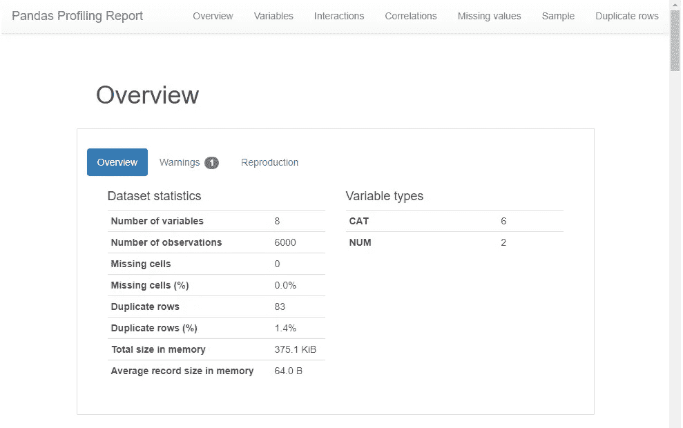
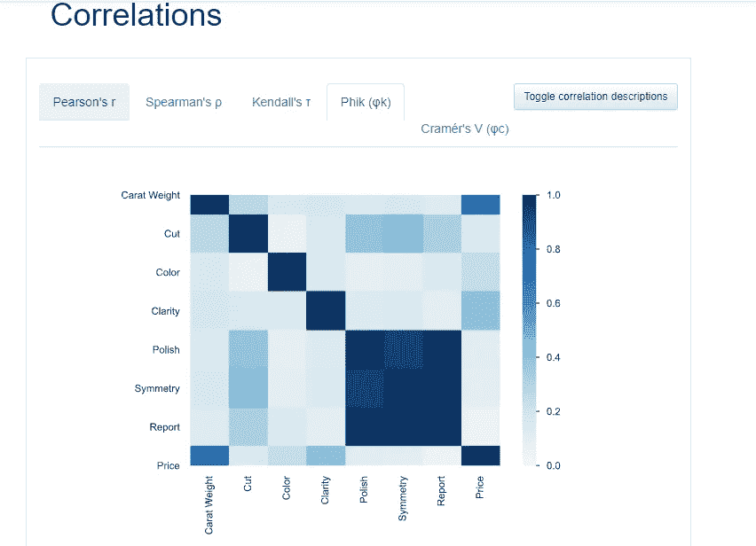
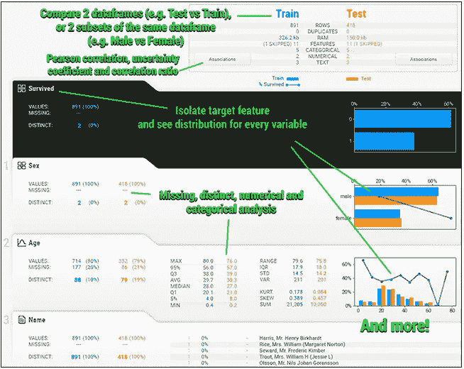

# EDA 变得简单

> 原文：<https://medium.com/analytics-vidhya/eda-made-easy-1e13a85172?source=collection_archive---------14----------------------->

在几分钟内了解对数据的见解。


照片由[亚里沙·安东](https://unsplash.com/@alisaanton?utm_source=medium&utm_medium=referral)在 [Unsplash](https://unsplash.com?utm_source=medium&utm_medium=referral) 上拍摄

**探索性数据分析**是一种分析数据集以最终确定其主要特征的方法，通常采用可视化方法来深入了解数据。

在我的学习过程中，我过去花在 EDA 和试图提高模型性能上的时间较少，后来意识到数据分析比在不清楚数据及其洞察力的情况下选择算法更重要。在学习了 Matplotlib、Seaborn 等可视化库之后，分析数据变得易如反掌，能够取得更好的效果。后来我知道了一些使 EDA 变得容易的库。

在这个故事中，我简要介绍了强大的 python 库，名为 Pandas Profiling、Sweetviz、Autoviz，通过在更短的时间内使用几行代码实现了更好的可视化和数据分析。

## **熊猫简介**



用于获取数据的快速摘要和相关性分析。这将为给定的数据框生成剖面报告。通常，我们使用 **df.describe()** 函数来实现这一点，但这不足以进行深入的探索性数据分析。通过使用 **df.profile_report()** 提供报表进行数据分析。

根据列的相关数据类型，交互式 HTML 报告中会显示以下详细信息

*   **类型推断:**检测数据框中出现的列或特征的[类型](https://github.com/pandas-profiling/pandas-profiling#types)。
*   **要素**:数据的类型、唯一值、缺失值。
*   **分位数统计**如最大值、Q3、中位数、Q1、最小值、范围、四分位间距。
*   **描述性统计**如均值、众数、标准差、总和、中位数绝对偏差、变异系数、偏度、峰度。
*   **缺失值**缺失值的矩阵、计数、热图和树状图。
*   **最频繁值和直方图。**



*   **相关性**突出显示高度相关的变量、Spearman、Pearson 和 Kendall 矩阵。
*   **文本分析**学习文本数据的类别(大写、空格)、脚本(拉丁文、西里尔文)、块(ASCII)。
*   **文件和图像分析**提取文件大小、创建日期和尺寸，并扫描被截断的图像或包含 EXIF 信息的图像。

**安装**

**使用画中画**

```
pip install pandas-profiling
```

从 GitHub 安装最新版本

```
pip install https://github.com/pandas-profiling/pandas-profiling/archive/master.zip
```

我们可以通过导入模块并将其应用于数据框来开始使用该库。

```
import pandas as pd
from pandas_profiling import ProfileReportdf = pd.read_csv("sample.csv")
profile = ProfileReport(df, title='Pandas Profiling Report', explorative=True)
```

要生成报告

```
profile = ProfileReport(df, title="Pandas Profiling Report")
```

保存报告

```
profile.to_file("EDA_report.html")
```

# SweetVIZ

这个库帮助我们创建可视化。它是一个开源 python 库，可以生成漂亮的高密度可视化效果，只需一行代码就可以启动 EDA。输出是完全独立的 HTML 应用程序的形式。它还用于比较数据集并从中得出推论。它的目标是提供对目标特征、训练与测试数据以及其他此类数据表征任务的快速分析。



## 特征

*   **目标分析** :-目标值与其他特性的关系。
*   **可视化**并比较不同的数据集(如训练与测试数据)和组内特征(如儿童与成人)。
*   **混合型关联:** Sweetviz 无缝集成了数字(皮尔逊相关)、分类(不确定系数)和分类-数字(相关比率)数据类型的关联，以提供最大限度的信息。
*   **类型推断:**自动检测数字、分类和文本特征。
*   **汇总信息:**唯一值、类型、缺失值、重复行、最常见值。
*   **数值分析:**最小值/最大值/范围、四分位数、均值、众数、标准差、总和、中位数绝对偏差、变异系数、峰度、偏度。

**使用 Pip 安装**

```
pip install sweetviz
```

**用法**

```
import sweetviz as sv

report = sv.analyze(my_dataframe)
report.show_html() # Default arguments will generate to "SWEETVIZ_REPORT.html"
```

要了解更多关于库[的信息，请查看此](https://pypi.org/project/sweetviz/)。

# Autoviz

Autoviz 是一个用于自动可视化的开源库。它可以用一行代码自动可视化任何大小的任何数据集。提供任何输入文件(CSV、文本或 JSON ), auto viz 将可视化它。

**使用 Pip 安装**

```
pip install autoviz
```

使用

```
from autoviz.AutoViz_Class import AutoViz_Class

AV = AutoViz_Class()filename = "train.csv"
sep = ","
dft = AV.AutoViz(
    filename,
    sep,
    target,
    df,
    header=0,
    verbose=0,
    lowess=False,
    chart_format="svg",
    max_rows_analyzed=150000,
    max_cols_analyzed=30,
)
```

**备注:**

*   AutoViz 将使用统计有效的样本可视化任何大小的文件。
*   `COMMA`被假定为文件中的默认分隔符。但是你可以改变它。
*   假定第一行作为文件的标题，但您可以更改它。

**论据**

*   `max_rows_analyzed` -限制用于显示图表的最大行数
*   `max_cols_analyzed` -限制可以分析的连续变量的数量
*   `verbose`
*   如果为 0，则不打印任何消息，并进入静默模式。这是默认值。
*   如果为 1，则在终端上打印消息，并在终端上显示图表。
*   如果是 2，打印消息但不显示图表，它将简单地保存它们。

**结论**

许多其他库也可以用于快速 EDA，但我给出了三个最流行的库，对您的项目、数据分析和数据科学之旅会有帮助。

感谢您的阅读！我希望这篇文章对你有用，点击拍手按钮，让我知道你最喜欢的库，如果你使用过任何类似的库，使你的旅程有趣。