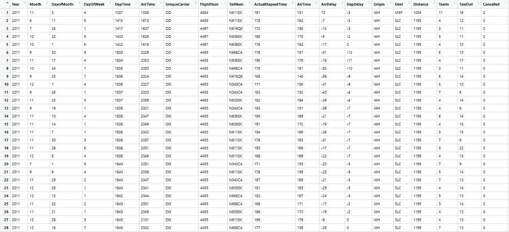

# 带 R 的高频灯 EDA

> 原文：<https://medium.com/analytics-vidhya/eda-of-hflights-with-r-a280579f3115?source=collection_archive---------15----------------------->

图片来自[这里](https://all-free-download.com/free-photos/download/lufthansa-airbus-a380_516417.html)

这次我们将讨论如何使用高频光数据建立假设。关于统计数字的可视化，请参见之前的帖子。

重点是查看数据和识别出现的问题的过程。继续质疑数据会帮助你用各种方式分析数据。

## **数据结构**

数据结构

使用 r 中内置的 hflights 包。

## **缺失值**

漏测值

有些变量大约有 3000 个缺失值。因为取消存在变数，我认为缺失值是取消的航班。

取消的航班数量是 2973。

*   将取消航班的缺失值转换为零
*   取消的有 2973 个，而“DepDelay”少了 2905 个。68 填充的是什么？
*   我的期望是:航班被取消了，但它去了目的地的下一个航班。这可能已经被记录下来了。

缺失值多于 2973 的变量

*   在这种情况下如何替换丢失的值
*   为了方便起见，我们简单地删除了该行并继续。

现在数据已经准备好了，创建一个假设。第一个问题是关于延迟时间。

**假设 1。飞机多的机场影响航班延误吗？也就是飞机多的机场延误时间长吗？**

简而言之，我认为繁忙的机场会有更长的到达延迟。

*   它可以让你在一个情节中尽可能地表达你想看到的所有信息。
*   颜色越浅(越靠左)，进来的飞机就越多。
*   用橙色突出显示超过平均延误时间的机场
*   机场延误时间的分布似乎与航班数量无关。
*   然而，延误超过 10 分钟的机场更多位于右侧，而不是左侧。

机场对比之后，我们自然对航空公司产生了好奇。

**假设二。我们认为航班较少的航空公司延误会更少，因为它们在飞行阶段相对不太忙。**

*   航班数量最少的两家航空公司都表现出较低的延误时间，但很难断定它们总体上倾向于这样做。
*   航班量大的前三四家航空公司也有类似的延误情况。
*   这些航空公司的条形颜色显示，它们占航班总数的大多数。

没有得到预期的结果，不过还好。

**假设 3。既然我们已经按航空公司做了比较，我们就按飞机做比较。这可以通过数据的“TailNum”变量来检查。**

每架飞机将有不同的飞行次数。我预计少量航班会延误很长时间。这是因为我认为航班量大的飞机会足够稳定运行。航空公司将只比较上面确定的前四名。

*   在 OO 的情况下，你可以看到航班少的飞机延误大。你也可以看到平均延迟是负的。
*   在 WN 的例子中，你可以看到更少的航班有更多的延误。
*   在 XE 中，你可以看到有几架飞机的飞行次数非常高，在这些情况下，延迟不是很大。

如果延误时间为负，即比预定时间提前开始，
如果您没有在规定时间内办理登机手续，某些规定允许飞机在起飞时间之前离开。

我只是想检查一下位于图表下方的 OO 航空公司飞机的数据。

*   目的地是 SLC，除了一个航班。
*   发车时间多为 18:30-18:45。

> *关于取消代码*
> 
> *A =承运人，*
> 
> *B =天气，*
> 
> *C =国家空气系统，*
> 
> *D =安全*

**我们来看看航空公司的取消因素**

总的来说，虽然 A 和 B 的取消原因相似，但我们可以看到 B 是 CO 的大多数。

**我们也按一周中的某一天进行检查。**

我注意到除了 WN，周四和周五有很多航班取消。

比较每日和航空公司的延误。

**假设四:按时间检查。我觉得早晚都会有很多用处。我把时间绑了两个小时，对比了一下。**

可以看到 00:00 以后航班数量迅速下降。

但此时平均延迟时间相对较大。由于此时用户数量较少，机场似乎能够避免复杂性，但高延迟的风险似乎不可避免。

hflights 数据分析到此结束。随时欢迎提问或指点。请留下评论。谢谢你。:)