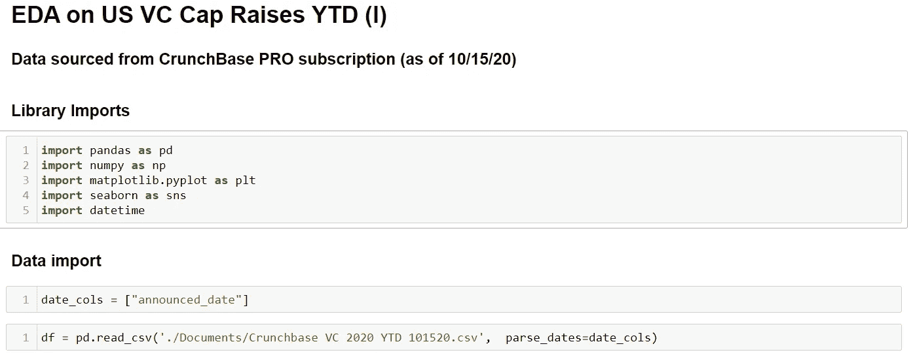
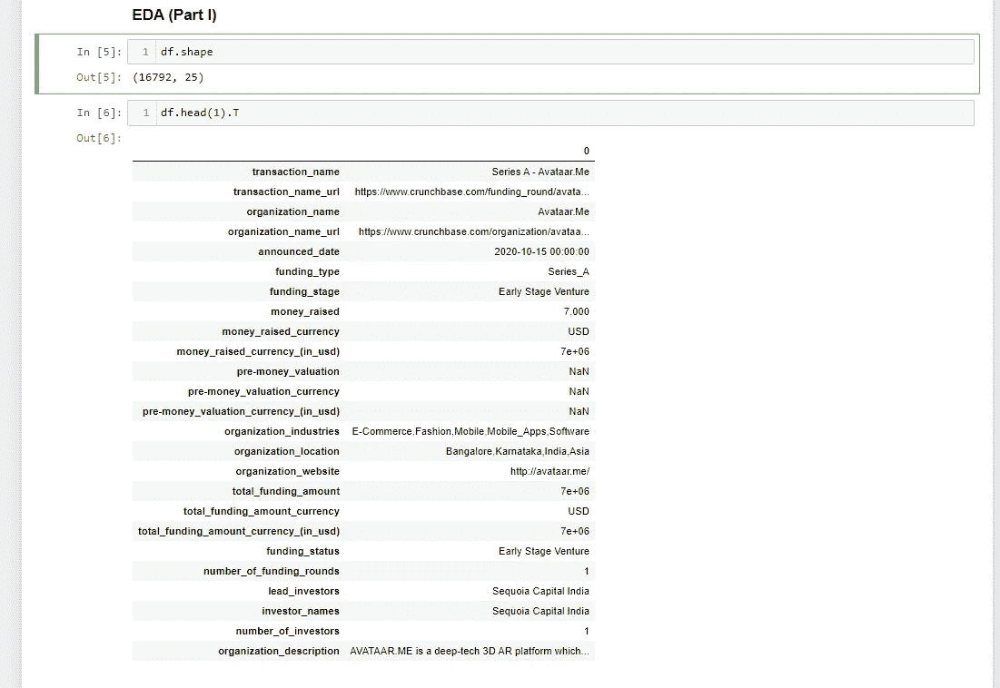
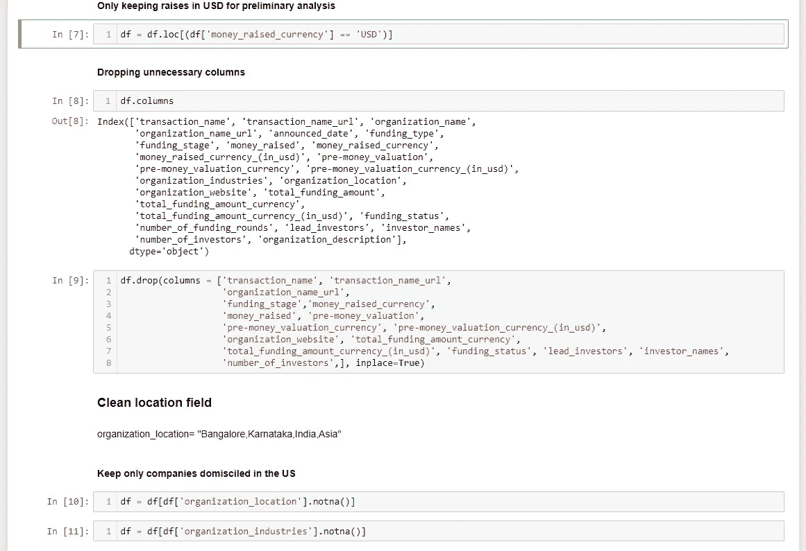
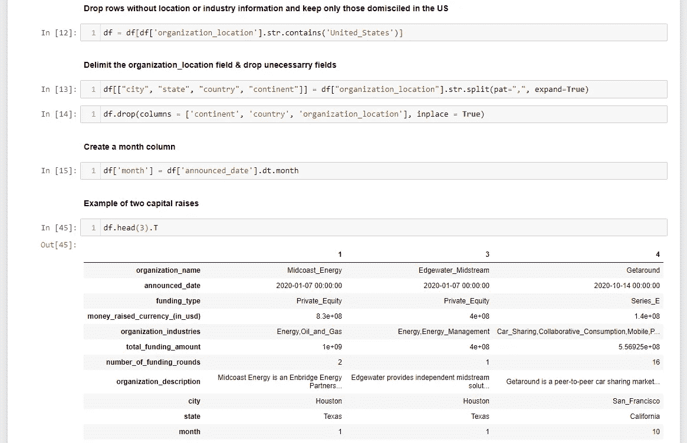
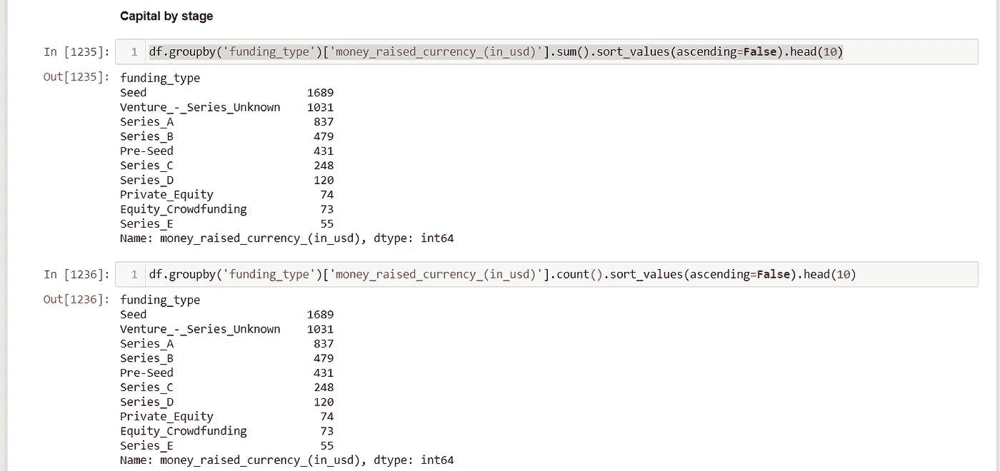
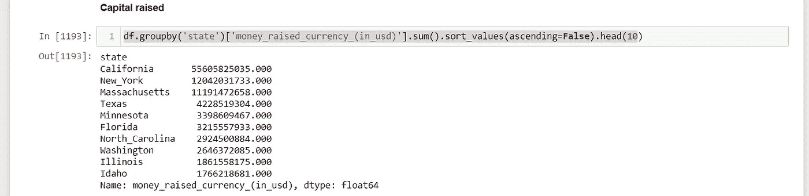
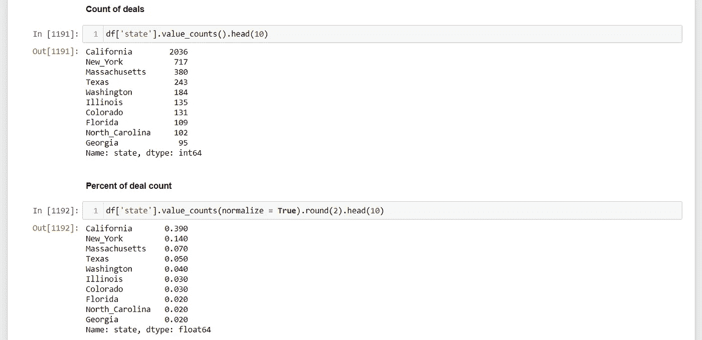
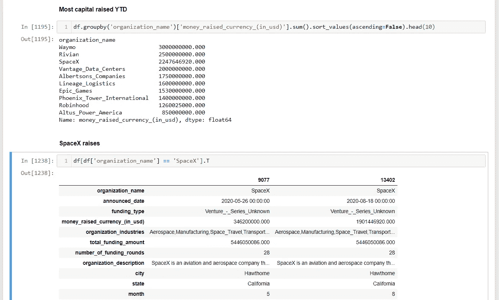

# EDA 对美国风险资本上限的提高(一)

> 原文：<https://medium.com/analytics-vidhya/eda-on-us-vc-cap-raises-ytd-i-c89210c23282?source=collection_archive---------27----------------------->

## 基于 Crunchbase 风险资本数据的 EDA(上)

这是一系列文章的第一部分，旨在通过使用 Jupyter 笔记本来说明 Python 中的 EDA 过程。

EDA 或探索性数据分析是“一种分析数据集以总结其主要特征的方法。”根据维基百科。

投资尖端科技领域的私营公司可能非常令人兴奋。然而，不管是好是坏，公众大多不参与私募市场的投资，必须等到公司公开上市后才能投资。也就是说，我们选择风险投资作为我们 EDA 系列博文的用例。

以下 YTD 数据是从 [Crunchbase](https://www.crunchbase.com/) (Pro)中检索的，是截至 2020 年 10 月 15 日的最新数据。

请注意，这里使用的数据旨在说明工作流程，而不是对风险领域资本筹集的完全准确的看法。有时，我们会忽略空值或其他没有经过彻底检查的值。但是，确实存在进一步审查这些值和深入挖掘此分析的意图，并且将在持续的基础上进行更新。

有关 Crunchbase 如何聚合数据的信息，请访问 https://news.crunchbase.com/methodology/
。

SpaceX 今年进行了两次私人融资，向太空发射了一枚火箭。图片由[https://unsplash.com/s/photos/rocket-launch](https://unsplash.com/s/photos/rocket-launch)提供

# **分析**

我们从标准库导入开始，然后导入数据集。

用 ***快速浏览。形状*** 表示数据显示的行数和列数以及 ***。head*** 列出了我们已经导入的特性。通过增加 ***。T*** 我们把列转置成行，行转置成列。

已经决定只包括以美元进行的融资，我们通过使用 ***将数据框架设置为限于美元的行项目。iloc*** 选择行，并设置列***money _ raised _ currency*= = ' USD '**

为了删除这个特定 EDA 不需要的列，我们使用 ***。删除*** 并设置 columns =我们想要删除的特性列表。

在第 8 行用 ***df.columns*** 列出我们的特性使得复制和粘贴我们想要删除的特性变得容易。

清理***organization _ location***字段将是一个挑战，因为我们注意到格式在一个字段中包括城市、州、国家和洲。

如前所述，为了这个 EDA 的目的，我们将删除空值，并将***organization _ location***和***organization _ industries***字段设置为仅包含带有 ***.notna.*** 的非空值

我们将 dataframe 设置为等于在***organization _ location***字段中仅包含“美国”的字段，然后按照我们希望拆分(分隔)列字段的顺序重命名我们的列。列数必须与使用 ***.str.split*** 并选择 ***"、"*** *作为分隔符后得到的字段数相匹配。*

我们使用***announce _ date***字段上的 ***.dt.month*** 设计了一个 ***【月】*** 列，以便我们可以按月检查总数。

使用 ***。我们从数据帧中检查三个例子。***

## 因此，现在我们有了一个美国注册公司的数据集，可以获得融资总额和行业。我们将试图回答以下几个问题:

*   大多数风投交易是在哪个州完成的
*   州注册地筹集了多少资金
*   分阶段筹集的资本明细
*   一些公司亮点

我们用 ***。分组依据*** 和 ***。sum*** 方法来合计 ***funding_type 筹集的资金的价值。*** 利用 ***。计算*** ，我们显示加注完成的次数。**同*。sort _ values(ascending = False)***我们按照最大值到最小值对信息进行排序。我们注意到许多资本筹集的系列是未知的。这是处理风险资本和上市公司数据时面临的挑战之一。

众所周知，科技投资是热门的，有 550 亿美元的资金，所以大多数风险投资都位于加州也就不足为奇了，加州是硅谷的所在地，也是许多最新尖端科技公司的诞生地。

一些私人资本融资亮点包括 SpaceX 的两次融资和迄今为止 Robinhood 的 13 亿美元融资。看到 [SpaceX](https://www.spacex.com/) 在[昨天成功发射](https://www.cbsnews.com/news/spacex-nasa-launch-international-space-station-2020-11-15/)后筹集到更多资金，不要惊讶。

这是迄今为止(10 . 15 . 20)EDA 关于风险资本筹集的第一部分的结尾。

请继续关注第二部分，在这一部分中，我们将使用全球数据来深入研究特定行业，并探索诸如合并数据框架、格式化货币值和创建各种可视化等主题。