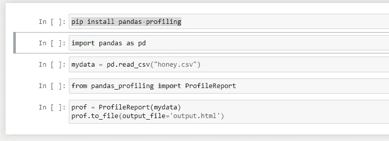
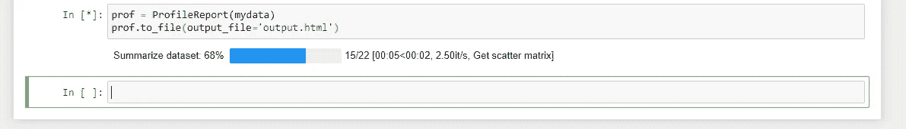
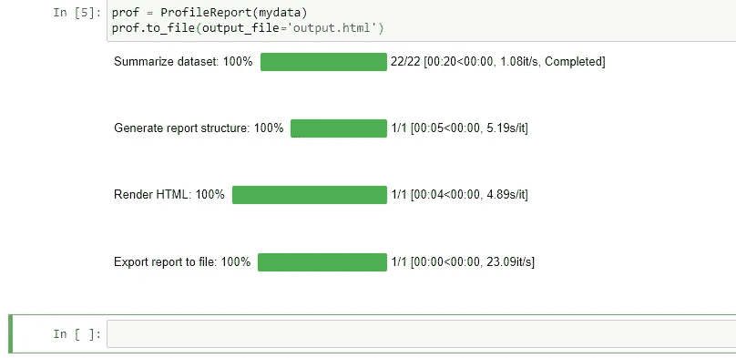
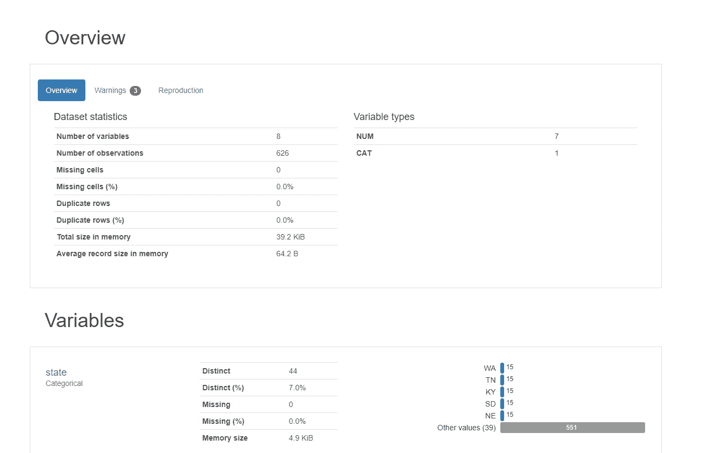
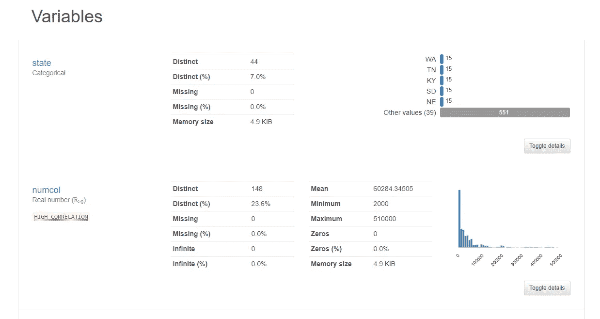
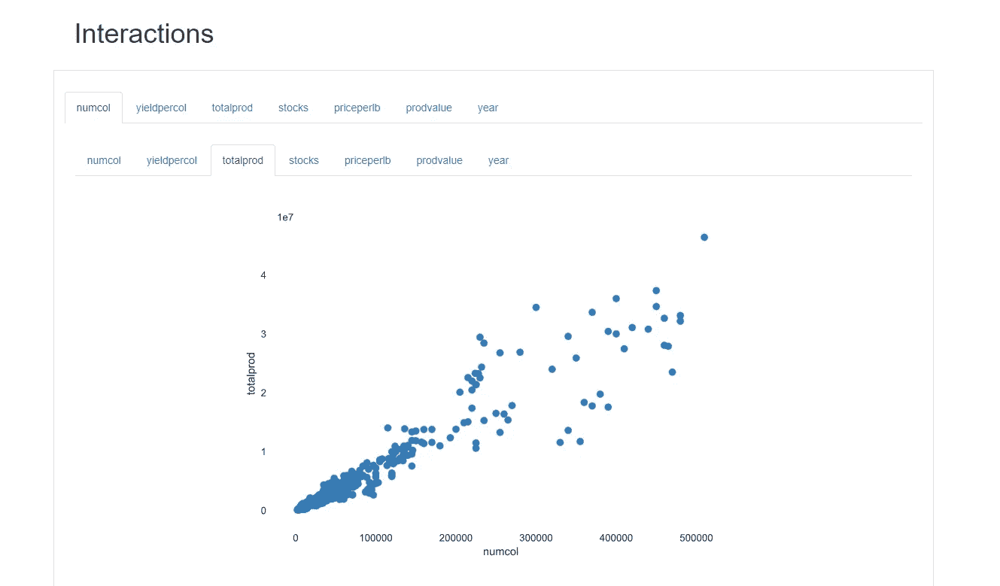
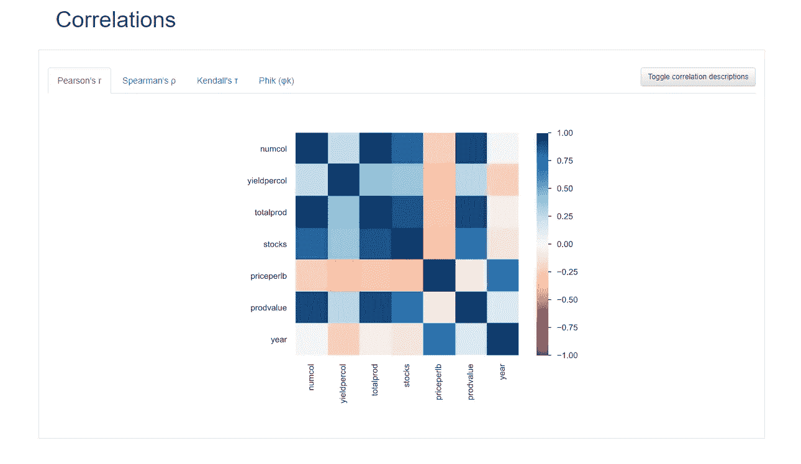
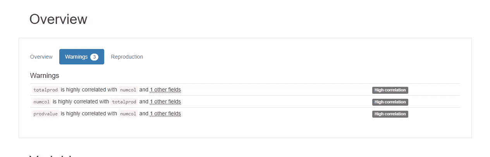
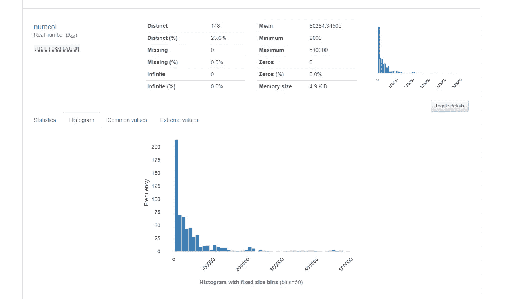

# EDA 使用 python，只需一个命令

> 原文：<https://medium.com/analytics-vidhya/eda-using-python-just-one-command-d03cf1849f64?source=collection_archive---------24----------------------->

探索性数据分析是任何数据科学项目的重要步骤。今天我将解释一下 python 中的一个命令可以给你一个完整的 EDA 报告，蜂蜜生产数据集用作样本。

让我们从 Kaggle 下载蜂蜜生产的数据来探究这些数据

代码:

理解代码

我们将安装名为“pandas-profiling”的库，并从 ProfileReport 导入“pandas_profiling”。还需要导入熊猫来读取我们的数据，“import pandas as pd”和“pd.read_csv()”属于熊猫库。

运行代码后，可能需要一些时间来安装这个库也生成报告，它将生成一个大报告，我们将逐页理解

当过程完成时。

这将在您的项目文件夹中创建名为 output.html 的 html 文件。打开该文件。

**概述**:这一部分将提供我们数据的汇总，有多少变量，观察总数，是否有缺失信息？，数据是否重复，变量的类型是什么，多少是数字的，多少是分类的。

在摘要旁边，该报告提供了每个变量的详细信息
#有多少唯一值
#变量类型
#最大值和最小值
#平均值
#数据分布图

**交互**:用这个图找出每个变量之间的相关性，它有一个经典的功能，用 tab 组合可以查看所有变量之间的相关性。

该报告还提供了各种 corr 图。

在警告选项卡下很容易找到高度相关的变量

用数据、直方图和其他细节检查每个变量的细节

这是 EDA 的最佳工具之一。