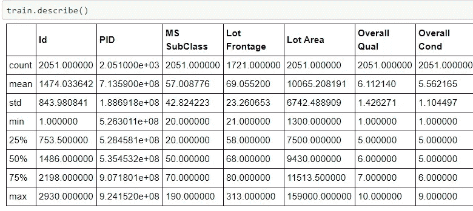
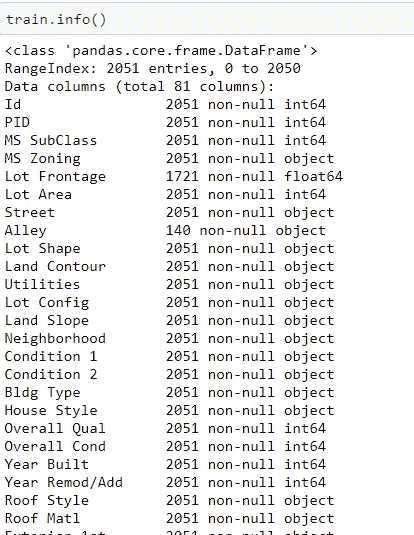
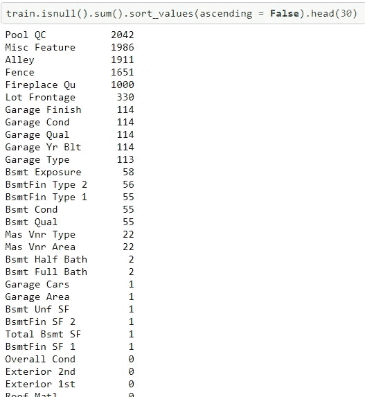
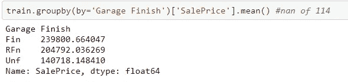
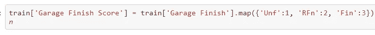
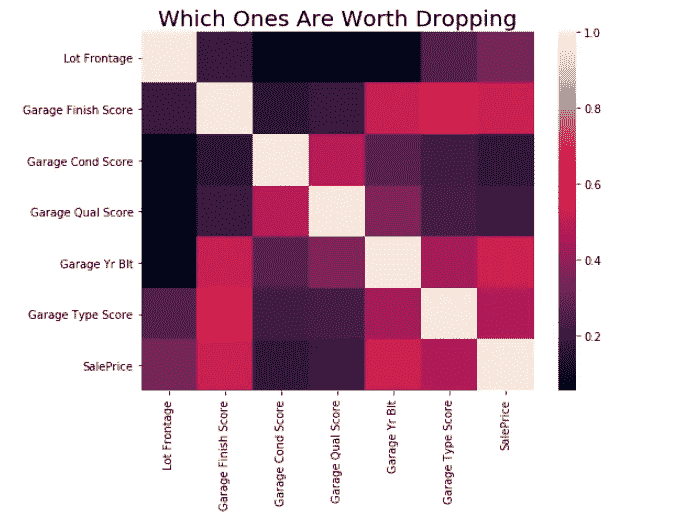
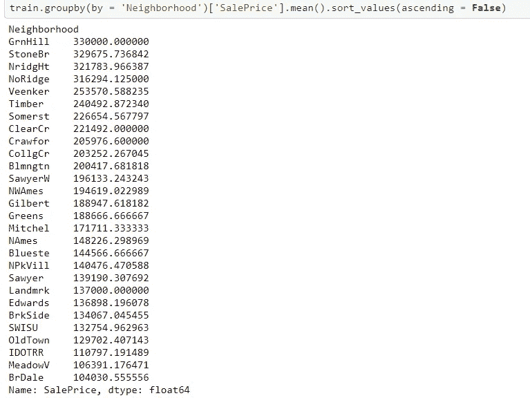

# EDA —数据科学家的肌肉记忆中有什么

> 原文：<https://medium.com/analytics-vidhya/eda-whats-in-a-data-scientist-s-muscle-memory-cadd5b537c9f?source=collection_archive---------14----------------------->

只要你曾经接触过数据，你就知道你需要清理它。因为有些数据可能输入错误，有些数据不完整，有些数据可能重叠；即使您有一个以前清理过的数据集，它也可能不符合您的需要。数据清理是至关重要的，因为你不仅需要清理它，还需要知道它会把你引向什么方向。

这次我们处理的是经典的 Ames hosing 数据。这个数据集通常用于数据建模实践，而根据我的实践，清理部分起着重要的作用。我会用埃姆斯住宅作为数据清理的总结。

我们以火车组为例。第一件要做的事是永远有一个偷偷摸摸的高峰。

№1 描述()

`data.describe`给我们简单介绍一下。您可以检查最小、最大计数，以查看是否有明显的异常值或缺失数据。意思是，std 和 50%中位数给你一个粗略的概念，你在处理什么。你可能不知道具体要做什么，但是通过看这个框架，你知道你可能有一个相当的工作要做，或者是一个相对简单的工作。

№2 信息()

`data.info`开始给你实用信息。从上面你可以看到，并不是所有的数据都是数字，即使是你想要的数字。在大多数情况下，数字是我们最好的朋友。他们不在的时候我能怎么办？在这个想法开始困扰我之前，我能放下这个专栏吗？

№3 检查空列

总共有 2015 行。前 5 列缺失约一半或以上。这些对构建模型没有帮助，所以我们要担心的行数少了 5 行。

让我们看看 objects 列到底在谈论什么，这样我们就可以决定是否仍然保留它们。要清理这个数据集，我认为最重要的方法是**映射**。

例如，车库整理具有 114 个 NaN 值。我们将它们与销售价格组合在一起，看它们如何影响价格:

分组依据

对分类数据进行评分

看起来这些类别在价格方面确实有意义，这也是我们所关心的。我在 to-drop 列表上绘制了所有的分类列，但是我们在将它们变成数字之后还要删除它们吗？

待删除列的热图

根据上面的地图，似乎车库状况和车库质量与销售价格没有太大关系，我们觉得把它们去掉比较安全。其余的缺失数据大约占所有数据的 5%,我们可以有把握地假设它们不会对模型产生很大的影响，因此我们删除了那些行。

对于其余的数据，没有 NaN，我们可以安全地对它们建模，对于分类数据，我们将使用黄金法则来举例(位置，位置，位置！)

相应地映射它们，但不要将它们缩放到 1 到 28。使用与 SalesPrice 相关的近似标度，并将此方法应用于其他分类列。

这不是普通的解决问题的方法，而是试一试！你以后会感谢我的。