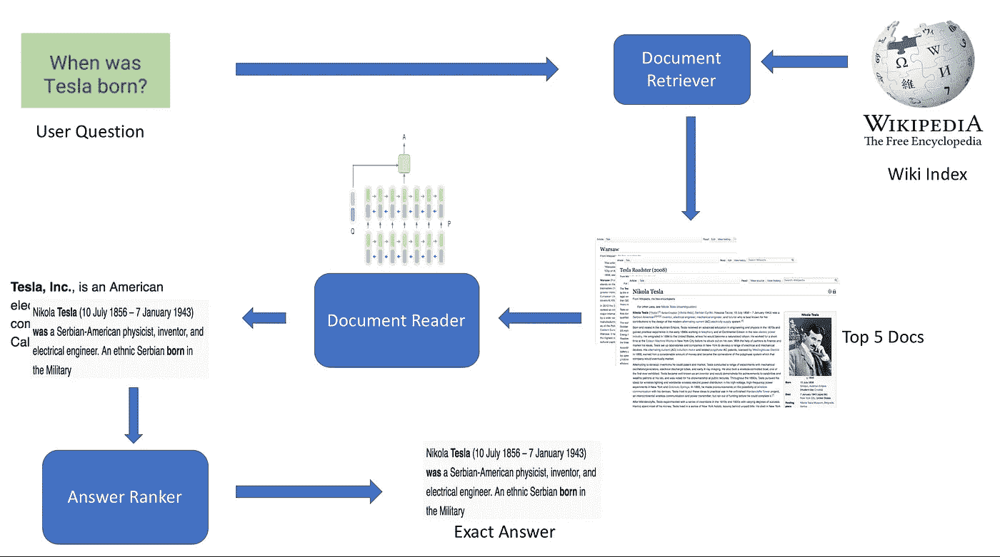
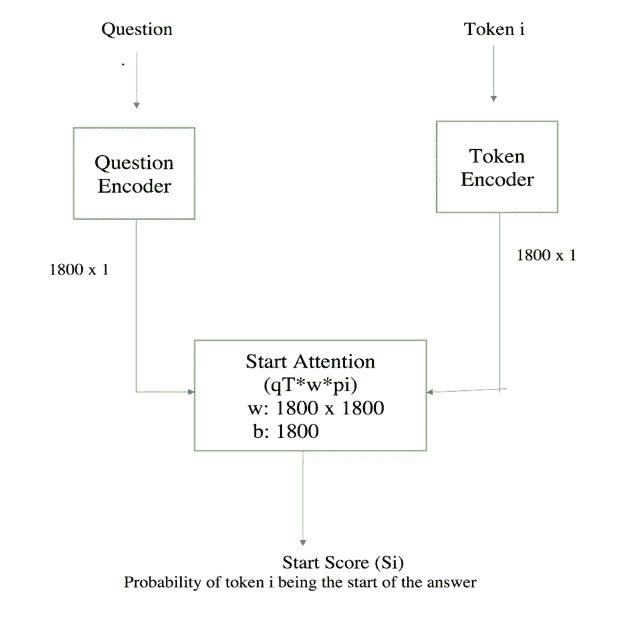
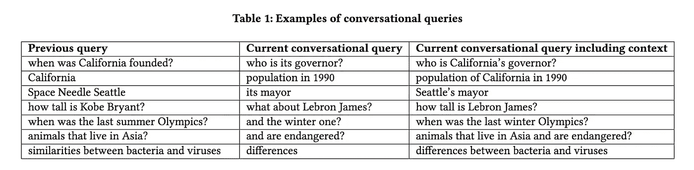
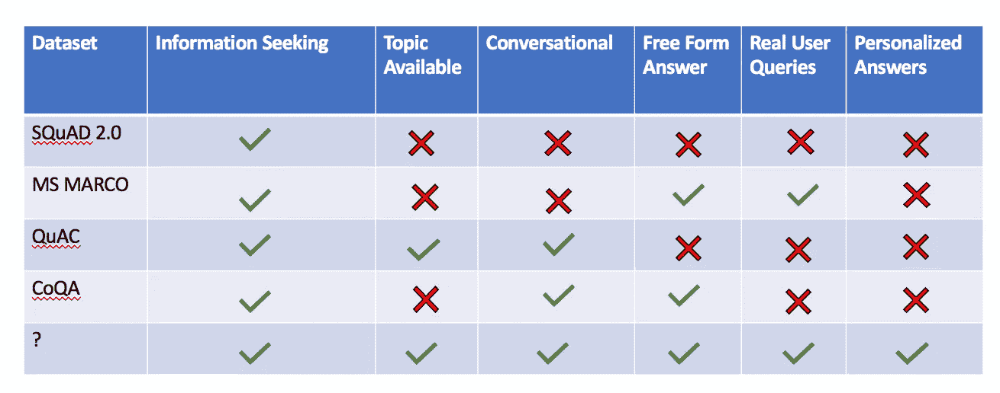
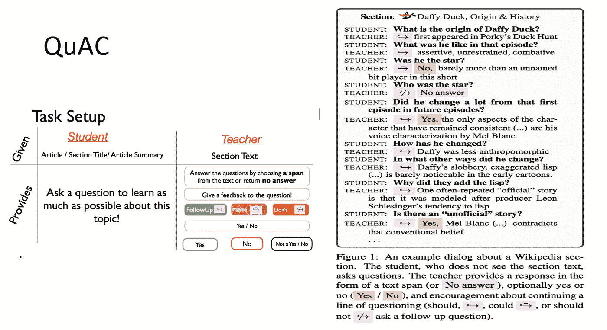
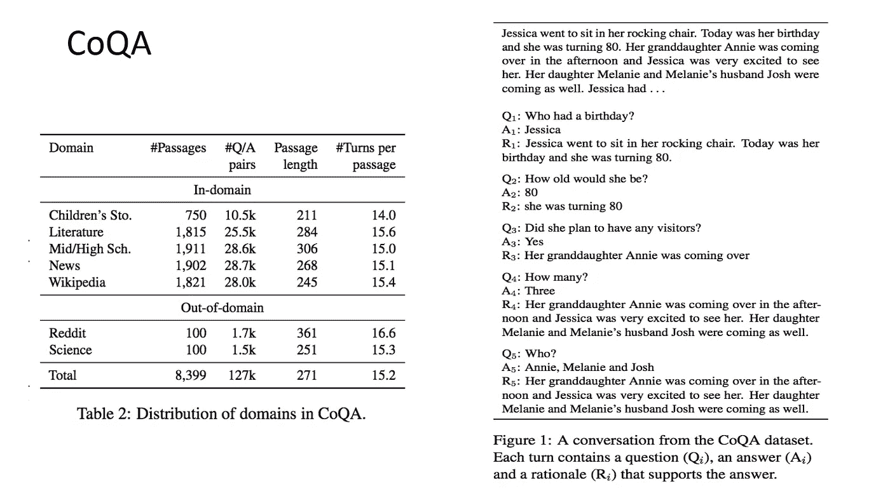
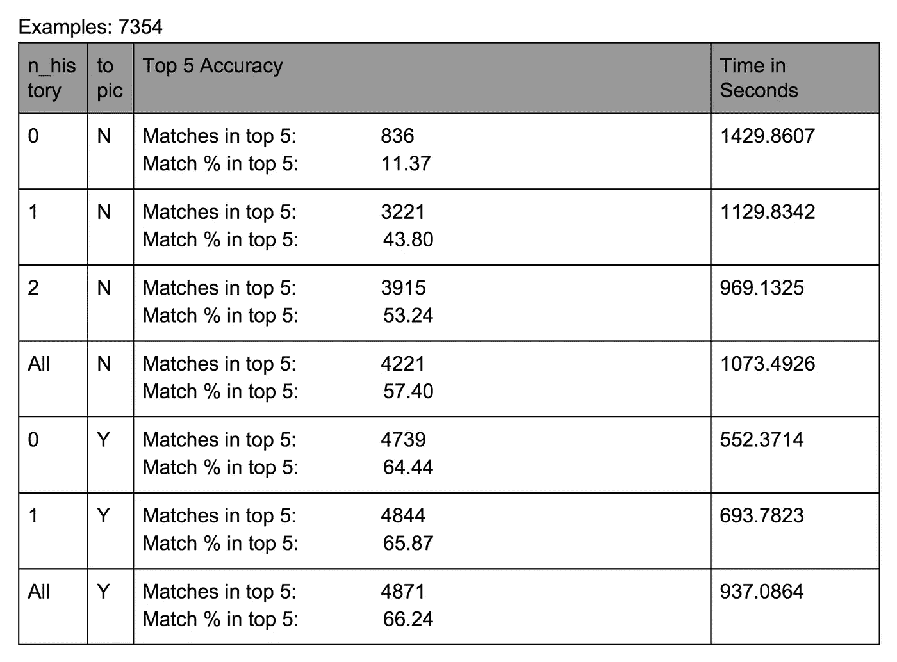
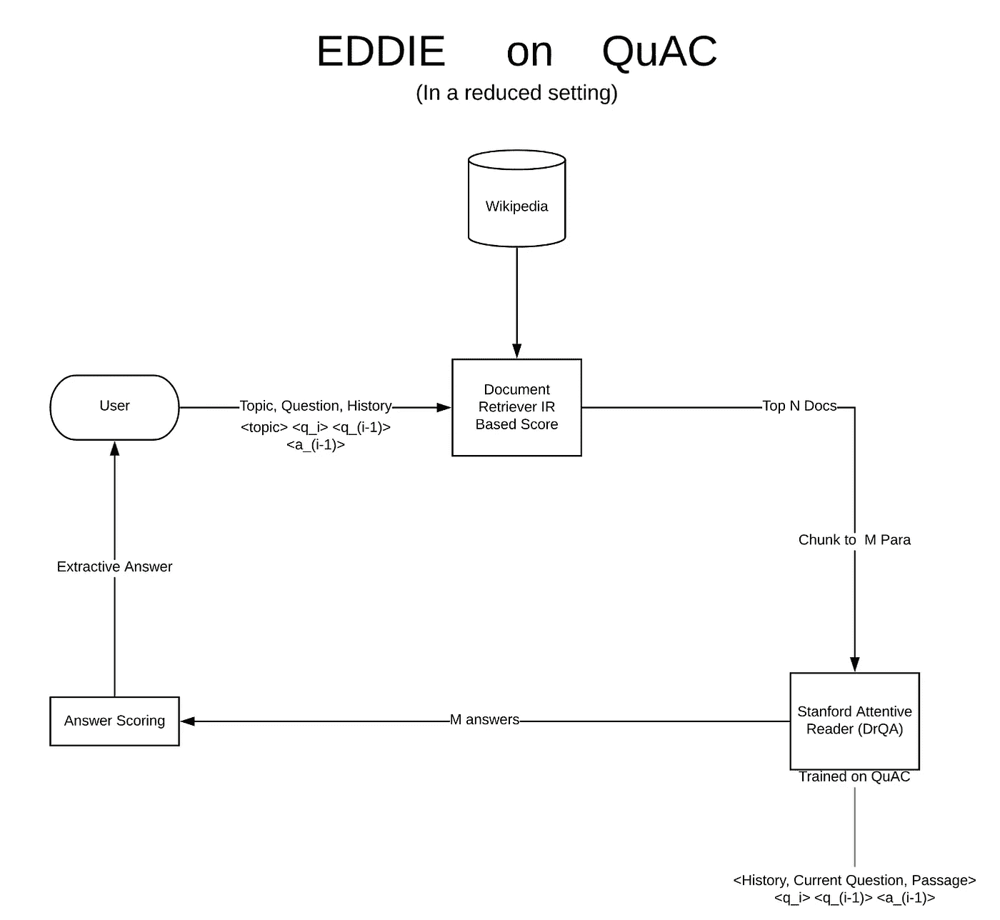

# 埃迪:知识支持的问题回答代理——第一部分

> 原文：<https://medium.com/analytics-vidhya/eddie-a-knowledge-backed-question-answering-agent-part-1-b93f68dab5c1?source=collection_archive---------7----------------------->

最近，我从石溪大学获得了计算机科学硕士学位。我在 [COMPAS](https://compas.cs.stonybrook.edu/) 实验室工作，由[教授 Mike Ferdman](https://compas.cs.stonybrook.edu/~mferdman/) 指导。我花了两个美丽的学期研究开发“埃迪:知识支持的问答代理”。这篇文章揭示了我在那段旅程中的一些学习。

这篇文章是一系列文章的第一部分([第二部分](/@miteshkumarsingh/eddie-understanding-user-queries-providing-natural-responses-part-3-f2542ec3785d))。它面向所有对自然语言处理感兴趣的人，尤其是了解开放领域问答系统内部的人。这样的系统往往会形成像 Siri、Cortana、Alexa 等个人助理的核心组件。

# 目标是什么？

> 开发一个智能问答代理，它可以通过适合每个用户的交互式和知识支持的对话来解决用户的复杂信息需求。我们称这个系统为“埃迪”。

我们设想对话代理更像人类，主要针对以下目标。

## 主要目标

1.  **提供准确的答案**
    我们希望代理扫描整个 web，并为用户的查询提供准确的答案，而不是转储一组搜索结果。
2.  **回答上下文相关/相互关联的问题**
    这样的代理应该能够理解对话上下文，并与用户进行一系列相互关联的问答对话。比如用户问—
    一、*加州的人口是多少？*
    *二世。那里的天气怎么样？* 代理应该足够聪明，能够理解前面问题中的‘there’指的是‘California’这个词。

Eddie 演示:基于主题的开放领域对话式问答

## 次要目标

1.  **理解多样的用户查询** 自然语言是模棱两可的。用户查询通常很短并且缺乏上下文。此外，可以用多种方式询问同一个查询。Eddie 应该能够重新制定用户查询，或者在有疑问时询问更多的上下文。
2.  **用有意义的句子作答**
    代理应该用有意义的句子作答，而不是用单个单词或阅读互联网文档中的短语。
3.  **提供个性化响应** 这样的对话界面产生的响应应该是个性化的。在回复之前，它应该考虑用户的个性特征，如年龄、性别、兴趣和过去的查询。于是，一个代理人对问题“*什么是癌症？*“对于一个对星座感兴趣的 5 岁孩子来说，应该和给医生的回复不一样。

值得注意的是，每个目标都是由研究人员/公司在某种程度上独立实现的。然而，还没有一个成功的系统具有 Eddie 的所有主要特征。每个子问题都是一个独立的研究课题，我们将在随后的文章中简要介绍它们。

# Eddie 和现有的聊天机器人有什么不同？

## 现有聊天机器人

现有的基于语音的聊天机器人大致分为两类

像 Alexa、Siri 或 Cortana 这样的个人数字助理主要是面向任务的机器人。它们是封闭域机器人，即它们响应执行特定的任务。例如，他们可以轻松地预约餐馆，播放视频或预订优步。他们可以通过给你讲一个笑话或有意识地回答几个问题来进行有限的社交聊天。他们还可以通过从互联网上识别相关文档并通读它们来回答一些寻求信息的问题。在内部，这些助理将社交聊天和信息搜索建模为成千上万个其他任务中的两个独立任务。当提出问题时，助手首先将话语分类到任务类别之一。这被划分为 [**意图分类和槽填充**](http://nlpprogress.com/english/intent_detection_slot_filling.html) 问题，并且通常使用神经网络来解决。一旦任务被识别，与该任务相关联的相关 API 执行该工作。

**社交聊天机器人** 这种机器人是开放域机器人，即它们可以讨论任何话题。它们或者是基于检索的，或者是生成的。给定用户的一句话和一段对话，基于检索的机器人要么从知识库或知识图中检索下一个响应。生殖机器人使用深度神经网络(在现有的社交聊天中训练)来生成用户查询的答案。聊天机器人的常见例子有— [XiaoIce](https://www.msxiaobing.com/) 、 [Meena](https://arxiv.org/pdf/2001.09977.pdf) 、 [Cleverbot](https://www.cleverbot.com/)

## **艾迪**

埃迪的目标是改进面向任务的机器人的单一任务——在开放领域寻找信息的任务。旨在回答用户的开放领域、多回合、情境化问题。

现有的语音助手经常最终对许多问题提供固定的回答，即它们的准确性非常低。即使他们找到了答案，他们的反应也是基于跨度的。因为他们只是阅读维基百科的文档，所以他们的回答不是会话式的。我们希望埃迪用有意义的人类句子来回应。此外，现有的助手不能对对话中的上下文问题做出反应。我们希望 Eddie 至少保留到最后一个问题答案对的上下文。

我们在一个非常受约束的环境中建造埃迪。例如，现有的助手/搜索引擎具有丰富的上下文，如—

1.与这个问题相关的最常见的问题有哪些？
2。当给定一组链接时，用户点击了哪个链接？
3。什么是用户个性，种族，位置？

他们使用这些问题的答案，同时找出用户问题的答案。由于这些助手的数据集不公开，Eddie 没有所有这些信息。此外，助理使用基于**知识图的问答和基于神经 RC 模型的问答**来回答问题。我们的研究只集中在基于神经 RC 模型的问答系统上。

# 目标 1 —提供一个准确的答案

我们目标的最重要方面是让 Eddie 能够回答寻找信息的问题。这可以通过建立一个开放领域问答系统来实现。我们使用一个流行的 QA 系统 [DrQA](https://github.com/facebookresearch/DrQA) 的设计作为基础。**我们首先建立一个管道，仅处理与上下文无关的问题。我们的系统主要由 3 部分组成。**

基于 [DrQA](https://github.com/facebookresearch/DrQA) 的非对话式开放领域问答系统的总体架构

注意，为了清楚起见，我们将答案排名器显示为一个单独的模块。答案排序器的逻辑位于文档阅读器本身内部。

## **文件检索器**

我们使用 DrQA 的维基百科索引作为我们的知识库。

> 给定一个问题 Q 和一组文档{d1，d2，…dn}，找出可能包含问题 Q 答案的前 K 个文档。

我们使用 TFIDF 模型为每个文档生成一个分数。分数表示用户问题和文档之间的相似性。根据分数，我们检索一组可能包含答案的前 5 个文档。

## **文件阅读器**

在检索文档时，我们将每个文档分成段落，比如总共 X 个段落。对于每一段，我们现在已经将我们的问题简化为 NLP 中的标准阅读理解问题。

> 给定一个段落 P 和一个问题 Q，找出段落中最有可能成为答案的跨度。

段落中的跨度由段落中的两个标记确定，开始标记和结束标记。我们使用 [SQuAD](https://rajpurkar.github.io/SQuAD-explorer/) v1.1(基于跨度的阅读理解)数据集来训练神经模型，以找到开始和结束标记。

具体来说，我们使用手套嵌入对问题 Q 和段落 P 标记进行编码。我们通过一个 **3 层堆叠的 biLSTM 模型传递问题和段落表示，并使用问题和段落之间的注意力** *(* **斯坦福注意力读者模型)** 来确定每个标记成为开始/结束标记的概率。

在推理过程中，该模型将具有最高起始和结束标记联合概率的段落跨度作为答案跨度。

要详细查看我们的神经模型的架构，请阅读此处的。并不是说 COMPAS 实验室的同学致力于建造 LSTM 加速器。他们使用我的斯坦福专心读者(SAR)代码来测试他们的加速器。为了帮助他们开发，我对 SAR 模型进行了详细的参数分析，其细节也可以在上面的链接中找到。

## **答案排名**

在 X 个段落上运行神经阅读器后，我们获得了一组 X 个答案。现有的 DrQA 模型为每个答案提供分数。

答案得分= max (Pr(开始令牌)x Pr(结束令牌))
DrQA 使用得分最高的区间作为最佳区间。

*然而，我们发现这些答案分数是跨段落不可比的。*在开放领域设定中，大部分段落不包含答案。现有的 DrQA 模型是在不包含无法回答的问题的 SQuAD v1.1 上训练的。因此，该模型没有被训练来为不包含答案的段落产生低置信度分数。为了解决这个问题，我们使用了 [Clark 等人](https://arxiv.org/abs/1710.10723)在开发[文档 QA](https://github.com/allenai/document-qa) 时采用的方法。**我们修改了现有的 DrQA，在培训目标中使用共享标准化。这在所有段落中产生了精确的分数。**

对于我们的非上下文管道，我们使用 SQuAD 2.0 来训练和评估模型，因为它也包含无法回答的段落。

# 目标 2 —回答上下文相关的问题

我们的下一个目标是让 Eddie 能够与用户进行有吸引力的对话。它应该理解对话的上下文，并能够回答一系列相互关联的问题。例如，考虑下表第二列中的查询。

学分— [使用序列对序列建模的对话查询理解](https://www.microsoft.com/en-us/research/uploads/prod/2018/03/www_published_rpsr1234-renA.pdf)

为了正确回答这样的问题，Eddie 必须保持过去对话的上下文，并通过它们进行推理。因此，我们建议在管道的检索器和读取器组件中都包含上下文。

# 步骤 1 —定义上下文

在基于阅读理解的会话式问答中，给出一个固定的段落。问题的答案要么存在于给定的段落中，要么问题无法回答。基于 RC 的会话式问答数据集的流行示例是 QuAC 和 CoQA。

> 给定一个段落 P 和一个对话历史(Q1、A1、Q2、A2……)，一个 **RC 对话 QA** 的目标是使用**整个对话历史作为上下文**来回答第 n 个问题 Qn。然而，在**开放领域对话式问答**中，用户可以在主题之间切换。每个问题可以来自完全不同的领域(比如从政治到体育)，从而使整个对话历史变得无关紧要。

如果 Eddie 有一个“**会话标识符/主题检测器**”模块，就可以解决上述问题。该模块可以检测话题变化。然后，它可以计算与当前问题的主题相关的先前问答配对的回合数。然而，由于时间限制，我们在研究中跳过了会话标识符模块。我们缩小我们的研究范围，建立一个基于主题的开放领域问答系统，也就是说，我们强迫用户总是通过预先声明主题来声明一个新的对话正在开始。

**我们的方法——基于主题的开放领域 QA**

在开始对话之前，Eddie 和用户就讨论的主题达成一致。每当用户希望讨论新的话题时，它可以与 Eddie 开始新的会话。因此，当前会话中的所有问题/答案都充当 Eddie 的上下文。用户只能问与约定主题相关的问题。如果用户向 Eddie 提出不同主题的问题，Eddie 可能会返回垃圾答案，因为当前问题和上下文不再匹配。

# 步骤 2 —选择对话数据集

为了训练和测试我们的管道，我们需要一个数据集来满足我们的主要目标和次要目标。我们调查了大量数据集，寻找以下特征—

## **主要特征**

1.  **信息搜寻—** 阅读理解数据集默认为信息搜寻。
2.  **主题可用性—** 为了在推理过程中评估 Eddie，我们需要将主题作为上下文传递给检索者和读者。因此，数据集必须有可用的每个对话的主题。
3.  **对话式—** 数据集应该有一系列相互关联的问题。
4.  **段落无关查询—** 在大多数数据集中，问题都是基于给定的段落。然而，在现实世界中，提问者并没有一个段落。因此，数据集应该有真实的用户向搜索引擎和 QA 机器提出的问题，独立于任何段落。这种查询通常是不明确的和开放式的。我们还希望避免数据集在看到文章后有注释者创建的问题。

## **次要特征**

1.  **自由形式答案—** 数据集应该有自然语言的答案。它不应基于跨度。比如
    **段**:公羊去市场了。他买了牛奶。
    **问题**:拉姆买牛奶了吗？
    Span 答案:他买了牛奶。
    **自然回答**:是
    用‘是’回答比用 span 回答更像人类。
2.  **个性化的答案—** 如果答案也基于个性背景，那就更好了。

## **数据集调查结果**

2.0 小队和马尔科女士不搭话。MARCO 女士有一个优势，那就是它包含了真实的 Bing 用户查询，并且其中的答案是自由形式的。然而，他们提出了一个额外的挑战，即跨越多个段落的答案(多跳推理)，这超出了我们的研究范围。CoQA 和 QuAC 是对话式的，但它们不是基于真实的用户查询。没有一个数据集包含用户回答时的个性。我们意识到没有这样的数据集能满足我们所有的需求。因此，我们缩小了研究范围，专注于解决埃迪的主要目标。

Eddie 数据集调查

在简化设置中，QuAC 是唯一满足 4 个主要要求中的 3 个的数据集。它不满足“段落独立查询”标准。为了解决这个问题，我们使用 QuAC 数据集的训练集来训练我们的文档阅读器。但是我们通过删除所有段落来修改 QuAC 验证集。在推理过程中，我们在维基百科索引中索引了所有的 QuAC 验证段落，并只向 Eddie(检索者+读者)提出没有段落的问题。我们把这个修改后的数据集称为**开域 QuAC** ，类似于[开域小队](https://github.com/facebookresearch/DrQA)。

QuAC 数据集

## **使用 CoQA 的简短实验**

我们通过构建一个管道并始终将过去的两个查询视为上下文，对 CoQA 数据集进行了简单的实验。我们观察到，在推断过程中，CoQA 性能非常低，主要原因如下

1.  CoQA 中的问题往往太短(什么？，哪里？什么时候？)以便检索器返回有意义的结果。QuAC 中的平均问题长度为 6.5 个标记，而 CoQA 中的平均问题长度仅为 5.5 个标记。
2.  CoQA 中的问题不是仿真的，当独立地向寻回者提出时，通常没有任何意义。这可能是因为 CoQA 中的提问者可以看到该段落，然后提问。另一方面，QuAC 包含维基百科段落。因此，它的问题更加真实，非常类似于用户在与语音助手/网络交互时寻求信息的本性。

CoQA

3.其准确性低的另一个原因隐藏在我们创造环境的方式中。在实验中，我们使用前两个问题作为背景，一个接一个地问所有的问题。例如，考虑只有两个段落的数据集 P1(两个问题 Q1 和 Q2)和 P2(两个问题 Q3 和 Q4)。如果我们删除这些段落，并向 Eddie 提出问题(Q1、Q2、第 3 季度、第 4 季度)，我们将最终使用 Q1 和 Q2 作为第 3 季度的背景。因此，我们最终向埃迪·里查德和里德提供了错误的背景，因为 Q1 和 Q2 完全基于不同的段落，也许是不同的主题。

# 步骤 3——融入背景

我们使用与上面提到的相同的非上下文管道，只是改变提供给检索器和阅读器的输入。

## 向检索器添加上下文

我们的文档检索器不是基于机器学习的组件。因此它不需要被训练。我们在维基百科索引中索引了 QuAC 训练和验证数据集中的所有段落。构建维基百科索引需要一个 120GB 内存的系统。我们通过将主题和 QA 对作为上下文传递给检索器，在检索器上执行了几个实验。

Eddie 文档检索器在 QuAC 验证数据集上的评估结果

**我们观察到，通过这个话题，检索者的准确率从 11.37%大幅提高到 64.44%。**类似地，将所有之前的问答对与主题一起作为上下文传递，将检索器的准确率从 11.37%提高到 66.24%。我们还测量检索器返回验证集所有问题的结果所花费的时间。当我们只是把主题作为上下文传递时，花费的时间最少。

## 向读者添加上下文

> *给定一个问题 Q，段落 P，题目 T，以及一段对话历史{Q1，A1，Q2，A2，… }，我们的目标是找到答案 A.*

为了实现这个目标，我们通过传递一个上下文相关的问题来修改 QuAC 上 Stanford attention Reader(SAR)模型的输入。上下文问题是原始问题和上下文(主题和之前的问答对)的串联。它有以下结构—
<话题><Q1><A1><Q2><A2>……<Q>

我们在 K40 GPU 上用新的输入重新训练 SAR 模型 26 小时。【DrQA 适配 QuAC 的细节可以看[这里](https://github.com/miteshksingh/Eddie/blob/master/Adapting_DrQA_on%20QuAC.pdf)。

**在 QuAC 验证数据集**
上的评测结果精确匹配准确率— 29.61
F1 准确率— 45.87

## 重述—埃迪·皮莱恩

埃迪管道公司

## 管道评估

在评估期间，我们使用 QuAC 的修改验证集。我们将不带原始段落的上下文问题作为查询传递给检索器。检索器从索引中检索可能包含也可能不包含正确段落的文档列表。读者从检索到的段落中获得多个答案跨度。排序器然后提供具有最高分数的区间。我们通过比较 Eddie 的答案跨度和黄金跨度来计算精确的匹配评估度量。

在开放域对话设置中，Eddie 具有 3.03%的精确匹配准确度。 [DrQA](https://github.com/facebookresearch/DrQA) 在开域班整体精确匹配准确率 30%。然而，DrQA 不能处理相互关联的问题，即它不是对话式的。虽然我们的管道精度较低，但我们相信它可以作为构建开放域对话系统的基线。

# 简而言之…

据我们所知，Eddie 是第一个尝试在开放对话环境中回答问题的人。我们建立了一个端到端的管道，可以为一系列相互关联的用户问题提供准确的答案。我们还提出了一个修改的数据集——开放域 QuAC，并对我们的管道进行了评估。我们在本系列的第 2 部分的[中分析了我们的流水线精度低的原因。](/@miteshkumarsingh/eddie-understanding-user-queries-providing-natural-responses-part-3-f2542ec3785d)