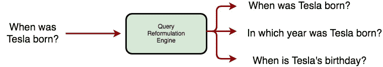
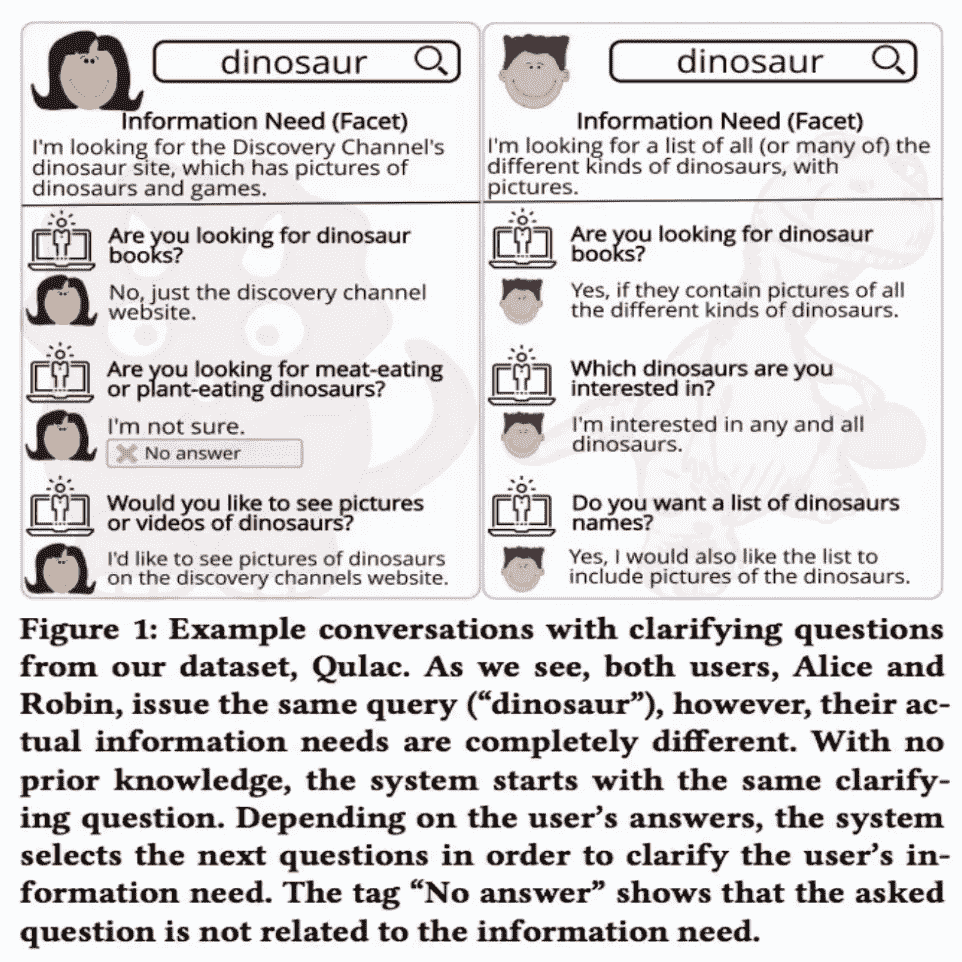
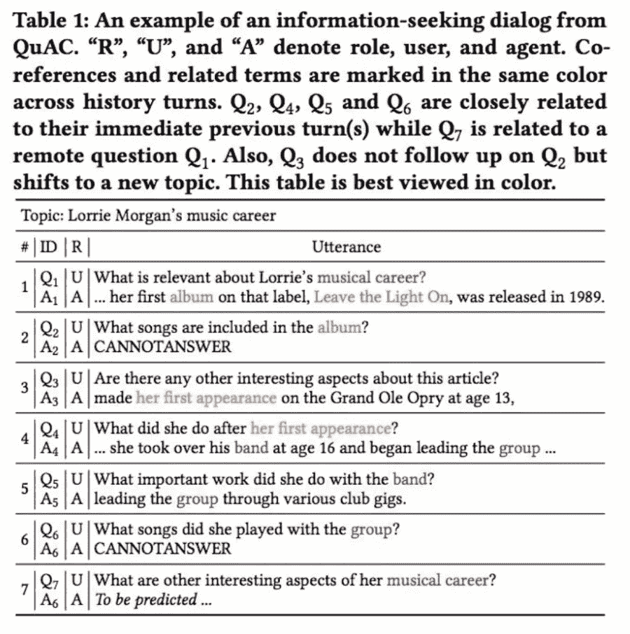
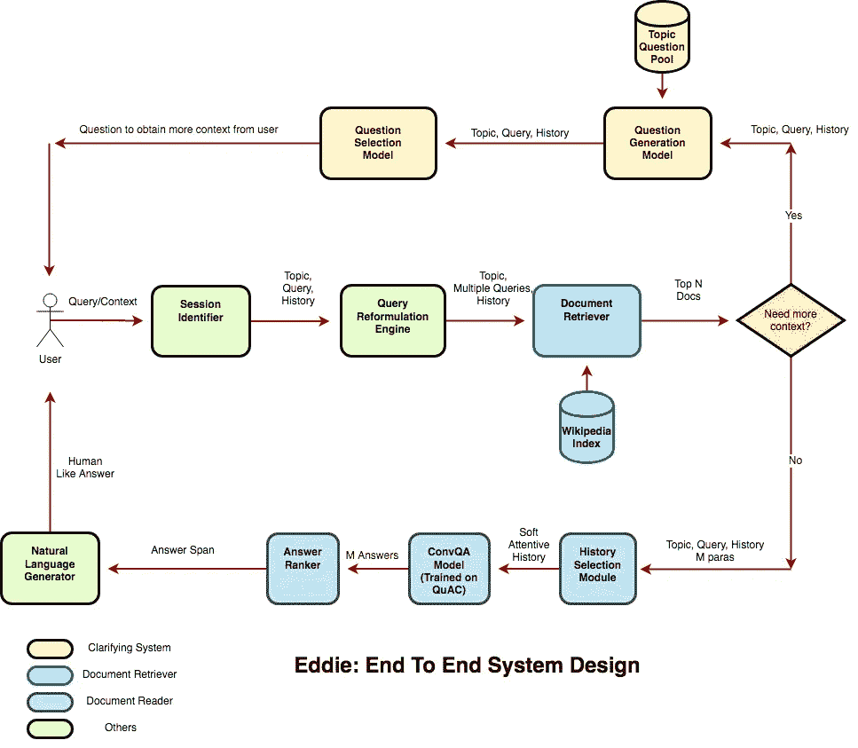

# Eddie:理解用户查询并提供自然的响应——第二部分

> 原文：<https://medium.com/analytics-vidhya/eddie-understanding-user-queries-providing-natural-responses-part-3-f2542ec3785d?source=collection_archive---------13----------------------->

在本系列的第 1 部分中，我介绍了埃迪，并解释了埃迪如何回答一系列相互关联的问题。这篇文章解释了埃迪失败的情况。我们讨论了机器人在理解真实用户查询和以类似人类的方式回复时所面临的挑战。

# 理解用户查询

当用户与 Google/Bing 这样的搜索引擎交互时，他们通常会在多次查询中找到自己想要的答案。用户提出一个问题，然后通读一堆网页结果标题。如果他们对结果不满意，他们要么重新制定查询，要么向搜索引擎提供额外的上下文。这使得搜索引擎更容易带回相关的结果。由于语音助手没有显示多个结果的可视化界面，因此对他们来说，在第一次尝试中提供最佳答案本身就变得具有挑战性。此外，语音界面缺乏像自动完成和拼写纠正这样的机制，这些机制通常会引导用户在文本界面中进行搜索。为了克服这些问题，我们分析了不同类型的用户查询，并提出了一个可以处理每一种查询的系统。

## 寻找相同信息的不同方法

人类可以用多种方式问同一个问题。在每种情况下，用户查询在语法上是不同的，但是在语义上是相同的。我们发现，虽然 Eddie 中的文档阅读器模块理解查询的语义，但检索器模块却不能理解。由于检索器遵循简单的短语匹配或单词包模型，它不断返回不相关的结果，直到用户使用检索器的索引文档中存在的相同短语。

因此，我们建议在向检索器发送查询之前添加一个**查询重构引擎**。该引擎将生成同一查询的多个公式。然后，Eddie 可以返回多个答案，并从中选择最佳答案进行阅读。我们从论文[主动问答](https://openreview.net/pdf?id=S1CChZ-CZ)中得到灵感来实现这样一个引擎。

## 不明确的用户查询

用户的查询通常简短、模糊且缺乏上下文。举个例子，

**用户的查询** — *“什么是增值税？”* **埃迪的回复**——“*梵蒂冈使徒图书馆()，俗称
梵蒂冈图书馆或简称 the Vat，是教廷的图书馆，
位于梵蒂冈城内。*

用户的意思是询问印度的“增值税”。然而，埃迪把它和梵蒂冈使徒图书馆的增值税混淆了。因此，在印度的两个人之间的对话中非常明显的事情，对于一个与你的国籍无关的机器人来说，可能并不明显。理想情况下，Eddie 应该向用户询问更多的上下文信息

*“你指的是增值税库还是印度的税？”*

## 多方面用户查询

用户有复杂的信息需求。他们无法在一个查询中明确表达他们的需求。像 Eddie 这样的系统即使在问题不完整或不清楚的情况下也会返回结果。在现实生活中，这样的系统应该向用户提出澄清性的问题，以便更好地理解他们的需求。例如，
这是论文[中的一个例子，在开放领域信息搜寻对话中提出澄清性问题](https://arxiv.org/abs/1907.06554)。

图片来源:[在公开领域的信息搜索对话中提出澄清性问题](https://arxiv.org/abs/1907.06554)

为了处理模糊和多方面的查询，我们建议在任何信息搜索聊天机器人系统中增加一个**澄清模块**。澄清系统可以基于当前对话历史、主题和查询生成澄清问题。它还可以查阅关于该主题的现有问题的索引，并选择要问的最佳问题。澄清系统主要有两个部分——问题生成模块和问题选择模块。更多细节可以在这里找到[。](https://arxiv.org/abs/1907.06554)

## 话题转移和话题回归问题

在与 Eddie 开始对话之前，用户通知 Eddie 对话的主题。在得到一个问题的答案时，Eddie 使用该主题和历史中的所有问题(或最后 n 个问题)作为上下文。然而，在对话中，用户经常在不同的副主题之间切换，从而使部分对话与当前问题无关。换句话说，为了回答当前的问题，不能对所有的历史进行同等的加权。用户从一个子主题转移，过一段时间后又回到这个子主题。这个问题在[对话式问答的注意历史选择](https://arxiv.org/pdf/1908.09456.pdf)一文中有详细解释

图片致谢:[对话式问答的关注历史选择](https://arxiv.org/pdf/1908.09456.pdf)

在这篇论文之后，我们提出在文档阅读器神经模型中使用一种**历史关注机制来对**模型历史进行关注。过去的问题/答案可以基于它们与当前查询的相关性来加权，并且我们可以使用位置历史答案嵌入(PosHAE)来建模上下文。

# 提供自然反应

在最近的过去，有一个强大的焦点，使机器人像人一样回答。[的马尔科女士](https://microsoft.github.io/msmarco/)运行了一个自然语言生成挑战，以一种智能扬声器可以读取的格式来设计问答任务答案，并且在没有任何额外上下文的情况下使其有意义。

为了让 Eddie 能够对话，我们在管道中添加了一个**自然语言生成组件**。该组件使用 Seq2Seq 模型(P [指针生成器网络](https://arxiv.org/abs/1704.04368))将读者基于跨度的答案转换成自由形式的答案。该模型将问题和答案跨度作为输入，并返回自由形式的答案作为输出。举个例子，

**问题** : *他们拿到瓶子了吗？*
**回答跨度** : *于是他们抓住了瓶子* **自然回答:**是的

从例子中可以看出，对一个“是/否”问题回答“是/否”比阅读答案范围更具对话性。我们在 [CoQA](https://www.aclweb.org/anthology/Q19-1016/) 数据集上训练 PGNet 模型，因为 CoQA 中的答案与 QuAC 不同，是自由形式的。

我们观察到，这种模型在重构是/否问题的答案方面非常好。然而，对于其他类型的问题，它们表现不佳。

# 艾迪:理想的系统设计

不可否认，语音助手是互联网的未来。与语音助手互动比浏览一堆网页结果更像人类。然而，提供类似人类的体验仍然遥不可及。

为了实现这个目标，我们提出了一个新颖的端到端设计来开发这样一个多领域、多圈、上下文相关的智能 QA 代理。

这个设计的每一个组成部分都在我的 3 篇博文中讨论过。据我所知，这是第一个设计和实现端到端开放领域 QA 代理的开源项目。

# 展望未来

用户问题是开放式的、模糊的、多方面的、无法回答的，或者在给定的上下文中通常是有意义的。处理如此复杂的信息需求使得开发 Eddie 具有挑战性。

我们提出的设计非常适合构建这样一个系统所需的众多组件。然而，我们还没有对**个性化组件**建模。我们还计划改进我们的文档阅读器模型，以处理答案跨越多个段落的问题(**多跳推理**)。

如果你想了解更多，请随时联系我(【https://miteshksingh.github.io/】T4)。