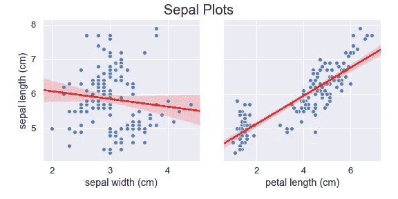

# 在 Python 中编辑地块

> 原文：<https://medium.com/analytics-vidhya/editing-data-visualization-in-python-64f42225ba21?source=collection_archive---------5----------------------->

## 一个关于如何使用 Matplotlib 和 Seaborn 为初学者定制你的绘图的综合列表


由[卢卡斯·布拉塞克](https://unsplash.com/@goumbik?utm_source=unsplash&utm_medium=referral&utm_content=creditCopyText)在 [Unsplash](https://unsplash.com/@goumbik?utm_source=unsplash&utm_medium=referral&utm_content=creditCopyText) 上拍摄

作为一个刚刚学会如何用 Python 绘制图形的人，我花了很多时间在谷歌上搜索如何编辑我的可视化效果。添加标题、更改 x 和 y 标签甚至更改图形大小都可能是一项单调乏味的任务，因为使用 Python 绘图的方式非常多。由于这是一本初学者指南，我将讨论 Python 中两种不同的可视化方法( **Matplotlib 和 Seaborn)** 以及如何在这些方法中编辑和清理图形。

为了展示和解释 Matplotlib 和 Seaborn 之间的差异，我将使用来自 sklearn 的数据集`iris`来演示一些图。该数据集由 3 种不同类型的鸢尾(Setosa、Versicolour 和 Virginica)花瓣和萼片长度和宽度组成。我将跳过数据的加载和清理部分，直接进入绘图。

***用两种方法绘图***


(左图= Matplotlib，右图= Seaborn)

谈到绘图，我们都有自己喜欢的方法。有时我使用 Seaborn，有时我使用 Matplotlib。不幸的是，我大部分时间都在编辑我的标签、标题、尺寸等等。对于这个例子:Matplotlib 只显示 y 标签，Seaborn 只显示 x 标签，没有任何进一步的输入。这通常是我开始谷歌的时候:“添加 x 标签 Matplotlib”或者“添加 y 标签 Seaborn”。

为了节省您的一些时间，我创建了以下几个代码，可能会解决您在清理地块时遇到的问题。

# 单一地块

## 马特普罗德利卜和西伯恩


粉色 Matplotlib 和蓝色 Seaborn

两个图的代码块

因为 seaborn 与 matplotlib 非常兼容，所以我们基本上可以使用相同的代码来编辑我们的两个图。下面你可以找到我在绘图时常用的编辑列表。

## 常见编辑列表

点击 Github 搜索列表

然而，只绘制一个情节很容易，定制起来非常快，但如果你想绘制多个支线剧情呢？这就是我建议使用支线剧情或配对剧情的地方。

# 多重情节

## 配对图

默认情况下，Pairplot 将创建一个轴网格，这样`data`中的每个变量将在 y 轴的一行中共享，在 x 轴的一列中共享。对角线轴绘制一个图，显示该列中变量的数据分布。

```
sns.pairplot(df, hue=”species”)
```


使用 Seaborn 绘制 Pairplot 并给“物种”着色

我建议只有在你试图绘制的特征中有**而不是**很多的时候才使用`Pairplot`。然而，正如你所看到的，我们不能真正定制这些情节，而且有些情节我们实际上并不需要。

有一种方法可以解决这个问题，那就是指定您想要绘制的变量(参见下面的代码块)。



使用 Pairplot 绘制散点图

## 支线剧情

另一种创造多重剧情的方法是使用支线剧情。当绘制多个支线剧情时，如果你想自定义你的编辑，我建议使用一个函数。这在编辑你的情节时节省了你很多时间。


使用函数绘制支线剧情

分散支线剧情功能代码

# 结论

有很多方法可以编辑和定制你的情节。Matplotlib 和 Seaborn 是两个很好的入门工具，当你是 Python 的初学者，并试图探索数据可视化的时候。