# 饮酒对学生学业成绩的影响

> 原文：<https://medium.com/analytics-vidhya/effect-of-alcohol-use-on-academic-performance-of-school-students-c9ed44dafbba?source=collection_archive---------0----------------------->

**摘要**

这项研究是一项观察性研究的一部分，该研究考察了几个社会经济因素对中学生成绩的影响。本文的主要兴趣领域是观察酒精对学生最终成绩的影响，并选择影响成绩的其他重要因素。数据收集自两所中学的葡萄牙语班，作为调查的一部分。结果表明，工作日饮酒影响学生的最终成绩，而周末饮酒对最终成绩没有显著影响。进一步的研究，包括一个更大的、更有代表性的真实人群样本，将会改善这一发现。

**简介**

在美国，12 岁至 20 岁的人中有四分之一每月饮酒，而对于 12 年级的学生来说，这一比例变为每两周五杯或更多。学生饮酒通常被视为一个重要的社会话题，也是许多家长和学校管理者关注的一个原因。过去进行的一些研究表明，饮酒会对学生产生负面影响，因为他们无法平衡学业和社会生活，导致潜在的辍学和不及格。相反，一些研究表明，饮酒对学生的表现没有显著影响。因此，这项研究的目的是成功地了解饮酒是否对学生的最终成绩有任何影响，并找出有助于解释学生成绩的其他重要因素。

**相关工作**

Walid El Ansari、Christiane Stock 和 Claire Mills (2012)研究了大学生饮酒和学业成就之间的关系。作者采用了五种饮酒测量方法(最近饮酒时间和饮酒量、饮酒频率、重度间歇性饮酒、问题饮酒)；以及教育成就指标，即学生在学习中的实际模块分数。他们的结论是，实际的模块标记与任何酒精消耗测量都没有关联。

Butler 等人(2011 年)研究了饮酒和学业需求之间的关系。全国调查表明，40%的大学生经常酗酒，而且酗酒的比率似乎在增加。这项研究的结果表明，当学生第二天要参加考试或论文时，他们少喝了 38%。结果还表明，学生当前的学业要求与他们当前饮酒量减少 30%有关。这项研究表明，一些学生没有减少他们的酒精摄入量，即使他们有学术要求，以满足第二天。

安娜·I·巴尔萨、劳拉·m·朱利亚诺和迈克尔·t·弗伦奇(2011)研究了饮酒对高中生学习质量的影响。他们的研究得出结论，饮酒量的增加导致男生的 GPA 小幅下降，但具有统计学意义，而女生的 GPA 变化在统计学上不显著。

Singleton 和 Wolfston (2009)研究了饮酒量、睡眠时间和学习成绩。作者展示了饮酒和睡眠、饮酒和学习成绩以及睡眠和学习成绩之间的关系。东北大学的学生 89%是白人，98%年龄在 18-22 岁之间，82%住校。他们的结论是，饮酒过多的学生保持不良的睡眠模式，这会对学习成绩产生负面影响。

Aertgeerts 和 Buntinx (2002)研究了一年级学生酗酒和他们学业成绩之间的关系。美国大学生不负责任的饮酒模式在 7%到 17%之间。这项研究是通过对 3518 名某大学一年级学生的问卷调查进行的。他们发现，14.2%的学生被确定为有酒精滥用或依赖，近三分之一的学生在第一次尝试中就通过了考试。结果表明，49.7%的男生和 48.9%的女生继续他们的第二年学业。令人担忧的是，只有大约一半的一年级学生成功升入了二年级。这可能表明酒精消费是大学生中的一个主要社会问题。

上面引用的大部分研究文章发现饮酒和学习成绩之间存在负相关。但是他们都有一个主要的局限性，即把酒看作一个单一的实体，而不观察它的消费模式，即它是在周末聚会时被随意消费还是作为一种日常习惯被消费。

**问题陈述**

这项研究的主要目的是找出饮酒(无论是在工作日还是周末)是否对中学生的最终成绩有任何影响。并找出有助于解释学生最终成绩的最佳显著解释变量集。

**研究方法论**

卡梅里诺大学的 Fabio Pagnotta，Hossain Mohammad Amran 通过对两所不同学校的葡萄牙班学生进行调查，对这一问题进行了初步研究。大约 650 名学生参与了调查，学生被要求回答 23 个问题，但不告诉他们研究的确切目的。调查中提出的大多数问题都是以“是”或“否”的形式回答，以方便学生。这些结果被整合并存储在 UCI 数据库的 csv 文件中，以满足未来的研究。使用这种类型的数据选择技术的主要好处是低成本和时间效率。

**假设**

根据社会经济学理论，饮酒对学生的成绩有负面影响，即他们的平均绩点低于不饮酒的学生。因此，在目前的研究中，无效假设是，无论是在工作日还是周末饮酒对学生的成绩没有影响。另一个假设是，在工作日或周末饮酒或两者都饮酒对成绩有负面影响。在模型中，突出的独立变量是工作日饮酒量和周末饮酒量。因变量是学生的期末成绩。

H0:工作日和周末饮酒对成绩没有影响。

H1:其中至少有一个对成绩有负面影响。

**解决方案**

这个问题的解决方案可以分为两部分。首先是选择有助于估计期末成绩的重要解释变量列表。多元线性回归可用于此目的，以创建一个包含所有独立变量的初始模型，然后使用 AIC 和 BIC 罚函数，向前选择或向后排除可用于找出解释变量的最重要列表。根据经济理论，可以将交互项添加到该模型中，最终模型可以根据 AIC、BIC 和 Cp 统计数据进行测试，以查看哪个模型表现更好。这些统计值越低，表明模型越好。在此步骤中创建的最终模型被称为简化模型。

其次，可以将工作日和周末的酒精消耗变量添加到来自第一部分的简化模型中，并且可以对完整模型和简化模型使用 ANOVA 测试，以查看两个或两个酒精消耗变量中的任何一个对于模型是否显著。这将让我们了解饮酒是否对学生的成绩有任何影响。

**分析**

样本包括 22 个自变量和 1 个因变量。变量及其说明见附录表 1。

**样品特性**

*独立变量*

描述性数据研究表明，样本包含大约。41%的男生和 59%的女生，其中约 37%的人有恋爱关系，63%的人没有。大约 70%的学生住在城市地区，30%住在农村地区。年龄变量显示出一种特殊的趋势，因为大约 99%的数据在 15 至 19 岁之间，只有大约 1%的学生在 20 至 22 岁年龄组。因此，变量需要进一步调查。表 1 以表格形式描述了一些主要的解释变量。

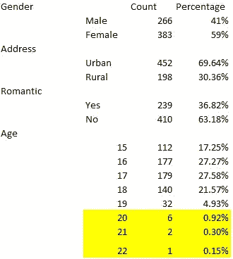

表 1

表 2 和图 1 分别提供了工作日和周末饮酒量的表格和图表描述。从两者可以看出，近 70%的学生在工作日只饮酒一次，约 61%的学生在周末饮酒一次或两次。

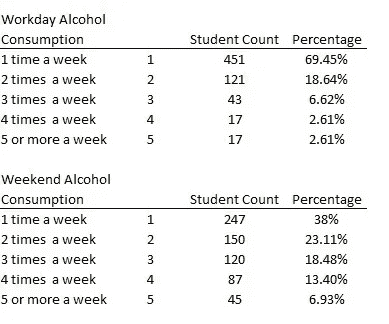

表 2

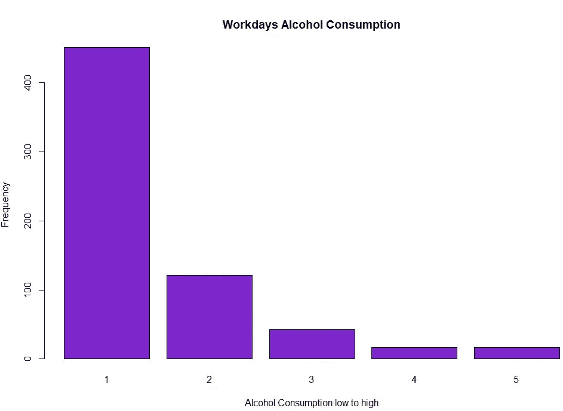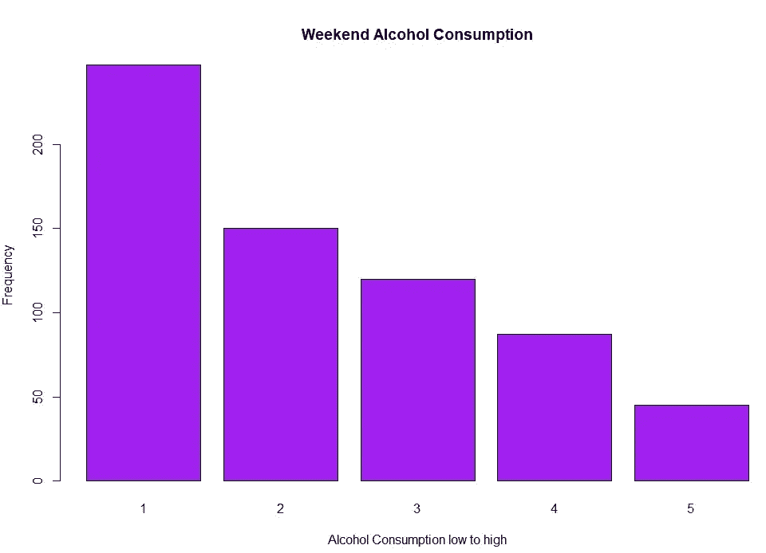

图 1

*因变量*

图 2 提供了因变量最终成绩频率分布的图形视图，可以观察到，大多数学生的分数在 50%到 60%之间，并且该图呈正态分布。

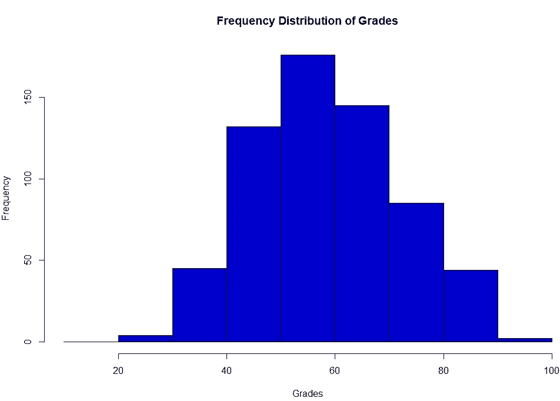

图 2

**变量转换**

这里显示的数据集基本上是干净的，没有丢失值。包括因变量在内的大多数变量呈正态分布，但数据集中只有少数自变量需要进行异常值剔除或偏斜度剔除处理。

*“缺席”变量*

从变量的视觉检查中可以看出，变量是正偏的，因为大多数学生的缺课次数非常少。因此，为了消除偏斜度，使用了因变量的对数变换。图 3 提供了转换前的频率分布(红色图)和转换后的缺勤变量的频率分布(绿色图)。转换后的数据现在看起来大致正常。

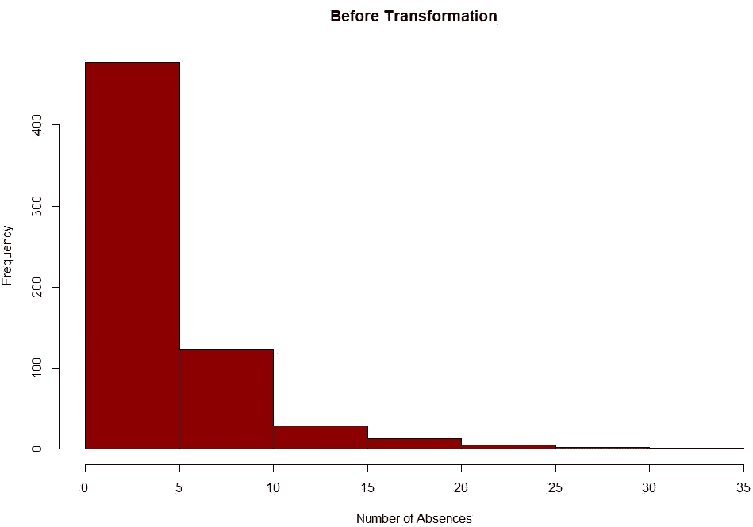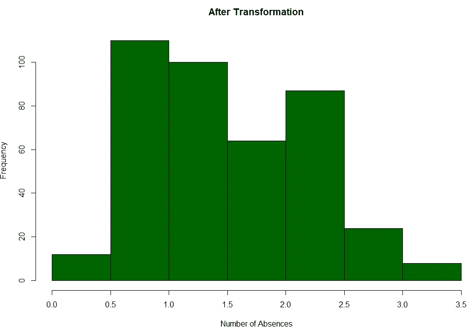

图 3

*“年龄”变量*

图 4 显示了根据年龄变量的最终成绩分布，可以看出，649 名学生中只有一名学生的年龄为 22 岁，两名学生的年龄为 21 岁，只有三名学生的年龄为 20 岁。根据经济理论，理想情况下，中学生(达到 12 级标准)的最高年龄为 19 岁，下面的数据甚至表明只有 1%的学生在 20 至 22 岁之间。有些学生可能在调查中提供了不正确的年龄信息。因此，将这些观察结果视为异常值并将其从数据集中删除将是一个理想的选择。图 5 显示了异常值处理后的最终变量。

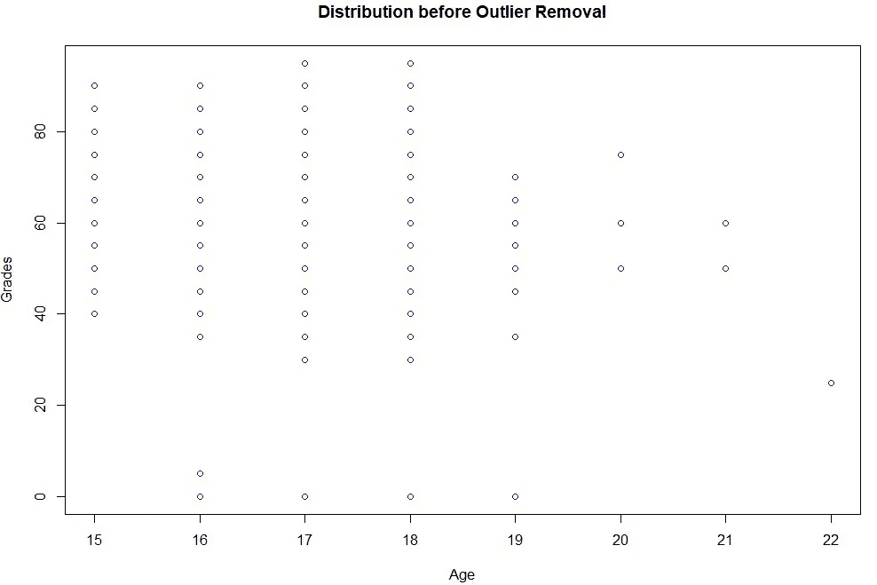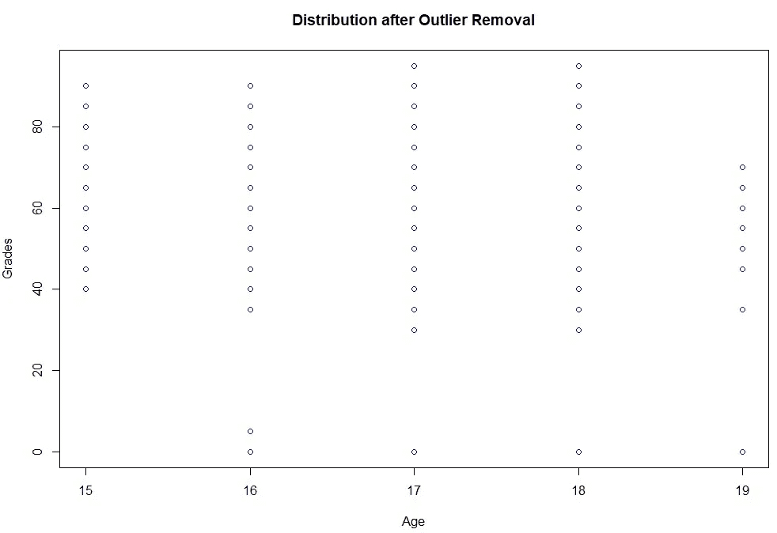

图 4

***酒精 Vs 成绩***

图 6 显示了最终分数与解释变量工作日酒精消耗量和周末酒精消耗量的箱线图，1-5 表示酒精消耗量非常低，5 表示酒精消耗量非常高。从这两个图表中的视觉观察表明，当工作日的饮酒量从 1 杯增加到 5 杯时，学生的中值分数略有下降，而中值分数似乎不受周末饮酒量增加的影响，因为中值分数几乎保持不变。

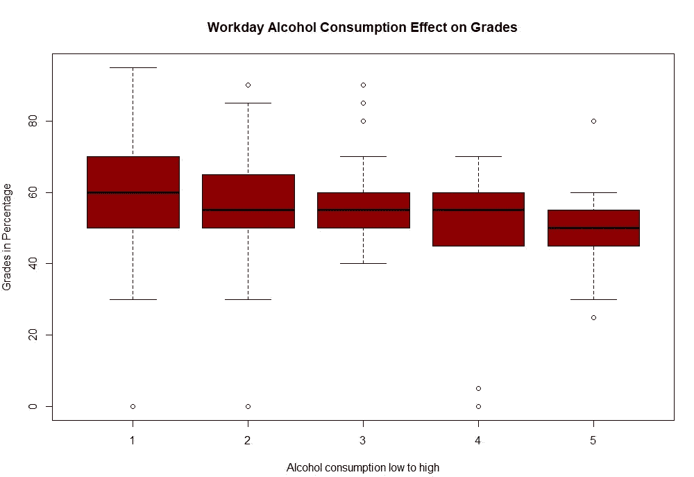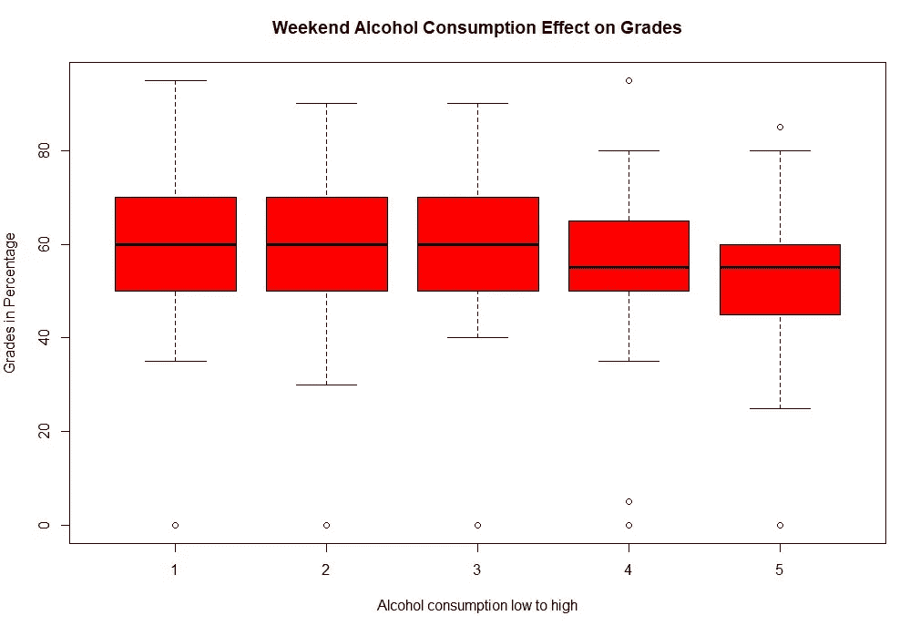

图 5

**模型建立**

*变量选择*

为了给模型选择重要的解释变量，向前选择和向后排除过程被用于 AIC 和 BIC 惩罚。在选择冲突的情况下，BIC 惩罚将是首选，因为它对模型的惩罚最高。

图 7 显示了 AIC，BIC 和 Cp 的最终模型的统计数据，这些模型是通过使用 AIC 和 BIC 惩罚的正向选择和反向淘汰过程选择的。采用 AIC 罚函数的反向淘汰法选择了一个具有 15 个解释变量的模型，R 为 29%，而采用 BIC 罚函数的反向淘汰法选择了一个只有 6 个显著变量的模型，R 约为 26%。此外，带有 BIC 惩罚的向前选择和向后消除选择了相同的模型，并且所选择的模型在所有模型中具有最低的 BIC 值。因此，根据奥卡姆剃刀原理，选择解释变量数量最少的模型作为最终分析模型，因为增加了 9 个解释变量，所以模型的 R 仅增加了 3%。

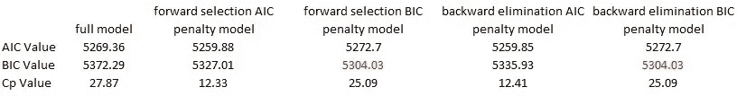

图 6

*交互项添加*

根据经济学理论，人们认为增加一些交互项可能有助于更好地解释模型，就像一个经常外出并有浪漫关系的学生可能比一个经常外出或有浪漫关系的学生分数低。因此，对所有可能的相互作用项重复反向消除过程，以获得最终模型。图 8 显示了对选定变量的最终列表和 BIC 统计执行的线性回归的 R 输出。对于将来的参考，该模型将被称为简化模型。从 BIC 的统计数据中我们可以看到，模型的 BIC 值没有增加很多，但模型的 R 值增加了大约 2%。当α等于 1%时，两个增加的相互作用项对模型都是重要的。

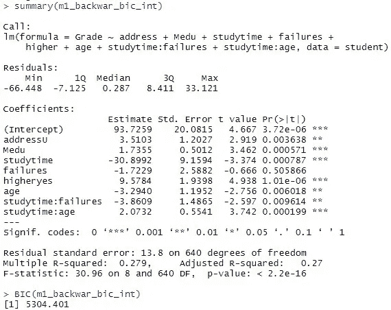

图 7

*全型号*

通过对简化模型中出现的一组选定输入变量以及酒精消费变量( *Walc* 、 *Dalc* )进行多元线性回归，准备完整模型。图 9 显示了完整模型运行的 R 输出，可以看出，与简化模型相比，完整模型的 R 从 27.8%增加到 29.53%。

对 *Dalc* & *Walc* 的 t 检验表明，Dalc 的系数在 alpha 等于 5%时与零有显著差异，而 Walc 的系数即使在 alpha 等于 10%时也可能与零没有显著差异。

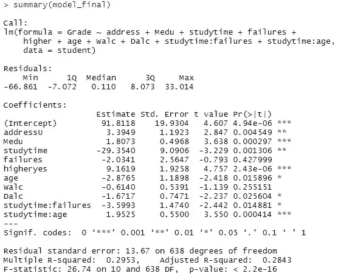

图 8

*模型对比:方差分析*

为了查看酒精消费变量( *Walc* & *Dalc* )是否对学生成绩有显著影响，进行了方差分析测试。检验的零假设是两个变量对模型都不重要，替代假设是至少其中一个或两个变量对模型都重要，即

H0:*Walc*和 *Dalc* 的系数等于零。

H1:至少它们的系数不等于零。

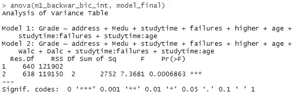

图 9

图 10 显示了 ANOVA 测试的 R 输出。可以观察到 p 值非常小，即 0.00068，因此我们拒绝零假设，并得出结论，酒精变量中的至少一个或两个对于模型是显著的。

**结论**

该分析提供了压倒性的证据，表明酒精在决定中学生的最终成绩方面起着重要作用(F 值为 7.36)。周末饮酒量对成绩没有显著影响(单侧 p 值 0.2551)，而工作日饮酒量对最终成绩有显著的负面影响(单侧 p 值 0.0256)，即饮酒量每增加 1 个单位，成绩下降 1.67%。

**推论范围**

由于这是一项观察性研究，因此无法建立因果推断。这里的样本并不代表真实的人口，因为参与者仅从两所学校的葡萄牙语班中选出。因此，对人口的推断在这里不能成立。然而，这项研究的发现与经济理论相一致，即酒精对学生的成绩有负面影响，但在这一领域需要更多的研究来证明作为娱乐活动的限量消费可能不会对成绩产生显著影响。

**参考文献**

1.克莱尔·米尔斯。2013."饮酒与大学生学习成绩差有关吗？"国际预防医学杂志。

2.安娜·巴尔萨。2011.“饮酒对高中学业成绩的影响”。 *HHS 作者手稿*

3.吉尔·科曼。2002.“饮酒对大学生学习成绩的影响”。[https://www.semanticscholar.org/](https://www.semanticscholar.org/)

**附录**

*变量定义*

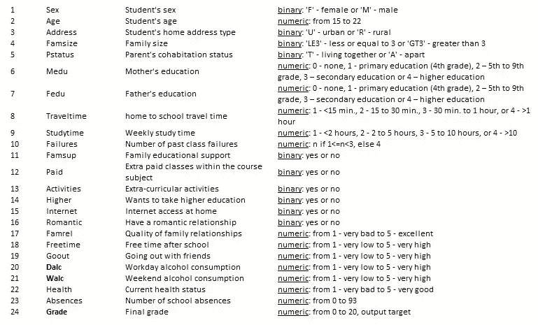

表 1