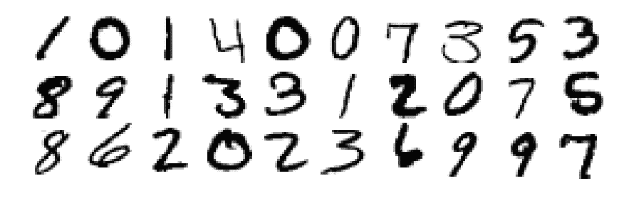
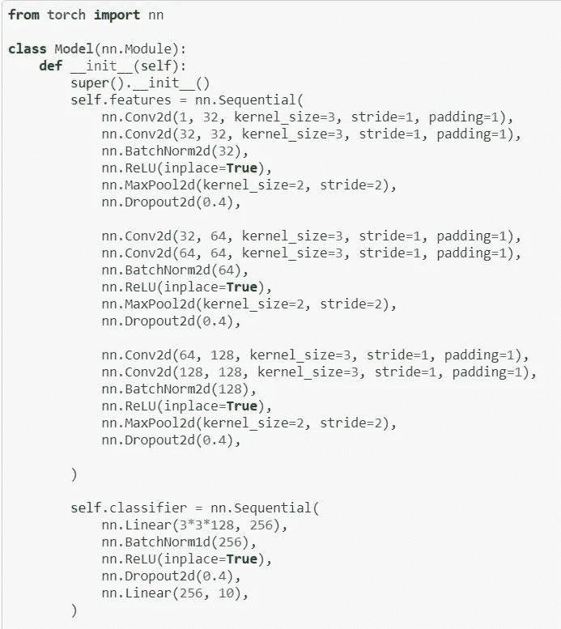
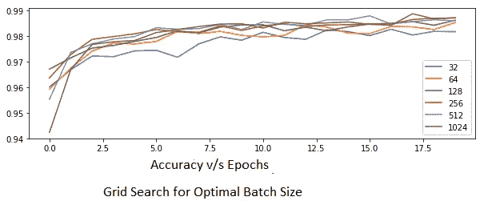
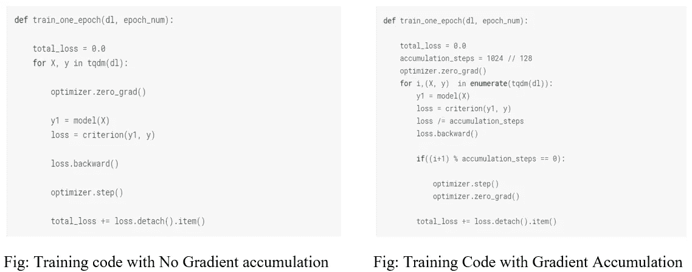

# 梯度累积下批量大小对训练过程和结果的影响

> 原文：<https://medium.com/analytics-vidhya/effect-of-batch-size-on-training-process-and-results-by-gradient-accumulation-e7252ee2cb3f?source=collection_archive---------17----------------------->

在本实验中，我们研究了批量大小和梯度累积对训练和测试准确性的影响。

我们研究了图像分类背景下的批量大小，采用 MNIST 数据集进行实验。众所周知，在机器学习社区中，很难对超参数的影响做出一般性的陈述，因为行为通常会因数据集和模型而异。因此，我们得出的结论只能作为一个路标，而不是关于批量的一般陈述。

批量大小是现代深度学习系统中需要调整的重要超参数之一。从业者通常希望使用更大的批量来训练他们的模型，因为它允许 GPU 的并行性加速计算。然而，众所周知，批量太大会导致泛化能力差。另一方面，经验表明，使用较小的批量可以更快地收敛到好的解决方案，因为它允许模型在看到所有数据之前就开始学习。但是不利的一面是，这个模型不能保证收敛到全局最优。

人们普遍认为，在一个和整个训练数据集之间存在一个最佳批量，这将提供最佳的泛化能力，从而实现更高的精度，它通常取决于数据集和所讨论的模型。

# 实验:

我们的实验使用卷积神经网络(CNN)将 MNIST 数据集中的图像(包含手写数字 0 到 9 的图像)分类到相应的数字标签“0”到“9”。下图显示了手写数字的图像。

互联网上最著名的 MNIST 分类器达到了 99.8%的准确率！！太神奇了。最好的 Kaggle 核 MNIST 分类器达到 99.75%。这个实验演示了确定用于训练模型的任何分类器的最佳批量大小的研究。

# 建筑亮点:

我们训练了 6 个不同的模型，每个模型具有 32、64、128、256、512 和 1024 个样本的不同批量，保持所有模型中所有其他超参数相同。然后，我们分析了每个模型架构的验证准确性。

该笔记本在 [Github](https://github.com/nainci/MNIST-BatchSize-Experiment/blob/master/mnist-digit-base-batchsize-test.ipynb) 上有售。

# 结果:

结果解释了根据图图例以不同颜色显示的不同批量的曲线。x 轴上是时期的数量，在本实验中取为“20”，y 轴表示训练精度图。

从实验中可以明显看出，准确度随着批量的增加而提高，然而，实验中第二大批量 512 的批量与最大批量的准确度相差很小。因此，它可以作为最佳样本大小，以便考虑计算资源的最佳利用和较低的复杂性。

# 梯度累积:

可以克服使用较小批量来训练模型的低存储器 GPU 约束的策略是梯度累积。

梯度累积是一种将用于训练神经网络的一批样本分成几个小批样本的机制，这些小批样本将按顺序运行。

梯度累积的工作方式是，在网络反向传播过程中，参数不会在小批量的每一步中更新，而是累积梯度结果。在完成小批量的所有步骤时，小批量的所有先前步骤的累积梯度更新模型参数。这个过程与使用较高的批量大小来训练网络一样好，因为梯度被更新相同的次数。

在给定的代码中，optimizer 在累积了 8 批批量大小为 128 的梯度后步进，这与使用 128*8 = 1024 的批量大小产生了相同的净效果。

要记住的一件事是 BatchNorm 层的性质，它仍将在每批中起作用。您需要用 GroupNorm 图层替换它们，以便在执行渐变累积时有效。

# 实验代码:

# 结果:

在提交给 Kaggle 的 DigitRecognizer 竞赛时，我们获得了 [99.257%](https://www.kaggle.com/ncyjain/mnist-digit-base) 的分数，批量为 128。采用步长为 8 的梯度累积后，精度提高到 [99.442%](https://www.kaggle.com/ncyjain/mnist-digit-base-accumulate-gradient?scriptVersionId=31423509) 。您可以点击链接查看各自的笔记本。

干杯！