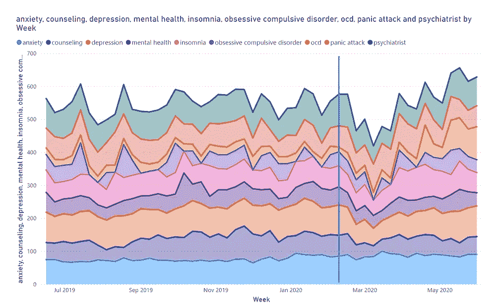

# 新冠肺炎对心理健康的影响

> 原文：<https://medium.com/analytics-vidhya/effect-of-covid-19-on-mental-health-3db2596ce57a?source=collection_archive---------25----------------------->

> 我们的心灵和新冠肺炎

心理健康意识已经存在很长时间了，许多人都有，并且仍然在与他们的心理健康作斗争。我决定收集一些数据，然后尝试运行不同的可视化方法，来看看与前几年相比，新冠肺炎是如何影响人们的心理健康的。本文研究了包含全球疫情爆发前 33 周和爆发后 18 周的数据集，从这些数据中，我们可以看出新冠肺炎对人们的心理健康有影响。

文章的这一部分着眼于世界范围的数据以及新冠肺炎对全球人们心理健康的影响。

这种可视化包括世界范围的数据。几十年来，人们遭受了不同类型的精神疾病，然而，在 2020 年 2 月 9 日之后，世界各地的精神疾病率有所增加，因为这标志着新冠肺炎的开始，越来越多的人开始呆在家里。总是被人包围的人发现自己很孤独。

测试呈阳性的人被限制在管理隔离区，并接受最大限度的预防治疗。通常，当我们生病时，很自然地，我们会依靠我们所爱的人。然而，那些测试呈阳性的人不得不被隔离，这也导致了焦虑和抑郁，因为他们不能依靠他们所爱的人来支持。根据 healthline.com，几乎 20 %的新冠肺炎患者在确诊后的三个月内出现了精神健康问题。

该表显示了疫情爆发后每个学期的平均兴趣变化，我们可以看到心理健康服务下降了近 20 %。由于新冠肺炎，心理健康服务中断了 98%。此外，这意味着由于精神健康服务效率低下，人们无法获得通常会得到的必要援助。它也显示了恐慌症的增加。由于新冠肺炎的症状类似于普通感冒和流感，所以很难弄清楚一个人感染了什么，除非他们做新冠肺炎测试，直到结果出来，一个人会恐慌和焦虑。

文章的这一部分更多地关注了意大利，因为意大利是受冠状病毒影响最严重、死亡人数最多的国家。

上面的可视化说明了意大利的心理健康数据。意大利因冠状病毒死亡的人数是世界上第二高的，实施的封锁是欧洲最严格和最长的。自从封锁和死亡率增加以来，在 2020 年 3 月中旬之后，不同类型的精神健康问题突然增加。

受严重影响的人，如意大利伦巴第人，心理健康和一线工人的福祉有所增加。由于引入了新的措施，个人的日常活动、日常生活和生计受到影响，抑郁、孤独等程度也有所降低。，都在上升。

该表显示了疫情爆发前后每个术语的平均兴趣变化，新冠肺炎疫情爆发后精神卫生服务下降了近 30%。此外，我们还可以观察到，人们的强迫症增加了 89%,因为每个人都尽最大努力保持自己和他们去的地方清洁卫生。

由于新冠肺炎，世界发生了很大的变化，这种疫情影响了每个人的心理健康。作为个人，我们必须开始提高意识，因为在许多社区、家庭和城市，讨论心理健康仍然是一个禁忌。我们需要团结起来改变态度，鼓励人们寻求帮助是至关重要的。政府还需要在精神健康方面分配更多的国家卫生预算，因为拥有健康的精神和健康的身体同样重要。