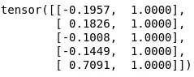

# 学习率对训练收敛的影响。

> 原文：<https://medium.com/analytics-vidhya/effect-of-learning-rate-for-training-convergence-2d6801a95956?source=collection_archive---------6----------------------->

# 介绍

在这篇文章中，我将分享我对学习率的不同值在训练时如何影响收敛的见解，在训练我们的模型时，我们应该从学习率图中推断出什么，以及基于此我们应该如何更新我们的学习率。

# 概观

我们将创建一个样本数据，并使用特定的权重来创建目标值。一旦我们有了目标值，我们将添加高斯噪声。现在我们的任务是预测导致目标产生噪音的权重。在此过程中，我们将不断改变学习速度以达到目标，并观察其效果。以下是我将遵循的 6 个步骤

1.  创建示例数据
2.  选择特定重量
3.  获得添加了噪声的目标并将其可视化。
4.  首先使用均方差进行预测，看看我们离输出有多远。
5.  使用梯度下降优化到达目标。
6.  更新学习率并观察其效果。


# 履行

我们将在整个实现中使用 pytorch、matplotlib 和 numpy。

首先，我们将创建一个维度为[100，2]的样本数据，其中第一列代表来自均匀分布的一些数据，第二列是有偏差的数据。

```
import torch
import matplotlib.pyplot as plt
import numpy as np
from torch import nnn=100
x = torch.ones(n,2)      #sample data of shape [100,2]
x[:,0].uniform_(-1.,1) 
x[:5]
```



抽样资料

现在我们将创建一个张量，其中 3。是权重，2 是偏差，粗略地说，我们称之为权重矩阵。**这是算法最终要学习的矩阵**。

```
a = torch.Tensor([3.,2])   #weights to be learned by the model.
```


权重矩阵

在这里，我们将我们的权重矩阵乘以样本数据来获得预测，然后添加一些噪声。现在这个 y 是目标标签。


样本数据和重量的乘积(x@a)

```
y = x@a + torch.rand(n)   #target label to be predicted
plt.scatter(x[:,0], y);
```


目标 y 可视化

这里，我们将使用随机选择的[-1，1]权重矩阵进行第一次预测。同时，我们也将使用均方差来计算损失。

```
**def** mse(y_hat, y):              #mean squared error 
    **return** ((y_hat-y)**2).mean()a = torch.Tensor([-1.,1])               #initializing random weights

y_hat = x@a                    #first target prediction
mse(y_hat, y)plt.scatter(x[:,0],y)
plt.scatter(x[:,0],y_hat);
```


第一目标预测图。

# 梯度下降

我们将使用 pytorch 编写梯度下降实现，以便自动计算梯度。上面随机创建的权重矩阵 **a** 我们会传入 nn。pytorch 的参数模块，自动计算在 **a** 上完成的所有操作的梯度，这些梯度可以使用 **a.grad** 访问。我们将预测 y，计算损失，反向传播损失，更新权重矩阵。这个过程我们将做 100 次，我们预计在 100 次迭代结束时，我们将接近目标标签值。

```
a = nn.Parameter(a);

**def** update():
    y_hat = x@a
    loss = mse(y, y_hat)
    **if** t % 10 == 0: print(loss)
    loss.backward()
    **with** torch.no_grad():
        a.sub_(lr * a.grad)
        a.grad.zero_()lr = 1e-1 
**for** t **in** range(100): 
    update()plt.scatter(x[:,0],y)
plt.scatter(x[:,0],x@a.detach());
```


100 次迭代后，预测 y(橙色)和目标 y(蓝色)。

# 更新学习率

我们将通过使用 **lr=0.1** 和 **lr=1.01** 来查看学习率的效果

正如我们从左侧视频中看到的，当我们使用 0.1 的低**学习率时，模型在 **70 个历元**左右达到最小值需要时间。**

另一方面，如果我们使用略高的 0.7 的**学习率**，模型在大约 8 个时期内达到最小值。

而 1.01 的更高的**学习率**将模型推向发散。

# 结论


正如我们从左图中看到的，当达到收敛**时，损失函数开始波动**。这可以从下图中得到解释，该图显示**损失曲线在底部**是平坦的，这导致了损失函数的波动。

最后，我要感谢 fastai @ Josh FP 对这个话题的解释。 **❤️喜欢，分享，留下你的评论**